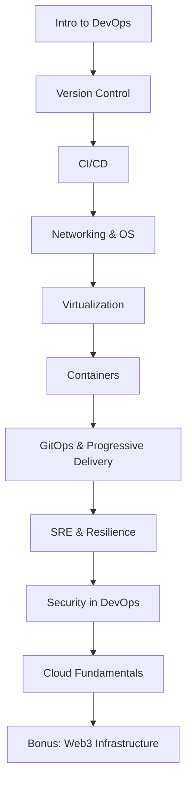

# Lab 2 — Submission

## Task 1 — Git Object Model

- **Commands run:**

**1.1**
```bash
$ git rev-parse HEAD
2a6f5659536108b1330a9c5aa4057d10bd201239
```

**1.2**
```bash
$ git cat-file -p 2a6f5659536108b1330a9c5aa4057d10bd201239
```

**2.1**
```bash
$ git rev-parse HEAD^{tree}
c223eb926a9deecba14c173dbc35536f41a4d316
```

**2.2**
```bash
$ git cat-file -p c223eb926a9deecba14c173dbc35536f41a4d316
```

**3.1**
```bash
$ git ls-tree -r HEAD
100644 blob 4db373667a50f14a411bb5c7e879690fd08aacc1    README.md
100644 blob 879f7b0a4bf49956fb34fe513a15463a8ddbb143    a.txt
100644 blob b1f8af089a94f160ce00ed7710f07a7e9ba6c584    labs/lab1.md
100644 blob 1468ba02d6bcacd3fee5fd378cc02717a8cb2fbc    labs/lab2.md
100644 blob 890d3c25c2ea110419b0fd28afbeb468cb97a171    labs/lab3.md
100644 blob aceb1f5b85dfb9f5a3586498d64d40343fadef8a    labs/submission1.md
100644 blob 81407a8214e2fcfeb3b2412b8b0037bfde7584c1    labs/submission2.md
100644 blob 304628578f83a142e37ad867c4d94e0dfe3797de    lectures/lec1.md
100644 blob c4f16b6b7ad4b9c00970949aba60b8d26aae656f    lectures/lec2.md
100644 blob 337a6f9942f26e6f9af8f43df1002ae0f81bd8cd    lectures/lec3.md
100644 blob e38d7f6166c0658c5019b23a0f05a057b5fe7eb4    notes.txt
```

**3.2**
```bash
$ git cat-file -p 4db373667a50f14a411bb5c7e879690fd08aacc1
```

- **Outputs:**

**1) `git cat-file -p <commit>`**
```text
tree c223eb926a9deecba14c173dbc35536f41a4d316
parent 4ecb0e3dbbdfddd760b0f776f3a7224902bd280d
author NoNesmer <vo0203vo0203@mail.ru> 1758031152 +0300
committer NoNesmer <vo0203vo0203@mail.ru> 1758031152 +0300
gpgsig -----BEGIN SSH SIGNATURE-----
 U1NIU0lHAAAAAQAAADMAAAALc3NoLWVkMjU1MTkAAAAgFNB3gltOciUAt/ZtkSfs0VgCCo
 MO+RqYm+IISudUqlwAAAADZ2l0AAAAAAAAAAZzaGE1MTIAAABTAAAAC3NzaC1lZDI1NTE5
 AAAAQEgvBnIyRoEK/IMG1q55SFEdMGvPqzmeWpkSwQiLvRTsTYngLMNkhUcfVXR598WrM+
 /NlYucMa71fevTCeR15A8=
 -----END SSH SIGNATURE-----

Add notes.txt
```

**2) `git cat-file -p <tree>`**
```text
100644 blob 4db373667a50f14a411bb5c7e879690fd08aacc1    README.md
100644 blob 879f7b0a4bf49956fb34fe513a15463a8ddbb143    a.txt
040000 tree d5e0f66d9b08d9cc7468dd61eddadcab969edbfd    labs
040000 tree 2f0387f9eebb6ad846cd02dbd1e7a4a151c06a7e    lectures
100644 blob e38d7f6166c0658c5019b23a0f05a057b5fe7eb4    notes.txt
```

**3) `git cat-file -p <blob>` (README.md)**
````text
# 🚀 DevOps Introduction Course: Principles, Practices & Tooling

[](#-lab-based-learning-experience)
[](#-evaluation-framework)
[](#-lab-based-learning-experience)
[](#-course-roadmap)

Welcome to the **DevOps Introduction Course**, where you will gain a **solid foundation in DevOps principles and practical skills**.
This course is designed to provide a comprehensive understanding of DevOps and its key components.

Through **hands-on labs and lectures**, you’ll explore version control, software distribution, CI/CD, containerization, cloud computing, and beyond — the same workflows used by modern engineering teams.

---

## 📚 Course Roadmap

Practical modules designed for incremental skill development:

| #  | Module                              | Key Topics & Technologies                                                                                                 |
|----|-------------------------------------|--------------------------------------------------------------------------------------------------------------------------|
| 1  | **Introduction to DevOps**          | Core principles, essential tools, DevOps concepts                                                                        |
| 2  | **Version Control**                 | Collaborative development workflows, Git tooling                                                                         |
| 3  | **CI/CD**                           | Continuous integration/deployment practices                                                                              |
| 4  | **Networking & OS for DevOps**      | IP/DNS, firewalls, Linux fundamentals (shell/systemd/logs), permissions, troubleshooting, DevOps-friendly distros        |
| 5  | **Virtualization**                  | Virtualization concepts, benefits in modern IT infrastructures                                                           |
| 6  | **Containers**                      | Docker containerization, Kubernetes orchestration                                                                        |
| 7  | **GitOps & Progressive Delivery**   | Git as source of truth, Argo CD, canary/blue-green deployments, feature flags, rollbacks                                |
| 8  | **SRE & Resilience**                | SLOs/SLAs/SLIs, error budgets, incident management, chaos engineering, postmortems                                       |
| 9  | **Security in DevOps (DevSecOps)**  | Shift-left security, SAST/DAST, SBOM, container/image scanning (Trivy/Snyk), secret management                           |
| 10 | **Cloud Fundamentals**              | AWS/Azure/GCP basics, IaaS/PaaS/SaaS, regions/zones, pricing, core services (EC2/S3/IAM/VPC), cloud-native patterns      |
| 11 | **Bonus**                            | Web3 Infrastructure, decentralized storage, IPFS, Fleek                                                                 |

---

## 🖼 Module Flow Diagram



---

## 🛠 Lab-Based Learning Experience

**80% of your grade comes from hands-on labs** — each designed to build real-world skills:

1. **Lab Structure**

   * Task-oriented challenges with clear objectives
   * Safe environments using containers or local VMs

2. **Submission Workflow**

   * Fork course repository → Create lab branch → Complete tasks
   * Push to fork → Open Pull Request → Receive feedback & evaluation

3. **Grading Advantage**

   * **Perfect Lab Submissions (10/10)**: Exam exemption + bonus points
   * **On-Time Submissions (≥6/10)**: Guaranteed pass (C or higher)
   * **Late Submissions**: Maximum 6/10

---

## 📊 Evaluation Framework

*Transparent assessment for skill validation*

### Grade Composition

* Labs (10 × 8 points each): **80%**
* Final Exam (comprehensive): **20%**

### Performance Tiers

* **A (90-100)**: Mastery of core concepts, innovative solutions
* **B (75-89)**: Consistent completion, minor improvements needed
* **C (60-74)**: Basic competency, needs reinforcement
* **D (0-59)**: Fundamental gaps, re-attempt required

---

## ✅ Success Path

> *"Complete all labs with ≥6/10 to pass. Perfect lab submissions grant exam exemption and bonus points toward an A."*

--- Brief explanations

- **Commit — `git rev-parse HEAD` + `git cat-file -p <commit>`**  
  A *commit* is a history node that stores metadata (author, timestamp, message), a pointer to a **tree**, and parent commit(s).  
  In my output I see: `tree c223eb9…`, a `parent …`, `author/committer …`, and the message “Add notes.txt”.  
  → Conclusion: the commit ties my change to a specific snapshot (its tree) and links it into history.

- **Tree — `git rev-parse HEAD^{tree}` + `git cat-file -p <tree>`**  
  A *tree* is the directory snapshot for that commit: it maps names and modes to object hashes (either **blob** for files or **tree** for subfolders).  
  In my output I see entries like `README.md → 4db3736… (blob)` and subfolders `labs` and `lectures` as `tree` objects.  
  → Conclusion: the tree records *what files/folders exist* and *which object IDs* represent them.

- **Blob — `git ls-tree -r HEAD` + `git cat-file -p <blob>`**  
  A *blob* is just the raw file contents for a specific version (no filename or path inside the blob itself).  
  Printing the blob for `README.md` shows the actual text of the file.  
  → Conclusion: filenames/paths come from the **tree**; the blob is only the bytes.


## Task 2 — Reset & Reflog
- **Commands:**
```bash
git switch -c git-reset-practice
echo "First commit" > file.txt && git add file.txt && git commit -m "First commit"
echo "Second commit" >> file.txt && git add file.txt && git commit -m "Second commit"
echo "Third commit"  >> file.txt && git add file.txt && git commit -m "Third commit"
git log --oneline -n 5
git status
git reset --soft HEAD~1
git status
git log --oneline -n 5
git reset --hard HEAD~1
git status
git log --oneline -n 5
git reflog
git reset --hard f1d49f0
git log --oneline -n 3
```

- **`git log --oneline` snippet (key moments):**

**After 3 commits**
```text
f1d49f0 (HEAD -> git-reset-practice) Third commit
4ddc9a6 Second commit
f8f9b40 First commit
2a6f565 (feature/lab2) Add notes.txt
4ecb0e3 Append something to a.txt
```

**After `git reset --soft HEAD~1`**
```text
4ddc9a6 (HEAD -> git-reset-practice) Second commit
f8f9b40 First commit
2a6f565 (feature/lab2) Add notes.txt
4ecb0e3 Append something to a.txt
909e555 Add txt file for example
```

**After `git reset --hard HEAD~1`**
```text
f8f9b40 (HEAD -> git-reset-practice) First commit
2a6f565 (feature/lab2) Add notes.txt
4ecb0e3 Append something to a.txt
909e555 Add txt file for example
6bc51c6 chore: add submission file for Lab 2
```

**After recovery (`git reset --hard f1d49f0`)**
```text
f1d49f0 (HEAD -> git-reset-practice) Third commit
4ddc9a6 Second commit
f8f9b40 First commit
```

- **`git reflog` snippet (recovery references):**
```text
f8f9b40 (HEAD -> git-reset-practice) HEAD@{0}: reset: moving to HEAD~1
4ddc9a6 HEAD@{1}: reset: moving to HEAD~1
f1d49f0 HEAD@{2}: commit: Third commit
4ddc9a6 HEAD@{3}: commit: Second commit
f8f9b40 (HEAD -> git-reset-practice) HEAD@{4}: commit: First commit
2a6f565 (feature/lab2) HEAD@{5}: checkout: moving from feature/lab2 to git-reset-practice
```

- **What changed (working tree, index, history):**
```
Soft reset (git reset --soft HEAD~1)
- History: branch pointer moved back one commit.
- Index: now includes the undone commit’s changes (staged).
- Working tree: unchanged (files stayed as they were).

Hard reset (git reset --hard HEAD~1)
- History: branch pointer moved back one commit.
- Index: reset to match that commit (no staged changes).
- Working tree: files rewritten to that commit (uncommitted edits lost).

Reflog + recovery
- Reflog recorded each move of HEAD (e.g., HEAD@{2} = "Third commit").
- Using git reset --hard <that-hash> restored the repo to that earlier state.
```

## Task 3 — History Graph
- Graph snippet:

$ git log --oneline --graph --all
* b860921 (side-branch) Side branch commit
| * f1d49f0 (git-reset-practice) Third commit
| * 4ddc9a6 Second commit
| * f8f9b40 First commit
|/
* 2a6f565 (HEAD -> feature/lab2) Add notes.txt
* 4ecb0e3 Append something to a.txt
* 909e555 Add txt file for example
* 6bc51c6 chore: add submission file for Lab 2
* 0ec5c78 (origin/feature/lab1, feature/lab1) docs: add commit signing summary
| * 20d0868 (origin/main, origin/HEAD, main) Revert "docs: add commit signing summary"
| * 57f2fe6 docs: add commit signing summary
| * b5d4e00 docs: add PR template
|/
* 82d1989 feat: publish lab3 and lec3
* 3f80c83 feat: publish lec2
* 499f2ba feat: publish lab2
* af0da89 feat: update lab1
* 74a8c27 Publish lab1
* f0485c0 Publish lec1
* 31dd11b Publish README.md

- Commit messages list:

Commit messages list (bullets with just the messages)
Side branch commit
Third commit
Second commit
First commit
Add notes.txt
Append something to a.txt
Add txt file for example
chore: add submission file for Lab 2
docs: add commit signing summary
Revert "docs: add commit signing summary"
docs: add commit signing summary
docs: add PR template
feat: publish lab3 and lec3
feat: publish lec2
feat: publish lab2
feat: update lab1
Publish lab1
Publish lec1
Publish README.md

- Reflection:
The git log --graph --oneline --all view makes branch divergence (parallel lines) and merge points (a commit with two parents) obvious, so I can see which commits belong to each branch and where they were combined.

## Task 4 — Tags
- **Tag names, commit hashes:**
```text
v1.0.0 -> fe64344ca6b63415b634accb46a35bddb8c46030
```

- **Why tags matter:**
Tags mark important points in history (like releases). They’re stable, human-friendly references that don’t move, so teams/CI can build, deploy, and compare versions reliable.

## Task 5 — switch vs checkout vs restore

- **Commands and `git status` / `git branch` snippets:**
```bash
git switch -c cmd-compare
git switch -
git branch
git status
git checkout -b cmd-compare-2
git checkout -
git branch
git status
echo "scratch" >> demo.txt
git status
# (tried restore on an untracked file; see notes below)
git restore demo.txt
git restore --staged demo.txt
git restore --source=HEAD~1 demo.txt
```

**`git branch` output**
```text
  cmd-compare
  cmd-compare-2
  feature/lab1
* feature/lab2
  git-reset-practice
  main
  side-branch
```

**`git status` output (after creating demo.txt)**
```text
On branch feature/lab2
Changes not staged for commit:
  (use "git add <file>..." to update what will be committed)
  (use "git restore <file>..." to discard changes in working directory)
        modified:   labs/submission2.md

Untracked files:
  (use "git add <file>..." to include in what will be committed)
        demo.txt
```

- **Summary of when to use each:**
  - **`git switch`** — branch operations only (modern, clear):
    - `git switch -c cmd-compare` (create & switch), `git switch -` (jump back), `git switch feature/lab2`.
  - **`git checkout`** — legacy multi-purpose (still works, but prefer `switch`/`restore`):
    - You used `git checkout -b cmd-compare-2` and `git checkout -` to hop back.
  - **`git restore`** — file content & staging:
    - `git restore <file>` → discard **working tree** changes (to match `HEAD`).
    - `git restore --staged <file>` → **unstage** changes (keep them in the working tree).
    - `git restore --source=<commit> <file>` → take the version from another commit.
    - Note: operates on **tracked** files; remove untracked files with `rm` or `git clean -fd`.
