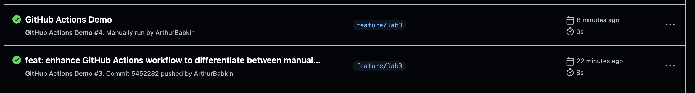

# Lab 3 Submission - CI/CD with GitHub Actions

## Task 1 — First GitHub Actions Workflow

### 1.1: GitHub Actions, what I did:

1. Created `.github/workflows` directory in the repository
2. Created a new workflow file `github-actions-demo.yml`
3. Implemented a basic workflow that:
   - Triggers on push to feature/lab3 branch
   - Runs on ubuntu-latest runner
   - Checks out the repository
   - Prints GitHub context information
   - Lists repository files
   - Gathers system information

Key concepts learned:

- **Jobs**: Basic units of work in a workflow
- **Steps**: Individual tasks within a job
- **Runners**: Virtual machines that execute the jobs
- **Triggers**: Events that start a workflow (push, workflow_dispatch)

### 1.2: Workflow Trigger Test

The workflow is configured to trigger on:

1. Push events to the feature/lab3 branch
2. Manual trigger via workflow_dispatch

[Link to successful workflow run](https://github.com/ArthurBabkin/F25-DevOps-Intro/actions/runs/18325542519/job/52188985705#step:1:19)



The workflow was successfully triggered by pushing to the feature/lab3 branch. The run completed successfully in 4 seconds.

### Analysis of Workflow Execution:

1. The workflow was automatically triggered by the push event
2. It ran on an Ubuntu-based runner
3. Successfully executed all defined steps:
   - Checked out the repository
   - Printed GitHub context
   - Listed repository files
   - Gathered system information

## Task 2 — Manual Trigger + System Information

### 2.1: Manual Trigger Implementation

I added the `workflow_dispatch` trigger to enable manual workflow execution:

```yaml
on:
  push:
    branches: [ "feature/lab3" ]
  workflow_dispatch:
```

**Important Discovery**: Initially, the "Run workflow" button was not visible in the GitHub Actions UI. After researching the issue, I discovered that **workflow_dispatch can only be triggered manually from the UI when the workflow file exists in the default branch (main)**.

To resolve this:

1. I copied the workflow file from `feature/lab3` to the `main` branch
2. After pushing to main, the "Run workflow" button appeared in the Actions UI
3. I was then able to select the `feature/lab3` branch and trigger the workflow manually

This is a key limitation of GitHub Actions: manual triggers via UI require the workflow definition to be present in the repository's default branch, even if you want to run it on a different branch. Or I understood it not correctly, but I really tried to do it without changing main.

### 2.2: System Information Collection

Added a step to gather system information:

```yaml
- name: System Information
  run: |
    echo "🖥️ Runner Environment Information:"
    echo "OS: $(uname -a)"
    echo "CPU Info:"
    lscpu
    echo "Memory Info:"
    free -h
    echo "Disk Info:"
    df -h
```

System information from the runner:

```
🖥️ Runner Environment Information:
OS: Linux runnervmwhb2z 6.11.0-1018-azure #18~24.04.1-Ubuntu SMP Sat Jun 28 04:46:03 UTC 2025 x86_64 x86_64 x86_64 GNU/Linux

CPU Info:
- Architecture: x86_64
- CPU(s): 4
- Model name: AMD EPYC 7763 64-Core Processor
- Thread(s) per core: 2
- Core(s) per socket: 2
- Socket(s): 1
- Virtualization: AMD-V
- Hypervisor vendor: Microsoft

Memory Info:
- Total: 15Gi
- Used: 768Mi
- Free: 13Gi
- Buff/cache: 1.5Gi
- Available: 14Gi
- Swap: 4.0Gi (unused)

Disk Info:
- Root (/): 72G total, 50G used, 23G available
- Boot: 881M total
- Additional volume: 74G total, 66G available
```

### Analysis

#### Automatic vs Manual Triggers

- **Automatic (push)**: Triggers workflow automatically when code is pushed to feature/lab3 branch
- **Manual (workflow_dispatch)**: Allows triggering workflow on-demand through GitHub UI

### Comparison of Trigger Types:

1. **Push Trigger Results:**

   - [Link to push-triggered run](https://github.com/ArthurBabkin/F25-DevOps-Intro/actions/runs/18326246115)
   - Triggered automatically on push to feature/lab3
   - Run time: 4 seconds
   - Event type: push
   - Commit: 5452282
   - Message displayed: "🎉 The job was automatically triggered by a push event."
2. **Manual Trigger Results:**

   - [Link to manually-triggered run](https://github.com/ArthurBabkin/F25-DevOps-Intro/actions/runs/18326597471)
   - Triggered manually via Actions UI
   - Run time: 4 seconds
   - Event type: workflow_dispatch
   - Commit: 5452282 (same commit)
   - Message displayed: "🎉 The job was manually triggered using workflow_dispatch"

### Key Observations:

1. **Successful Differentiation**: The updated workflow correctly identifies and displays different messages for push vs manual triggers
2. **Consistent Performance**: Both runs completed in 4 seconds with identical system specifications
3. **Same Environment**: Both runs used the same runner environment (Linux, AMD EPYC processor, 15Gi RAM)
4. **Trigger Flexibility**: Manual trigger allows running workflows on-demand without code changes

#### Runner Environment

The workflow runs on ubuntu-latest, which provides:

**Hardware Specifications:**

- **CPU**: AMD EPYC 7763 64-Core Processor (4 cores available)
- **Memory**: 15Gi total RAM, ~14Gi available
- **Storage**: 72G root filesystem, 74G additional volume
- **Architecture**: x86_64 with virtualization support

**Software Environment:**

- **OS**: Ubuntu Linux (Azure-hosted)
- **Virtualization**: Microsoft Hyper-V
- **Git**: Version 2.51.0
- **Runner**: GitHub Actions Runner 2.328.0

**Security Features:**

- Various CPU vulnerability mitigations enabled
- Secure boot and trusted execution environment
- Isolated container environment for each job
