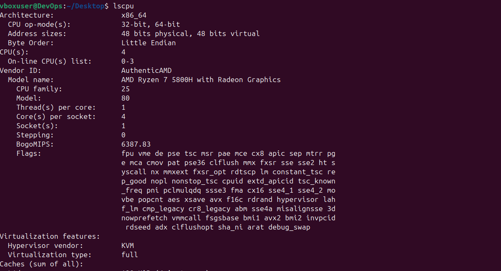
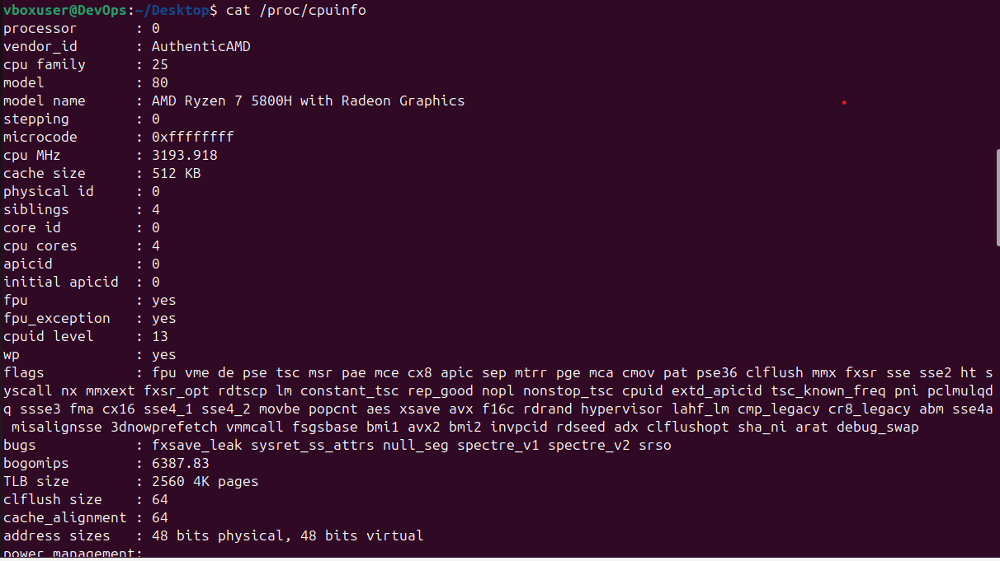
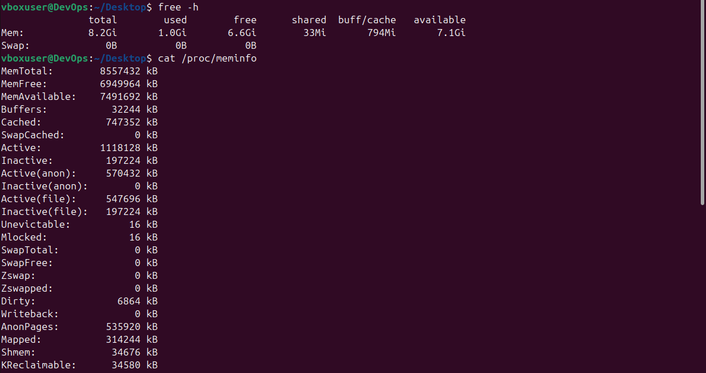
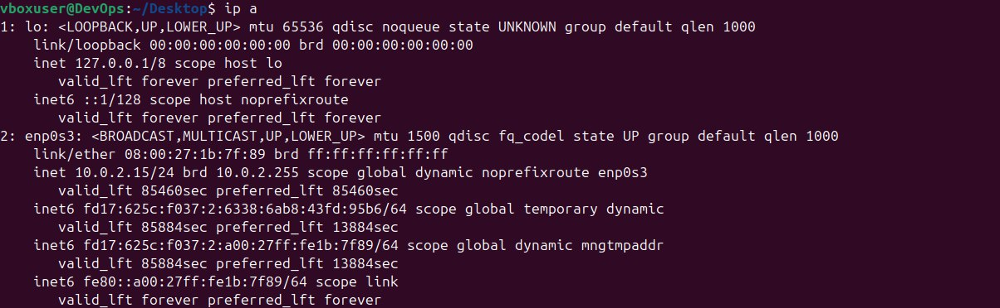
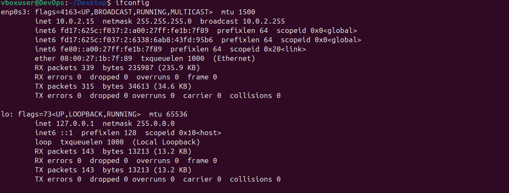
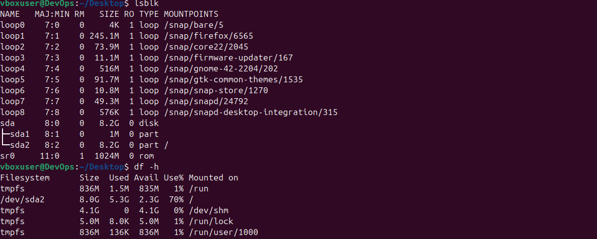
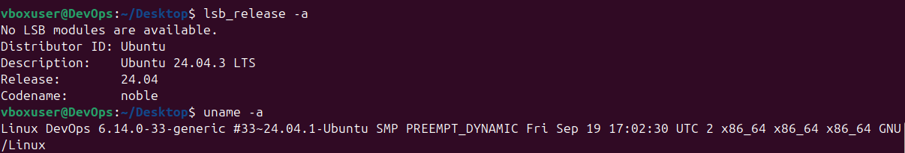

# Lab 5: Virtualization and System Analysis

## Task 1: VirtualBox Installation

**Host OS:** Windows 11 Pro 
**VirtualBox Version:** 7.2.2-170484

**Installation Description:**  
I downloaded VirtualBox from the official website (https://www.virtualbox.org/) and installed it using the default settings.
The installation completed successfully with no errors. No reboot was required.

**Installation Path:**  
C:\Program Files\Oracle

**Problems and Solutions:**  
- No problems, everything went good

## Task 2: Creating and Configuring the Virtual Machine
### 2.1 Create Ubuntu VM
**VM Name:** DevOps  
**Base Folder:** C:\Users\egors\VirtualBox VMs  
**ISO Image:** ubuntu-24.04-desktop-amd64.iso  
**Operating System:** Ubuntu (64-bit)  
**RAM:** 8627 MB  
**CPU:** 4 cores  
**Disk Size:** 8.21 GB

**Description:**  
I created a new virtual machine in VirtualBox. I selected Ubuntu (64-bit) as the OS, specified RAM, CPUs, and a virtual disk according to the lab requirements. I attached the downloaded Ubuntu ISO to the virtual CD/DVD drive for installation. The screenshots above illustrate the main configuration steps.

### 2.2 System Information Discovery
- **CPU Details:** Processor model, architecture, cores, frequency  

- **Memory Information:** Total RAM, available memory  
!

- **Network Configuration:** IP addresses, network interfaces  

- **Storage Information:** Disk usage, filesystem details  

- **Operating System:** Ubuntu version, kernel information  

- **Virtualization Detection:** Confirmation system is running in a VM  

**Overall:**
Overall it was fun experience because I do not have to work on Linux. Thx for lab!