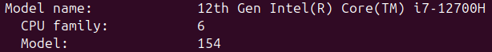
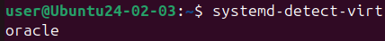

# Virtualization & System Analysis
### VirtualBox Installation
- Host Operating System: **Ubuntu 24.04.2 LTS**
- Virtual Box **Version 7.2.0**

### System Information Discovery
1. **CPU Details**: valid CLI tools are `ls /proc/cpuinfo` and `lscpu` (more human-readable)
- Processor Model

- Architecture

- Cores

- Frequency

2. **Memory Information**: `free -h`
- Total RAM

- Available RAM

3. **Network Configuration**: `ip a`
- Interfaces + IP addresses

4. **Storage Information**: `df -hT`
- Disk usage + Filesystem details

5. **Operating System**
- Ubuntu Version: `cat /etc/os-release`

- Kernel Version: `uname -rv`

6. **Virtualization Detection**: `systemd-detect-virt`

- Another method: `sudo dmidecode`

### Most useful tools
- `uname -a` prints detailed information on kernel version
- `free -h` allows to discover total RAM and track system load
- `ip a` is a quick way of checking internet interfaces and IP addresses