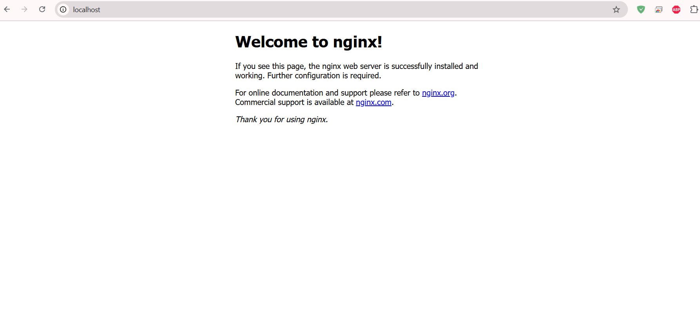
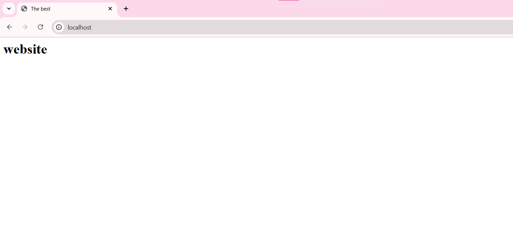
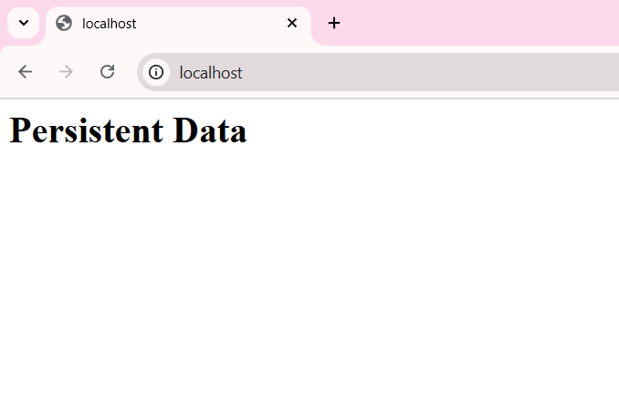

# Lab 6

## Task 1

### 1.1


Output of `docker ps -a`:
```bash
CONTAINER ID   IMAGE            COMMAND                  CREATED       STATUS                   PORTS     NAMES
a9155cc5a1e9   deployment-app   "streamlit run app.p…"   13 days ago   Exited (0) 12 days ago             deployment-app-1
e2f0955e638c   deployment-api   "uvicorn main:app --…"   13 days ago   Exited (0) 12 days ago             deployment-api-1
```
Output of `docker images`:
```bash
REPOSITORY   TAG       IMAGE ID       CREATED      SIZE
ubuntu       latest    728785b59223   6 days ago   117MB
```
**Image size and layer count:**

- 117MB - image size

- layer count:
    ```bash
    IMAGE          CREATED      CREATED BY                                      SIZE      COMMENT
    728785b59223   6 days ago   /bin/sh -c #(nop)  CMD ["/bin/bash"]            0B
    <missing>      6 days ago   /bin/sh -c #(nop) ADD file:d9cb8116905a82675…   87.6MB
    <missing>      6 days ago   /bin/sh -c #(nop)  LABEL org.opencontainers.…   0B
    <missing>      6 days ago   /bin/sh -c #(nop)  LABEL org.opencontainers.…   0B
    <missing>      6 days ago   /bin/sh -c #(nop)  ARG LAUNCHPAD_BUILD_ARCH     0B
    <missing>      6 days ago   /bin/sh -c #(nop)  ARG RELEASE                  0B
    ```

---

**Inside the container:**
```bash
root@b64552cf3c1f:/# cat /etc/os-release
PRETTY_NAME="Ubuntu 24.04.3 LTS"
NAME="Ubuntu"
VERSION_ID="24.04"
VERSION="24.04.3 LTS (Noble Numbat)"
VERSION_CODENAME=noble
ID=ubuntu
ID_LIKE=debian
HOME_URL="https://www.ubuntu.com/"
SUPPORT_URL="https://help.ubuntu.com/"
BUG_REPORT_URL="https://bugs.launchpad.net/ubuntu/"
PRIVACY_POLICY_URL="https://www.ubuntu.com/legal/terms-and-policies/privacy-policy"
UBUNTU_CODENAME=noble
LOGO=ubuntu-logo
root@b64552cf3c1f:/# ps aux
USER       PID %CPU %MEM    VSZ   RSS TTY      STAT START   TIME COMMAND
root         1  0.1  0.0   4588  3072 pts/0    Ss   12:48   0:00 /bin/bash
root        10  0.0  0.0   7888  3968 pts/0    R+   12:48   0:00 ps aux
```


### 1.2

**Tar file size comparison with image size:**

```bash
Mode                 LastWriteTime         Length Name
-a----        07.10.2025     15:50       29740544 ubuntu_image.tar
```
- 29MB - tar file size; less than image size (117MB)

---

**Error after `docker rmi ubuntu:latest`:**

```
Error response from daemon: conflict: unable to delete ubuntu:latest (must be forced) - container b64552cf3c1f is using its referenced image 728785b59223
```

Docker will issue an error that it cannot delete the image because it is being used by the ubuntu_container container (even if the container is stopped).

---

**Why does image removal fail when a container exists?**

Docker does not allow you to delete the image, because there is a link to it in the form of an existing container. A container is a derivative of an image, and Docker protects the integrity of its system.

---
**What is included in the exported tar file?**

Complete (full) copy of the image with all its layers and metadata


## Task 2

### 2.1

**Screenshot and output of original Nginx welcome page:**



`curl http://localhost`

```bash
StatusCode        : 200
StatusDescription : OK
Content           : <!DOCTYPE html>
                    <html>
                    <head>
                    <title>Welcome to nginx!</title>
                    <style>
                    html { color-scheme: light dark; }
                    body { width: 35em; margin: 0 auto;
                    font-family: Tahoma, Verdana, Arial, sans-serif; }
                    </style...
RawContent        : HTTP/1.1 200 OK
                    Connection: keep-alive
                    Accept-Ranges: bytes
                    Content-Length: 615
                    Content-Type: text/html
                    Date: Wed, 08 Oct 2025 07:08:57 GMT
                    ETag: "68e54807-267"
                    Last-Modified: Tue, 07 Oct 2025 ...
Forms             : {}
Headers           : {[Connection, keep-alive], [Accept-Ranges, bytes], [Content-Length, 615], [Content-Type, text/html]...}
Images            : {}
InputFields       : {}
Links             : {@{innerHTML=nginx.org; innerText=nginx.org; outerHTML=<A href="http://nginx.org/">nginx.org</A>; outerText=nginx.org; tagName=A; href=http
                    ://nginx.org/}, @{innerHTML=nginx.com; innerText=nginx.com; outerHTML=<A href="http://nginx.com/">nginx.com</A>; outerText=nginx.com; tagNa 
                    me=A; href=http://nginx.com/}}
ParsedHtml        : mshtml.HTMLDocumentClass
RawContentLength  : 615
```

---

**Custom HTML content and verification via curl:**



`curl http://localhost`

```bash
StatusCode        : 200
StatusDescription : OK
Content           : <html>
                    <head>
                    <title>The best</title>
                    </head>
                    <body>
                    <h1>website</h1>
                    </body>
                    </html>
RawContent        : HTTP/1.1 200 OK
                    Connection: keep-alive
                    Accept-Ranges: bytes
                    Content-Length: 92
                    Content-Type: text/html
                    Date: Wed, 08 Oct 2025 07:11:36 GMT
                    ETag: "68e60e6c-5c"
                    Last-Modified: Wed, 08 Oct 2025 07...
Forms             : {}
Headers           : {[Connection, keep-alive], [Accept-Ranges, bytes], [Content-Length, 92], [Content-Type, text/html]...}
Images            : {}
InputFields       : {}
Links             : {}
ParsedHtml        : mshtml.HTMLDocumentClass
RawContentLength  : 92

```

### 2.2

`docker diff my_website_container`

```bash
C /etc
C /etc/nginx
C /etc/nginx/conf.d
C /etc/nginx/conf.d/default.conf
C /run
C /run/nginx.pid
```

The `/etc/nginx/conf.d/default.conf` file has been changed. The other entries are the directories where this file is located.

---
**Explain the diff output (A=Added, C=Changed, D=Deleted):**

- A : Content present in the second file that was not in the first
- D : Content present in the first file that is no longer in the second
- C : Content that differs between the two files, effectively a deletion of the old content and an addition of the new

---
**What are the advantages and disadvantages of docker commit vs Dockerfile for image creation?**

`docker commit`

| Advantages | Disadvantages |
| --- | --- |
| Rapid prototyping (changed in the container, fixed the result) | Non-Reproducible |
| Export an existing environment ( "commit" a working container for transfer to another machine) | All intermediate files, cache, and temporary data get into the image |
| No need for Dockerfile syntax | It is difficult to track changes between image versions |
| | Manual assembly process |

`Dockerfile`

| Advantages | Disadvantages |
| --- | --- |
| Reproducible | Knowledge of Dockerfile syntax |
| All steps and dependencies are visible | For each change, need to rebuild the image |
| Сlear the cache in one layer | |
| The dockerfile can be stored in git | |
| Automation(Integration with CI/CD) | |
| Controlled assembly process | |


## Task 3

`docker exec container1 ping -c 3 container2`

```bash
PING container2 (172.19.0.3): 56 data bytes
64 bytes from 172.19.0.3: seq=0 ttl=64 time=1.227 ms
64 bytes from 172.19.0.3: seq=1 ttl=64 time=0.207 ms
64 bytes from 172.19.0.3: seq=2 ttl=64 time=0.275 ms

--- container2 ping statistics ---
3 packets transmitted, 3 packets received, 0% packet loss
round-trip min/avg/max = 0.207/0.569/1.227 ms
```
---

`docker network inspect lab_network`

```bash
"Containers": {
            "756e5a2bef6ca82ef30424726d7f14bb20c964bcd9e581e3b3b98f63b9e804f9": {
                "Name": "container2",
                "EndpointID": "55b4c6648c449e140446637b99e3d5efe28e8d95b4fd0d3a3f3a7ed4dd4bfa2a",
                "MacAddress": "42:71:70:6b:75:c9",
                "IPv4Address": "172.19.0.3/16",
                "IPv6Address": ""
            },
            "e4df73b091345e40570fe7d1b7e112cb889a62ffdbf4e45d1d622a4ad4a7cb91": {
                "Name": "container1",
                "EndpointID": "f6b455983cb9840c612463cdd672749b539ee6a52b5572e819f091eecea3de92",
                "MacAddress": "5e:f6:84:8b:75:36",
                "IPv4Address": "172.19.0.2/16",
                "IPv6Address": ""
            }
        },
```

---
`docker exec container1 nslookup container2`

```bash
Server:         127.0.0.11   
Address:        127.0.0.11:53

Non-authoritative answer:    

Non-authoritative answer:    
Name:   container2
Address: 172.19.0.3
```

---
**How does Docker's internal DNS enable container-to-container communication by name?**

The built-in DNS server in Docker allows containers to communicate by name, automatically assigning a unique DNS name to each container on the network and converting it to the corresponding IP address.

---
**What advantages does user-defined bridge networks provide over the default bridge network?**

Custom bridge networks offer greater flexibility and control over standard networks, allowing you to configure subnets, gateways and addresses, connect/disconnect containers, and improved isolation and security by better handling names and hiding containers from the public network.

## Task 4

` docker volume ls`
```bash
DRIVER    VOLUME NAME
local     app_data
```

**Custom HTML content used:**



**Output of curl showing content persists after container recreation:**

`curl http://localhost`
```bash

StatusCode        : 200
StatusDescription : OK
Content           : <html><body><h1>Persistent Data</h1></body></html>
RawContent        : HTTP/1.1 200 OK
                    Connection: keep-alive
                    Accept-Ranges: bytes
                    Content-Length: 50
                    Content-Type: text/html
                    Date: Wed, 08 Oct 2025 13:55:05 GMT
                    ETag: "68e66bfb-32"
                    Last-Modified: Wed, 08 Oct 2025 13...
Forms             : {}
Headers           : {[Connection, keep-alive], [Accept-Ranges, bytes], [Content-Length, 50], [Content-Type, text/html]...}
Images            : {}
InputFields       : {}
Links             : {}
ParsedHtml        : mshtml.HTMLDocumentClass
RawContentLength  : 50
```
---
**Volume inspection output showing mount point:**

`docker volume inspect app_data`
```bash
[
    {
        "CreatedAt": "2025-10-08T13:45:57Z",
        "Driver": "local",
        "Labels": null,
        "Mountpoint": "/var/lib/docker/volumes/app_data/_data",
        "Name": "app_data",
        "Options": null,
        "Scope": "local"
    }
]
```
---
**Why is data persistence important in containerized applications?**

Storing data in container applications is important to ensure resilience, data integrity, and the ability to recover from failures or updates.

---
**Explain the differences between volumes, bind mounts, and container storage. When would you use each?**

| Volumes | Bind mounts | Container storage |
| --- | --- | --- |
| They are managed by Docker and stored in a special area of the host's file system.  Data is saved when containers are deleted | Direct connection of a specific folder from the host to the container. Changes on the host are immediately visible in the container, but depending on the folder structure of the host | Temporary data stored in the container layers. They are deleted along with the container |


*When to use:*
| Volumes | Bind mounts | Container storage |
| --- | --- | --- |
| databases, persistent application data | development, when you need to synchronize the code | temporary data that can be lost |
