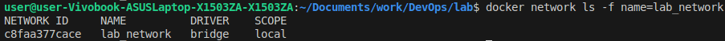

# Container Fundamentals with Docker

- An `image` is a full read-only copy of a prepared runnable environment stored on disk
- A `container` is an instance of an image in execution

### Task 1 — Container Lifecycle & Image Management
#### 1. List all current containers
```bash
docker ps -a
```

#### 2. Pull (download) a `Ubuntu` image
```bash
docker pull ubuntu:latest
docker images ubuntu
```


#### 3. Run interactive container
```bash
docker run -it --name ubuntu_container ubuntu:latest
```

Inside the container:
- Check OS version:
```bash
cat /etc/os-release
```


- List processes
```bash
ps aux
```

- Exit the container
```bash
exit
```

#### 4. Analyze image
List images:
```bash
docker images
```


View image's history - a list of layers, each representing a step in the image's build process:
```bash
docker history ubuntu
```


Conclusion:
- Image size: `78.1MB`
- Layer count: `7` (`docker history ubuntu | wc -l`)

### Image Export and Dependency Analysis
#### 1. Export image
```bash
docker save -o ubuntu_image.tar ubuntu:latest
```

Examine the exported result:


- The size of the exported equivalent is `77MB`, whereas the image's size is `78.1MB`

#### 2. Attempt to remove the image
```bash
docker rmi ubuntu:latest
```


- We cannot remove an image that is being used to run a container.
- A container **relies on the read-only contents of an image** in order to be lightweight by itself, rather than copying it every time a new container is made.

Remove the container and retry:
```bash
docker rm ubuntu_container
docker rmi ubuntu:latest
```


### Task 2 — Custom Image Creation & Analysis
#### 1. Deploy and сustomize nginx
```bash
docker run -d -p 80:80 --name nginx_container nginx # running an nginx container in the background and exposing port 80 to its port 80
curl http://localhost
```


#### 2. Copy custom html file to the container
```bash
docker cp index.html nginx_container:/usr/share/nginx/html/
```


- The nginx welcome page response has changed, because we overwrote it with a different file

#### 3. Commit container to image
```bash
docker commit nginx_container my_website:latest
```


- We have saved a running container **into a new image**

#### 4. Remove original and deploy from custom image
```bash
docker rm -f nginx_container
docker run -d -p 80:80 --name my_website_container my_website:latest
curl http://localhost
```


- Result is the same. The new configuration was successfully saved into the image.

#### 5. Analyze filesystem changes
```bash
docker diff my_website_container
```
- `A` = Added file or directory
- `C` = Changed file or directory
- `D` = Deleted file or directory


- `docker diff` marks all the ancestor directories as `C` if a single descendant of them is modified
- When nginx is reloaded within the container, its process is restarted, leading to a new `pid` and an updated `nginx.pid` file
- `/etc/nginx/conf.d/default.conf` was automatically changed due to the welcome page overwrite we made

#### Reflection
What are the advantages and disadvantages of `docker commit` vs `Dockerfile` for image creation?
- `Dockerfile` management allows for deterministic image setup that is **automated** and can be **shared** with others
- `docker commit` is easier for **quick changes and tests** without rerunning the image creation process, which may take especially long if the cached layers cannot be reused

### Task 3 — Container Networking & Service Discovery
#### 1. Create bridge network
```bash
docker network create lab_network
docker network ls
```



#### 2. Deploy connected containers
```bash
docker run -dit --network lab_network --name container1 alpine ash
docker run -dit --network lab_network --name container2 alpine ash
```

#### 3. Test connectivity and DNS
Ping `container2` from `container1`:
```bash
docker exec container1 ping -c 3 container2
```


#### 4. Inspect network details
```bash
docker network inspect lab_network
```


#### 5. Check DNS resolution
```bash
docker exec container1 nslookup container2
```


#### Analysis
How does Docker's internal DNS enable container-to-container communication by name?
- In a **user-defined bridge network**, an embedded DNS server is created on `127.0.0.11` IP address
- The server contains mappings of **network aliases** (by default, container names) to their IP addresses, to which any container in the network can send a DNS-resolution query

#### Comparison
What advantages does user-defined bridge networks provide over the default bridge network?
- The default bridge network provides **connectivity** but not **discoverability**, that is containers can communicate but cannot know addresses of the other. There's no DNS involved
- **User-defined** bridge network provides a convenient built-in mechanism for **communicating** with other containers in the network **by their name**
- **Network aliases** are **stable**, whereas IP addresses always vary
- Additionally, it provides **security isolation**. Direct communication is allowed with only members of the allocated network, not arbitrary containers on the machine

### Task 4 — Data Persistence with Volumes
#### 1. Create and use volume
```bash
docker volume create app_data
docker volume ls
```


#### 2. Deploy container with volume
```bash
docker stop my_website_container && docker rm my_website_container # was running on port 80
docker run -d -p 80:80 -v app_data:/usr/share/nginx/html --name web nginx
```

#### 3. Copy custom content to the volume
Create file `index.html`:
```html
<html><body><h1>Persistent Data</h1></body></html>
```
Copy to the volume:
```bash
docker cp index.html web:/usr/share/nginx/html/
curl http://localhost
```


#### 4. Verify persistence
Destroy and recreate container:
```bash
docker stop web && docker rm web
docker run -d -p 80:80 -v app_data:/usr/share/nginx/html --name web_new nginx
curl http://localhost
```


Inspect volume:
```bash
docker volume inspect app_data
```


#### Analysis
Why is data persistence important in containerized applications?
- Containers may be transient and fragile - they run and may be stopped and deleted, along with all the data saved inside
- **Persistent storage** in separate directories decouple important data from container lifetime
- **Mount points** serve for **dynamic sharing** of files between the host machine and containers, as well as save computer resources at times when copying is not needed

#### Comparison
Explain the differences between volumes, bind mounts, and container storage. When would you use each?
- **Volumes** exist independently of containers inside `/var/lib/docker/volumes/`. Used in **production** to persist and share files across many containers. Does **not tie** the data's location to the **host's filesystem** for portability
- **Bind mount** directly maps a filesystem location in a container to a location on the host. Used for **sharing data** and **configurations** in **development environments**
- **Container storage** is a default storage for every container. Deleted together with the container. Used for **temporary** data