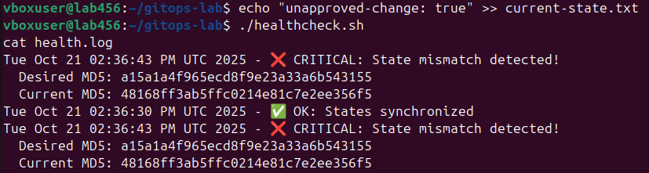
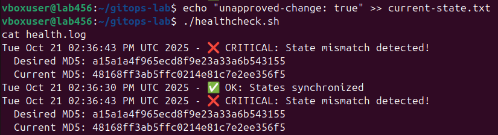
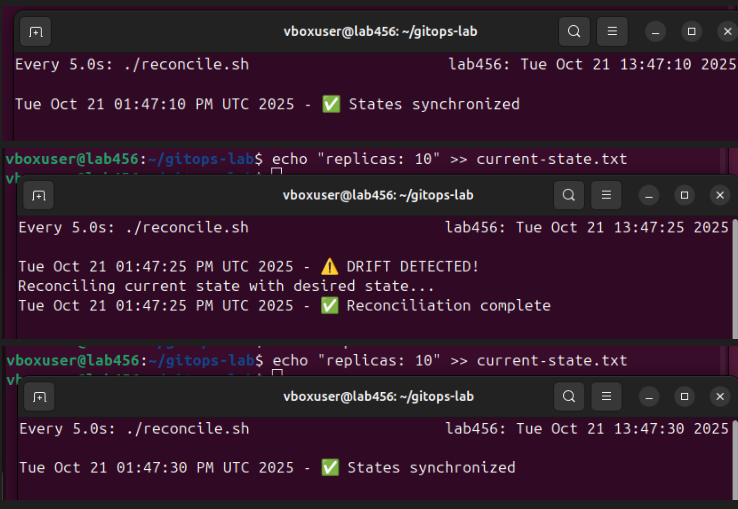
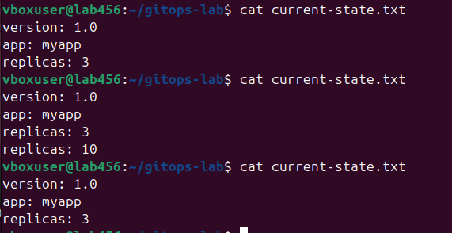
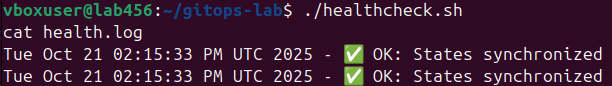
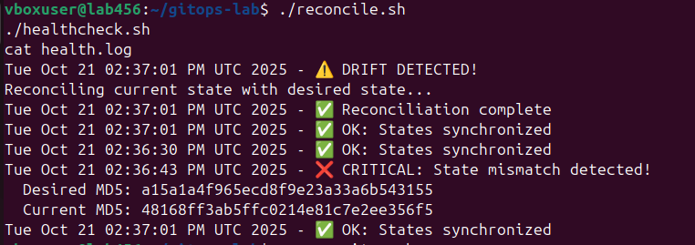
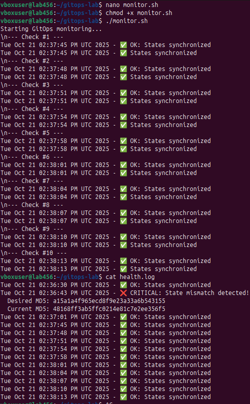

# Lab 7 — GitOps Fundamentals

## Tasks

### Task 1 — Git State Reconciliation (6 pts)

#### 1.1: Initialize Git Repository and Desired State

#### Initial State Files Contents:

**desired-state.txt:**
```
version: 1.0
app: myapp
replicas: 3
```

**current-state.txt:**
```
version: 1.0
app: myapp
replicas: 3
```

### 1.2: Create Reconciliation Loop

**reconcile.sh contents:**
```bash
#!/bin/bash
# reconcile.sh - GitOps reconciliation loop

DESIRED=$(cat desired-state.txt)
CURRENT=$(cat current-state.txt)

if [ "$DESIRED" != "$CURRENT" ]; then
    echo "$(date) - ⚠️  DRIFT DETECTED!"
    echo "Reconciling current state with desired state..."
    cp desired-state.txt current-state.txt
    echo "$(date) - ✅ Reconciliation complete"
else
    echo "$(date) - ✅ States synchronized"
fi
```

### 1.3: Test Manual Drift Detection

**After creating drift - current-state.txt:**
```
version: 2.0
app: myapp
replicas: 5
```

**Output of ./reconcile.sh:**
```
Tue Oct 21 10:16:54 AM UTC 2025 - ⚠️  DRIFT DETECTED!
Reconciling current state with desired state...
Tue Oct 21 10:16:54 AM UTC 2025 - ✅ Reconciliation complete
```

**Output of diff command:**
```
[No output - files are identical after reconciliation]
```

**After reconciliation - current-state.txt**

```
version: 1.0
app: myapp
replicas: 3
```

### 1.4: Automated Continuous Reconciliation

**Initial watch output (before drift):**
```
Tue Oct 21 10:19:33 AM UTC 2025 - ✅ States synchronized
```



**Drift command executed:**
```bash
echo "replicas: 10" >> current-state.txt
```

**Current state after creating drift:**



**Output from continuous reconciliation loop detecting auto-healing:**

After ✅ States synchronized:

```
version: 1.0
app: myapp
replicas: 3
```

✅ reconciliation loop automatically detected and fixed the drift.

Screenshots:







**Analysis: Explain the GitOps reconciliation loop. How does this prevent configuration drift?**

The **GitOps reconciliation loop** continuously compares desired state **(Git)** with current state **(cluster)**.`reconcile.sh` checked files every 5 seconds, automatically fixing any drift by copying `desired-state` to `current-state`. This prevents configuration drift through constant monitoring and immediate self-healing


**Reflection: What advantages does declarative configuration have over imperative commands in production?**

The key advantage is **self-healing** capability. Declarative configuration also enables **collaboration** and **rollback** capabilities. Defining desired state in Git creates an immutable **history of changes**, while imperative approaches risk inconsistent results and undocumented modifications. Teams can easily revert to previous states, while imperative commands offer no such safety mechanisms for **production environments**.

---

### Task 2 — GitOps Health Monitoring (4 pts)


#### 2.1: Create Health Check Script

Created Executable skript named `healthcheck.sh` following instractions.

#### 2.2: Test Health Monitoring

1. **Test Healthy State:**

    

2. **Simulate Configuration Drift + 3. Run Health Check on Drifted State:**

   ```bash
   echo "unapproved-change: true" >> current-state.txt
   ./healthcheck.sh
   cat health.log
   ```
    **Output showing "CRITICAL" status when drift is detected:**

    

4. **Fix Drift and Verify:**

   ```bash
   ./reconcile.sh
   ./healthcheck.sh
   cat health.log
   ```
    **Drift correction output:**

    ```
    Tue Oct 21 02:37:01 PM UTC 2025 - ⚠️  DRIFT DETECTED!
    Reconciling current state with desired state...
    Tue Oct 21 02:37:01 PM UTC 2025 - ✅ Reconciliation complete
    Tue Oct 21 02:37:01 PM UTC 2025 - ✅ OK: States synchronized
    ```
    

#### 2.3: Continuous Health Monitoring



**Output from monitor.sh:** 
10 consecutive monitoring cycles running every 3 seconds, each performing health check + reconciliation.

**Complete health.log shows:**
- Initial healthy state ✅
- Drift detection with MD5 mismatch ❌  
- Successful reconciliation ✅
- 10 healthy checks every 3 sec ✅ proving sustained sync

---

**Analysis: How do checksums (MD5) help detect configuration changes?**

Healthcheck script using **md5 checksums** to detect any content modification.
Even small changes produce different hashes, ensuring drift detection without comparing entire files.


**Comparison: How does this relate to GitOps tools like ArgoCD's "Sync Status"?**

 `healthcheck.sh` with **MD5** checks works like **ArgoCD's** sync status monitoring - both find configuration **mismatches** and provide health status visibility. The `monitor.sh` script acts like ArgoCD's continuous checks, and our `health.log` gives the same visibility as ArgoCD's dashboard. This shows the main GitOps principle of continuous state verification