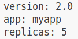
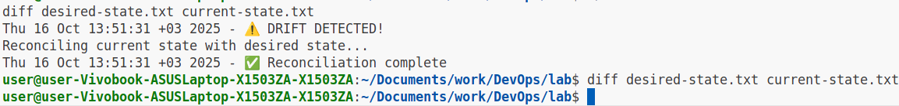
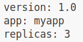
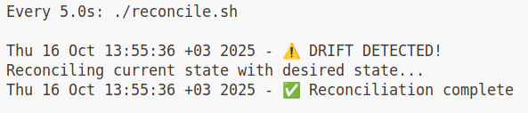
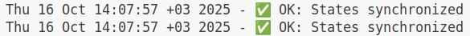
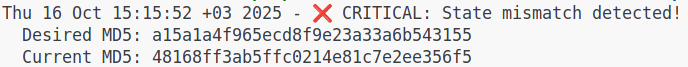
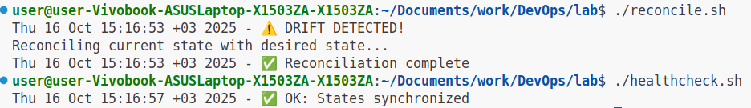
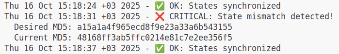
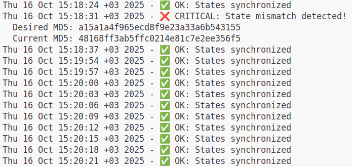

# GitOps Fundamentals

GitOps Philosophy:
- Git as Single Source of Truth - All configuration changes go through Git.
- Declarative Configuration - Define the desired state, not the steps to get there.
- Self-Healing - Drift is automatically corrected without manual intervention.
- Automated Reconciliation - Systems continuously sync to match Git state.

### Task 1 — Git State Reconciliation
#### 1. Setup Desired State Configuration
`current-state.txt`:
```
version: 1.0
app: myapp
replicas: 3
```

#### 2. Test Manual Drift Detection
Simulate a manual drift:



Run reconciliation manually:
```bash
./reconcile.sh
diff desired-state.txt current-state.txt
```



Verify drift was fixed:
```bash
cat current-state.txt
```



#### 3. Automated Continuous Reconciliation
```bash
watch -n 5 ./reconcile.sh
```
- `watch -n 5` executes the command every 5 seconds

In another terminal:
```bash
echo "replicas: 10" >> current-state.txt
```



#### Analysis
How does this prevent configuration drift?
- The `watch` command automatically executes the reconciliation script continuously in time
- The configuration regains the desired state upon each execution
- Deviated state is rectified automatically

#### Reflection
What advantages does declarative configuration have over imperative commands in production?
- Production of a large scale is hard to monitor and requires extra human resources
- Automatic remediation is more consistent and saves precious time of employees by solving simple yet frequent problems

### Task 2 — GitOps Health Monitoring
#### 1. Test Healthy State
```bash
./healthcheck.sh
cat health.log
```



Simulate configuration drift:
```bash
echo "unapproved-change: true" >> current-state.txt
./healthcheck.sh
```



```bash
./reconcile.sh
./healthcheck.sh
```



```bash
cat health.log
```



#### 2. Continuous Health Monitoring
```bash
./monitor.sh
```
View full log:
```bash
cat health.log
```



#### Analysis
How do checksums (MD5) help detect configuration changes?
- `MD5` is a hash algorithm: given the state file as input, it produces a hash code of fixed size, representing the input
- When different inputs are given, the hash codes also differ

#### Comparison
How does this relate to GitOps tools like ArgoCD's "Sync Status"?
- ArgoCD's "Sync Status" indicates whether a live Kubernetes cluster state matches the desired state defined in a Git repository
- This simulates ArgoCD's "Sync Status" execution, issuing either `Synced` or `OutOfSync`