# Site Reliability Engineering (SRE)
## Task 1 — Key Metrics for SRE and System Analysis
### 1. Monitor system resources
```bash
sudo apt install htop sysstat -y
```
### 2. Identify top resource consumers
```bash
htop
```

- Top 3 CPU-consuming processes:

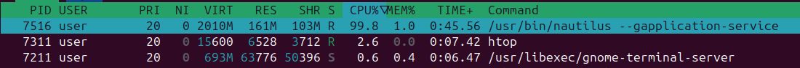

- Top 3 RAM-consuming processes:

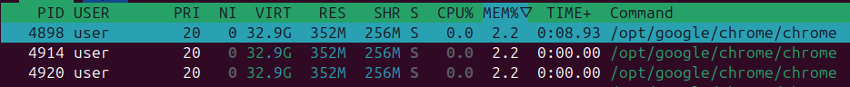

Besides `chrome` tabs, there are `/usr/share/code/code --type=zygote` and `/usr/bin/gnome-shell` 

- Top 3 IO-intensive processes:

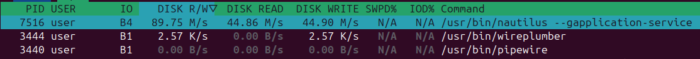

### 3. Check disk usage
```bash
df -h
```

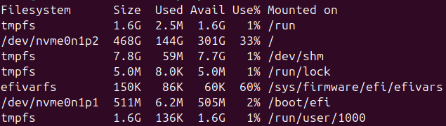

### 4. Identify largest files
```bash
du -h /var | sort -rh | head -n 10
```

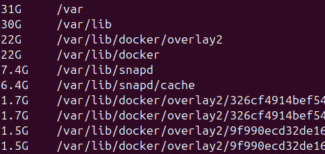

Top 3 largest files in `/var` are 3 docker images.

### Analysis
What patterns do you observe in resource utilization?
- The CPU is drastically loaded with the process of compressing a large file
- For the same reason, I/O is heavily used
- In normal cases, both CPU and I/O are idle most of the time

### Reflection
How would you optimize resource usage based on your findings?
- In the case of a personal computer, a heavy compression running in the background and consuming most of the resources is acceptable, especially when the user themselves initiated it
- Otherwise, there should be strict resource limits imposed on the compression process to prevent starvation of other processes

## Task 2 — Practical Website Monitoring Setup
### 1. Moodle website availability check
To set up an availability website test, a simple configuration is required:
- Url

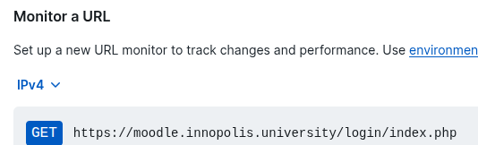

- Status code

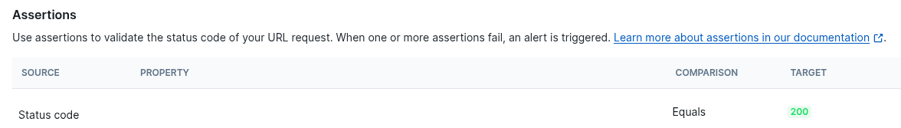

- Alert channels for notifying about changes

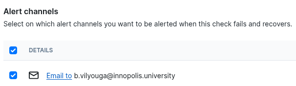

**Result**:

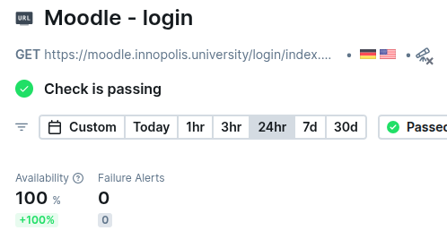

### 2. Moodle website user functionality check

The configuration used:
```js
const { expect, test } = require('@playwright/test')

test.setTimeout(210000)
test.use({ actionTimeout: 10000 })

test.describe('Moodle home page', () => {
  test.beforeEach(async ({ page }) => {
    await page.goto("https://moodle.innopolis.university/login/index.php")
  })
  test('has a correct title containing', async ({ page }) => {
    await expect(page).toHaveTitle("Log in to the site | IU Moodle")
  })

  test("has a 'Innopolis University' button", async ({ page }) => {
    const link = page.getByRole("link").getByText('Innopolis University')
    await expect(link).toHaveAttribute('href', /^https:\/\/moodle.innopolis.university\/auth\/oauth2\/login.php*/)
    await link.click()

    await expect(page).toHaveURL(/https:\/\/sso.university.innopolis.ru\/adfs\/oauth2\/authorize*/)
    await page.screenshot({ path: 'innopolis-university-login.jpg' }) // this will save a screenshot to be displayed in the test info
  })
})
```

#### Result:
- Due to time taken to complete the development of a correct test, the incomplete versions have run several times, **displaying retries and failures**.
- When the test has been completed, the **statistics started to recover**

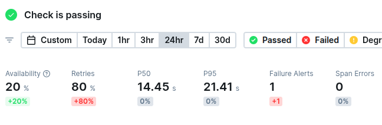

The service provides convenient storage and display of media associated with completed tests (like screenshots made in the test logic):

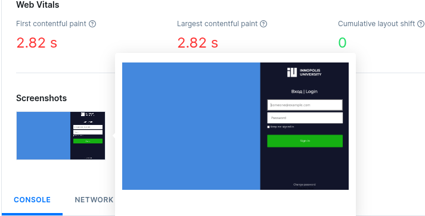

#### Alert about recovery sent to bound email:

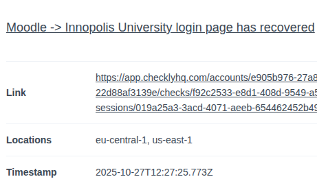

### 3. Dashboard overview
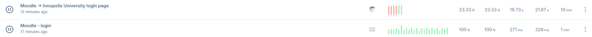

### Analysis
Why did you choose these specific checks and thresholds?
- The login page availability and functionality are vital for an educational web service such as Moodle
- The thresholds chosen before alerting are 1 failure each for the same reason

### Reflection
How does this monitoring setup help maintain website reliability?
- It notifies the development team about anomalies and unintended behaviour of the product that users might experience
- Additionally, it provides flexible tuning of tests and detailed reports of what goes wrong to easily investigate and address emerged issues