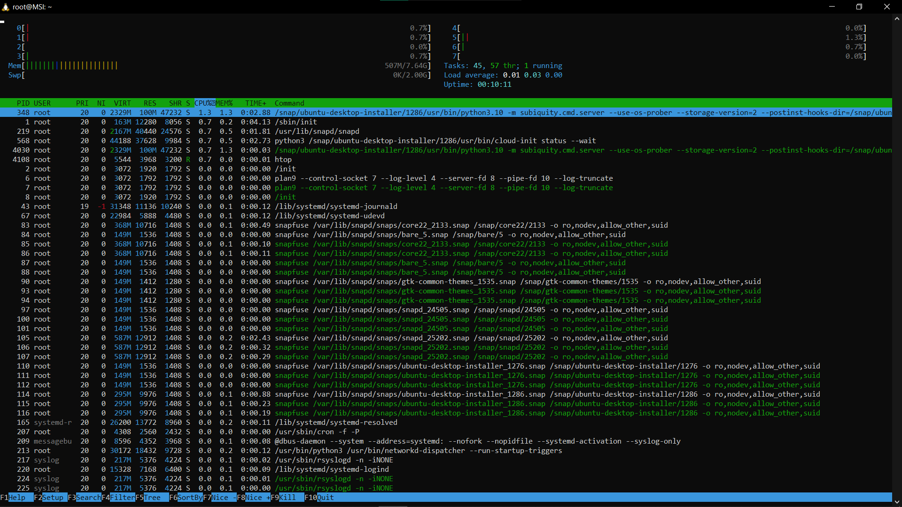
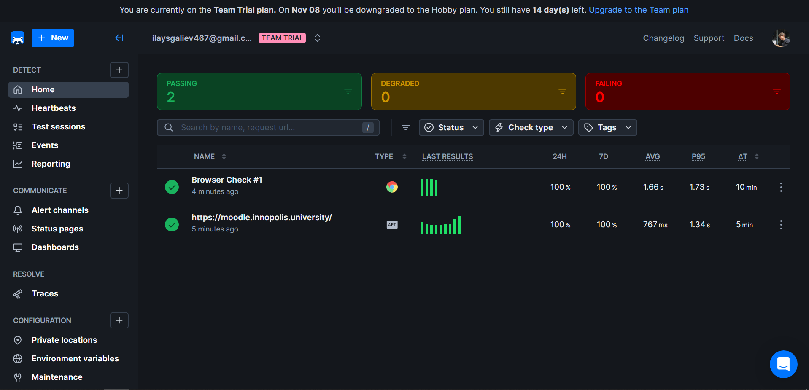
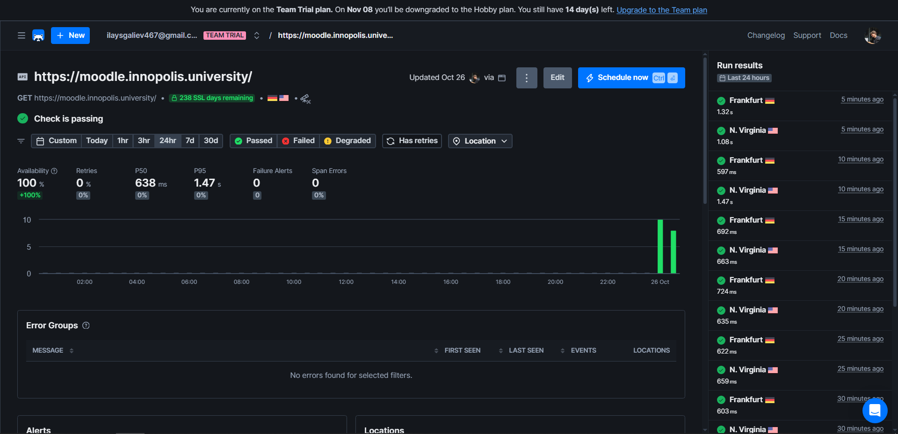
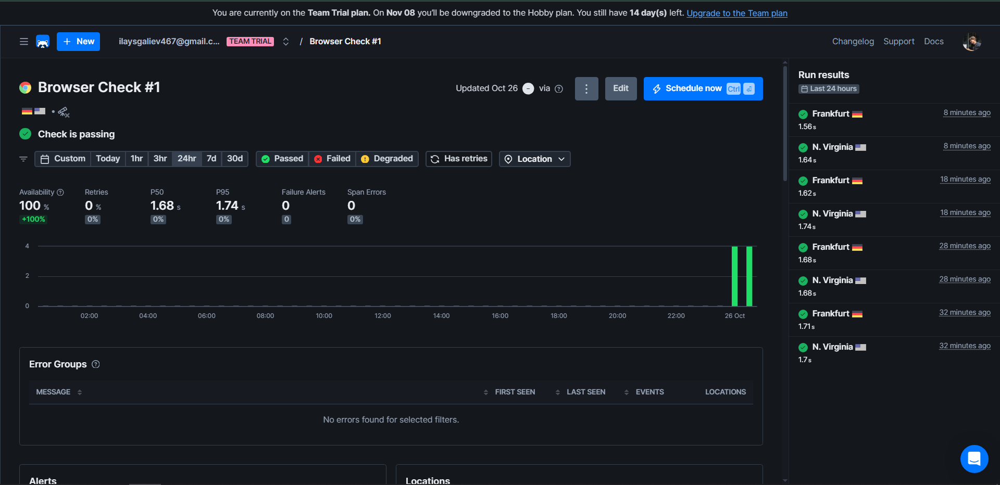
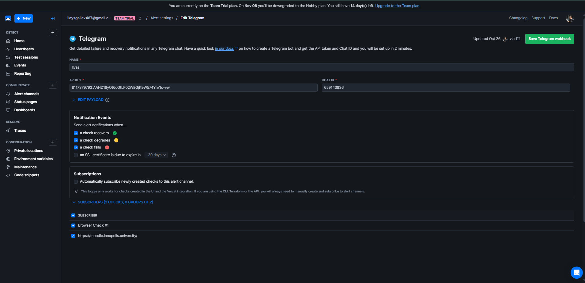

# Lab 8 — Submission

## Task 1 — Key Metrics for SRE and System Analysis (4 pts)

**Measurement date/time:** (insert date/time of measurements, e.g. 2025-10-26 20:40 MSK)

### 1.1 Collected artifacts (raw)
- `labs/raw/iostat.txt` — output of `iostat -x 1 5`
- `labs/raw/df.txt` — output of `df -h`
- `labs/raw/du_var_top10.txt` — `du -h /var | sort -rh | head -n 10`
- `labs/raw/big_files_var.txt` — `find /var -type f -exec du -h {} + | sort -rh | head -n 3`
- `labs/raw/top_cpu.txt` — `ps -eo pid,comm,%cpu,%mem --sort=-%cpu | head -n 15`
- `labs/raw/top_mem.txt` — `ps -eo pid,comm,%mem,%cpu --sort=-%mem | head -n 15`
- `labs/raw/iotop.txt` — optional, `iotop` or `pidstat -d` output
- `labs/raw/free.txt`, `labs/raw/uname.txt`, `labs/raw/lsb_release.txt` — environment and memory snapshot

(All raw files are placed in the repository under `labs/raw/`.)

### 1.2 Observations (brief)
- **CPU:** the system is mostly idle. `iostat` shows `idle` ≈ 98–99% (see `labs/raw/iostat.txt`). No prolonged high `%user` or `%system` activity.
- **Top CPU processes:** `python3.10`, `snapd`, and system daemons appear in `labs/raw/top_cpu.txt`. CPU usage percentages are single-digit or fractional (≈ 0.5–1.5% at sample time).
- **Memory:** ~7 GiB free, swap is not used (see `labs/raw/free.txt`). `python3.10` and `snapd` are the most visible memory consumers (see `labs/raw/top_mem.txt`).
- **I/O:** `iotop` or `pidstat` shows background `snapfuse/snapd` activity. No heavy I/O queues or high `iowait` (see `labs/raw/iotop.txt`).
- **Disk (/var):** primary consumers are snap packages and logs. Top-3 large files under `/var` are snap images (`ubuntu-desktop-installer_1286.snap`, `1276.snap`, `gtk-common-themes_1535.snap`) around 90–130 MB each (see `labs/raw/big_files_var.txt`). Root filesystem has ample free space (see `labs/raw/df.txt`).

### 1.3 Operational recommendations
1. Vacuum old systemd journal entries: `sudo journalctl --vacuum-time=7d` or `--vacuum-size=200M`.
2. Clean apt cache: `sudo apt clean && sudo apt autoremove`.
3. Remove old snap revisions: `snap list --all` → `sudo snap remove <pkg> --revision <old>` for unused revisions.
4. Move large persistent artifacts to a separate volume or to the Windows filesystem if appropriate.
5. Configure log rotation for `/var/log` (logrotate) if not already configured.

### 1.4 Proof images
**htop (top processes view):**  


---

## Task 2 — Website Monitoring (Checkly) (6 pts)

**Target URL:** `https://moodle.innopolis.university/` (example used for testing).

### 2.1 Configured checks (summary)
- **API Check** (GET `https://moodle.innopolis.university/`)  
  - Assertions: `Status code == 200` (and optionally `Response time < 1000 ms`)
  - Frequency: 5 minutes
  - Locations: EU (Frankfurt), US (N. Virginia)
  - Observed (dashboard): **avg ≈ 668 ms**, **p95 ≈ 908 ms**
  - Screenshot: `labs/img/checkly_api.png`

- **Browser Check** (Playwright script)  
  - Script: `goto(URL)` → `expect(page).toHaveTitle(...)` → `expect(locator('text=...')).toBeVisible()` → optional click and URL verification
  - Frequency: 10 minutes (or 5 minutes)
  - Locations: EU (Frankfurt), US (N. Virginia)
  - Observed: **avg ≈ 1.7 s**, **p95 ≈ 1.71 s**
  - Screenshots: `labs/img/checkly_browser.png`, `labs/img/checkly_run.png`

- **Alerting**  
  - Channels: Telegram (configured) and Email (optional)
  - Policy: `Alert after 2 consecutive failures` → notify via Telegram/Email; `Resolve after 1 success`
  - Screenshot: `labs/img/checkly_alerts.png`

### 2.2 Browser Check — example Playwright script
```javascript
/**
 * Playwright Test example for Checkly Browser Check
 * Adjust selectors and URL to match your target site.
 */

const { test, expect } = require('@playwright/test')

test.setTimeout(210000)       // 210 seconds test timeout for Checkly
test.use({ actionTimeout: 10000 }) // 10s action timeout

test('visit page and verify key content', async ({ page }) => {
  const response = await page.goto(process.env.ENVIRONMENT_URL || 'https://moodle.innopolis.university/', { waitUntil: 'domcontentloaded' })
  // Screenshot for evidence
  await page.screenshot({ path: 'labs/img/checkly_browser_run.png' })
  // Basic assertions
  expect(response.status(), 'should respond with correct status code').toBeLessThan(400)
  await expect(page).toHaveTitle(/Moodle/i)
  await expect(page.getByText('Dashboard')).toBeVisible() // adjust selector as needed
})
```

### 2.3 Proof images (Checkly)
**Dashboard / checks list:**  


**API Check configuration (URL, method, assertions, frequency):**  


**Browser Check script & config:**  


**Alert channels / policy:**  


## Reflection — how this setup helps maintain website reliability

**Incident detection and scope**
- API checks detect server-side outages and edge-network problems fast.
- Browser checks detect functional regressions and critical client-side errors that impact users even when the API responds.

**Noise reduction and actionability**
- Multi-location checks and “2 consecutive failures” policy reduce false positives.
- Using p95 and LCP thresholds targets user-impacting slowdowns rather than transient spikes.

**Operational benefits**
- Faster MTTR: clear, evidence-backed alerts (logs, screenshots, failing step) speed up triage.
- Prioritization: SREs and developers can prioritize fixes by user-impact metrics (p95, LCP).
- Continuous verification: automated checks provide regression protection for deployments and third-party changes.

**Next steps (practical improvements)**
- Integrate Checkly alerts with incident management (Slack + PagerDuty) for on-call escalation.
- Add synthetic transactions for other critical flows (login, checkout, search).
- Track long-term trends in metrics (daily/weekly p95) and align thresholds with SLO/SLI targets.

