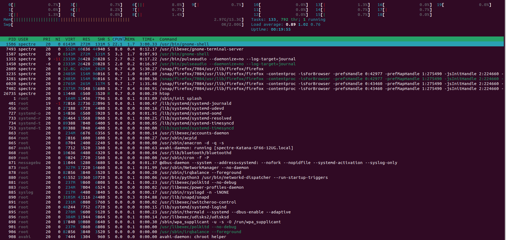
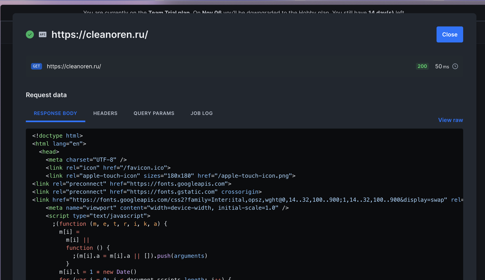
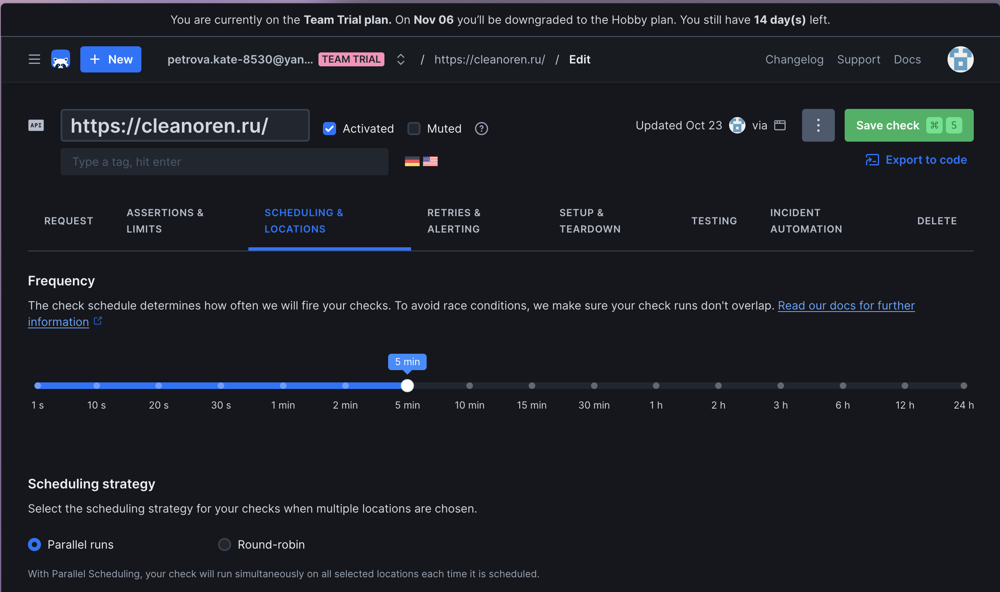
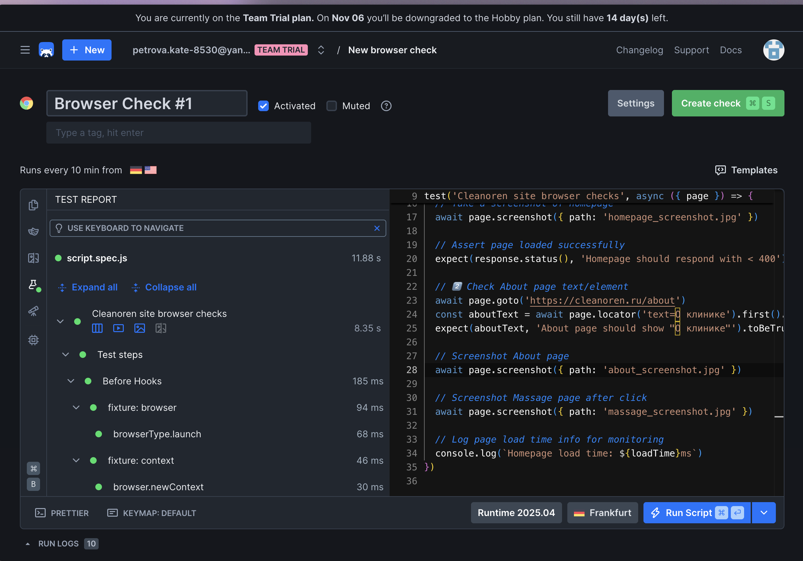
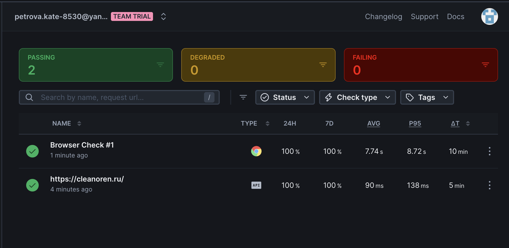

# Lab 8 Submission - Task 1

## Task 1 — Key Metrics for SRE and System Analysis

### 1.1 System Resource Monitoring

**Command** htop

**Output**

**Command:** ps aux --sort=-%cpu | head -6

**Output:**
spectre     2609 39.2  3.9 13079268 628924 ?     Sl   21:02   4:03 /snap/firefox/7084/usr/lib/firefox/firefox
spectre     1506 17.6  1.6 6009636 272816 ?      Ssl  21:02   1:50 /usr/bin/gnome-shell
spectre     6020 11.5  1.5 2752640 256380 ?      Sl   21:07   0:37 /snap/firefox/7084/usr/lib/firefox/firefox

**Command:** ps aux --sort=-%mem | head -6

**Output:**
spectre     2609 38.6  3.8 13108676 625648 ?     Sl   21:02   4:05 /snap/firefox/7084/usr/lib/firefox/firefox
spectre     3221  4.4  1.8 2697336 296064 ?      Sl   21:02   0:27 /snap/firefox/7084/usr/lib/firefox/firefox
spectre     7131  1.9  1.7 2773736 288664 ?      Sl   21:07   0:06 /snap/firefox/7084/usr/lib/firefox/firefox

**Command:** top -bn1 | head -10

**Output:**
top - 21:13:33 up 11 min,  1 user,  load average: 0.94, 0.90, 0.54
Tasks: 400 total,   1 running, 398 sleeping,   0 stopped,   1 zombie
%Cpu(s):  0.6 us,  0.6 sy,  0.0 ni, 98.8 id,  0.0 wa,  0.0 hi,  0.0 si,  0.0 st

**Command:** free -h

**Output:**
MiB Mem :  15693.4 total,   9703.6 free,   2473.4 used,   3516.4 buff/cache
MiB Swap:   2048.0 total,   2048.0 free,      0.0 used.  12763.1 avail Mem

**Command:** vmstat 1 5

**Output:**
procs -----------memory---------- ---swap-- -----io---- -system-- ------cpu-----
 r  b   swpd   free   buff  cache   si   so    bi    bo   in   cs us sy id wa st
 2  0      0 9631072 129028 3775692    0    0   121   124  244  494  3  1 96  0  0

### 1.2 Disk Space Management

**Command:** df -h

**Output:**
Filesystem      Size  Used Avail Use% Mounted on
/dev/nvme0n1p7   77G   33G   40G  45% /

**Command:** du -h /home/$USER | sort -rh | head -10

**Output:**
14G	/home/spectre
7.7G	/home/spectre/.local
6.6G	/home/spectre/.local/lib/python3.10/site-packages
6.6G	/home/spectre/.local/lib/python3.10
6.6G	/home/spectre/.local/lib

**Command:** du -h /var/log | sort -rh | head -5

**Output:**
222M	/var/log
217M	/var/log/journal/99e9a42fe0b244879aa75d9b429762f4
217M	/var/log/journal
1.5M	/var/log/installer
244K	/var/log/apt

### Reflection:
The system shows healthy resource usage with Firefox as the main consumer. Plenty of free memory and low I/O wait indicate good performance. Disk space is adequate with Python packages being the largest data consumers.

## Task 2 — Practical Website Monitoring Setup

### Website URL: https://www.github.com

### API Check Configuration:

### API Check Result: 

### Browser ckeck with result:

### Alert Settings:

### Reflection:
This monitoring setup helps maintain website reliability by providing immediate alerts for downtime and performance issues, enabling proactive problem resolution before users are affected.
