# Lab 7

## Task 1

### 1.1

**Command:** `htop`

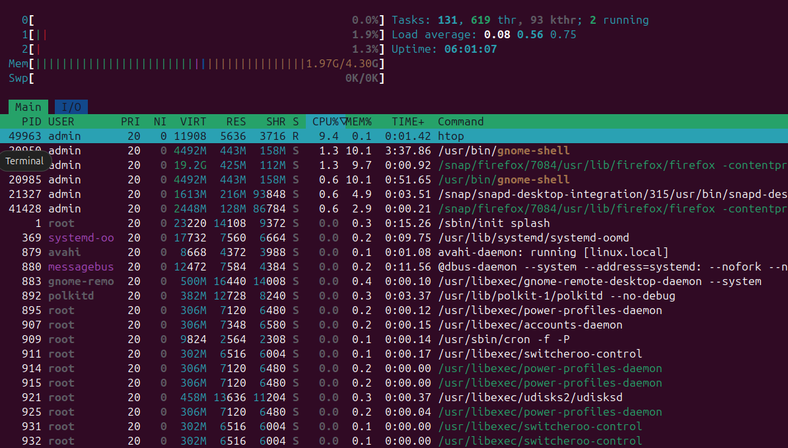


**Top 3 CPU-consuming processes:**
1. `/snap/firefox/...` — 1.3%  
2. `/usr/bin/gnome-shell` — 0.6%
3. `/snap/firefox/...` — 0.6%

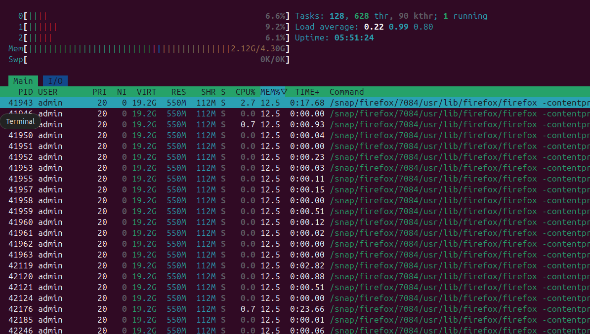

**Top 3 memory-consuming processes:**
1. `/snap/firefox/...` — 11.3%
2. `/snap/firefox/...` — 11.3%
3. `/snap/firefox/...` — 11.3%

---
`iostat -x 1 5`

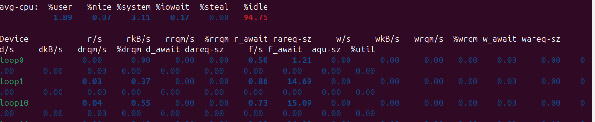

**Top 3 devices by I/O utilization:**
1. `sda` — %util ≈ 1.07
2. `loop4` — %util ≈ 0.02
3. `loop12` — %util ≈ 0.01


---
### 1.2 

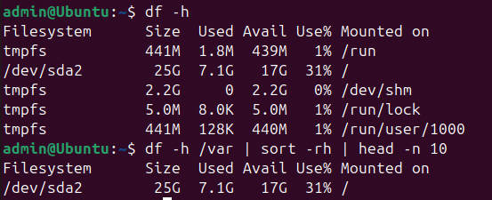

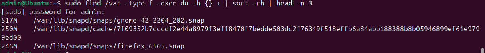
---
**What patterns do you observe in resource utilization?**

There is a high CPU usage of processes related to system updates. The memory is mostly occupied by the cache. The I/O load is low because the system does not perform resource-intensive disk tasks.

---
**How would you optimize resource usage based on your findings?**

For optimization, you can set up automatic updates at night and clear the cache of unnecessary packages.

## Task 2

### 2.1 - Choose Your Website

https://www.bbc.com

---
### 2.2 - API Check

- **Method:** GET
- **Assertion:** Status code equals 200
- **Interval:** Every 1 minutes
- **Locations:** Frankfurt, N. Virginia

**Result:** Status 200, response time ~6 ms


**Screenshots of successful check results**
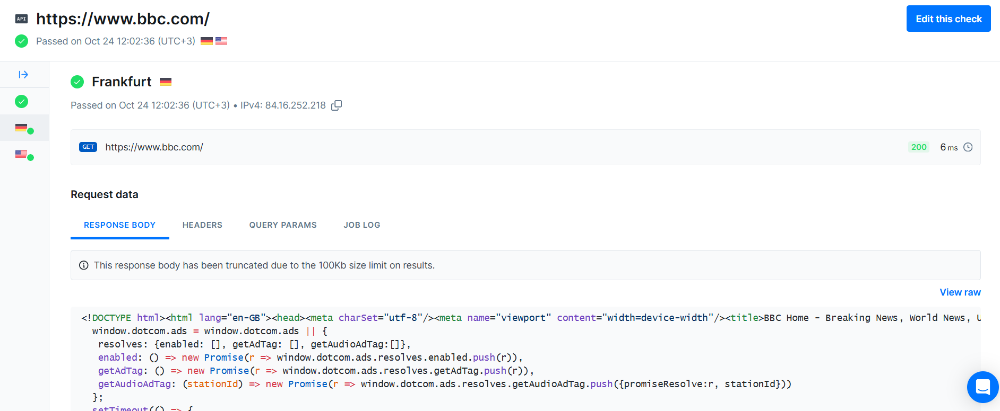
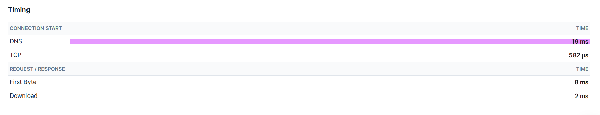
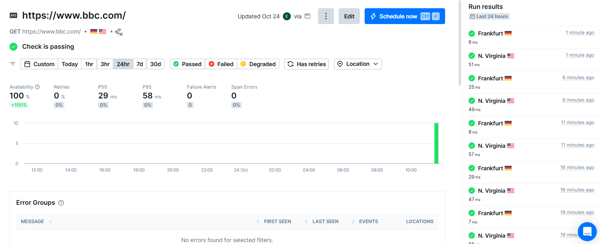


### 2.3 - Browser Check


**Playwright (Checkly) script**:
```
const { test, expect } = require('@playwright/test');

test('check BBC homepage', async ({ page }) => {
  test.setTimeout(60000);
  
  // 1. Go to the BBC homepage
  await page.goto('https://www.bbc.com', { waitUntil: 'domcontentloaded' });
  
  // 2. Check that the page has loaded (the header contains BBC)
  await expect(page).toHaveTitle(/BBC/, { timeout: 10000 });
  
  // 3. Check that the BBC logo is visible (using several selector options)
  const logoSelectors = [
    'a[aria-label*="BBC"]',
    'header svg', 
    'nav svg',
    '.ssrcss-1gn0a9a-Header',
    '[data-testid*="logo"]',
    'header img[alt*="BBC"]'
  ];
  
  let logoFound = false;
  for (const selector of logoSelectors) {
    const logo = page.locator(selector).first();
    if (await logo.isVisible()) {
      logoFound = true;
      console.log(`✅ Logo found with selector: ${selector}`);
      break;
    }
  }
  
  if (!logoFound) {
    await expect(page.locator('header').first()).toBeVisible({ timeout: 10000 });
    console.log('⚠️ Using header as fallback for logo check');
  }
  
  // 4. Check that the main content is loaded
  await expect(page.locator('main, [role="main"], .ssrcss-1yh5whj-MainColumn').first()).toBeVisible({ timeout: 15000 });
  
  // 5. Check that there is at least one link/news item on the main page.
  const contentLinks = page.locator('a[href*="/news/"], a[href*="/sport/"], [data-testid*="card"]').first();
  await expect(contentLinks).toBeVisible({ timeout: 10000 });
  
  // 6. Check that navigation is present
  const navSelectors = [
    'nav',
    '[aria-label*="navigation" i]',
    '[role="navigation"]',
    '.ssrcss-1sifr1k-Navigation'
  ];
  
  let navFound = false;
  for (const selector of navSelectors) {
    const nav = page.locator(selector).first();
    if (await nav.isVisible()) {
      navFound = true;
      console.log(`✅ Navigation found with selector: ${selector}`);
      break;
    }
  }
  
  console.log('✅ BBC homepage check completed successfully');
});
```

**Screenshot of browser check configuration**

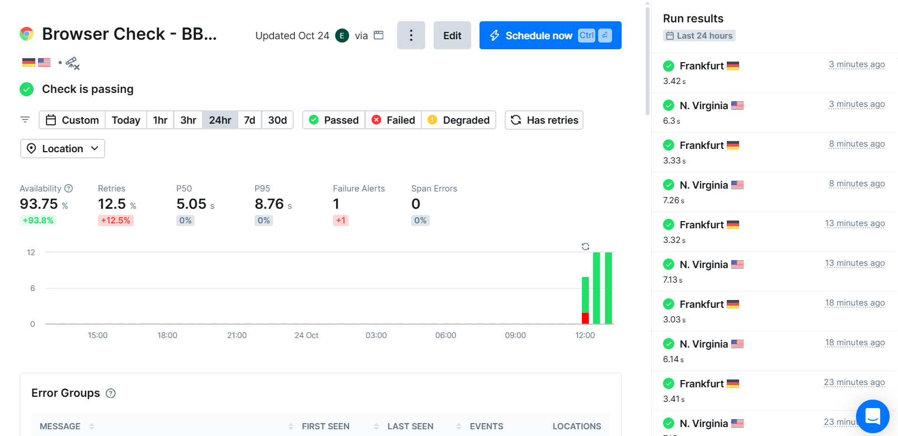
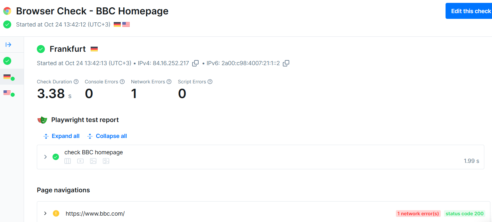

**Screenshot of Dashboard**

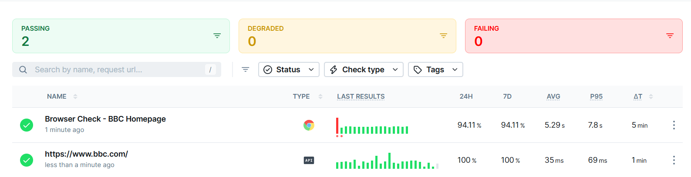

---
### 2.4 - Screenshots of alert settings

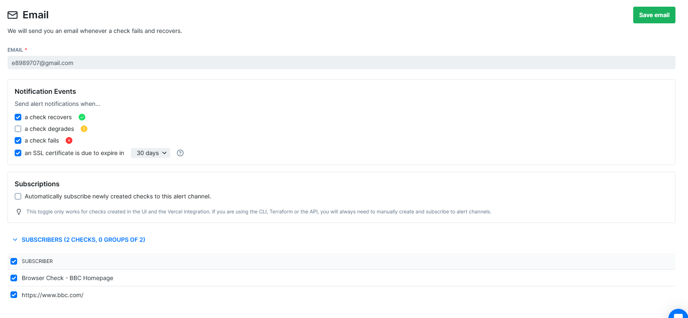
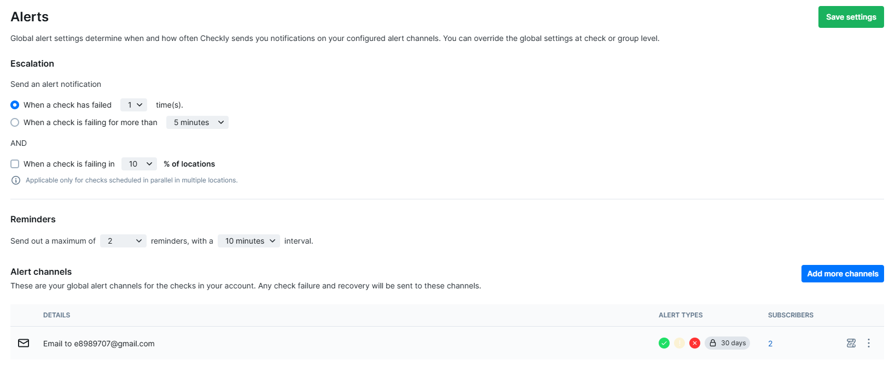

---
**Why did you choose these specific checks and thresholds?**

I choose a `200` status check for basic availability, as this is the minimum requirement for the site to work. Browser verification includes validation of the visibility of key elements to ensure that the site is not only accessible, but also displayed correctly. Alert thresholds are left at default to receive notifications of any failure, which is critical to maintain a high availability level.

---
**How does this monitoring setup help maintain website reliability?**

This setting allows you to proactively detect problems: `API check` will show site downtime, and `Browser check `will reveal more subtle problems with the interface or JavaScript. By receiving `email alerts`, I can quickly react to an incident before users notice it.