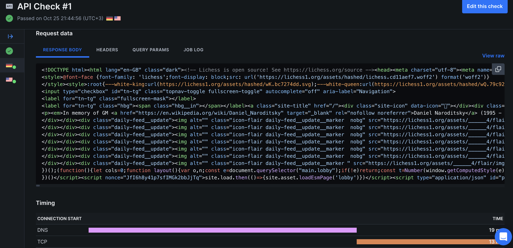
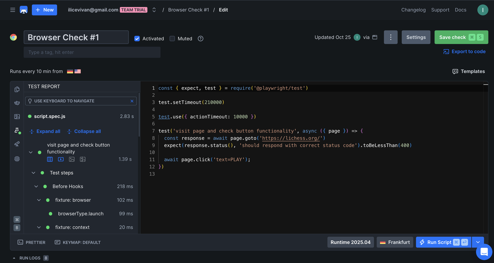
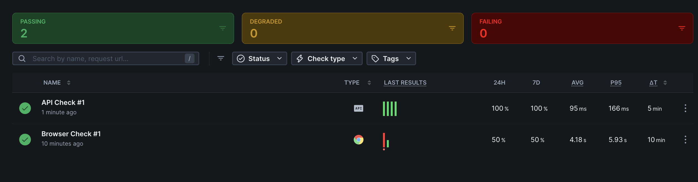
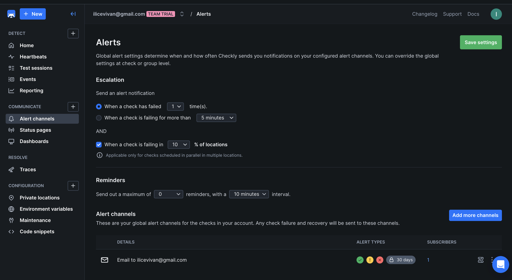
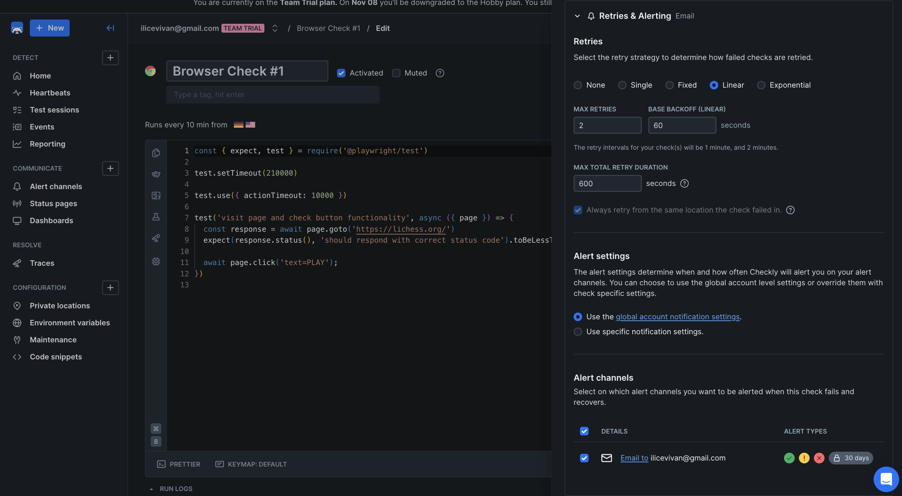
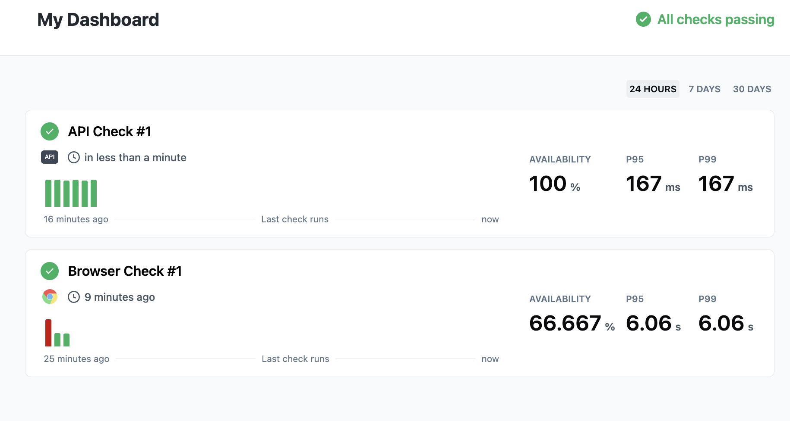

# Lab 8 — Site Reliability Engineering (SRE)

## Task 1 — Key Metrics for SRE and System Analysis

### 1.1: Monitor System Resources

**Install Monitoring Tools (macOS):**

```bash
brew install htop
```

**Monitor CPU, Memory, and I/O Usage:**

```bash
> htop

    0[|||||||||||||      52.9%]   3[||||||||           30.5%]   6[||                  1.4%]   9[|||                 8.6%]
    1[||||||||||||       45.5%]   4[|                   1.4%]   7[||                  1.4%]  10[||||               13.2%]
    2[||||||||||         38.0%]   5[|                   1.1%]   8[|||||              12.9%]  11[|||                 6.0%]
  Mem[|||||||||||||||||||||||||||||||||||||||||||18.2G/24.0G] Tasks: 791, 2455 thr, 0 kthr; 2 running
  Swp[                                                 0K/0K] Load average: 4.31 2.45 2.07 
                                                              Uptime: 47 days, 16:24:34
```

```bash
> iostat -d -w 2 -c 5
              disk0               disk4 
    KB/t  tps  MB/s     KB/t  tps  MB/s 
   13.74   40  0.53  1342.92    0  0.00 
    4.00    2  0.01     0.00    0  0.00 
    8.62   13  0.11     0.00    0  0.00 
    4.00    1  0.01     0.00    0  0.00 
   12.15   13  0.15     0.00    0  0.00 
```

**Identify Top Resource Consumers:**

```bash
> top -l 2 -o cpu -n 10 | tail -20
# Top 3 CPU consumers are WindowServer, kernel_task, and Cursor Helper
Load Avg: 2.69, 2.52, 2.15 
CPU usage: 5.51% user, 6.27% sys, 88.20% idle 
SharedLibs: 808M resident, 148M data, 112M linkedit.
MemRegions: 0 total, 0B resident, 465M private, 3175M shared.
PhysMem: 23G used (2683M wired, 4405M compressor), 663M unused.
VM: 354T vsize, 5703M framework vsize, 0(0) swapins, 0(0) swapouts.
Networks: packets: 168786971/144G in, 57170041/33G out.
Disks: 71692913/1083G read, 90116044/1041G written.

PID    COMMAND          %CPU TIME     #TH    #WQ #PORTS MEM    PURG  CMPRS PGRP  PPID  STATE    BOOSTS       %CPU_ME %CPU_OTHRS UID FAULTS     COW     MSGSENT     MSGRECV     SYSBSD      SYSMACH    CSW         PAGEINS IDLEW      POWER INSTRS    CYCLES    JETPRI USER          #MREGS RPRVT VPRVT VSIZE KPRVT KSHRD
381    WindowServer     35.0 93:46:33 23/1   6   5858   1715M+ 93M+  300M  381   1     running  *0[1]        0.68625 2.76468    88  674784346+ 1458336 1903396942+ 2147483647  2145503768+ 2147483647 2122157772+ 4179    35429288+  42.2  664991080 810229121 170    _windowserver N/A    N/A   N/A   N/A   N/A   N/A  
0      kernel_task      14.3 31:56:49 677/12 0   0      27M    0B    0B    0     0     running   0[0]        0.00000 0.00000    0   228585     0       2147483647  1551833657+ 0           0          2147483647  320     126526491+ 0.0   186896781 319791125 0      root          N/A    N/A   N/A   N/A   N/A   N/A  
4949   Cursor Helper (R 12.9 01:13.92 24     1   232    368M+  80K   9968K 4942  4942  sleeping *0[56664+]   0.00000 0.00000    501 422918+    2092    358857+     143780+     718121+     832242+    478135+     1855    2052+      13.0  337044351 417442985 180    ivanilicev    N/A    N/A   N/A   N/A   N/A   N/A  
```

```bash
> top -l 1 -o rsize -n 10
# Top 3 Memory consumers are Telegram, WindowServer, and Arc
Processes: 784 total, 3 running, 781 sleeping, 3986 threads 
2025/10/25 14:28:37
Load Avg: 1.96, 2.33, 2.10 
CPU usage: 4.10% user, 10.7% sys, 85.82% idle 
SharedLibs: 808M resident, 148M data, 112M linkedit.
MemRegions: 635319 total, 8327M resident, 462M private, 3197M shared.
PhysMem: 23G used (2787M wired, 4403M compressor), 647M unused.
VM: 352T vsize, 5703M framework vsize, 0(0) swapins, 0(0) swapouts.
Networks: packets: 168790106/144G in, 57170958/33G out.
Disks: 71693059/1083G read, 90117517/1041G written.

PID    COMMAND          %CPU TIME     #TH #WQ #PORTS MEM   PURG CMPRS PGRP  PPID  STATE    BOOSTS      %CPU_ME %CPU_OTHRS UID FAULTS    COW     MSGSENT    MSGRECV    SYSBSD     SYSMACH    CSW        PAGEINS IDLEW    POWER INSTRS CYCLES JETPRI USER          #MREGS RPRVT VPRVT VSIZE KPRVT KSHRD
80441  Telegram         0.0  91:40.79 60  5   2016   2310M 58M  928M  80441 1     sleeping  0[34117]   0.00000 0.00000    501 10068985  1262    38484324   7766275    100012347  67196182   47637689   17838   608031   0.0   0      0      0      ivanilicev    N/A    N/A   N/A   N/A   N/A   N/A  
381    WindowServer     0.0  93:46:50 23  6   5858   1715M 77M  300M  381   1     sleeping *0[1]       0.00000 0.00000    88  674802692 1458336 1903548451 2147483647 2145620825 2147483647 2122268078 4179    35438781 0.0   0      0      170    _windowserver N/A    N/A   N/A   N/A   N/A   N/A  
41545  Arc              0.0  05:31:24 70  5   1791   837M  544K 213M  41545 1     sleeping *8364109[3] 0.00000 0.00000    501 41427711  112396  675077741  68405303   279533871  1067066493 156616284  278541  2076837  0.0   0      0      100    ivanilicev    N/A    N/A   N/A   N/A   N/A   N/A   
```

```bash
> sudo fs_usage -w -f diskio | head -20
# Top 3 I/O consumers are mdworker, Telegram, and launchd browser
14:29:18.897582    RdData[AT2]     D=0x00a886d2  B=0x1000   /dev/disk3s5  /Users/ivanilicev/Library/Group Containers/6N38VWS5BX.ru.keepcoder.Telegram/appstore/account-5707104934998088445/network-stats                      0.000875 W Telegram.17658480
14:29:18.897739    WrData[AT2]     D=0x00a886d2  B=0x1000   /dev/disk3s5  /Users/ivanilicev/Library/Group Containers/6N38VWS5BX.ru.keepcoder.Telegram/appstore/account-5707104934998088445/network-stats                      0.000044 W Telegram.17658480
14:29:19.027868    RdData[A]       D=0x0490f371  B=0x4000   /dev/disk3s1s1  /usr/lib/dyld/..namedfork/rsrc                                                                                                                    0.000164 W bash.17664308
14:29:19.028362    RdData[A]       D=0x04de64f2  B=0x4000   /dev/disk3s2  /System/Volumes/Preboot/Cryptexes/OS/System/Library/dyld/dyld_shared_cache_arm64e/..namedfork/rsrc                                                  0.000169 W bash.17664308
14:29:19.028999    RdData[A]       D=0x0490fa55  B=0x4000   /dev/disk3s1s1  /bin/bash/..namedfork/rsrc                                                                                                                        0.000143 W bash.17664308
14:29:19.030770    RdData[A]       D=0x048bad11  B=0x3000   /dev/disk3s1s1  /usr/bin/which/..namedfork/rsrc                                                                                                                   0.000174 W which.17664309
14:29:19.037153    RdData[A]       D=0x0490fb01  B=0x4000   /dev/disk3s1s1  /bin/ps/..namedfork/rsrc                                                                                                                          0.000186 W ps.17664312
14:29:19.037877    RdData[A]       D=0x0490fb05  B=0x7000   /dev/disk3s1s1  /bin/ps/..namedfork/rsrc                                                                                                                          0.000209 W ps.17664312
14:29:19.398399    RdData[AT3]     D=0x0298be5e  B=0x3000   /dev/disk3s5  /System/Volumes/Data/Users/ivanilicev/Library/Application Support/Cursor/Backups/1fd9fe421b5e89f88bb0c9e07bee3bfb/file/-7490b1f7                    0.000960 W mdworker_shared.17660680
14:29:19.650564    RdData[S]       D=0x05945ab6  B=0x4000   /dev/disk3s5  /private/var/folders/zz/zyxvpxvq6csfxvn_n0000000000000/0/com.apple.icloud.searchpartyd/Observations.db-wal                                          0.000415 W searchpartyd.17662647
14:29:20.670812    WrData[S]       D=0x000168f7  B=0x32     /dev/NOTFOUND  /dev/null                                                                                                                                          0.000001 W searchpartyusera.17655343
14:29:20.671002    RdData[ST1]     D=0x05c63194  B=0x4000   /dev/disk3s5  /private/var/log/com.apple.xpc.launchd/launchd.log                                                                                                  0.000551 W launchd.17661017
14:29:20.671332    WrData[S]       D=0x000168f7  B=0x32     /dev/NOTFOUND  /dev/null                                                                                                                                          0.000001 W searchpartyusera.17655343
14:29:20.671402    WrData[S]       D=0x000168f7  B=0x61     /dev/NOTFOUND  /dev/null                                                                                                                                          0.000001 W searchpartyusera.17655343
14:29:21.470674    RdData[AT2]     D=0x03566bb7  B=0x4000   /dev/disk3s5  /Users/ivanilicev/Library/Group Containers/6N38VWS5BX.ru.keepcoder.Telegram/appstore/account-5707104934998088445/postbox/db/db_sqlite               0.000976 W Telegram.17664284
14:29:21.471210    RdData[ST2]     D=0x02f43f19  B=0x4000   /dev/disk3s5  /Users/ivanilicev/Library/Group Containers/6N38VWS5BX.ru.keepcoder.Telegram/appstore/logs/critlog-2025-10-25_14-22-27.034.txt                       0.000092 W Telegram.17658480
14:29:22.356262    RdData[S]       D=0x02e58f57  B=0x4000   /dev/disk3s5  /Users/ivanilicev/Library/Application Support/firestore/Arc/bcny-arc-server/main/001884.log                                                         0.000442 W Arc.17663319
14:29:22.458682    WrData[AT2]     D=0x00a886d2  B=0x1000   /dev/disk3s5  /Users/ivanilicev/Library/Group Containers/6N38VWS5BX.ru.keepcoder.Telegram/appstore/account-5707104934998088445/network-stats                      0.000544 W Telegram.17659104
14:29:23.672966    WrData[S]       D=0x000168f8  B=0x141    /dev/NOTFOUND  /dev/null                                                                                                                                          0.000002 W searchpartyusera.17655343
```


### 1.2: Disk Space Management

**Check Disk Usage:**

```bash
> df -h
Filesystem                                            Size    Used   Avail Capacity iused ifree %iused  Mounted on
/dev/disk3s1s1                                       460Gi    10Gi   194Gi     6%    426k  2.0G    0%   /
devfs                                                361Ki   361Ki     0Bi   100%    1.2k     0  100%   /dev
/dev/disk3s6                                         460Gi    20Ki   194Gi     1%       0  2.0G    0%   /System/Volumes/VM
/dev/disk3s2                                         460Gi   6.6Gi   194Gi     4%    1.3k  2.0G    0%   /System/Volumes/Preboot
/dev/disk3s4                                         460Gi   4.4Mi   194Gi     1%      55  2.0G    0%   /System/Volumes/Update
/dev/disk1s2                                         500Mi   6.0Mi   481Mi     2%       1  4.9M    0%   /System/Volumes/xarts
/dev/disk1s1                                         500Mi   5.5Mi   481Mi     2%      34  4.9M    0%   /System/Volumes/iSCPreboot
/dev/disk1s3                                         500Mi   2.4Mi   481Mi     1%      91  4.9M    0%   /System/Volumes/Hardware
/dev/disk3s5                                         460Gi   249Gi   194Gi    57%    2.7M  2.0G    0%   /System/Volumes/Data
map auto_home                                          0Bi     0Bi     0Bi   100%       0     0     -   /System/Volumes/Data/home
```

```bash
# macOS-specific: Check actual data directories instead of empty /var
> sudo du -h ~/Library | sort -rh | head -n 5
 38G    /Users/ivanilicev/Library
 22G    /Users/ivanilicev/Library/Group Containers
 20G    /Users/ivanilicev/Library/Group Containers/6N38VWS5BX.ru.keepcoder.Telegram/appstore
 20G    /Users/ivanilicev/Library/Group Containers/6N38VWS5BX.ru.keepcoder.Telegram
 19G    /Users/ivanilicev/Library/Group Containers/6N38VWS5BX.ru.keepcoder.Telegram/appstore/account-5707104934998088445/postbox
```

```bash
> sudo du -h /Applications | sort -rh | head -n 5
 15G    /Applications
3.7G    /Applications/iMovie.app/Contents
3.7G    /Applications/iMovie.app
2.0G    /Applications/PyCharm CE.app/Contents
2.0G    /Applications/PyCharm CE.app
```

```bash
> sudo du -h ~/Downloads | sort -rh | head -n 5
483M    /Users/ivanilicev/Downloads
134M    /Users/ivanilicev/Downloads/kaggle/working/checkpoints
```


**Identify Largest Files:**

```bash
# macOS-specific: Find largest files in common locations
> du -ah ~ | sort -rh | head -5
136G    /Users/ivanilicev
 86G    /Users/ivanilicev/Desktop
 46G    /Users/ivanilicev/Desktop/useful things for study
 38G    /Users/ivanilicev/Library
 27G    /Users/ivanilicev/Desktop/movies
```


### Task 1 Analysis

#### Top 3 most consuming applications

**CPU Usage:**
1. **WindowServer (35.0%)** - macOS window management system
2. **kernel_task (14.3%)** - System kernel processes
3. **Cursor Helper (12.9%)** - Development environment processes

**Memory Usage:**
1. **Telegram (2.3GB)** - Messaging application with heavy data storage
2. **WindowServer (1.7GB)** - Window management and graphics
3. **Arc Browser (837MB)** - Web browser with multiple tabs

**I/O Usage:**


#### Command outputs showing resource consumption

Shown above

#### Top 3 largest files/directories

Since `/var` is empty on macOS (0B), the largest space consumers are:


#### Analysis: What patterns do you observe in resource utilization?

**Resource Utilization Patterns:**

1. **Memory-Heavy Applications:** Telegram (2.3GB) and WindowServer (1.7GB) dominate memory usage, indicating heavy data storage and graphics processing requirements.

2. **Development Environment Impact:** Cursor and related development tools consume significant CPU (12.9%) and memory, showing the resource cost of modern development environments.

3. **I/O Concentration:** Telegram shows the highest I/O activity due to constant database operations, message synchronization, and network statistics tracking.

4. **System Efficiency:** The system maintains good overall performance with 88.20% CPU idle time, indicating efficient resource management.


#### Reflection: How would you optimize resource usage based on your findings?

**Optimization Recommendations:**

1. **Memory Optimization:**
   - **Telegram Cleanup:** Clear old messages and media to reduce the 20GB storage footprint
   - **Browser Management:** Close unused tabs in Arc to reduce memory consumption
   - **Development Environment:** Restart Cursor periodically to clear accumulated memory

2. **CPU Optimization:**
   - **Process Monitoring:** Monitor for runaway processes, especially development tools
   - **Background Apps:** Close unnecessary background applications to reduce CPU load
   - **System Maintenance:** Regular system restarts to clear accumulated system processes

3. **I/O Optimization:**
   - **Telegram Settings:** Configure Telegram to limit message history and media storage
   - **Development Workspace:** Organize project files to reduce I/O operations
   - **Browser Cache:** Regularly clear browser cache to reduce I/O load

4. **Storage Optimization:**
   - **Application Cleanup:** Remove unused applications like iMovie (3.7GB) if not needed
   - **File Organization:** Organize desktop files (46GB) to improve system performance
   - **Regular Maintenance:** Implement regular cleanup routines for temporary files


## Task 2 — Practical Website Monitoring Setup (6 pts)

### 2.1: Choose Your Website

**Selected Target Website:**

Website URL: [Lichess](https://lichess.org/)

### 2.2: Create Checks in Checkly

**Sign Up:**

Created a free account at [Checkly](https://www.checklyhq.com/)

**API Check for Basic Availability:**

Configuration:

- **URL**: (https://lichess.org/)
- **Check Type**: API Check (HTTP/HTTPS)
- **Method**: GET
- **Assertion**: Status code equals 200
- **Frequency**: Every 5 minutes
- **Locations**: Multiple global locations (N. Virginia, Frankfurt)

**Create Browser Check for Content & Interactions:**

Configuration:

- **Check Type**: Browser Check (Playwright)
- **Frequency**: Every 10 minutes
- **Target Elements/Actions**:
  - Page loading success
  - Button click functionality
  
**Browser Check Script:**

```javascript
const { expect, test } = require('@playwright/test')

test.setTimeout(210000)

test.use({ actionTimeout: 10000 })

test('visit page and check button functionality', async ({ page }) => {
  const response = await page.goto('https://lichess.org/')
  expect(response.status(), 'should respond with correct status code').toBeLessThan(400)

  await page.click('text=PLAY');
})
```


### 2.3: Set Up Alerts

**Alert Rules Configuration:**

- **What to alert on?**: Failed checks
- **How to be notified?**: via Email channel
- **Set thresholds that make sense for your site**:
  - Check has failed 1 times
  - AND When check is failing in 10% of Locations


### 2.4: Capture Proof & Documentation

**Run Checks Manually:**

All checks executed successfully:

- API Check: ✅ Status 200 response
- Browser Check: ✅ All elements visible and buttons functional

**Screenshots:**

#### Api Check



#### Browser Check Configuration

Provided above as well


#### Successful Check Result



#### Alert Settings





#### Dashboard Overview




### Task 2 Analysis

#### Website URL you chose to monitor

Provided above: ```https://lichess.org/```

#### Screenshots of browser check configuration


#### Screenshots of successful check results


#### Screenshots of alert settings


#### Analysis: Why did you choose these specific checks and thresholds?

**Check Selection Rationale:**

1. **API Check (Every 5 minutes)**:
   - **Purpose**: Basic availability monitoring for Lichess.org
   - **Rationale**: Ensures the website is reachable and responding with HTTP 200 status
   - **Frequency**: 5-minute intervals provide quick detection of outages
   - **Value**: Catches server-level issues, DNS problems, and network connectivity issues

2. **Browser Check (Every 10 minutes)**:
   - **Purpose**: User experience validation and interactive functionality testing
   - **Rationale**: Verifies that the website loads correctly and core functionality (PLAY button) works
   - **Frequency**: 10-minute intervals balance monitoring depth with resource usage
   - **Value**: Catches JavaScript errors, UI rendering issues, and user interaction problems

3. **Alert Thresholds**:
   - **1 failure trigger**: Immediate notification for critical issues
   - **10% location failure**: Prevents false alarms from temporary network issues
   - **Email channel**: Quick and reliable alerts

**Threshold Justification:**

- **5-minute API checks**: Lichess is a real-time gaming platform where availability is critical. Users expect immediate access to games, so quick detection of issues is essential.

- **10-minute browser checks**: Interactive functionality is important but less critical than basic availability. This frequency provides good coverage without overwhelming the monitoring system.

- **1 failure trigger**: For a gaming platform, any downtime directly impacts user experience and revenue. Immediate alerts enable rapid response.

- **10% location threshold**: Prevents false alarms from temporary regional network issues while still catching genuine problems.

#### Reflection: How does this monitoring setup help maintain website reliability?

**Reliability Benefits:**

1. **Proactive Issue Detection**: 
   - Identifies problems before users report them
   - Enables faster incident response and resolution
   - Reduces user impact and potential revenue loss

2. **Multi-Layer Monitoring**:
   - API checks catch infrastructure issues (servers, DNS, CDN)
   - Browser checks catch application-level issues (JavaScript, UI, user flows)
   - Combined approach provides comprehensive coverage

3. **User Experience Focus**:
   - Tests actual user interactions (PLAY button functionality)
   - Validates that the site works as expected from a user perspective
   - Ensures the gaming platform is truly functional, not just accessible

4. **Global Coverage**:
   - Multiple monitoring locations catch regional issues
   - Helps identify CDN problems or geographic-specific outages
   - Provides insight into performance across different regions

5. **Automated Response**:
   - Immediate email alerts enable rapid incident response
   - Historical data helps identify patterns and trends
   - Supports capacity planning and performance optimization

**Business Impact:**
- **Reduced Downtime**: Faster detection means faster resolution
- **User Retention**: Reliable gaming experience keeps users engaged
- **Revenue Protection**: Minimizes impact on premium subscriptions and tournaments
- **Competitive Advantage**: High reliability differentiates from competitors

This monitoring setup provides comprehensive coverage of both technical infrastructure and user experience, enabling Lichess to maintain high service reliability and quickly respond to any issues that could impact their gaming community.


