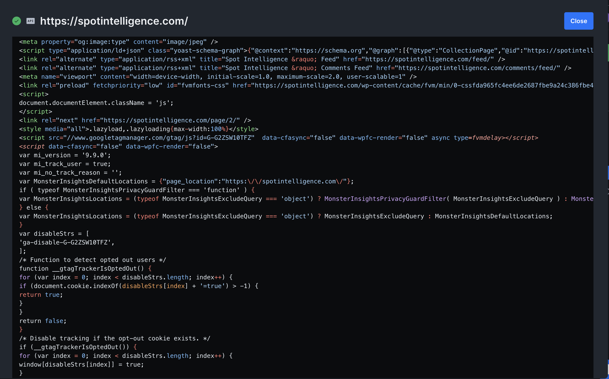
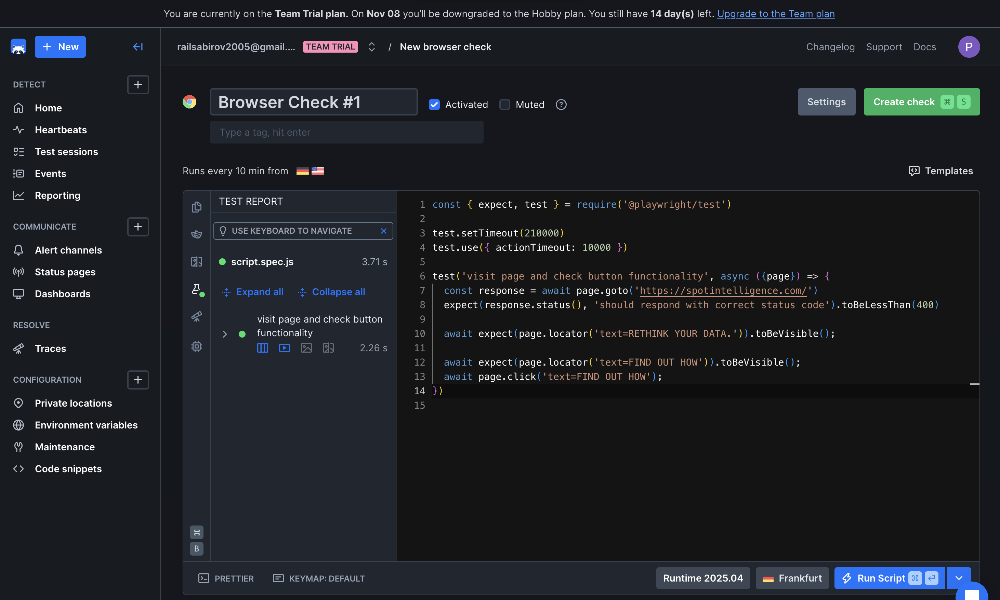
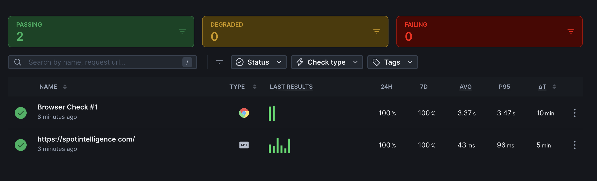
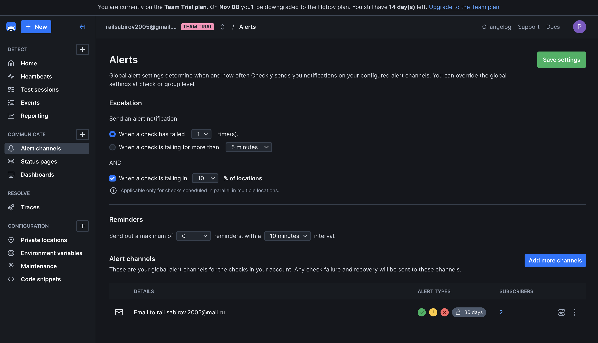
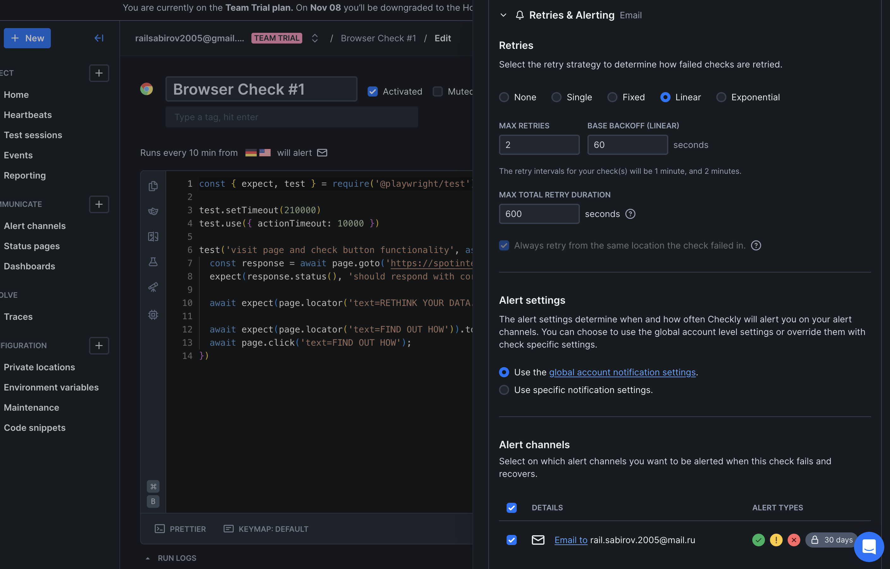
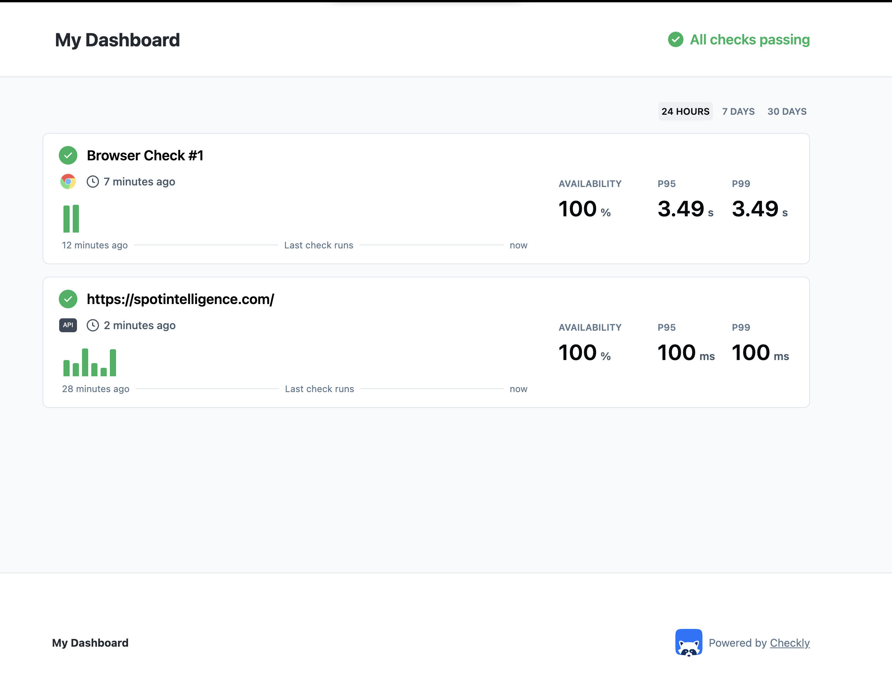

# Lab 8 — Site Reliability Engineering (SRE)

## Task 1 — Key Metrics for SRE and System Analysis

### 1.1: Monitor System Resources

**Install Monitoring Tools (macOS):**

Commands:

```bash
brew install htop
```

**Monitor CPU, Memory, and I/O Usage:**

Commands:

```bash
htop
iostat -x 1 5
```

Output:

```bash
>               disk0 
    KB/t  tps  MB/s 
   15.09  109  1.61 
    0.00    0  0.00 
    4.00    2  0.01 
    4.00    1  0.00 
    5.00   12  0.06 
```

**Identify Top Resource Consumers:**

Commands:

```bash
top -l 2 -o cpu -n 10 | tail -20
top -l 1 -o rsize -n 10
sudo fs_usage -w -f diskio | head -20
```

Output:

```bash
# Top 3 CPU consumers WindowServer, PacketTunnel, Browser Helper
Load Avg: 2.42, 3.01, 3.08 
CPU usage: 12.95% user, 6.84% sys, 80.20% idle 
SharedLibs: 663M resident, 129M data, 81M linkedit.
MemRegions: 0 total, 0B resident, 409M private, 2074M shared.
PhysMem: 15G used (2379M wired, 1692M compressor), 183M unused.
VM: 293T vsize, 5703M framework vsize, 1549611(0) swapins, 2461399(0) swapouts.
Networks: packets: 307614100/423G in, 125002630/188G out.
Disks: 46179279/619G read, 50602156/777G written.

PID    COMMAND          %CPU TIME     #TH    #WQ #PORTS MEM    PURG CMPRS PGRP  PPID  STATE    BOOSTS     %CPU_ME %CPU_OTHRS UID FAULTS    COW    MSGSENT     MSGRECV     SYSBSD      SYSMACH    CSW        PAGEINS IDLEW      POWER INSTRS    CYCLES    JETPRI USER           #MREGS RPRVT VPRVT VSIZE KPRVT KSHRD
382    WindowServer     45.3 26:36:40 24     7   22070  852M+  28M- 176M  382   1     sleeping *0[1]      0.63386 4.26703    88  61326071+ 518900 655383198+  860638421+  1640473525+ 2147483647 662647337+ 7544    54032052+  52.2  769463893 928874078 170    _windowserver  N/A    N/A   N/A   N/A   N/A   N/A  
4686   PacketTunnel     20.1 32:27.92 21     2   116    97M-   0B   17M   4686  1     sleeping *0[1]      0.10140 0.18855    501 14529     245    346253+     17439+      62530835+   122815+    25731603+  716     209148+    20.5  718164659 668232020 100    rail           N/A    N/A   N/A   N/A   N/A   N/A  
60287  Browser Helper ( 16.4 01:57:21 24     3   458    370M   107M 47M   60283 60283 sleeping *1[349799] 3.19188 0.00000    501 6043142+  980    106546092+  41798379+   83078853+   323402994+ 75432448+  2267    4432640+   17.8  220687615 341951537 180    rail           N/A    N/A   N/A   N/A   N/A   N/A  
 
```

Output:

```bash
# Top 3 Memory consumers Telegram, Finder, WindowServer
Processes: 650 total, 2 running, 648 sleeping, 3371 threads 
2025/10/25 11:39:05
Load Avg: 3.48, 3.21, 3.15 
CPU usage: 7.69% user, 12.37% sys, 79.93% idle 
SharedLibs: 663M resident, 129M data, 81M linkedit.
MemRegions: 473293 total, 6096M resident, 377M private, 2038M shared.
PhysMem: 15G used (2396M wired, 1790M compressor), 369M unused.
VM: 292T vsize, 5703M framework vsize, 1549611(0) swapins, 2461399(0) swapouts.
Networks: packets: 307657043/423G in, 125036358/188G out.
Disks: 46180315/619G read, 50607688/777G written.

PID    COMMAND          %CPU TIME     #TH #WQ #PORTS MEM   PURG CMPRS PGRP  PPID  STATE    BOOSTS     %CPU_ME %CPU_OTHRS UID FAULTS   COW    MSGSENT   MSGRECV   SYSBSD     SYSMACH    CSW       PAGEINS IDLEW    POWER INSTRS CYCLES JETPRI USER          #MREGS RPRVT VPRVT VSIZE KPRVT KSHRD
959    Telegram         0.0  08:31:01 75  7   2773   1906M 0B   1140M 959   1     sleeping *1[68151]  0.00000 0.00000    501 36340895 30126  163213296 13203175  555977174  254107375  289848210 109234  10002870 0.0   0      0      100    rail          N/A    N/A   N/A   N/A   N/A   N/A  
592    Finder           0.0  25:49.82 5   2   574    858M  0B   810M  592   1     sleeping *5[4]      0.00000 0.00000    501 8593852  532    2858208   2043980   161104776  12148866   5993138   20555   36818    0.0   0      0      100    rail          N/A    N/A   N/A   N/A   N/A   N/A  
382    WindowServer     0.0  26:37:35 23  6   22067  826M  27M  183M  382   1     sleeping *0[1]      0.00000 0.00000    88  61365648 518900 655853240 861366062 1641860731 2147483647 663108062 7544    54051421 0.0   0      0      170    _windowserver N/A    N/A   N/A   N/A   N/A   N/A 
```

Output:

```bash
#Top 3 I/O consumers Telegram, mds_stores, PacketTunnel
11:45:11.292870    RdData[S]       D=0x00dfcafc  B=0x4000   /dev/disk3s5                                                                                                                                                      0.000611 W locationd.12904885
11:45:11.321281    WrData[A]       D=0x00408d8c  B=0x1000   /dev/disk3s5  Library/Containers/ru.keepcoder.Telegram/Data/tmp/TemporaryItems/NSIRD_Telegram_XPloIu/dots_voice_dots#FFFFFF:0.85-v68-lzfse-bs5760-lt259200-map    0.000073 W Telegram.12899463
11:45:11.332228    RdData[ST3]     D=0x0040b4d6  B=0x1000   /dev/disk3s5  /System/Volumes/Data/.Spotlight-V100/Store-V2/6D68E914-C636-4716-8399-BF836DEEE211/journalAttr.1453                                                 0.000076 W mds_stores.12906266
11:45:11.475472    WrData[S]       D=0x00000471  B=0x43     /dev/NOTFOUND  /dev/null                                                                                                                                          0.000002 W PacketTunnel.12848328
11:45:11.544928    RdData[S]       D=0x00775c72  B=0x4000   /dev/disk3s5  /Users/rail/Library/Group Containers/group.hossin.asaadi.V2Box/error.log                                                                            0.000361 W PacketTunnel.12382029
11:45:11.893541    RdData[A]       D=0x01eb548d  B=0x4000   /dev/disk3s1s1  /bin/bash/..namedfork/rsrc                                                                                                                        0.000144 W bash.12909582
11:45:12.087476    RdData[S]       D=0x00d37bb2  B=0x4000   /dev/disk3s5  /Users/rail/Library/Application Support/firestore/Arc/bcny-arc-server/main/000732.log                                                               0.000821 W Arc.12907957
```

### 1.2: Disk Space Management

**Check Disk Usage:**

Commands:

```bash
df -h

# macOS-specific: Check actual data directories instead of empty /var
sudo du -h ~/Library | sort -rh | head -n 5
sudo du -h /Applications | sort -rh | head -n 5
du -h ~/Downloads | sort -rh | head -n 5
```

Output:

```bash
>
Filesystem        Size    Used   Avail Capacity iused ifree %iused  Mounted on
/dev/disk3s1s1   228Gi    10Gi    61Gi    15%    426k  639M    0%   /
devfs            201Ki   201Ki     0Bi   100%     696     0  100%   /dev
/dev/disk3s6     228Gi   2.0Gi    61Gi     4%       2  639M    0%   /System/Volumes/VM
/dev/disk3s2     228Gi   6.6Gi    61Gi    10%    1.2k  639M    0%   /System/Volumes/Preboot
/dev/disk3s4     228Gi   2.0Mi    61Gi     1%      55  639M    0%   /System/Volumes/Update
/dev/disk1s2     500Mi   6.0Mi   483Mi     2%       1  4.9M    0%   /System/Volumes/xarts
/dev/disk1s1     500Mi   5.8Mi   483Mi     2%      29  4.9M    0%   /System/Volumes/iSCPreboot
/dev/disk1s3     500Mi   872Ki   483Mi     1%      93  4.9M    0%   /System/Volumes/Hardware
/dev/disk3s5     228Gi   147Gi    61Gi    71%    1.6M  639M    0%   /System/Volumes/Data
map auto_home      0Bi     0Bi     0Bi   100%       0     0     -   /System/Volumes/Data/home
> 
 68G    /Users/rail/Library
 20G    /Users/rail/Library/Containers
 18G    /Users/rail/Library/Application Support
 17G    /Users/rail/Library/Containers/com.docker.docker/Data/vms/0/data
 17G    /Users/rail/Library/Containers/com.docker.docker/Data/vms/0
> 
 12G    /Applications
3.2G    /Applications/iMovie.app/Contents
3.2G    /Applications/iMovie.app
2.0G    /Applications/Docker.app/Contents
2.0G    /Applications/Docker.app
> 
182M    /Users/rail/Downloads
168M    /Users/rail/Downloads/kaggle/working/checkpoints
168M    /Users/rail/Downloads/kaggle/working
168M    /Users/rail/Downloads/kaggle
```

**Identify Largest Files:**

Commands:

```bash
# macOS-specific: Find largest files in common locations
du -ah ~ | sort -rh | head -10
```

Output:

```bash
105G    /Users/rail
 68G    /Users/rail/Library
 20G    /Users/rail/Library/Containers
 18G    /Users/rail/Library/Application Support
 17G    /Users/rail/Library/Containers/com.docker.docker/Data/vms/0/data/Docker.raw
 17G    /Users/rail/Library/Containers/com.docker.docker/Data/vms/0/data
 17G    /Users/rail/Library/Containers/com.docker.docker/Data/vms/0
 17G    /Users/rail/Library/Containers/com.docker.docker/Data/vms
 17G    /Users/rail/Library/Containers/com.docker.docker/Data
 17G    /Users/rail/Library/Containers/com.docker.docker
```

### Task 1 Analysis

#### Top 3 most consuming applications

**CPU Usage:**

1. **WindowServer** - 45.3% CPU (Graphics/display server managing all visual output)
2. **PacketTunnel** - 20.1% CPU (VPN tunnel process handling encrypted traffic)  
3. **Browser Helper (Plugin)** - 16.4% CPU (Web browser plugin/extension process)

**Memory Usage:**

1. **Telegram** - 1906M (1.9 GB) - Messaging application with rich media content
2. **Finder** - 858M (858 MB) - macOS file manager and desktop interface
3. **WindowServer** - 826M (826 MB) - Graphics/display server with window management

**I/O Usage:**
Based on fs_usage disk I/O monitoring:

1. **Telegram** - Writing temporary voice/media files (4KB writes to temp directories)
2. **mds_stores** - Spotlight indexing operations (4KB reads from index files)
3. **PacketTunnel** - VPN log file operations (16KB reads from error.log files)

#### Command outputs showing resource consumption

Already provided above

#### Top 3 largest files/directories

Since `/var` is empty on macOS (0B), the largest space consumers are:

1. **Docker.raw** - 17GB (/Users/rail/Library/Containers/com.docker.docker/Data/vms/0/data/Docker.raw) - Docker VM disk image
2. **User Library** - 68GB total (/Users/rail/Library) - Application data and containers
3. **iMovie.app** - 3.2GB (/Applications/iMovie.app) - Video editing application

#### Analysis: What patterns do you observe in resource utilization?

**CPU Patterns:**

- **Graphics workload dominance**: WindowServer (45.3%) indicates heavy display/graphics processing, likely from multiple monitors or graphics-intensive applications
- **Network security overhead**: PacketTunnel (20.1%) shows significant VPN encryption/decryption load
- **Web browsing impact**: Browser Helper consuming 16.4% suggests active web browsing with plugins/extensions
- **Good performance headroom**: 80% CPU idle time provides capacity for additional workloads

**Memory Patterns:**

- **Communication app intensity**: Telegram's 1.9GB usage suggests rich media content (voice messages, images, videos)
- **System service baseline**: WindowServer (826MB) and Finder (858MB) represent normal macOS overhead
- **Efficient memory management**: Strong compression (1790M compressed) with minimal unused memory (369M)
- **No memory pressure**: Zero swap activity indicates healthy memory utilization

**I/O Patterns:**

- **Application-driven activity**: Telegram frequently writing temporary media files (voice messages, images)
- **System maintenance**: Spotlight indexing (mds_stores) performing background file indexing
- **Network logging**: PacketTunnel reading/writing VPN operational and error logs
- **Small, frequent operations**: Most I/O operations are 4KB-16KB, indicating efficient file access patterns

**Storage Patterns:**

- **Docker dominance**: 17GB Docker VM represents largest single storage consumer
- **Container-heavy usage**: 20GB in Library/Containers suggests extensive use of sandboxed applications
- **Development environment**: Large Docker installation and development tools indicate active development work

#### Reflection: How would you optimize resource usage based on your findings?

**CPU Optimization:**

- **Graphics optimization**: WindowServer's 45.3% usage suggests reviewing display settings - consider reducing resolution on secondary monitors, disabling visual effects, or closing graphics-intensive applications when not needed
- **VPN efficiency**: PacketTunnel consuming 20% CPU - evaluate VPN protocol efficiency (consider WireGuard over OpenVPN), review connection settings, or schedule heavy network tasks during off-peak VPN usage
- **Browser management**: Implement aggressive tab management, disable unnecessary browser extensions, and use lightweight alternatives for basic browsing tasks
- **Process monitoring**: Implement automated alerts for sustained CPU usage >70% to catch performance issues early

**Memory Optimization:**

- **Application lifecycle management**: Close Telegram when not actively used to free 1.9GB, especially during memory-intensive development work
- **System cache optimization**: Regular cache clearing using `sudo purge` and application-specific cache cleanup
- **Memory pressure monitoring**: Set up monitoring for swap usage and memory pressure indicators
- **Development environment tuning**: Configure Docker with memory limits to prevent excessive allocation

**Storage Optimization:**

- **Docker management**:
  - Regular cleanup of unused Docker images: `docker system prune -a`
  - Configure Docker Desktop with storage limits
  - Move Docker VM to external storage if needed
- **Container cleanup**: Review and remove unused applications in Library/Containers (20GB)
- **Application audit**: Uninstall rarely used large applications like iMovie (3.2GB) if not needed
- **Automated cleanup**: Implement scheduled cleanup of temporary files, logs, and caches

**I/O Optimization:**

- **Temporary file management**: Configure Telegram to more aggressively clean temporary media files
- **Spotlight optimization**: Exclude development directories and Docker containers from Spotlight indexing
- **SSD optimization**: Ensure TRIM is enabled and avoid unnecessary write operations to extend SSD lifespan

## Task 2 — Practical Website Monitoring Setup (6 pts)

### 2.1: Choose Your Website

**Selected Target Website:**

Website URL: [Spot intelligence](https://spotintelligence.com/)

**Reasoning for Selection:**
Personal interest

### 2.2: Create Checks in Checkly

**Sign Up:**

Created a free account at [Checkly](https://www.checklyhq.com/)

**API Check for Basic Availability:**

Configuration:

- **URL**: [Your chosen website URL]
- **Check Type**: API Check (HTTP/HTTPS)
- **Method**: GET
- **Assertion**: Status code equals 200
- **Frequency**: Every 5 minutes
- **Locations**: Multiple global locations (N. Virginia, Frankfurt)

**Browser Check for Content & Interactions:**

Configuration:

- **Check Type**: Browser Check (Playwright)
- **Frequency**: Every 10 minutes
- **Target Elements/Actions**:
  - Specific elements visibility check
  - Button click functionality

Browser Check Script:

```javascript
const { expect, test } = require('@playwright/test')

test.setTimeout(210000)
test.use({ actionTimeout: 10000 })

test('visit page and check button functionality', async ({page}) => {
  const response = await page.goto('https://spotintelligence.com/')
  expect(response.status(), 'should respond with correct status code').toBeLessThan(400)

  await expect(page.locator('text=RETHINK YOUR DATA.')).toBeVisible();

  await expect(page.locator('text=FIND OUT HOW')).toBeVisible();
  await page.click('text=FIND OUT HOW');
}) 
```

### 2.3: Set Up Alerts

**Alert Rules Configuration:**

- What to alert on?: Failed checks
- How to be notified?: via Email channel
- Set thresholds that make sense for your site:
  - Check has failed 1 times
  - When check is failing in 10% of Locations

### 2.4: Capture Proof & Documentation

**Run Checks Manually:**

All checks executed successfully:

- API Check: ✅ Status 200 response
- Browser Check: ✅ All elements visible and buttons functional

**Screenshots:**

#### Api Check



#### Browser Check Configuration

Provided above


#### Successful Check Result



#### Alert Settings




#### Dashboard Overview



### Task 2 Analysis

#### Website URL you chose to monitor

Provided above: https://spotintelligence.com/

#### Screenshots of browser check configuration


#### Screenshots of successful check results


#### Screenshots of alert settings


#### Analysis: Why did you choose these specific checks and thresholds?

**Check Selection Rationale:**

1. **API Check (Every 5 minutes)**:
   - **Purpose**: Ensures basic website accessibility and server health
   - **Frequency**: 5-minute intervals provide quick detection without overwhelming the target server
   - **Global locations (N. Virginia, Frankfurt)**: Tests availability from different geographic regions to catch regional outages

2. **Browser Check (Every 10 minutes)**:
   - **Content validation**: Verifies critical elements like "RETHINK YOUR DATA." heading are loading correctly
   - **User interaction**: Tests "FIND OUT HOW" button functionality to ensure call-to-action works
   - **Real user simulation**: Playwright browser checks simulate actual user experience better than simple HTTP checks

3. **Alert Thresholds**:
   - **1 failure trigger**: Immediate alerting for quick incident response
   - **10% location threshold**: Prevents false positives from single location network issues
   - **Email notifications**: Reliable and immediate notification method for critical issues

**Threshold Justification:**

- **Low failure tolerance**: Data intelligence websites need high availability for business credibility
- **Geographic redundancy**: 10% location threshold ensures true outages vs. isolated network problems
- **Conservative approach**: Better to get notified quickly than miss critical downtime

#### Reflection: How does this monitoring setup help maintain website reliability?

**Proactive Issue Detection:**

- **Early warning system**: Detects problems before users encounter them or report issues
- **User experience validation**: Browser checks ensure critical functionality (navigation, CTA buttons) works correctly
- **Geographic coverage**: Multi-location monitoring catches regional connectivity or CDN issues

**Business Impact:**

- **Customer confidence**: Ensures visitors can access key information about data intelligence services
- **Lead generation protection**: Monitors "FIND OUT HOW" button to prevent lost business opportunities
- **Brand reputation**: Maintains consistent availability expected from a technology company

**Operational Benefits:**

- **Reduced MTTR**: Immediate email alerts enable faster incident response
- **Automated validation**: Eliminates need for manual website checking
- **Performance baseline**: Historical data helps identify trends and capacity planning needs
- **SLA compliance**: Continuous monitoring supports uptime commitments to stakeholders

**Technical Advantages:**

- **Multi-layer monitoring**: API + Browser checks provide comprehensive coverage
- **Real user perspective**: Browser checks test actual user workflows and interactions
- **Cost-effective**: Cloud-based monitoring requires no additional infrastructure maintenance
- **Scalable approach**: Easy to add more checks or adjust thresholds as business needs evolve

This setup transforms reactive maintenance into proactive reliability management, ensuring the Spot Intelligence website consistently delivers value to potential customers seeking data solutions.
