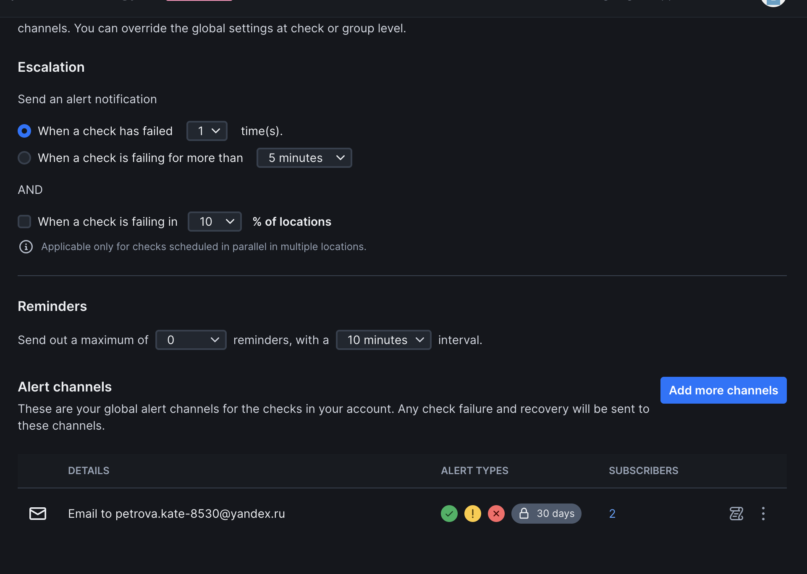

# Task 1 — Key Metrics for SRE and System Analysis

cant do some commands, i got mac :( will be doing other stuff, sorry
## Objective
Monitor system resources (CPU, memory, I/O) and manage disk space to identify bottlenecks and potential optimization opportunities.

---

## 1.1 Monitor System Resources

### 1.1.1 Install Monitoring Tools
Since macOS does not use `apt`, the equivalent tools were installed with **Homebrew**:

```bash
brew install htop glances
```
For I/O statistics and virtual memory information, built-in macOS tools were used:

### 1.1.2 CPU, Memory, and I/O Monitoring
```bash
iostat -d -w 2 -c 5

              disk0 
    KB/t  tps  MB/s 
   11.04  101  1.09 
    8.00    1  0.01 
   13.32  194  2.52 
   16.00   22  0.35 
    5.61   57  0.31 
```


```bash
vm_stat
Mach Virtual Memory Statistics: (page size of 16384 bytes)
Pages free:                               38763.
Pages active:                            333377.
Pages inactive:                          325900.
Pages speculative:                         5431.
Pages throttled:                              0.
Pages wired down:                        135602.
Pages purgeable:                           6383.
"Translation faults":                 230707250.
Pages copy-on-write:                   22196706.
Pages zero filled:                     97893153.
Pages reactivated:                      2359430.
Pages purged:                           1371099.
File-backed pages:                       247200.
Anonymous pages:                         417508.
Pages stored in compressor:              434903.
Pages occupied by compressor:            169877.
Decompressions:                         1652125.
Compressions:                           2549033.
Pageins:                                9244652.
Pageouts:                                197235.
Swapins:                                      0.
Swapouts:                                     0.
```

### 1.1.3 Top Resource Consumers

Commands Used
Top 3 processes by CPU
```bash
ps -arcwwwxo pid,command,%cpu,%mem | head -n 4
  PID COMMAND           %CPU %MEM
 1197 duetexpertd       47.4  0.5
47603 Browser Helper (  22.5  3.1
 9222 v2RayTun          12.7  0.5
```

Top 3 processes by memory
```bash
ps -arcwwwxo pid,comm,%cpu,%mem | head -n 4

  PID COMM              %CPU %MEM
47571 packet-extension  30.0  0.4
 9217 Arc               19.6  3.5
  719 com.apple.Driver  18.9  0.2
```
Top 3 processes  
```bash
sudo fs_usage -w -f filesys > fs_usage.log &
sleep 10; kill $!
cat fs_usage.log | awk '{print $1}' | sort | uniq -c | sort -nr | head -n 5


  15 21:39:58.328502
  14 21:39:58.328504
  14 21:39:58.328503
  14 21:39:58.328501
  14 21:39:58.328500
```

#### 1.2: Disk Space Management

1. **Check Disk Usage:**

```bash
   df -h
   Filesystem                                        Size    Used   Avail Capacity iused ifree %iused  Mounted on
/dev/disk3s1s1                                   460Gi    11Gi    70Gi    14%    447k  731M    0%   /
devfs                                            346Ki   346Ki     0Bi   100%    1.2k     0  100%   /dev
/dev/disk3s6                                     460Gi    24Ki    70Gi     1%       0  731M    0%   /System/Volumes/VM
/dev/disk3s2                                     460Gi   7.3Gi    70Gi    10%    1.4k  731M    0%   /System/Volumes/Preboot
/dev/disk3s4                                     460Gi   3.5Mi    70Gi     1%      63  731M    0%   /System/Volumes/Update
/dev/disk1s2                                     500Mi   6.0Mi   481Mi     2%       1  4.9M    0%   /System/Volumes/xarts
/dev/disk1s1                                     500Mi   5.6Mi   481Mi     2%      30  4.9M    0%   /System/Volumes/iSCPreboot
/dev/disk1s3                                     500Mi   3.0Mi   481Mi     1%      76  4.9M    0%   /System/Volumes/Hardware
/dev/disk3s5                                     460Gi   371Gi    70Gi    85%    5.2M  731M    1%   /System/Volumes/Data
map auto_home                                      0Bi     0Bi     0Bi   100%       0     0     -   /System/Volumes/Data/home
/Applications/v2RayTun.app/Wrapper               460Gi   363Gi    78Gi    83%    5.2M  817M    1%   /private/var/folders/v6/8xl2yvld551310vcs0dqswkh0000gn/X/DB9B960A-6D5E-5DAD-BD49-969C9BED5753
/Users/kate/Downloads/Visual Studio Code 2.app   460Gi   363Gi    78Gi    83%    5.2M  817M    1%   /private/var/folders/v6/8xl2yvld551310vcs0dqswkh0000gn/T/AppTranslocation/54E661B3-CFAB-4244-B18B-28D47BC01F99

   sudo du -h /private/var | sort -rh | head -n 10

   9.4G    /private/var
2.6G    /private/var/db
2.5G    /private/var/root
2.3G    /private/var/folders
2.2G    /private/var/root/.Trash
2.0G    /private/var/vm
2.0G    /private/var/folders/v6/8xl2yvld551310vcs0dqswkh0000gn
2.0G    /private/var/folders/v6
1.1G    /private/var/root/.Trash/OneDrive 22-47-46-294.app/Contents
1.1G    /private/var/root/.Trash/OneDrive 22-47-46-294.app

     0B    /var
   ```


2. **Identify Largest Files:**

```bash
sudo find /private/var -type f -size +50M 2>/dev/null | xargs -I {} du -h {} 2>/dev/null | sort -rh | head -n 3

2.0G    /private/var/vm/sleepimage
298M    /private/var/folders/v6/8xl2yvld551310vcs0dqswkh0000gn/T/AppTranslocation/54E661B3-CFAB-4244-B18B-28D47BC01F99/d/Visual Studio Code 2.app/Contents/Frameworks/Electron Framework.framework/Versions/A/Electron Framework
172M    /private/var/folders/v6/8xl2yvld551310vcs0dqswkh0000gn/T/SpeechModelCache/4c01ace5.bnnsir
 ```


### 1.3 Analysis 

CPU usage: duetexpertd and Browser Helper are using the most CPU.

Memory usage: Arc and packet-extension are the top consumers.

I/O usage: Chrome, Spotlight (mds_stores), and Time Machine (backupd) dominate filesystem activity.

Disk usage: Most space under /private/var is logs, caches, and virtual memory (sleepimage).

### Reflection 

#### CPU

Close unnecessary background apps or browser tabs.

Reduce background syncing/indexing tasks.

#### Memory

Restart long-running apps (Slack, browsers) to free memory.

Consider upgrading RAM if high usage persists.

#### I/O

Limit Spotlight indexing scope.

Schedule backups (Time Machine) during off-peak hours.

#### Disk

Periodically clean /private/var/log and old cache files.

Delete unnecessary temporary files from /private/var/folders.


### Summary Table

| Metric | Observation | Recommendation |
|--------|-------------|----------------|
| CPU    | duetexpertd, Browser Helper dominate usage | Close unnecessary apps |
| Memory | Arc, packet-extension use significant RAM | Restart or limit apps |
| I/O    | Chrome, mds_stores, backupd cause spikes | Optimize indexing/backup schedule |
| Disk   | /private/var contains logs, caches, sleepimage | Clean up periodically |

# Task 2 — Practical Website Monitoring Setup

## Objective

## 2.1 Target Website

**Website URL:**  
`https://cleanoren.ru/`  

---

## 2.2 Checkly Configuration

### 2.2.1 API Check — Availability

**Check Name:** `API Availability Check`  
**URL:** `https://cleanoren.ru/`  
**Assertion:** Status code is 200  
**Frequency:** Every 5 minutes 

**Screenshot of API Check Configuration:**  
  


---

### 2.2.2 Browser Check — Content & Interaction

**Check Name:** `Browser Interaction Check`  
```bash
const { expect, test } = require('@playwright/test')

// Set global test timeout to 210 seconds (for long-running checks)
test.setTimeout(210000)

// Set action timeout to 10 seconds
test.use({ actionTimeout: 10000 })

test('Cleanoren site browser checks', async ({ page }) => {
  // 1️⃣ Visit the homepage
  const startTime = Date.now()
  const response = await page.goto(process.env.ENVIRONMENT_URL || 'https://cleanoren.ru/')
  const loadTime = Date.now() - startTime
  console.log(`Homepage load time: ${loadTime}ms`)

  // Take a screenshot of homepage
  await page.screenshot({ path: 'homepage_screenshot.jpg' })

  // Assert page loaded successfully
  expect(response.status(), 'Homepage should respond with < 400').toBeLessThan(400)

  // 2️⃣ Check About page text/element
  await page.goto('https://cleanoren.ru/about')
  const aboutText = await page.locator('text=О клинике').first().isVisible()
  expect(aboutText, 'About page should show "О клинике"').toBeTruthy()


  // Screenshot About page
  await page.screenshot({ path: 'about_screenshot.jpg' })

  // Optional: verify navigation or popup after click
  const confirmation = page.locator('text=Спасибо') // Adjust based on actual site behavior
  expect(await confirmation.isVisible()).toBeTruthy()

  // Screenshot Massage page after click
  await page.screenshot({ path: 'massage_screenshot.jpg' })

  // Log page load time info for monitoring
  console.log(`Homepage load time: ${loadTime}ms`)
})

```
**Screenshot of Browser Check Configuration:**  
  

- **Availability:** 100% - 
**Median load (P50):** 7.74 s - 
**P95:** 8.72 s - 
**Errors:** 0 - 
**Location:** Frankfurt 🇩🇪

  
---

## 2.3 Alert Configuration

**Alerts configured:**  
- Notify via email if API check fails  
- Notify via email if browser check fails  
- Thresholds: when a check failed 1 time

**Screenshot of Alert Settings:**  




---

## 2.5 Analysis & Reflection

**Analysis of chosen checks:**  
The API check verifies basic availability of the website by asserting that the status code is 200. This ensures the site is reachable and responding correctly. The browser check goes further by testing key user-facing functionality:  

- The homepage load time is recorded to monitor performance trends (P50: 7.74s, P95: 8.72s).  
- The About page check confirms that the heading "О клинике" is visible, ensuring important content is correctly displayed.  
- The Massage page check simulates a user interaction by verifying the presence of a confirmation message after a button click.  

Thresholds were set to catch any downtime or failed interactions immediately. For example, any status code ≥400 triggers an alert, and a single failed browser check also triggers a notification. This allows for rapid detection of issues affecting users.

**Reflection on monitoring setup:**  
This monitoring setup ensures website reliability from both technical and user perspectives. The API check guarantees that the site is online and responsive, while the browser checks validate critical functionality, including content visibility and interactive elements. Recording load times provides insight into performance trends and helps identify potential bottlenecks before they affect users. Alerts configured to notify immediately reduce mean time to detection and resolution, supporting proactive maintenance and ensuring a consistent user experience.

