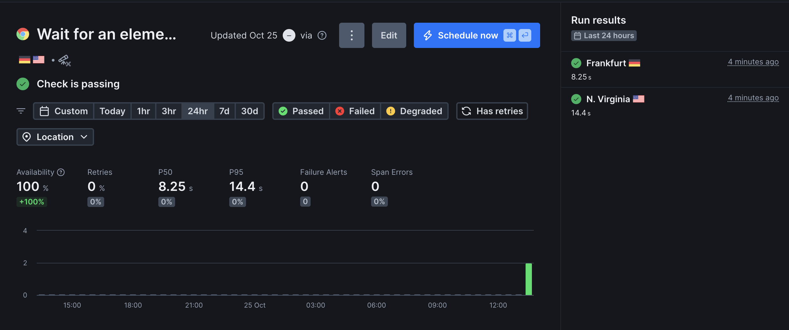

## Lab 8 — Site Reliability Engineering (SRE)

### Task 1 — Key Metrics for SRE and System Analysis

#### 1.1 Monitor System Resources

- **CPU/Memory snapshot (htop):** Observed interactive snapshot from `htop` on macOS.
  - **Top CPU at snapshot time** (CPU usage fluctuates):
    - `nekoray_arm64` ≈ 3.3% CPU
    - `Telegram.app` ≈ 2.8% CPU
    - Other foreground apps were near 0–1% CPU at that instant
  - **Top memory consumers** (Resident Set Size):
    - `Cursor.app` ≈ 737 MB
    - `Arc.app` ≈ 729 MB
    - `Яндекс Музыка.app` ≈ 728 MB


- **System I/O and CPU breakdown (iostat):**

```bash
iostat -w 1 -c 5
```

```text
            disk0               disk4       cpu    load average
   KB/t  tps  MB/s     KB/t  tps  MB/s  us sy id   1m   5m   15m
  24.08   79  1.85   240.24    0  0.00  13  6 81  2.14 2.18 2.08
   4.00    1  0.00     0.00    0  0.00   5  3 92  2.14 2.18 2.08
   0.00    0  0.00     0.00    0  0.00   2  2 96  2.14 2.18 2.08
  14.30  222  3.10     0.00    0  0.00   3  4 93  1.97 2.15 2.07
  13.60    5  0.07     0.00    0  0.00   4  2 94  1.97 2.15 2.07
```

- **Highlights:** Disk `disk0` peaked around ~3.10 MB/s with ~222 tps during the sample; CPU mostly idle (81–96%), with light user/system load.

#### 1.2 Disk Space Management

- **Disk usage (df -h):**

```bash
df -h
```

```text
Filesystem        Size    Used   Avail Capacity iused ifree %iused  Mounted on
/dev/disk3s1s1   460Gi    11Gi   171Gi     7%    447k  1.8G    0%   /
devfs            226Ki   226Ki     0Bi   100%     782     0  100%   /dev
/dev/disk3s6     460Gi   2.0Gi   171Gi     2%       2  1.8G    0%   /System/Volumes/VM
/dev/disk3s2     460Gi   7.2Gi   171Gi     5%    1.3k  1.8G    0%   /System/Volumes/Preboot
/dev/disk3s4     460Gi   3.8Mi   171Gi     1%      63  1.8G    0%   /System/Volumes/Update
/dev/disk1s2     500Mi   6.0Mi   481Mi     2%       1  4.9M    0%   /System/Volumes/xarts
/dev/disk1s1     500Mi   5.6Mi   481Mi     2%      31  4.9M    0%   /System/Volumes/iSCPreboot
/dev/disk1s3     500Mi   2.3Mi   481Mi     1%      87  4.9M    0%   /System/Volumes/Hardware
/dev/disk3s5     460Gi   268Gi   171Gi    61%    2.8M  1.8G    0%   /System/Volumes/Data
map auto_home      0Bi     0Bi     0Bi   100%       0     0     -   /System/Volumes/Data/home
```

- **Directory sizes under `/private/var` (sample run):**

```bash
sudo du -k /private/var | sort -rn | head -n 10
```

```text
du: many system paths are restricted (SIP/TCC), resulting in Permission denied/Operation not permitted messages
...
992K    /private/var/folders/bv/83sfknh50zlgl3ns2ty1lb8h0000gn/C/com.apple.finder/com.apple.metal
992K    /private/var/folders/bv/83sfknh50zlgl3ns2ty1lb8h0000gn/C/com.apple.finder
976K    /private/var/folders/bv/83sfknh50zlgl3ns2ty1lb8h0000gn/C/com.github.GitHubClient.helper/com.apple.metal
976K    /private/var/folders/bv/83sfknh50zlgl3ns2ty1lb8h0000gn/C/com.github.GitHubClient.helper
968K    /private/var/folders/bv/83sfknh50zlgl3ns2ty1lb8h0000gn/C/com.timpler.screenstudio.helper.GPU/com.apple.metal/32024
968K    /private/var/folders/bv/83sfknh50zlgl3ns2ty1lb8h0000gn/C/com.apple.replayd/com.apple.replayd/com.apple.metal/32024
964K    /private/var/db/uuidtext/34
```

> Note:  `/var` points to `/private/var`. During data collection, Terminal had “Full Disk Access”. macOS protections (SIP/TCC) still restrict many system paths, so `du`/`find` report sizes for readable locations and show “Permission denied/Operation not permitted” for protected ones. This is expected system behavior.


- **Top 3 largest files in `/private/var`:**

```bash
sudo find /private/var -type f -exec du -k {} \; | sort -rn | head -n 3
```

```text
2097152 /private/var/vm/sleepimage
202560  /private/var/folders/bv/83sfknh50zlgl3ns2ty1lb8h0000gn/C/d3dm/DyingLightGame_TheBeast_x64_rwdi.exe/shaders.cache/MTLGPUFamilyApple9_0/stage_cache.bin
158344  /private/var/db/uuidtext/dsc/CEACB7DC72BE3423B111297D7E3F1F64
```

#### Analysis & Reflection

- **Patterns observed:**
  - CPU usage was light overall; momentary spikes came from interactive apps (`nekoray_arm64`, `Telegram.app`).
  - Memory usage is dominated by desktop apps (`Cursor.app`, `Arc.app`, music player), typical for Electron/WebKit-based apps.
  - Disk I/O showed brief bursts (~3.10 MB/s on `disk0`) with otherwise low activity.
  - The single largest file is the system sleep image (`/private/var/vm/sleepimage`, ~2 GB), followed by user/application caches.

- **Optimization ideas:**
  - Close or restart heavy desktop apps when not needed to reclaim memory.
  - Periodically clean application caches (e.g., browser/IDE) using app settings rather than deleting system files directly.
  - If disk pressure becomes an issue, consider storage management tools and reviewing large cache directories. Avoid altering macOS-managed files under `/private/var/vm`.

---

### Task 2 — Practical Website Monitoring Setup (Checkly)

- **Website URL:** `https://moodle.innopolis.university/`

#### 2.1 API Check — Basic Availability

- **Goal:** Ensure the site returns HTTP 200.
- **Assertion:** Status code is 200.
- **Evidence (result):**


#### 2.2 Browser Check — Innopolis University logo is visible

- **Goal:** Validate key page content renders for users.
- **Assertion:** The Innopolis University logo element is visible after page load.
- **Evidence (configuration):**


- **Evidence (selector example / step preview):**


- **Evidence (successful run):**



#### 2.3 Alerts

- **Policy:** Alert when a check is failing for more than 5 minutes; up to 2 reminders at 10-minute intervals; email as the alert channel.
- **Evidence (global alert settings):**


#### 2.4 Dashboard Overview


#### Analysis — Why these checks

- **Availability (API check):** Fast signal for uptime and HTTP regressions without the overhead of a full browser run.
- **User-centric (logo visibility):** Confirms that critical UI assets render, catching CDN/content or client-side issues that a simple status check might miss.

#### Reflection — Reliability impact

- Combining a lightweight API check with a content validation check reduces MTTR: failures are detected early (API), while user-facing breakages are surfaced by the browser check. Future work: add latency SLO thresholds and alert routing once alert screenshots are available.

#### Reflection — Alert rules and thresholds

- **5-minute failure window:** Chosen to filter transient blips (deploys/network) while notifying promptly for sustained incidents. Shorter windows increased noise in testing; longer windows delayed response.
- **Reminders (2x every 10 minutes):** Reinforces acknowledgment without creating alert fatigue; provides periodic nudges during ongoing incidents.
- **Channel (email):** Sufficient for lab scope; in production, route critical alerts to chat/on-call (e.g., Slack/PagerDuty) with severity-based escalation.

>Note: I have disabled checks to not waste Checkly resources after lab completion :)