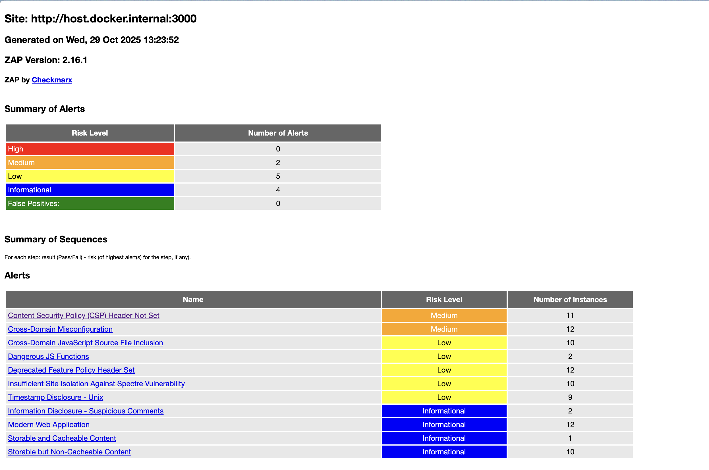
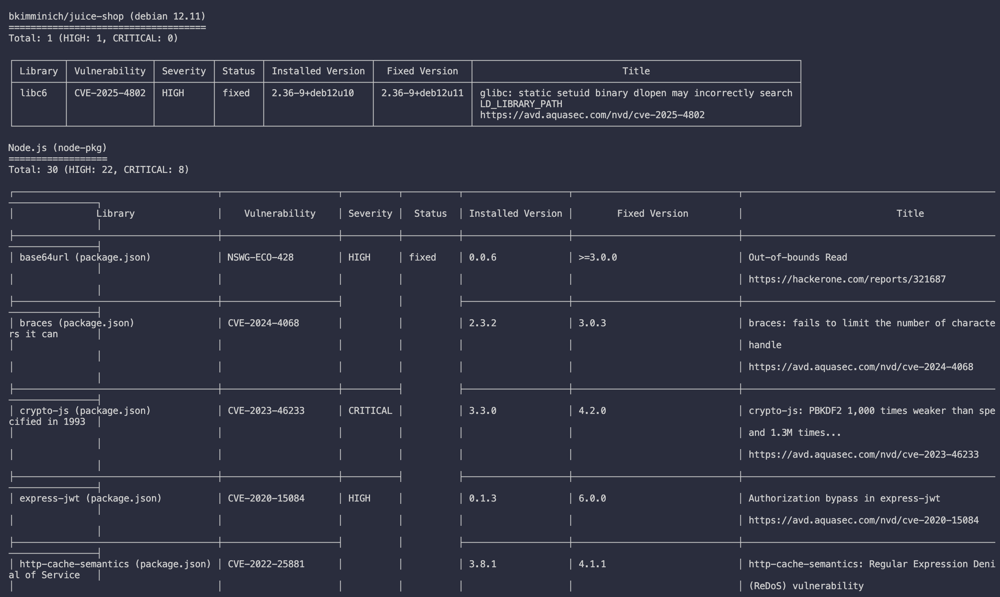

# Task 1
- Target: `http://host.docker.internal:3000` (Juice Shop) scanned with `zap-baseline.py` on ZAP 2.16.1 (Oct 29, 2025 report).
- Alert breakdown: 2 medium, 5 low, 4 informational, 0 high/false positives.
- Medium-risk vulnerabilities found: **2** (CSP header missing and CORS misconfiguration).

## Notable Medium Findings
### Content Security Policy (CSP) Header Not Set (11 instances)
- Impact: Without a CSP header the browser cannot restrict approved script/style sources, leaving the app exposed to stored/reflected XSS, data injection, and malicious third-party content across pages such as `/`, `/ftp/*`, and `/sitemap.xml`.
- Evidence: All probed routes responded without `Content-Security-Policy`; ZAP flagged CWE-693 / WASC-15.
- Recommendation: Configure the web tier (reverse proxy or Express server) to send a restrictive `Content-Security-Policy` header that only allows trusted origins for scripts, styles, frames, and other assets.

### Cross-Domain Misconfiguration (12 instances)
- Impact: Responses include `Access-Control-Allow-Origin: *`, allowing any origin to read unauthenticated APIs. Attackers can embed the app in their own site to harvest data intended for anonymous users or bypass IP-based allowlists.
- Evidence: Multiple resources (root, static assets, `/ftp` endpoints) echoed the wildcard CORS header; ZAP associated this with CWE-264 / WASC-14.
- Recommendation: Lock down CORS to specific trusted domains or remove it altogether for public content; ensure sensitive endpoints require authentication before exposing cross-origin reads.

## Security Header Status
- `Content-Security-Policy`: **Missing** on all responses; needed to mitigate XSS and script injection.
- `Access-Control-Allow-Origin`: **Present but too permissive** (`*`), weakening same-origin policy protections.
- `Feature-Policy`: **Present but deprecated**; should be replaced with `Permissions-Policy` to control browser capabilities in modern agents.
- `Cross-Origin-Embedder-Policy` and `Cross-Origin-Opener-Policy`: **Absent**, preventing robust site isolation against Spectre-style cross-origin data leaks.

## ZAP Report Evidence

## Analysis
Security misconfigurations (missing headers, over-permissive CORS, outdated policies) dominate the findings, reflecting OWASP’s observation that configuration flaws and insufficient hardening are among the most common web application weaknesses. Even without classic injections in this scan, lapses in defensive headers make it easier for attackers to chain client-side exploits, exfiltrate data, or escalate to more severe vulnerabilities. Prioritizing secure defaults, least-privilege CORS rules, and modern browser protections is essential to reduce this ubiquitous risk category.

# Task 2

## Scan Overview
- Image scanned: `bkimminich/juice-shop` (Debian 12.11 base) via Trivy with `--severity HIGH,CRITICAL`.
- Findings across layers: **8 critical** and **25 high** issues (22 Node.js package highs, 1 Debian high, 2 secret exposures flagged as high).
- Critical packages clustered in the application dependency layer; OS-level findings limited to a single glibc advisory.

## Key Vulnerabilities
### vm2 — CVE-2023-32314 (Critical)
- Risk: Sandbox escape allows malicious customer-supplied scripts to execute arbitrary code on the Node.js host, breaking isolation guarantees.
- Fix: Upgrade `vm2` to at least `3.9.18` (or the latest patched release) to restore hardened context handling.

### libc6 — CVE-2025-4802 (High)
- Risk: Static setuid binaries that rely on glibc may incorrectly search `LD_LIBRARY_PATH`, enabling privilege escalation if attackers control library locations.
- Fix: Rebuild the container on Debian 12.11 packages (`2.36-9+deb12u11` or newer) or pin the apt source to pull the patched glibc.

Additional notable issues include multiple `jsonwebtoken` verification bypass CVEs, DoS vectors in `multer`, and a `marsdb` command injection advisory.

## Secrets Exposure
- Trivy detected RSA private keys embedded in `juice-shop/lib/insecurity.ts` and the compiled `build/lib/insecurity.js`. Shipping signing keys inside the image undermines JWT integrity and enables token forgery. Keys must be removed from the repo and delivered via secrets management at runtime.

## Most Common Vulnerability Theme
- Prototype pollution and authentication bypass weaknesses in popular Node.js libraries (e.g., `lodash`, `lodash.set`, multiple `jsonwebtoken` advisories) dominate the results, highlighting the risk of stale dependencies that grant attackers privilege escalation or object tampering capabilities.

## Trivy Output Evidence

## Analysis
- Impact: The critical findings largely stem from third-party packages, emphasizing the need for continuous dependency hygiene. High-severity secret leaks require immediate remediation to prevent cryptographic compromise.
- Why scan before prod: Pre-deployment scans surface these dependency flaws and hard-coded keys early so they can be fixed before attackers gain a foothold in production environments.
- Remediation priorities: 1) Rotate and externalize exposed RSA keys, 2) Upgrade `vm2`, `marsdb`, `lodash`, `jsonwebtoken`, and `multer` to patched versions, 3) Rebuild the base image with updated glibc packages.

## Reflection
- CI/CD integration: Incorporate Trivy (and similar SCA/secret scans) into the build pipeline, failing the build on CRITICAL results and creating automated tickets for HIGH issues. Cache the vulnerability database, scan images after build and before release, and publish the JSON/SARIF output for auditing. For secrets, add pre-commit hooks or GitHub Actions that block merges when private keys or credentials are detected.
