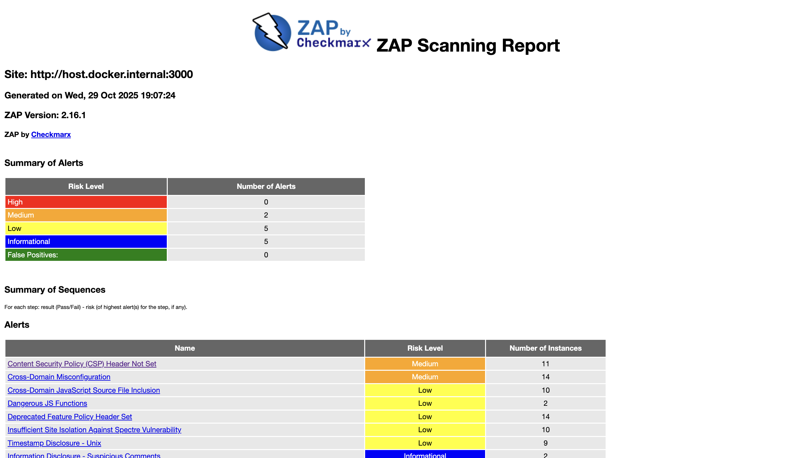
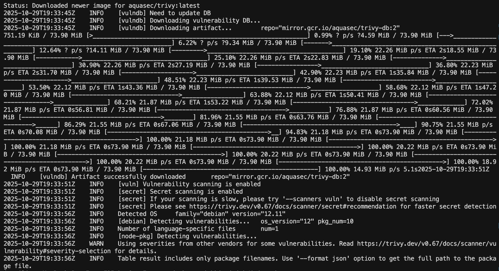
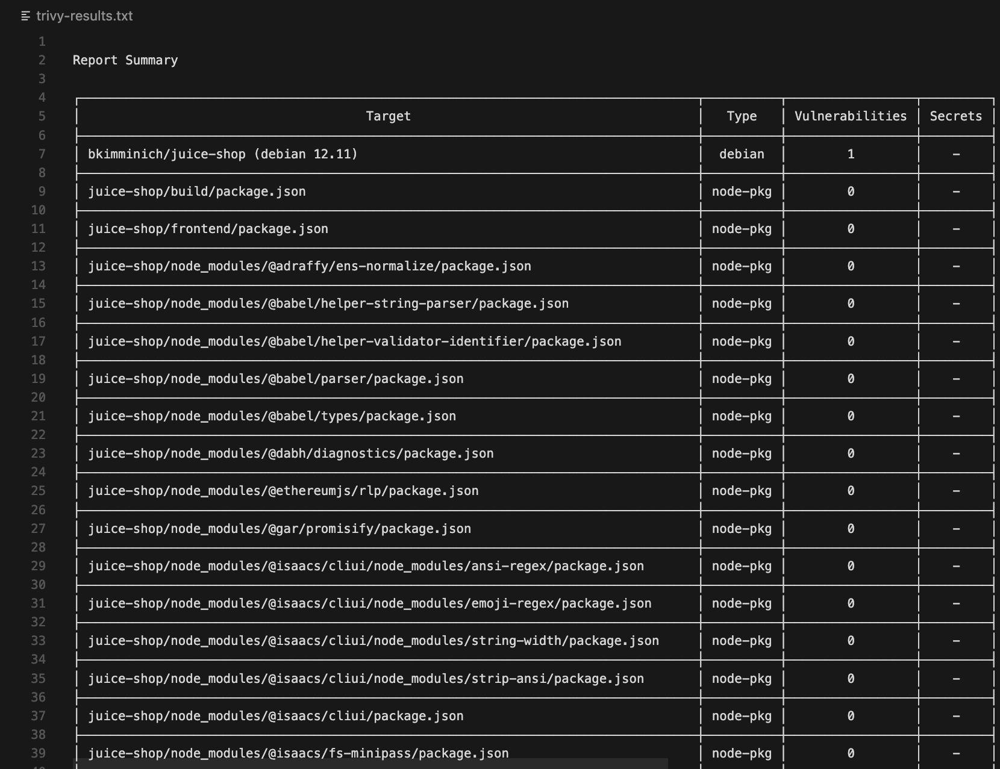
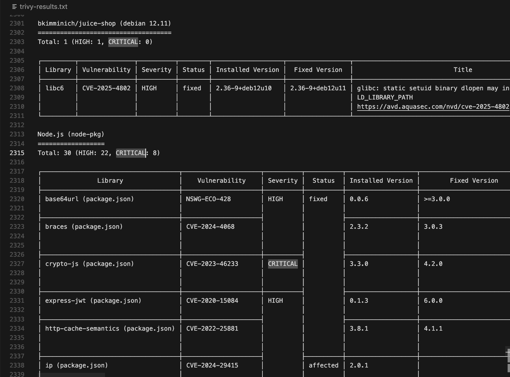

# Lab 9 — Introduction to DevSecOps Tools

## Task 1 — Web Application Scanning with OWASP ZAP

### 1.1: Start the Vulnerable Target Application

**Deploy Juice Shop (Intentionally Vulnerable Application):**

```bash
> docker run -d --name juice-shop -p 3000:3000 bkimminich/juice-shop
Status: Downloaded newer image for bkimminich/juice-shop:latest
8fb06f0a5e42330dc96de76fb8e5f02297cb59a70a2b26093db1d857b9808804
```


### 1.2: Scan with OWASP ZAP

**Run ZAP Baseline Scan:**

```bash
>docker run --rm -u zap -v $(pwd):/zap/wrk:rw \
-t ghcr.io/zaproxy/zaproxy:stable zap-baseline.py \
-t http://host.docker.internal:3000 \
-g gen.conf \
-r zap-report.html
```

**Output**:

```bash
Status: Downloaded newer image for ghcr.io/zaproxy/zaproxy:stable
Total of 95 URLs
PASS: Vulnerable JS Library (Powered by Retire.js) [10003]
PASS: In Page Banner Information Leak [10009]
PASS: Cookie No HttpOnly Flag [10010]
PASS: Cookie Without Secure Flag [10011]
PASS: Re-examine Cache-control Directives [10015]
PASS: Content-Type Header Missing [10019]
PASS: Anti-clickjacking Header [10020]
PASS: X-Content-Type-Options Header Missing [10021]
PASS: Information Disclosure - Debug Error Messages [10023]
PASS: Information Disclosure - Sensitive Information in URL [10024]
PASS: Information Disclosure - Sensitive Information in HTTP Referrer Header [10025]
PASS: HTTP Parameter Override [10026]
PASS: Information Disclosure - Suspicious Comments [10027]
PASS: Off-site Redirect [10028]
PASS: Cookie Poisoning [10029]
PASS: User Controllable Charset [10030]
PASS: User Controllable HTML Element Attribute (Potential XSS) [10031]
PASS: Viewstate [10032]
PASS: Directory Browsing [10033]
PASS: Heartbleed OpenSSL Vulnerability (Indicative) [10034]
PASS: Strict-Transport-Security Header [10035]
PASS: HTTP Server Response Header [10036]
PASS: Server Leaks Information via "X-Powered-By" HTTP Response Header Field(s) [10037]
PASS: X-Backend-Server Header Information Leak [10039]
PASS: Secure Pages Include Mixed Content [10040]
PASS: HTTP to HTTPS Insecure Transition in Form Post [10041]
PASS: HTTPS to HTTP Insecure Transition in Form Post [10042]
PASS: User Controllable JavaScript Event (XSS) [10043]
PASS: Big Redirect Detected (Potential Sensitive Information Leak) [10044]
PASS: Content Cacheability [10049]
PASS: Retrieved from Cache [10050]
PASS: X-ChromeLogger-Data (XCOLD) Header Information Leak [10052]
PASS: Cookie without SameSite Attribute [10054]
PASS: CSP [10055]
PASS: X-Debug-Token Information Leak [10056]
PASS: Username Hash Found [10057]
PASS: X-AspNet-Version Response Header [10061]
PASS: PII Disclosure [10062]
PASS: Hash Disclosure [10097]
PASS: Source Code Disclosure [10099]
PASS: Weak Authentication Method [10105]
PASS: Reverse Tabnabbing [10108]
PASS: Modern Web Application [10109]
PASS: Authentication Request Identified [10111]
PASS: Session Management Response Identified [10112]
PASS: Verification Request Identified [10113]
PASS: Script Served From Malicious Domain (polyfill) [10115]
PASS: ZAP is Out of Date [10116]
PASS: Absence of Anti-CSRF Tokens [10202]
PASS: Private IP Disclosure [2]
PASS: Session ID in URL Rewrite [3]
PASS: Script Passive Scan Rules [50001]
PASS: Insecure JSF ViewState [90001]
PASS: Java Serialization Object [90002]
PASS: Sub Resource Integrity Attribute Missing [90003]
PASS: Charset Mismatch [90011]
PASS: Application Error Disclosure [90022]
PASS: WSDL File Detection [90030]
PASS: Loosely Scoped Cookie [90033]
WARN-NEW: Cross-Domain JavaScript Source File Inclusion [10017] x 10 
        http://host.docker.internal:3000/ (200 OK)
        http://host.docker.internal:3000/ (200 OK)
        http://host.docker.internal:3000/sitemap.xml (200 OK)
        http://host.docker.internal:3000 (200 OK)
        http://host.docker.internal:3000/sitemap.xml (200 OK)
WARN-NEW: Content Security Policy (CSP) Header Not Set [10038] x 11 
        http://host.docker.internal:3000/ (200 OK)
        http://host.docker.internal:3000/sitemap.xml (200 OK)
        http://host.docker.internal:3000 (200 OK)
        http://host.docker.internal:3000/ftp/coupons_2013.md.bak (403 Forbidden)
        http://host.docker.internal:3000/ftp/encrypt.pyc (403 Forbidden)
WARN-NEW: Deprecated Feature Policy Header Set [10063] x 14 
        http://host.docker.internal:3000/ (200 OK)
        http://host.docker.internal:3000/runtime.js (200 OK)
        http://host.docker.internal:3000/polyfills.js (200 OK)
        http://host.docker.internal:3000/sitemap.xml (200 OK)
        http://host.docker.internal:3000 (200 OK)
WARN-NEW: Timestamp Disclosure - Unix [10096] x 9 
        http://host.docker.internal:3000/ (200 OK)
        http://host.docker.internal:3000/ (200 OK)
        http://host.docker.internal:3000/ (200 OK)
        http://host.docker.internal:3000/sitemap.xml (200 OK)
        http://host.docker.internal:3000 (200 OK)
WARN-NEW: Cross-Domain Misconfiguration [10098] x 14 
        http://host.docker.internal:3000/ (200 OK)
        http://host.docker.internal:3000/robots.txt (200 OK)
        http://host.docker.internal:3000/assets/public/favicon_js.ico (200 OK)
        http://host.docker.internal:3000/runtime.js (200 OK)
        http://host.docker.internal:3000/styles.css (200 OK)
WARN-NEW: Dangerous JS Functions [10110] x 2 
        http://host.docker.internal:3000/main.js (200 OK)
        http://host.docker.internal:3000/vendor.js (200 OK)
WARN-NEW: Insufficient Site Isolation Against Spectre Vulnerability [90004] x 10 
        http://host.docker.internal:3000/ (200 OK)
        http://host.docker.internal:3000/ (200 OK)
        http://host.docker.internal:3000/sitemap.xml (200 OK)
        http://host.docker.internal:3000/sitemap.xml (200 OK)
        http://host.docker.internal:3000 (200 OK)
FAIL-NEW: 0     FAIL-INPROG: 0  WARN-NEW: 7     WARN-INPROG: 0  INFO: 0 IGNORE: 0       PASS: 59
```

### 1.3: Analyze Results

**Open the Report:**

Found `zap-report.html` in my current directory and opened it via a browser


**Identify Vulnerabilities:**

1. **Risk levels and number of alerts:**

- High: **0** vulnerabilities
- Medium: **2** vulnerabilities  
- Low: **5** vulnerabilities
- Informational: **5** vulnerabilities
- False Positives: **0**


2. **Security headers status:**

    - Number of Medium risk alerts: **2** types
    - Content Security Policy (CSP) Header Not Set — 11 instances
    - Cross-Domain Misconfiguration (CORS) — 14 instances
    - Missing: `Content-Security-Policy`
    - Present but misconfigured: `Access-Control-Allow-Origin: *`

3. **The Most Interesting Medium Alert:**
  - **CORS misconfiguration:** `Access-Control-Allow-Origin: *` allows any origin to read unauthenticated responses. Fix: restrict allowed origins or remove for public assets.


### 1.4: Clean Up

```bash
> docker stop juice-shop && docker rm juice-shop
```


### Task 1 Analysis

#### Number of Medium risk vulnerabilities found

Found **2** Medium risk vulnerabilities.

#### Description of the 2 most interesting vulnerabilities


**1. Cross-Domain Misconfiguration - Medium Risk:**

- Description: Overly permissive CORS (`Access-Control-Allow-Origin: *`) permits any origin to read unauthenticated responses.
- Evidence: ZAP shows `Access-Control-Allow-Origin: *` across many resources.
- Why it matters: Third-party sites can programmatically read responses, potentially exposing sensitive-but-unauthenticated data.
- Remediation: Restrict CORS to specific trusted origins or remove CORS where not required; avoid `*` with credentials.

**2. Content Security Policy (CSP) Header Not Set - Medium Risk:**

- Description: Absence of a `Content-Security-Policy` header allows the browser to load scripts, styles, and frames from any source, increasing exposure to XSS and data injection.
- Evidence: Multiple endpoints in the ZAP report show no CSP (e.g., `/`, `/sitemap.xml`, `/ftp/*`).
- Why it matters: Attackers can inject or load malicious resources, leading to session theft or data exfiltration.
- Remediation: Add a restrictive CSP (e.g., default-src 'self'; object-src 'none'; base-uri 'self'; frame-ancestors 'none') and iteratively tighten with a report-only phase first.


#### Security headers status

- Present but deprecated: `Feature-Policy`
- Present but misconfigured: `Access-Control-Allow-Origin: *`

**Missing headers:**

- `Content-Security-Policy` (CSP): Limits allowed sources for scripts/styles/frames, mitigating XSS and injection.
- `Access-Control-Allow-Origin` (CORS): Controls which origins can read responses, preventing cross-origin data leakage.
- `X-Frame-Options`/`frame-ancestors`: Blocks clickjacking by disallowing untrusted framing of the site.
- `X-Content-Type-Options: nosniff`: Prevents MIME sniffing so browsers don’t execute non-JS as JS.
- `Strict-Transport-Security` (HSTS): Enforces HTTPS to stop downgrade/MITM over HTTP.

**Why headers matter:**
- Reduce exploitability (XSS, clickjacking, MIME sniffing, downgrade/MITM attacks).
- Enforce browser-side policies for origins, content types, and framing.
- Provide defense-in-depth and support security/compliance requirements.

#### Screenshot of ZAP HTML report overview



#### Analysis: What type of vulnerabilities are most common in web applications?

- Misconfigurations (missing/misconfigured security headers like CSP/CORS)
- Injection and XSS (input not properly validated/escaped)
- Sensitive data exposure via overly permissive access controls or verbose error messages
- Using Components with Known Vulnerabilities (outdated libraries)

## Task 2 — Container Vulnerability Scanning with Trivy

### 2.1: Scan Container Image

**Run Trivy Scan:**

Command:

```bash
docker run --rm -v /var/run/docker.sock:/var/run/docker.sock \
aquasec/trivy:latest image \
--severity HIGH,CRITICAL \
bkimminich/juice-shop > trivy-results.txt
```

Output:

Output is saved in `trivy-results.txt`


### 2.2: Analyze Results

**Identify Key Findings:**

From the scan output, identified:

- Total number of CRITICAL vulnerabilities: **8**
- Total number of HIGH vulnerabilities: **25**
- Vulnerable package names: **bkimminich/juice-shop**, **/juice-shop/lib/insecurity.ts (secrets)**, **Node.js (node-pkg)**, **/juice-shop/build/lib/insecurity.js (secrets)** 
- Most common vulnerability types in CVE category: **CVE-2015-9235**, **CVE-2022-23539** - each of them occured 2 times

### 2.3: Clean Up

Command:

```bash
> docker rmi bkimminich/juice-shop
```


### Task 2 Analysis

#### Total count of CRITICAL and HIGH vulnerabilities

- **CRITICAL vulnerabilities**: 8
- **HIGH vulnerabilities**: 25

#### List of 2 vulnerable packages with their CVE IDs

**1. crypto-js:**

- **CVE ID**: CVE-2023-46233 
- **Severity**: CRITICAL
- **Description**: Exploitation can enable unintended behavior such as information exposure or integrity issues under certain usages.
- **Impact**: May allow data disclosure or cryptographic weaknesses depending on how the library is used.
- **Remediation**: Upgrade `crypto-js` to a fixed version per the advisory and re-audit transitive deps.

**2. ws:**

- **CVE ID**: CVE-2024-37890  
- **Severity**: HIGH
- **Description**: Vulnerability in the WebSocket `ws` package that can lead to resource exhaustion or other unintended behavior when handling crafted inputs.
- **Impact**: Potential Denial of Service or data handling issues.
- **Remediation**: Update `ws` to the patched version specified by the advisory.

#### Most common vulnerability types found

**CVE-2015-9235**, **CVE-2022-23539**, **NSWG-ECO-17**, **AsymmetricPrivateKey** - each of them occured twice

#### Screenshot of Trivy output showing critical findings





#### Analysis: Why is container image scanning important before deploying to production?

- Finds known CVEs in base images and app dependencies before exposure.
- Reduces attack surface by guiding upgrades to patched components.
- Enables policy gates (e.g., block images with CRITICAL findings) to prevent risky deployments.
- Supports continuous compliance and vulnerability management.

#### Reflection: How would you integrate these scans into a CI/CD pipeline?

- Add ZAP baseline scan as a CI job against review apps; archive the HTML report as an artifact.
- Add Trivy image scan post-build; fail the pipeline on CRITICAL (and optionally HIGH) findings.
- Publish SBOM (e.g., Trivy or Syft) and vulnerability reports to artifacts/dashboards.
- Automate dependency updates (e.g., Renovate) and re-scan on changes.
- Run scheduled scans on mainline and for published images in the registry.