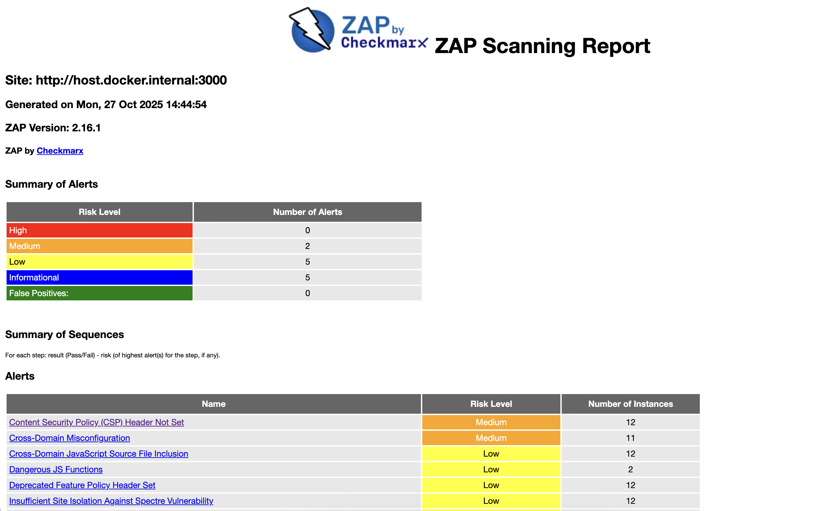
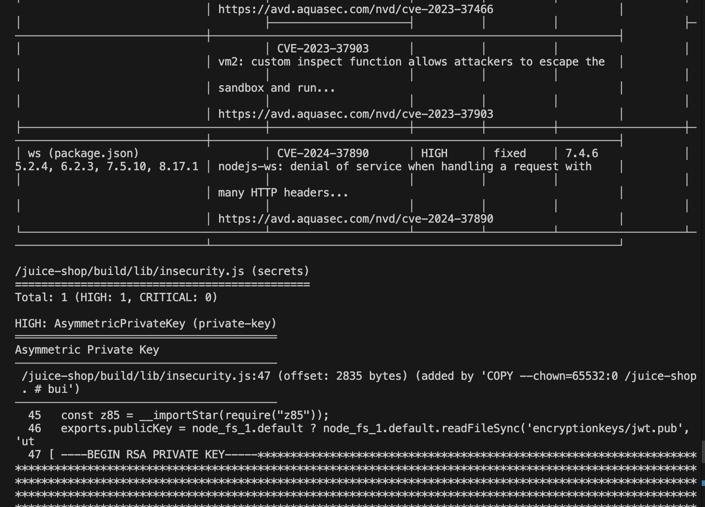
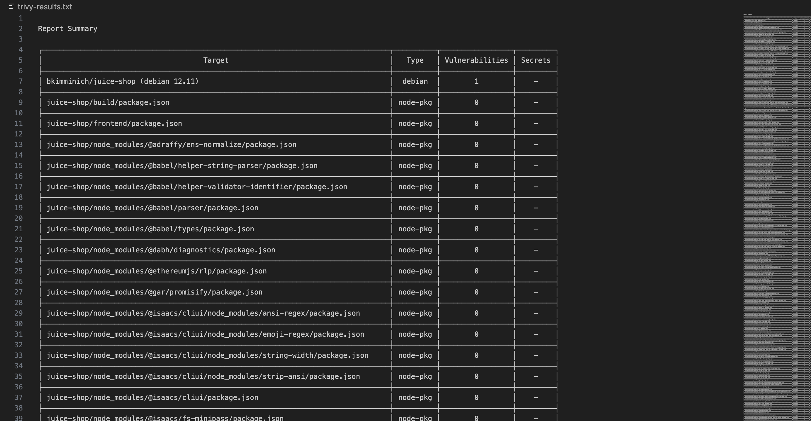

# Lab 9 — Introduction to DevSecOps Tools

## Task 1 — Web Application Scanning with OWASP ZAP

### 1.1: Start the Vulnerable Target Application

**Deploy Juice Shop (Intentionally Vulnerable Application):**

Command:

```bash
docker run -d --name juice-shop -p 3000:3000 bkimminich/juice-shop
```

Output:

```bash
9a96dde359d62461ba07323f9d982f63ba252052492ce94924cd31df1a5b7e8a
```

### 1.2: Scan with OWASP ZAP

**Run ZAP Baseline Scan:**

Command:

```bash
docker run --rm -u zap -v $(pwd):/zap/wrk:rw \
-t ghcr.io/zaproxy/zaproxy:stable zap-baseline.py \
-t http://host.docker.internal:3000 \
-g gen.conf \
-r zap-report.html
```

Output:

```bash
Total of 95 URLs
PASS: Vulnerable JS Library (Powered by Retire.js) [10003]
PASS: In Page Banner Information Leak [10009]
PASS: Cookie No HttpOnly Flag [10010]
PASS: Cookie Without Secure Flag [10011]
PASS: Re-examine Cache-control Directives [10015]
PASS: Content-Type Header Missing [10019]
PASS: Anti-clickjacking Header [10020]
PASS: X-Content-Type-Options Header Missing [10021]
PASS: Information Disclosure - Debug Error Messages [10023]
PASS: Information Disclosure - Sensitive Information in URL [10024]
PASS: Information Disclosure - Sensitive Information in HTTP Referrer Header [10025]
PASS: HTTP Parameter Override [10026]
PASS: Information Disclosure - Suspicious Comments [10027]
PASS: Off-site Redirect [10028]
PASS: Cookie Poisoning [10029]
PASS: User Controllable Charset [10030]
PASS: User Controllable HTML Element Attribute (Potential XSS) [10031]
PASS: Viewstate [10032]
PASS: Directory Browsing [10033]
PASS: Heartbleed OpenSSL Vulnerability (Indicative) [10034]
PASS: Strict-Transport-Security Header [10035]
PASS: HTTP Server Response Header [10036]
PASS: Server Leaks Information via "X-Powered-By" HTTP Response Header Field(s) [10037]
PASS: X-Backend-Server Header Information Leak [10039]
PASS: Secure Pages Include Mixed Content [10040]
PASS: HTTP to HTTPS Insecure Transition in Form Post [10041]
PASS: HTTPS to HTTP Insecure Transition in Form Post [10042]
PASS: User Controllable JavaScript Event (XSS) [10043]
PASS: Big Redirect Detected (Potential Sensitive Information Leak) [10044]
PASS: Content Cacheability [10049]
PASS: Retrieved from Cache [10050]
PASS: X-ChromeLogger-Data (XCOLD) Header Information Leak [10052]
PASS: Cookie without SameSite Attribute [10054]
PASS: CSP [10055]
PASS: X-Debug-Token Information Leak [10056]
PASS: Username Hash Found [10057]
PASS: X-AspNet-Version Response Header [10061]
PASS: PII Disclosure [10062]
PASS: Hash Disclosure [10097]
PASS: Source Code Disclosure [10099]
PASS: Weak Authentication Method [10105]
PASS: Reverse Tabnabbing [10108]
PASS: Modern Web Application [10109]
PASS: Authentication Request Identified [10111]
PASS: Session Management Response Identified [10112]
PASS: Verification Request Identified [10113]
PASS: Script Served From Malicious Domain (polyfill) [10115]
PASS: ZAP is Out of Date [10116]
PASS: Absence of Anti-CSRF Tokens [10202]
PASS: Private IP Disclosure [2]
PASS: Session ID in URL Rewrite [3]
PASS: Script Passive Scan Rules [50001]
PASS: Insecure JSF ViewState [90001]
PASS: Java Serialization Object [90002]
PASS: Sub Resource Integrity Attribute Missing [90003]
PASS: Charset Mismatch [90011]
PASS: Application Error Disclosure [90022]
PASS: WSDL File Detection [90030]
PASS: Loosely Scoped Cookie [90033]
WARN-NEW: Cross-Domain JavaScript Source File Inclusion [10017] x 12 
        http://host.docker.internal:3000/ (200 OK)
        http://host.docker.internal:3000/ (200 OK)
        http://host.docker.internal:3000 (200 OK)
        http://host.docker.internal:3000 (200 OK)
        http://host.docker.internal:3000/sitemap.xml (200 OK)
WARN-NEW: Content Security Policy (CSP) Header Not Set [10038] x 12 
        http://host.docker.internal:3000/ (200 OK)
        http://host.docker.internal:3000 (200 OK)
        http://host.docker.internal:3000/sitemap.xml (200 OK)
        http://host.docker.internal:3000/ftp/coupons_2013.md.bak (403 Forbidden)
        http://host.docker.internal:3000/ftp (200 OK)
WARN-NEW: Deprecated Feature Policy Header Set [10063] x 12 
        http://host.docker.internal:3000/ (200 OK)
        http://host.docker.internal:3000/runtime.js (200 OK)
        http://host.docker.internal:3000/polyfills.js (200 OK)
        http://host.docker.internal:3000 (200 OK)
        http://host.docker.internal:3000/sitemap.xml (200 OK)
WARN-NEW: Timestamp Disclosure - Unix [10096] x 20 
        http://host.docker.internal:3000/ (200 OK)
        http://host.docker.internal:3000/ (200 OK)
        http://host.docker.internal:3000/ (200 OK)
        http://host.docker.internal:3000 (200 OK)
        http://host.docker.internal:3000 (200 OK)
WARN-NEW: Cross-Domain Misconfiguration [10098] x 11 
        http://host.docker.internal:3000/ (200 OK)
        http://host.docker.internal:3000/robots.txt (200 OK)
        http://host.docker.internal:3000/assets/public/favicon_js.ico (200 OK)
        http://host.docker.internal:3000/polyfills.js (200 OK)
        http://host.docker.internal:3000/runtime.js (200 OK)
WARN-NEW: Dangerous JS Functions [10110] x 2 
        http://host.docker.internal:3000/main.js (200 OK)
        http://host.docker.internal:3000/vendor.js (200 OK)
WARN-NEW: Insufficient Site Isolation Against Spectre Vulnerability [90004] x 12 
        http://host.docker.internal:3000/ (200 OK)
        http://host.docker.internal:3000/ (200 OK)
        http://host.docker.internal:3000 (200 OK)
        http://host.docker.internal:3000 (200 OK)
        http://host.docker.internal:3000/sitemap.xml (200 OK)
FAIL-NEW: 0     FAIL-INPROG: 0  WARN-NEW: 7     WARN-INPROG: 0  INFO: 0 IGNORE: 0       PASS: 59
```

### 1.3: Analyze Results

**Open the Report:**

Found `zap-report.html` in current directory and opened in browser.

**Identify Vulnerabilities:**

Found vulnerabilities classified by risk level:

- High Risk: **0** vulnerabilities
- Medium Risk: **2** vulnerabilities  
- Low Risk: **5** vulnerabilities
- Informational: **5** vulnerabilities

### 1.4: Clean Up

Command:

```bash
docker stop juice-shop && docker rm juice-shop
```

### Task 1 Analysis

#### Number of Medium risk vulnerabilities found

Found **2** Medium risk vulnerabilities.

#### Description of the 2 most interesting vulnerabilities

**1. Content Security Policy (CSP) Header Not Set - Medium Risk:**

- **Description**: The application does not implement Content Security Policy headers, which are crucial for preventing XSS attacks and controlling resource loading
- **Impact**: Without CSP, attackers can inject malicious scripts, load unauthorized resources, and potentially steal user data or perform actions on behalf of users
- **Where**: Found across 12 different URLs including the main application pages and API endpoints

**2. Cross-Domain Misconfiguration - Medium Risk:**

- **Description**: The application sets `Access-Control-Allow-Origin: *` which allows any domain to make cross-origin requests to the application
- **Impact**: This overly permissive CORS configuration could allow malicious websites to access sensitive data from the application, potentially leading to data theft or unauthorized actions
- **Where**: Found on 11 URLs including main pages, JavaScript files, and static resources

#### Security headers status

**Present Headers:**

- **Feature-Policy**: Present but deprecated - should be updated to Permissions-Policy for controlling browser features
- **Access-Control-Allow-Origin**: Present but misconfigured (set to wildcard *)

**Missing Headers:**

- **Content-Security-Policy**: Missing - prevents XSS attacks by controlling resource loading and script execution
- **X-Frame-Options**: Missing - prevents clickjacking attacks by controlling if the site can be embedded in frames
- **X-Content-Type-Options**: Missing - prevents MIME type sniffing attacks
- **Strict-Transport-Security**: Missing - enforces HTTPS connections and prevents downgrade attacks
- **Cross-Origin-Embedder-Policy**: Missing - provides protection against Spectre-style attacks
- **Cross-Origin-Opener-Policy**: Missing - isolates browsing context to prevent certain cross-origin attacks

**Why Security Headers Matter:**

- **Defense in Depth**: Provide additional security layers beyond application code
- **Browser Protection**: Instruct browsers to enforce security policies automatically
- **Attack Prevention**: Block common attack vectors like XSS, clickjacking, and MITM attacks
- **Data Protection**: Prevent information leakage and unauthorized cross-origin access
- **Modern Threat Mitigation**: Address newer attack vectors like Spectre and provide site isolation

#### Screenshot of ZAP HTML report overview



#### Analysis: What type of vulnerabilities are most common in web applications?

Based on the ZAP scan results and industry research, the most common web application vulnerabilities include:

**1. Security Misconfigurations (Most Common in This Scan):**

**2. Cross-Site Scripting (XSS):**

**3. Injection Vulnerabilities:**

**4. Broken Authentication & Session Management:**

**5. Information Disclosure:**

**Key Patterns from This Scan:**

- Missing security headers across all pages (12 instances)
- Cross-domain JavaScript inclusion without proper validation
- Deprecated security policies (Feature-Policy vs Permissions-Policy)
- Information leakage through timestamps and file paths

## Task 2 — Container Vulnerability Scanning with Trivy

### 2.1: Scan Container Image

**Run Trivy Scan:**

Command:

```bash
docker run --rm -v /var/run/docker.sock:/var/run/docker.sock \
aquasec/trivy:latest image \
--severity HIGH,CRITICAL \
bkimminich/juice-shop > trivy-results.txt
```

Output:

results saved in `trivy-results.txt`

### 2.2: Analyze Results

**Identify Key Findings:**

From the scan output, identified:

- Total number of CRITICAL vulnerabilities: **9**
- Total number of HIGH vulnerabilities: **25**
- Vulnerable package names: **bkimminich/juice-shop**, **Node.js**, **/juice-shop/build/lib/insecurity.js**, **/juice-shop/lib/insecurity.ts**
- Most common vulnerability types: **CVE-2015-9235**, **CVE-2022-23539**, **NSWG-ECO-17**, **AsymmetricPrivateKey**

### 2.3: Clean Up

Command:

```bash
docker rmi bkimminich/juice-shop
```

### Task 2 Analysis

#### Total count of CRITICAL and HIGH vulnerabilities

- **CRITICAL vulnerabilities**: 9
- **HIGH vulnerabilities**: 25
- **Total HIGH/CRITICAL**: 34

#### List of 2 vulnerable packages with their CVE IDs

**1. vm2:**

- **CVE ID**: CVE-2023-32314
- **Severity**: CRITICAL
- **Description**: Sandbox escape vulnerability in vm2 JavaScript sandbox library that allows breaking out of the security isolation
- **Impact**: Allows attackers to escape the sandbox environment and execute arbitrary code on the host system, potentially leading to full system compromise and remote code execution

**2. jsonwebtoken:**

- **CVE ID**: CVE-2015-9235
- **Severity**: CRITICAL
- **Description**: JSON Web Token verification step bypass vulnerability allowing attackers to forge tokens by manipulating the algorithm field
- **Impact**: Complete authentication bypass - attackers can create valid-looking tokens without knowing the secret key, leading to unauthorized access and privilege escalation

#### Most common vulnerability types found

**CVE-2015-9235**, **CVE-2022-23539**, **NSWG-ECO-17**, **AsymmetricPrivateKey** - all have 2 entries

#### Screenshot of Trivy terminal output showing critical findings




#### Analysis: Why is container image scanning important before deploying to production?

1. **Find Problems Early**: Catch security issues before they go live where hackers can exploit them
2. **Check Dependencies**: Make sure third-party libraries and base images are safe
3. **Meet Requirements**: Many companies and regulations require security scanning
4. **Save Money**: Fixing bugs in development is much cheaper than fixing them in production

#### Reflection: How would you integrate these scans into a CI/CD pipeline?

**Simple Integration:**

**1. Add Security Step:**

```yaml
stages:
  - build
  - security-scan  # Add Trivy here
  - test
  - deploy
```

**2. GitHub Actions:**

```yaml
- name: Scan for vulnerabilities
  uses: aquasecurity/trivy-action@master
  with:
    image-ref: '${{ env.IMAGE_NAME }}'
    exit-code: '1'  # Stop pipeline if problems found
    severity: 'CRITICAL,HIGH'
```

**3. Set Rules:**

- **CRITICAL**: Always stop the pipeline
- **HIGH**: Stop unless approved
- **MEDIUM/LOW**: Just report but allow deployment

**4. Basic Workflow:**

```bash
1. Build container
2. Scan for vulnerabilities  
3. If critical issues found → stop and alert team
4. If clean → deploy to production
5. Keep scanning production images regularly
```

**5. Integration Options:**

- **Automatic scanning** on every build
- **Notifications** to team when issues found
- **Reports** for security team
- **Block deployment** of vulnerable images
