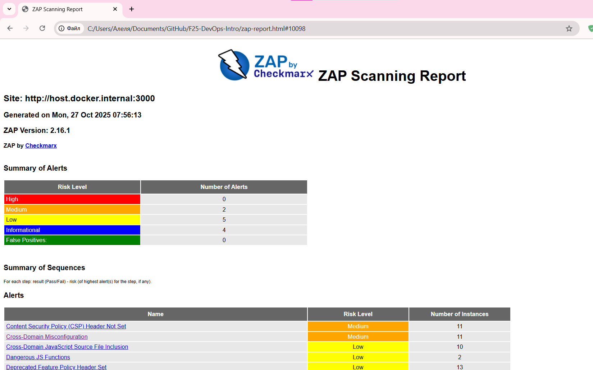
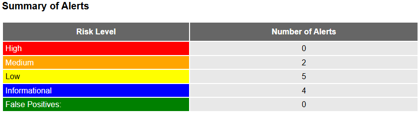
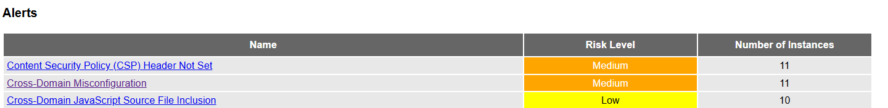
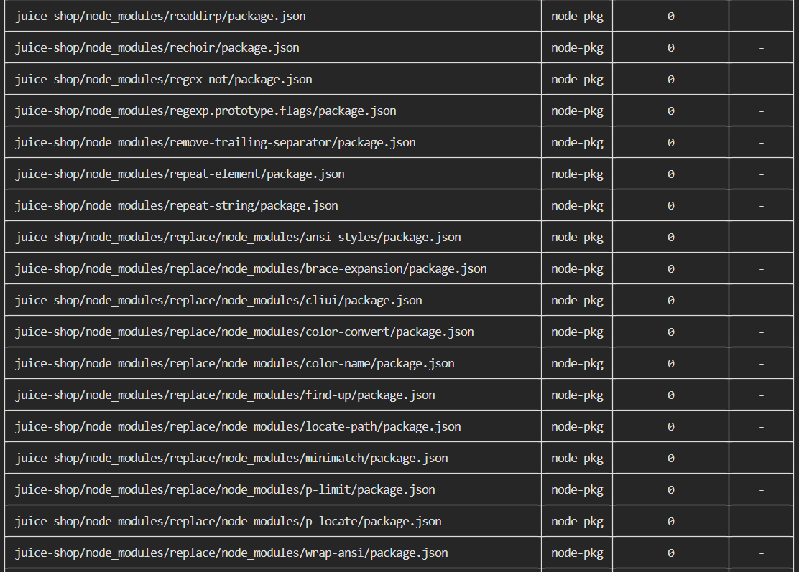
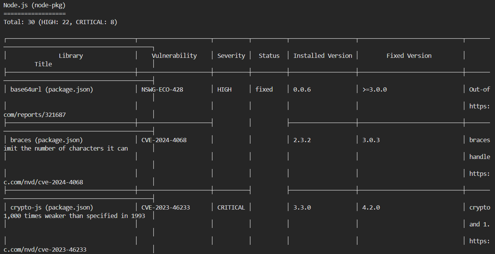
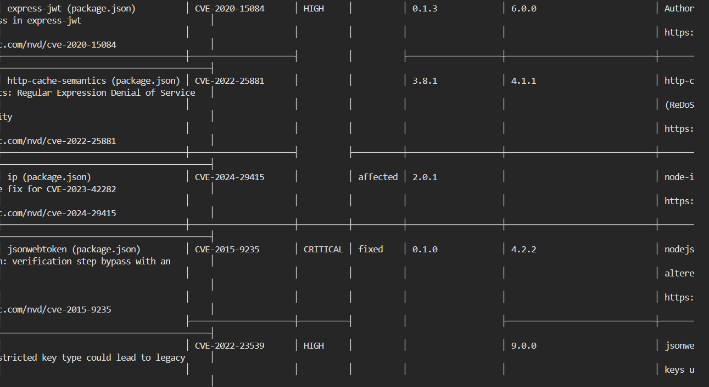

# Lab 9

## Task 1

**Number of Medium risk vulnerabilities found:** 2

---
**Description of the 2 most interesting vulnerabilities:**
  1.  **Content Security Policy (CSP) Header Not Set**: 
    
        Content Security Policy (CSP) is an added layer of security that helps to detect and mitigate certain types of attacks, including Cross Site Scripting (XSS) and data injection attacks. These attacks are used for everything from data theft to site defacement or distribution of malware. CSP provides a set of standard HTTP headers that allow website owners to declare approved sources of content that browsers should be allowed to load on that page — covered types are JavaScript, CSS, HTML frames, fonts, images and embeddable objects such as Java applets, ActiveX, audio and video files.
  2.  **Cross-Domain Misconfiguration**:
  
        Web browser data loading may be possible, due to a Cross Origin Resource Sharing (CORS) misconfiguration on the web server.

---
**Security headers status:**
  - **Present**: Anti-clickjacking, Strict-Transport-Security, HTTP Server Response, X-Backend-Server, X-ChromeLogger-Data
  - **Missing**: X-Content-Type-Options - missing, which may lead to MIME spoofing; Content-Type - missing, which may lead to how the receiving application interprets and handles the data.

---
**Screenshot of ZAP HTML report overview:**

  
  
  

---
**What type of vulnerabilities are most common in web applications?**

  The most common vulnerabilities of web applications are content security (CSP) and cross-site configuration (CORS) issues, as well as the absence of critical security headers.

## Task 2

**Total count of CRITICAL and HIGH vulnerabilities:**
- CRITICAL: 8
- HIGH: 23 (22 nodejs and 1 system)

---
**List of 2 vulnerable packages with their CVE IDs:**

1. `crypto-js` - CVE-2023-46233 (CRITICAL vulnerability in the cryptographic library)
2. `jsonwebtoken` - CVE-2015-9235 (CRITICAL vulnerability of prototype contamination)

---
**Most common vulnerability type found:** Prototype Pollution and verification bypass

---
**Screenshot of Trivy terminal output showing critical findings:**

  

  
  
  

---
**Why is container image scanning important before deploying to production?**

Scanning container images is critically important because it allows you to identify vulnerabilities in dependencies and system libraries that can be used by hackers to hack an application. 

In this case, critical vulnerabilities have been discovered in popular libraries (`crypto-js`, `lodash`), which can lead to compromise of the entire system.

---
**How would you integrate these scans into a CI/CD pipeline?**

I would integrate Trivy scanning during the build phase of the Docker image so that the build automatically fails when critical vulnerabilities are detected. You can also set up regular scanning of already deployed images.
