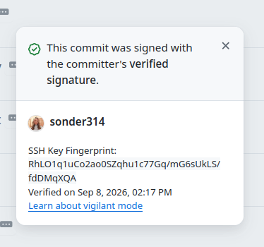
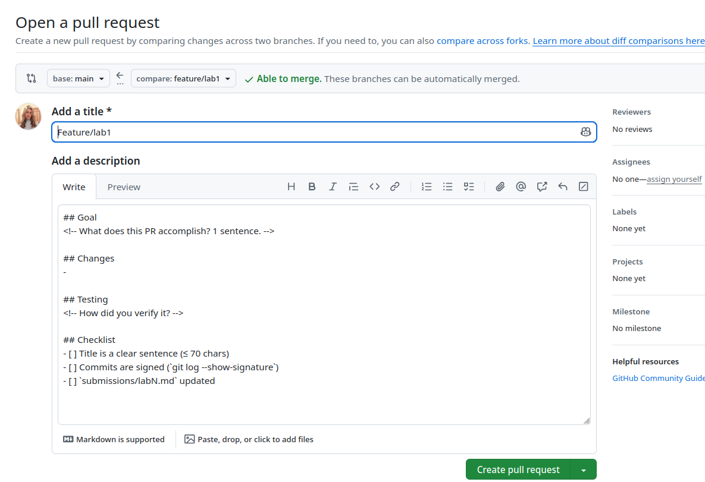
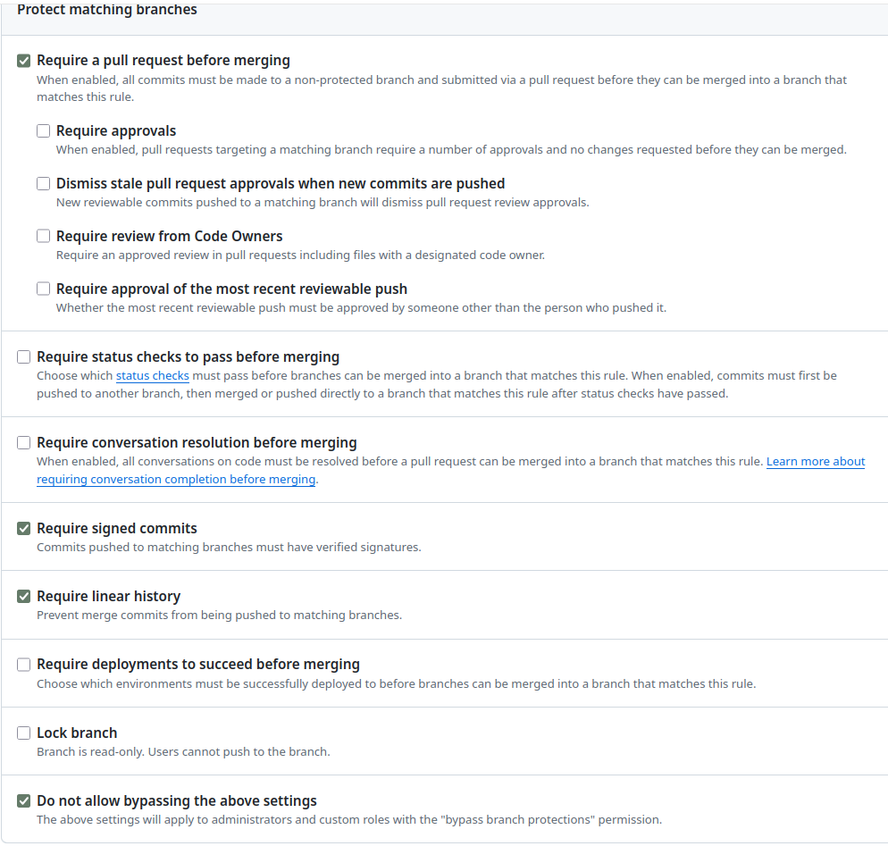

# Lab 1 — DevOps Foundations

Student: Arina ([@sonder314](https://github.com/sonder314))  
Repository: [sonder314/DevOps-Intro](https://github.com/sonder314/DevOps-Intro)  
Branch: `feature/lab1`  
Status: **Branches published and GitHub signatures verified; the unsigned-push test and upstream PR remain to be completed.**

## Task 1 — QuickNotes and SSH commit signing

### Environment

I checked my local tool versions on 8 September 2026:

```text
git version 2.53.0
go version go1.26.7 linux/amd64
OpenSSH_10.2p1 Ubuntu-2ubuntu3.5
```

I use Go from the repository-local `.goenv/toolchain`, with separate build and module caches. I activate it with `source .goenv/activate` from the repository root. For the HTTP checks, I ran QuickNotes with a separate data file initialized from `app/seed.json`, so my existing application data was preserved.

### QuickNotes endpoint evidence

<!-- BEGIN HTTP EVIDENCE -->
I captured the following responses at 2026-09-08T13:27:05+0300.

I checked that the application started with four seed notes, returned HTTP 201 when I created a note, and contained five notes afterwards.

### `GET /health` (HTTP 200)

```bash
curl -s http://localhost:8080/health | python3 -m json.tool
```

```json
{
    "notes": 4,
    "status": "ok"
}
```

### `GET /notes` (HTTP 200)

```bash
curl -s http://localhost:8080/notes | python3 -m json.tool
```

```json
[
    {
        "id": 1,
        "title": "Welcome to QuickNotes",
        "body": "This is the project you'll containerize, deploy, monitor, and harden across all 10 labs.",
        "created_at": "2026-01-15T10:00:00Z"
    },
    {
        "id": 2,
        "title": "Read app/main.go first",
        "body": "Start by understanding the entry point \u2014 env vars, signal handling, graceful shutdown.",
        "created_at": "2026-01-15T10:05:00Z"
    },
    {
        "id": 3,
        "title": "DevOps mantra",
        "body": "If it hurts, do it more often.",
        "created_at": "2026-01-15T10:10:00Z"
    },
    {
        "id": 4,
        "title": "Endpoint cheat-sheet",
        "body": "GET /notes  GET /notes/{id}  POST /notes  DELETE /notes/{id}  GET /health  GET /metrics",
        "created_at": "2026-01-15T10:15:00Z"
    }
]
```

### `POST /notes` (HTTP 201)

```bash
curl -s -X POST -H 'Content-Type: application/json' -d '{"title":"hello","body":"first POST"}' http://localhost:8080/notes | python3 -m json.tool
```

```json
{
    "id": 5,
    "title": "hello",
    "body": "first POST",
    "created_at": "2026-09-08T10:27:05.276015472Z"
}
```

### `GET /notes` (HTTP 200)

```bash
curl -s http://localhost:8080/notes | python3 -m json.tool
```

```json
[
    {
        "id": 3,
        "title": "DevOps mantra",
        "body": "If it hurts, do it more often.",
        "created_at": "2026-01-15T10:10:00Z"
    },
    {
        "id": 4,
        "title": "Endpoint cheat-sheet",
        "body": "GET /notes  GET /notes/{id}  POST /notes  DELETE /notes/{id}  GET /health  GET /metrics",
        "created_at": "2026-01-15T10:15:00Z"
    },
    {
        "id": 5,
        "title": "hello",
        "body": "first POST",
        "created_at": "2026-09-08T10:27:05.276015472Z"
    },
    {
        "id": 1,
        "title": "Welcome to QuickNotes",
        "body": "This is the project you'll containerize, deploy, monitor, and harden across all 10 labs.",
        "created_at": "2026-01-15T10:00:00Z"
    },
    {
        "id": 2,
        "title": "Read app/main.go first",
        "body": "Start by understanding the entry point \u2014 env vars, signal handling, graceful shutdown.",
        "created_at": "2026-01-15T10:05:00Z"
    }
]
```

### `GET /health` (HTTP 200)

```bash
curl -s http://localhost:8080/health | python3 -m json.tool
```

```json
{
    "notes": 5,
    "status": "ok"
}
```
<!-- END HTTP EVIDENCE -->

### Tests

I checked the application with its existing tests (`cd app && go test ./...`):

```text
ok  	quicknotes	0.011s
```

These tests exercise the handlers and store; the live HTTP checks above separately confirm the running application.

Raw runtime evidence: [curl responses](evidence/lab1/http.md) and [server log](evidence/lab1/server.txt).

### SSH signing

I configured SSH signing for this repository using `gpg.format=ssh`, `commit.gpgsign=true`, `tag.gpgsign=true`, and the existing `~/.ssh/id_ed25519_sonder314.pub` key. Local verification uses `.git/allowed_signers`; private key material is not included in this submission.

I verified the template commit on `main` with `git log --show-signature -1`:

```text
commit 579f5c9cc6f9bb2accda8a57985c5706ec8e82f1
Good "git" signature for uzersamsung873@gmail.com with ED25519 key SHA256:RhLO1q1uCo2ao0SZqhu1c77Gq/mG6sUkLS/fdDMqXQA
Author: Arina <uzersamsung873@gmail.com>
Date:   Tue Sep 8 13:24:03 2026 +0300

    docs: add PR template
    
    Signed-off-by: Arina <uzersamsung873@gmail.com>

```

Raw evidence: [signature.txt](evidence/lab1/signature.txt).

I authenticated to GitHub as `sonder314` using my new SSH key:

```text
Hi sonder314! You've successfully authenticated, but GitHub does not provide shell access.
```

I pushed `main` and `feature/lab1` to my fork successfully.

I registered my public key for SSH signing and checked that all my published commits show Verified on GitHub.



### Why signing matters

I use commit signatures to bind my commits to my signing key and make changes to their signed contents detectable. The [March 2024 xz-utils backdoor disclosure](https://openwall.com/lists/oss-security/2024/03/29/4) shows why supply-chain trust needs more than a familiar maintainer identity: an authorized contributor or compromised key can still deliver malicious code. Signing therefore complements code review, reproducible builds and testing; it does not certify that code is safe.

## Task 2 — PR template and first pull request

I committed the required template on local `main` at `579f5c9` and included it in `feature/lab1`: [pull_request_template.md](../.github/pull_request_template.md). It contains Goal, Changes, Testing and Checklist sections.

- [x] Template committed on local `main` with a valid SSH signature.
- [x] Template pushed to the fork's `main` before PR creation.
- [x] Template auto-population captured in a real screenshot.
- [ ] PR opened from `sonder314:feature/lab1` to `inno-devops-labs:main`.
- [ ] PR checklist completed and every contributed commit shows Verified.

**PR URL:** not yet recorded; I still need to publish the PR.

I checked the PR creation form in my fork and confirmed that the Goal, Changes, Testing and Checklist sections appeared automatically. This demonstrates my fork's template; the final submission PR targets the course repository.



## Task 3 — GitHub Community

I star repositories to bookmark useful tools and help the projects gain visibility. I follow developers to keep up with my classmates' work, discover projects and find opportunities to collaborate and learn.

I completed the following actions using my `sonder314` account:

- [x] I starred [inno-devops-labs/DevOps-Intro](https://github.com/inno-devops-labs/DevOps-Intro).
- [x] I starred [simple-container-com/api](https://github.com/simple-container-com/api).
- [x] I followed [Cre-eD](https://github.com/Cre-eD).
- [x] I followed [Naghme98](https://github.com/Naghme98).
- [x] I followed [pierrepicaud](https://github.com/pierrepicaud).
- [x] I followed at least three classmates.

## Bonus — Branch protection and required signing

**Status: branch protection configured; remote rejection test pending.**

I configured my fork's `main` to require signed commits, pull requests before merging and linear history. I also disabled bypassing the rules for administrators.



**Rejection test still to run:** I need to attempt an unsigned push to protected `main` and record the exact server rejection, including the `remote: error:` lines.

### Knight Capital reflection

The [SEC's Knight Capital order](https://www.sec.gov/files/litigation/admin/2013/34-70694.pdf) describes an inconsistent deployment in which one of eight servers did not receive the new code. I think requiring reviewed pull requests and signed commits on the production deployment branch could have improved traceability and created a review checkpoint before deployment. Linear history would have made the sequence of approved changes easier to audit, but neither signatures nor branch protection would have ensured that every server received the same artifact. Automated deployment verification, staged rollouts, monitoring and a tested rollback mechanism would still have been necessary to reduce the risk of a similar incident.

## Submission readiness

- [x] Existing application tests pass.
- [x] Local SSH signing is configured and verified.
- [x] Template exists on local `main`.
- [x] Live curl evidence captured (4 seed notes → 5 after POST).
- [x] GitHub Verified screenshot included.
- [x] Published template and auto-population evidence included.
- [x] I completed the required stars and followed the professor, both TAs and at least three classmates.
- [ ] Bonus rules screenshot and genuine rejection output included.
- [ ] Actual upstream PR URL recorded and PR checklist completed.
- [ ] PR URL submitted through Moodle before the deadline.
