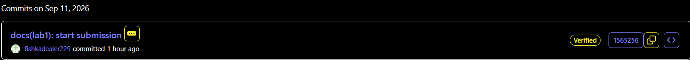

# Lab 1 submission

## Task 1

### 1. QuickNotes /health
{"notes":4,"status":"ok"}

### 2. QuickNotes /notes
[{"id":1,"title":"Welcome to QuickNotes","body":"This is the project you'll containerize, deploy, monitor, and harden across all 10 labs.","created_at":"2026-01-15T10:00:00Z"},{"id":2,"title":"Read app/main.go first","body":"Start by understanding the entry point — env vars, signal handling, graceful shutdown.","created_at":"2026-01-15T10:05:00Z"},{"id":3,"title":"DevOps mantra","body":"If it hurts, do it more often.","created_at":"2026-01-15T10:10:00Z"},{"id":4,"title":"Endpoint cheat-sheet","body":"GET /notes  GET /notes/{id}  POST /notes  DELETE /notes/{id}  GET /health  GET /metrics","created_at":"2026-01-15T10:15:00Z"}]

### 3. POST /notes
{"id":5,"title":"hello","body": "first POST",created_at: 2026-09-10T23:32:03.1140196Z}

### 4. Signed Commit
commit 1565256076a38d2758f20a7d3738cade3ab169ba Good "git" signature with ED25519 key SHA256:qxoWrG/EDJIFi8XJfipCDHRnecGcXiGFr0lkNiizMFY C:\\Users\\fishkadealer\\.ssh\\allowed_signers:1: missing key No principal matched. Author: fishkadealer229 <midav.06@mail.ru> Date:   Fri Sep 11 02:37:55 2026 +0300      docs(lab1): start submission          Signed-off-by: fishkadealer229 <midav.06@mail.ru>

### 5. Screenshot of the Verified badge

### 6. Why Signed Commits Matter
Signed commits help verify that a commit was created by the expected developer.
The March 2024 xz-utils incident showed the risks of compromising trusted open-source software and its supply chain, so commit signing is an important security measure for verifying authorship and maintaining traceability.

## Task 2

