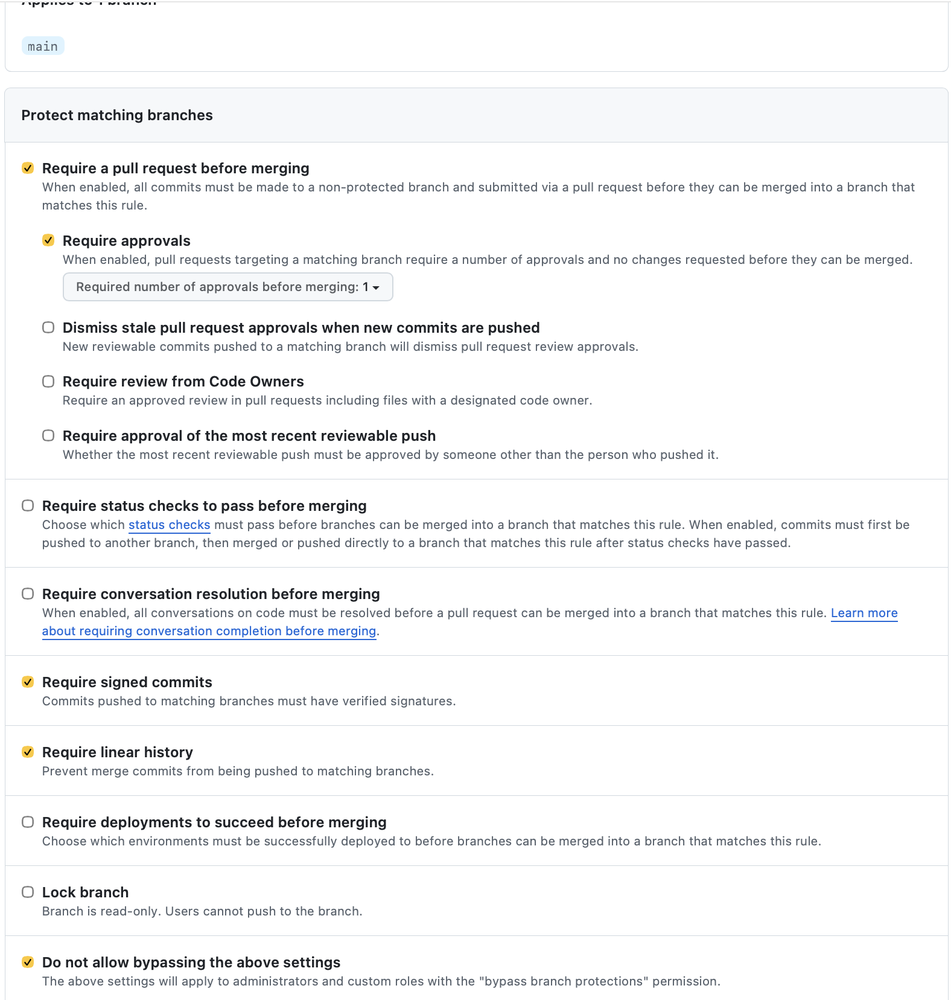

# Lab 1 submission


## Task 1 — SSH Commit Signing & QuickNotes

### Health endpoint
```json
{
    "notes": 4,
    "status": "ok"
}
```

### Notes endpoint
```json
[
    {
        "id": 1,
        "title": "Welcome to QuickNotes",
        "body": "This is the project you'll containerize, deploy, monitor, and harden across all 10 labs.",
        "created_at": "2026-01-15T10:00:00Z"
    },
    {
        "id": 2,
        "title": "Read app/main.go first",
        "body": "Start by understanding the entry point \u2014 env vars, signal handling, graceful shutdown.",
        "created_at": "2026-01-15T10:05:00Z"
    },
    {
        "id": 3,
        "title": "DevOps mantra",
        "body": "If it hurts, do it more often.",
        "created_at": "2026-01-15T10:10:00Z"
    },
    {
        "id": 4,
        "title": "Endpoint cheat-sheet",
        "body": "GET /notes  GET /notes/{id}  POST /notes  DELETE /notes/{id}  GET /health  GET /metrics",
        "created_at": "2026-01-15T10:15:00Z"
    }
]
```
### POST /notes
```json
{
    "id": 5,
    "title": "hello",
    "body": "first POST",
    "created_at": "2026-09-07T12:15:19.605636Z"
}
```
### Signed commit verification
```text
commit 02c5ba5e81c61cb5f6c0cd3dd2cc18336cbbcda9 (HEAD -> feature/lab1, origin/feature/lab1)
Good "git" signature for amiranabiullina@gmail.com with ED25519 key SHA256:/aeVaD5vxRqKdTCmMabybyKD+h3zw0Z9mHjgJYEp+hM
Author: amiranabiullina <amiranabiullina@gmail.com>
Date:   Mon Sep 7 15:22:01 2026 +0300

    docs(lab1): start submission
    
    Signed-off-by: amiranabiullina <amiranabiullina@gmail.com>
 ```

### Verified commit


### Why signed commits matter
Signed commits help verify that a commit was created by the expected developer and has not been impersonated. The xz-utils story discussed in Lecture 1 shows why software supply-chain trust and contributor identity are important. Commit signing provides an additional layer of verification when reviewing changes.


## Task 2


## Task 3 — GitHub Community

Starring repositories helps developers bookmark useful projects and increases their visibility in the open-source community. Following developers helps me stay updated on their work, discover new projects, and build connections for future collaboration.

## Bonus Task

### Branch protection


### Unsigned commit rejection

```text
Enumerating objects: 1, done.
Counting objects: 100% (1/1), done.
Writing objects: 100% (1/1), 220 bytes | 220.00 KiB/s, done.
Total 1 (delta 0), reused 0 (delta 0), pack-reused 0 (from 0)
remote: error: GH006: Protected branch update failed for refs/heads/main.
remote: 
remote: - Commits must have verified signatures.
remote:   Found 1 violation:
remote: 
remote:   b873c23423e69ff28c497b7346529687d48f5415
remote: 
remote: - Changes must be made through a pull request.
To github.com:amiranabiullina/DevOps-Intro.git
 ! [remote rejected] main -> main (protected branch hook declined)
error: failed to push some refs to 'github.com:amiranabiullina/DevOps-Intro.git'
```
### Reflection

With branch protection on the production deployment branch, Knight Capital's deployment would have required an approved pull request instead of allowing uncontrolled direct changes. Required signing would also have made it possible to verify exactly who authorized and produced the commits being deployed. These controls could have added an extra review and audit step before the faulty release reached production. However, commit signing alone would not have prevented the deployment inconsistency, so deployment verification and automated checks would still have been necessary.