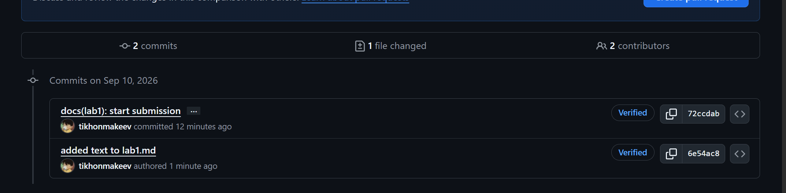

# Lab 1 submission

## Output of curl against /health, /notes, and POST /notes

[root@tikhon DevOps-Intro]# curl -s http://localhost:8080/health | python3 -m json.tool
curl -s http://localhost:8080/notes  | python3 -m json.tool
curl -s -X POST http://localhost:8080/notes \
  -H 'Content-Type: application/json' \
  -d '{"title":"hello","body":"first POST"}' | python3 -m json.tool
{
    "notes": 4,
    "status": "ok"
}
[
    {
        "id": 1,
        "title": "Welcome to QuickNotes",
        "body": "This is the project you'll containerize, deploy, monitor, and harden across all 10 labs.",
        "created_at": "2026-01-15T10:00:00Z"
    },
    {
        "id": 2,
        "title": "Read app/main.go first",
        "body": "Start by understanding the entry point \u2014 env vars, signal handling, graceful shutdown.",
        "created_at": "2026-01-15T10:05:00Z"
    },
    {
        "id": 3,
        "title": "DevOps mantra",
        "body": "If it hurts, do it more often.",
        "created_at": "2026-01-15T10:10:00Z"
    },
    {
        "id": 4,
        "title": "Endpoint cheat-sheet",
        "body": "GET /notes  GET /notes/{id}  POST /notes  DELETE /notes/{id}  GET /health  GET /metrics",
        "created_at": "2026-01-15T10:15:00Z"
    }
]
{
    "id": 5,
    "title": "hello",
    "body": "first POST",
    "created_at": "2026-09-10T20:37:38.273491209Z"
}
[root@tikhon DevOps-Intro]# curl -s http://localhost:8080/notes  | python3 -m json.tool
[
    {
        "id": 5,
        "title": "hello",
        "body": "first POST",
        "created_at": "2026-09-10T20:37:38.273491209Z"
    },
    {
        "id": 1,
        "title": "Welcome to QuickNotes",
        "body": "This is the project you'll containerize, deploy, monitor, and harden across all 10 labs.",
        "created_at": "2026-01-15T10:00:00Z"
    },
    {
        "id": 2,
        "title": "Read app/main.go first",
        "body": "Start by understanding the entry point \u2014 env vars, signal handling, graceful shutdown.",
        "created_at": "2026-01-15T10:05:00Z"
    },
    {
        "id": 3,
        "title": "DevOps mantra",
        "body": "If it hurts, do it more often.",
        "created_at": "2026-01-15T10:10:00Z"
    },
    {
        "id": 4,
        "title": "Endpoint cheat-sheet",
        "body": "GET /notes  GET /notes/{id}  POST /notes  DELETE /notes/{id}  GET /health  GET /metrics",
        "created_at": "2026-01-15T10:15:00Z"
    }

## Output of git log --show-signature -1 showing Good signature

PS C:\Users\tihon\ui-cources\DevOps-Intro> git log --show-signature -1
commit 72ccdabb78c1f44302810083b5920c758ef0302c (HEAD -> feature/lab1, origin/feature/lab1)
Good "git" signature for t.makeev@edu.centraluniversity.ru with ED25519 key SHA256:eqMgK1qLtQKw9U+S2DnO+E08MJ6aMdDwRKMWaiTZpno
Author: tikhonmakeev <t.makeev@edu.centraluniversity.ru>
Date:   Thu Sep 10 23:47:03 2026 +0300

    docs(lab1): start submission
    
    Signed-off-by: tikhonmakeev <t.makeev@edu.centraluniversity.ru>
    

## Screenshoted verified bage

## Why it matters
As I remember, story was something like "project merged bad commits with backdoor because trusted famous collaborator in community". So signed commits saves us from issue we have in git -- everybody can chose his username and email of commit, git never checks it. We need to check authority -- so we sign every commit (on public repos must have)

## Why starring repositories matters in open source
In open source it can be hard to find "An official repo" of needed project -- the only way sometimes is to find their site that links to github. Also we don`t have time to look throw codebase everytime to see is it good or not. 

As for me - a lot of start means that other coders already used project and found it usefull and well-written. It saves time and highlight new rising projects

## How following developers helps in team projects and professional growth
As for me, I follow person to be noticed of his new projects or to find him easily to go back to his profile and contact him. Of cource it is important to growth -- if I can join his team in the future, or call him to hackathon.