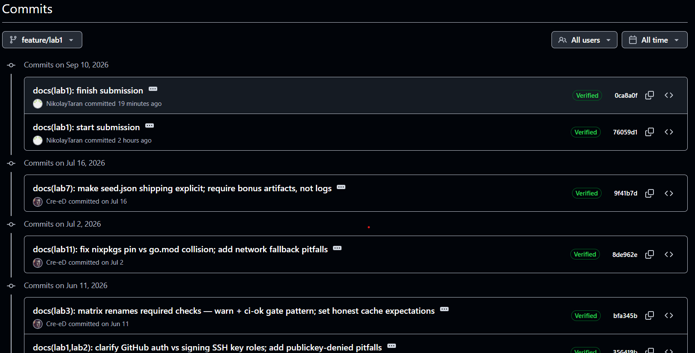
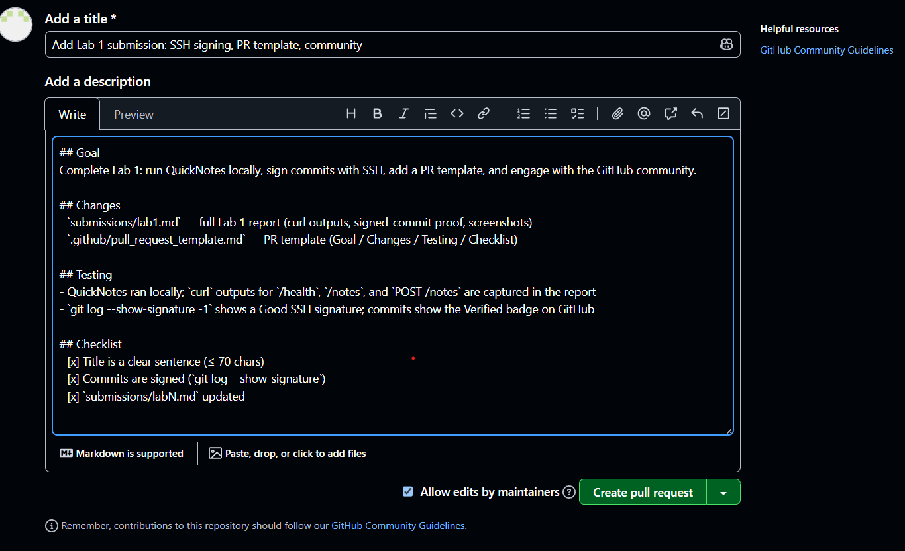
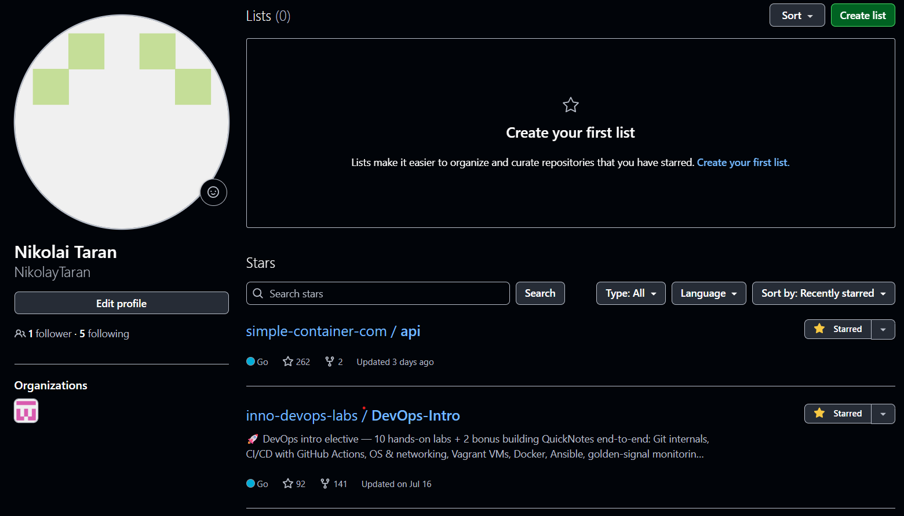
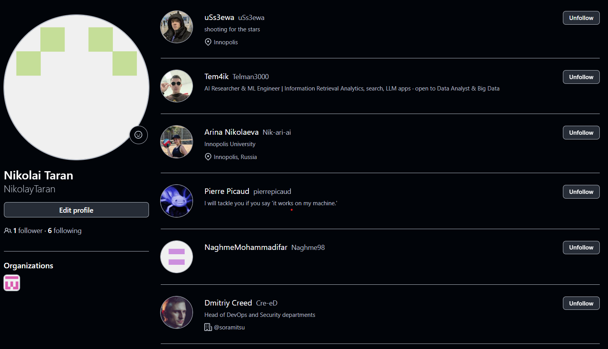
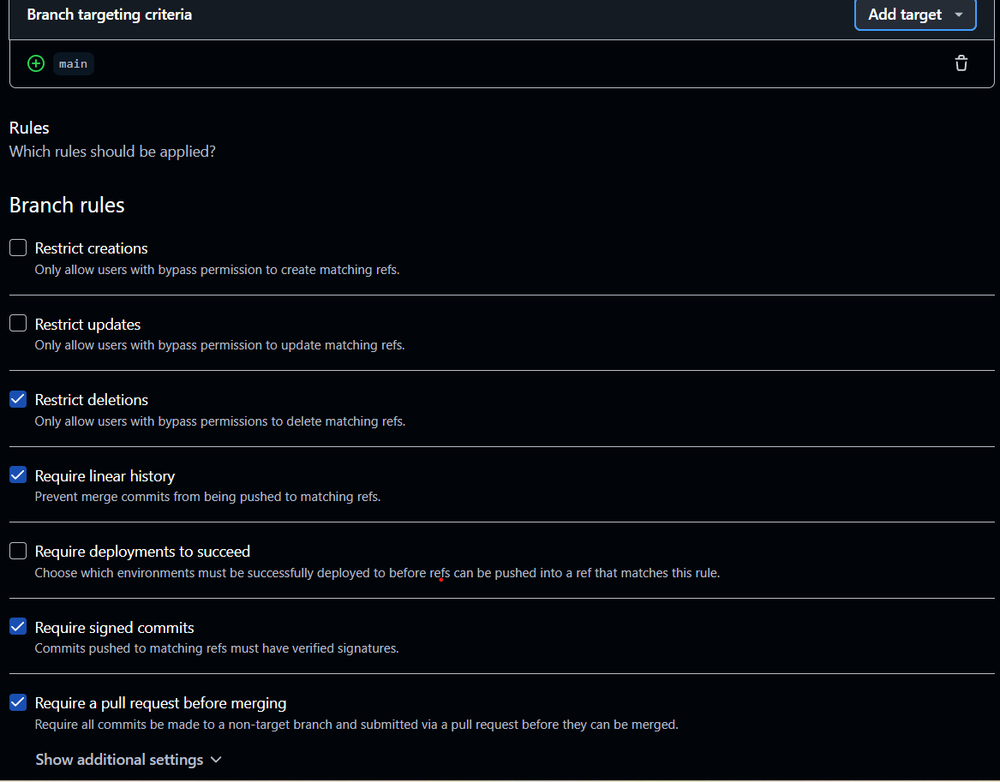

# Lab 1 — DevOps Foundations: Fork, Sign, and Open Your First PR

**Student:** Nikolai Taran
**GitHub:** https://github.com/NikolayTaran
**Fork:** https://github.com/NikolayTaran/DevOps-Intro

---

## Task 1 — SSH Commit Signing & First Signed Commit

### QuickNotes running locally

`GET /health` — service is up:

```bash
$ curl -s http://localhost:8080/health | python -m json.tool
{
    "notes": 4,
    "status": "ok"
}
```

`GET /notes` — 4 seed notes returned:

```bash
$ curl -s http://localhost:8080/notes | python -m json.tool
[
    {
        "id": 1,
        "title": "Welcome to QuickNotes",
        "body": "This is the project you'll containerize, deploy, monitor, and harden across all 10 labs.",
        "created_at": "2026-01-15T10:00:00Z"
    },
    {
        "id": 2,
        "title": "Read app/main.go first",
        "body": "Start by understanding the entry point — env vars, signal handling, graceful shutdown.",
        "created_at": "2026-01-15T10:05:00Z"
    },
    {
        "id": 3,
        "title": "DevOps mantra",
        "body": "If it hurts, do it more often.",
        "created_at": "2026-01-15T10:10:00Z"
    },
    {
        "id": 4,
        "title": "Endpoint cheat-sheet",
        "body": "GET /notes  GET /notes/{id}  POST /notes  DELETE /notes/{id}  GET /health  GET /metrics",
        "created_at": "2026-01-15T10:15:00Z"
    }
]
```

`POST /notes` — note #5 created (5 notes in total after the POST):

```bash
$ curl -s -X POST http://localhost:8080/notes -H 'Content-Type: application/json' -d '{"title":"hello","body":"first POST"}' | python -m json.tool
{
    "id": 5,
    "title": "hello",
    "body": "first POST",
    "created_at": "2026-09-09T21:36:03.624042Z"
}
```

### Signed commit verification

Output of `git log --show-signature -1`:

```bash
$ git log --show-signature -1
commit 76059d1b18686107f80416af8039f1f788a2b382 (HEAD -> feature/lab1)
Good "git" signature for na.taranvrn@gmail.com with ED25519 key SHA256:v0q6vLEo/9mCeHerKSiK6jWk7HuDvDwqbGkz9mPJpyw
Author: NikolayTaran <na.taranvrn@gmail.com>
Date:   Thu Sep 10 00:39:45 2026 +0300

    docs(lab1): start submission

    Signed-off-by: NikolayTaran <na.taranvrn@gmail.com>
```

Verified badge in the GitHub UI:



### Why signed commits matter

In March 2024 a backdoor (CVE-2024-3094) was discovered in xz/liblzma 5.6.0–5.6.1, planted by someone who had spent almost two years building trust as a project maintainer ("Jia Tan"). It showed how fragile identity and trust in open-source supply chains are. Signed commits make authorship verifiable instead of assumed: the green "Verified" badge proves the commit was made by the holder of the SSH key registered on the platform, so forging or silently hijacking a contributor's identity becomes far more expensive.

---

## Task 2 — Pull Request Template & First PR

`.github/pull_request_template.md` was added to the `main` branch of my fork (commit `docs: add PR template`), so pull request descriptions are structured according to the template:

https://github.com/NikolayTaran/DevOps-Intro/blob/main/.github/pull_request_template.md

Pull request to the course repository:

https://github.com/inno-dev-ops-labs/DevOps-Intro/pull/1516

The PR description uses the template sections, with all checklist items filled:



---

## Task 3 — GitHub Community

Starred:

- [inno-dev-ops-labs/DevOps-Intro](https://github.com/inno-dev-ops-labs/DevOps-Intro) — the course repository
- [simple-container-com/api](https://github.com/simple-container-com/api) — a promising open-source container management tool

Following:

- Professor: [@Cre-eD](https://github.com/Cre-eD)
- TAs: [@Naghme98](https://github.com/Naghme98), [@pierrepicaud](https://github.com/pierrepicaud)
- Classmates: [@Telman3000](https://github.com/Telman3000), [@Nik-ari-ai](https://github.com/Nik-ari-ai), [@uSs3ewa](https://github.com/uSs3ewa)





Starring is a lightweight public endorsement: it improves a repository's visibility and discovery, signals to maintainers and recruiters which tools the community values, and doubles as a bookmark of useful projects. Following developers keeps their work in your GitHub feed, which helps you learn from their code and activity and builds the network you rely on in team projects and later in your career.

---

## Bonus — Branch Protection & Required Signed Commits

Branch protection rules on the `main` branch of my fork (require a pull request before merging, require signed commits, require linear history, block force pushes, restrict deletions):



Attempting to push an unsigned commit directly to `main` — rejected by the branch protection rule:

```bash
$ git switch main
$ git -c commit.gpgsign=false commit -s --allow-empty -m "test: unsigned commit (should fail)"
$ git push origin main
```

<<<PASTE THE REJECTED PUSH OUTPUT HERE — the lines with `remote: error:` and `! [remote rejected]`>>>

### Reflection: Knight Capital with branch protection

On August 1, 2012, Knight Capital lost about $460 million in 45 minutes because a deploy script copied new code to only 7 of 8 servers, leaving old 2005-era code (behind a repurposed feature flag) running in production. With branch protection on the deploy branch — required pull requests, review, required signed commits, and linear history — no change could reach production silently: every deploy would be a reviewed, signed, ordered sequence of commits, and a half-updated server or unauthorized change would fail the checks instead of executing. The incident would have surfaced as a blocked push or a failed pipeline check, not as a nine-figure loss during market hours.
