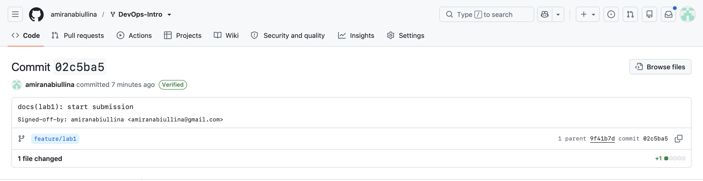

# Lab 1 submission


## Task 1 — SSH Commit Signing & QuickNotes

### Health endpoint
```json
{
    "notes": 4,
    "status": "ok"
}
```

### Notes endpoint
```json
[
    {
        "id": 1,
        "title": "Welcome to QuickNotes",
        "body": "This is the project you'll containerize, deploy, monitor, and harden across all 10 labs.",
        "created_at": "2026-01-15T10:00:00Z"
    },
    {
        "id": 2,
        "title": "Read app/main.go first",
        "body": "Start by understanding the entry point \u2014 env vars, signal handling, graceful shutdown.",
        "created_at": "2026-01-15T10:05:00Z"
    },
    {
        "id": 3,
        "title": "DevOps mantra",
        "body": "If it hurts, do it more often.",
        "created_at": "2026-01-15T10:10:00Z"
    },
    {
        "id": 4,
        "title": "Endpoint cheat-sheet",
        "body": "GET /notes  GET /notes/{id}  POST /notes  DELETE /notes/{id}  GET /health  GET /metrics",
        "created_at": "2026-01-15T10:15:00Z"
    }
]
```
### POST /notes
```json
{
    "id": 5,
    "title": "hello",
    "body": "first POST",
    "created_at": "2026-09-07T12:15:19.605636Z"
}
```
### Signed commit verification
```text
commit 02c5ba5e81c61cb5f6c0cd3dd2cc18336cbbcda9 (HEAD -> feature/lab1, origin/feature/lab1)
Good "git" signature for amiranabiullina@gmail.com with ED25519 key SHA256:/aeVaD5vxRqKdTCmMabybyKD+h3zw0Z9mHjgJYEp+hM
Author: amiranabiullina <amiranabiullina@gmail.com>
Date:   Mon Sep 7 15:22:01 2026 +0300

    docs(lab1): start submission
    
    Signed-off-by: amiranabiullina <amiranabiullina@gmail.com>
 ```

### Verified commit


### Why signed commits matter
Signed commits help verify that a commit was created by the expected developer and has not been impersonated. The xz-utils story discussed in Lecture 1 shows why software supply-chain trust and contributor identity are important. Commit signing provides an additional layer of verification when reviewing changes.


