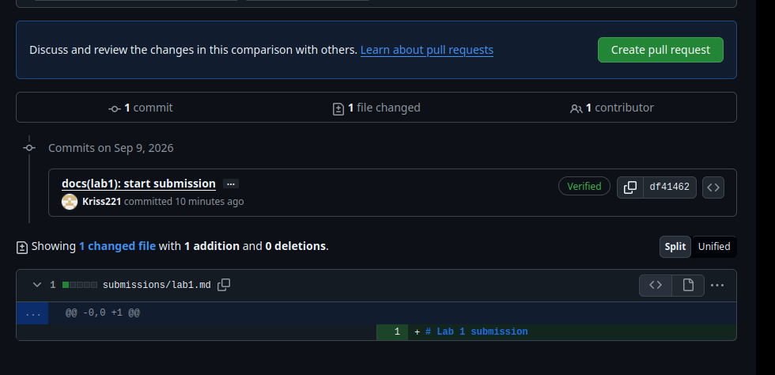
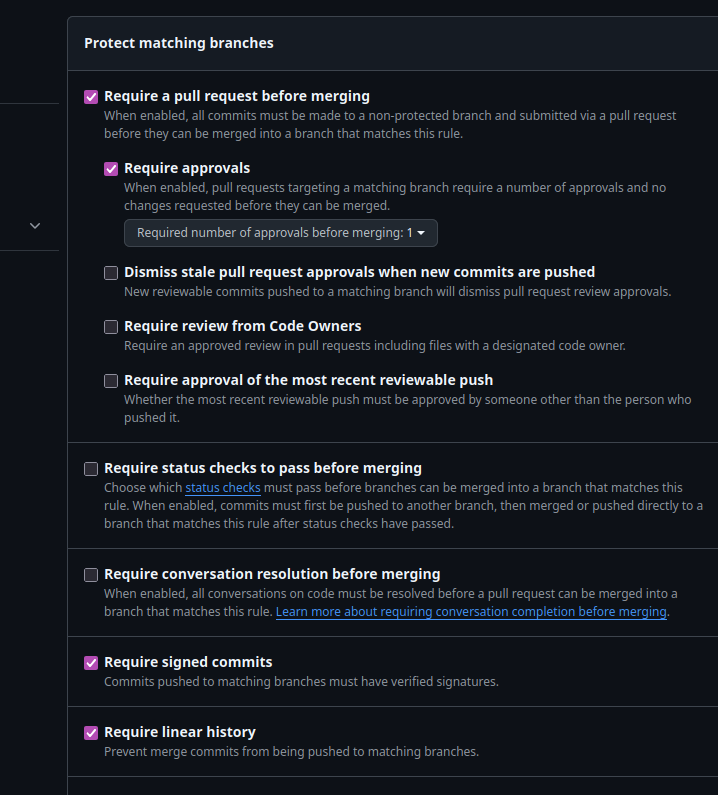

# Lab 1 submission

## First output

{
    "notes": 4,
    "status": "ok"
}
[
    {
        "id": 1,
        "title": "Welcome to QuickNotes",
        "body": "This is the project you'll containerize, deploy, monitor, and harden across all 10 labs.",
        "created_at": "2026-01-15T10:00:00Z"
    },
    {
        "id": 2,
        "title": "Read app/main.go first",
        "body": "Start by understanding the entry point \u2014 env vars, signal handling, graceful shutdown.",
        "created_at": "2026-01-15T10:05:00Z"
    },
    {
        "id": 3,
        "title": "DevOps mantra",
        "body": "If it hurts, do it more often.",
        "created_at": "2026-01-15T10:10:00Z"
    },
    {
        "id": 4,
        "title": "Endpoint cheat-sheet",
        "body": "GET /notes  GET /notes/{id}  POST /notes  DELETE /notes/{id}  GET /health  GET /metrics",
        "created_at": "2026-01-15T10:15:00Z"
    }
]
{
    "id": 5,
    "title": "hello",
    "body": "first POST",
    "created_at": "2026-09-09T14:06:49.376774855Z"
}

## SSH commit signature

commit df41462e1d3dc5765a2ab3a6016a25e4d5e608f9 (HEAD -> feature/lab1)
Good "git" signature for k.soloveva@innopolis.university with ED25519 key SHA256:U8gMwP7jZA2a0xvvr82zZnQrDYqHcYPaF+WVWnRGndM
Author: kriss <kristinsoll221@gmail.com>
Date:   Wed Sep 9 17:54:26 2026 +0300

    docs(lab1): start submission
    
    Signed-off-by: kriss <k.soloveva@innopolis.university>
    Signed-off-by: kriss <kristinsoll221@gmail.com>

## Screen


## Summary
Signed commits help ensure that commit was created by the intended developer and not by someone else. This is important for ensuring the seccurity of the software supply chain  as trusted repositories can become targets for attackers/hackers. The xz-utils case demonstrated how dangerous compromised or malicious changes can be in widely used open‑source software

## GitHub Community

Adding repositories to favorites helps preserve useful open‑source projects and also increases their visibility in the community. Subscribing to developers allows me to stay informed about their work, learn about new projects, and build connections for future collaboration

## Bonus Task — Branch Protection

### Branch protection rules



The `main` branch is protected with:
- Require a pull request before merging
- Require signed commits
- Require linear history

### Unsigned push rejection

```text
remote: error: GH006: Protected branch update failed for refs/heads/main.
remote:
remote: - Commits must have verified signatures.
remote:   Found 1 violation:
remote:
remote: - Changes must be made through a pull request.
To github.com:Kriss221/DevOps-Intro.git
 ! [remote rejected] main -> main (protected branch hook declined)
error: failed to push some refs to 'github.com:Kriss221/DevOps-Intro.git'

If Knight Capital used branch protection and required signing commits in the deployment working branch, direct unedited changes could be blocked before they reach the production environment. Requiring pull requests would add a review stage, and signed commits would increase accountability and traceability. These measures could reduce the risk of deploying unintended or unverified changes. They would not guarantee that all deployment errors would be prevented, but they would significantly complicate the introduction of unsafe direct changes.