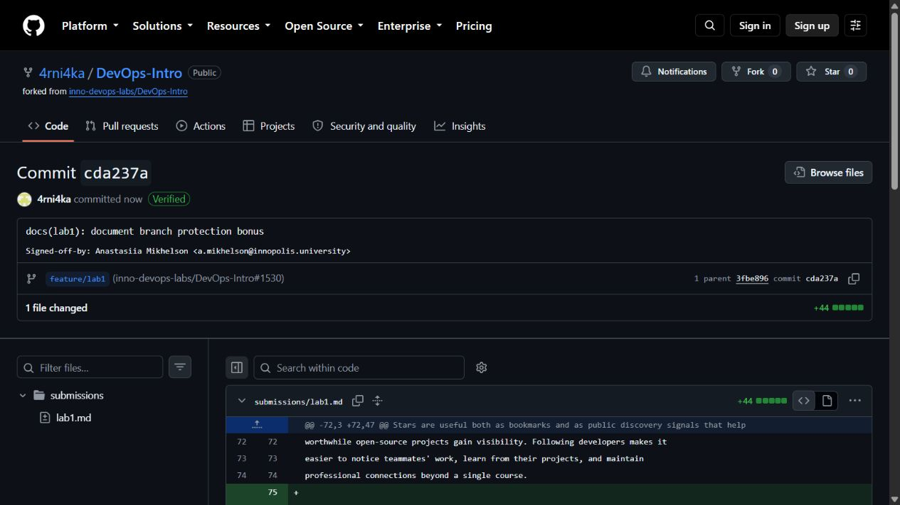
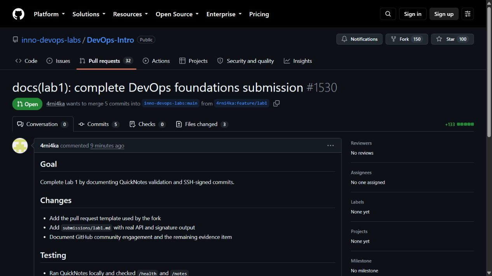

# Lab 1 submission

## Task 1 — SSH commit signing and QuickNotes

### Environment

```text
git version 2.50.0.windows.1
go version go1.27.0 windows/amd64
OpenSSH_for_Windows_9.5p2, LibreSSL 3.8.2
```

Port 8080 was already occupied on this workstation, so I ran the unchanged
application with `ADDR=127.0.0.1:18080` and used that port for the checks below.

### QuickNotes API output

```console
$ curl -s http://127.0.0.1:18080/health
{"notes":4,"status":"ok"}

$ curl -s http://127.0.0.1:18080/notes
[{"id":1,"title":"Welcome to QuickNotes","body":"This is the project you'll containerize, deploy, monitor, and harden across all 10 labs.","created_at":"2026-01-15T10:00:00Z"},{"id":2,"title":"Read app/main.go first","body":"Start by understanding the entry point — env vars, signal handling, graceful shutdown.","created_at":"2026-01-15T10:05:00Z"},{"id":3,"title":"DevOps mantra","body":"If it hurts, do it more often.","created_at":"2026-01-15T10:10:00Z"},{"id":4,"title":"Endpoint cheat-sheet","body":"GET /notes  GET /notes/{id}  POST /notes  DELETE /notes/{id}  GET /health  GET /metrics","created_at":"2026-01-15T10:15:00Z"}]

$ curl -s -X POST http://127.0.0.1:18080/notes -H "Content-Type: application/json" -d '{"title":"hello","body":"first POST"}'
{"id":5,"title":"hello","body":"first POST","created_at":"2026-09-10T19:55:40.8095705Z"}

$ curl -s http://127.0.0.1:18080/notes
[{"id":1,"title":"Welcome to QuickNotes","body":"This is the project you'll containerize, deploy, monitor, and harden across all 10 labs.","created_at":"2026-01-15T10:00:00Z"},{"id":2,"title":"Read app/main.go first","body":"Start by understanding the entry point — env vars, signal handling, graceful shutdown.","created_at":"2026-01-15T10:05:00Z"},{"id":3,"title":"DevOps mantra","body":"If it hurts, do it more often.","created_at":"2026-01-15T10:10:00Z"},{"id":4,"title":"Endpoint cheat-sheet","body":"GET /notes  GET /notes/{id}  POST /notes  DELETE /notes/{id}  GET /health  GET /metrics","created_at":"2026-01-15T10:15:00Z"},{"id":5,"title":"hello","body":"first POST","created_at":"2026-09-10T19:55:40.8095705Z"}]
```

The first list contains four seed notes; after the POST it contains five.

### Signed commit verification

```console
$ git log --show-signature -1
commit 4b26bf388f1a8ebcf8779d09ec85c942934cf321
Good "git" signature for a.mikhelson@innopolis.university with ED25519 key SHA256:qAmJ3kpUCV9WcYg5PdEFfFrrlzE0FCCV6eNjYjGoKwQ
Author: Anastasiia Mikhelson <a.mikhelson@innopolis.university>
Date:   Fri Sep 11 00:56:45 2026 +0500

    docs(lab1): start submission

    Signed-off-by: Anastasiia Mikhelson <a.mikhelson@innopolis.university>
```

Signed commits bind an identity and key to an exact commit object, making silent
history tampering easier to detect. The xz-utils incident in March 2024 showed
how much damage a patient supply-chain attacker can cause; verified provenance
does not replace review, but it gives reviewers and release systems a stronger
signal about who authorized each change.

GitHub reports the commits as `verified: true` with reason `valid`, and the
public commit page displays the **Verified** badge:



## Task 2 — Pull request template

The template is committed on the fork's `main` branch at
`.github/pull_request_template.md`. It contains Goal, Changes, Testing, and a
three-item checklist. This submission and the template were tested with signed
commits and `git log --show-signature`.



## Task 3 — GitHub Community

The course repository and `simple-container-com/api` are starred. GitHub API
checks also confirm that the account follows `Cre-eD`, `Naghme98`, and
`pierrepicaud`. The three required classmates will be recorded here once their
GitHub usernames are known.

Stars are useful both as bookmarks and as public discovery signals that help
worthwhile open-source projects gain visibility. Following developers makes it
easier to notice teammates' work, learn from their projects, and maintain
professional connections beyond a single course.

## Bonus — Branch protection

The fork's `main` branch has the following enforced settings:

```json
{
  "enforce_admins": {"enabled": true},
  "required_linear_history": {"enabled": true},
  "required_pull_request_reviews": {"required_approving_review_count": 0},
  "required_signatures": {"enabled": true}
}
```

An unsigned empty commit was created locally and rejected by GitHub:

```console
$ git commit --no-gpg-sign -s --allow-empty -m "test: unsigned commit (should fail)"
[main 98133e1] test: unsigned commit (should fail)

$ git push origin main
remote: error: GH006: Protected branch update failed for refs/heads/main.
remote:
remote: - Commits must have verified signatures.
remote:   Found 1 violation:
remote:
remote:   98133e1f0f8003f3aa19815063ed2d7e42edb118
remote:
remote: - Changes must be made through a pull request.
! [remote rejected] main -> main (protected branch hook declined)
error: failed to push some refs to 'https://github.com/4rni4ka/DevOps-Intro.git'
```

The rejected local commit was removed with `git reset --hard origin/main`, and
global commit signing remains enabled. A screenshot of the protection settings
page will be added after interactive GitHub web authorization is completed.

At Knight Capital, a protected production branch would have forced the change
through a reviewable pull request instead of allowing an ad-hoc direct update.
Required signatures would have established who authorized each production
change, while linear history would have made the deployed sequence easier to
audit. These controls would not by themselves detect dormant code on one of the
servers, but they could have stopped or slowed the uncontrolled rollout long
enough for review and verification.
