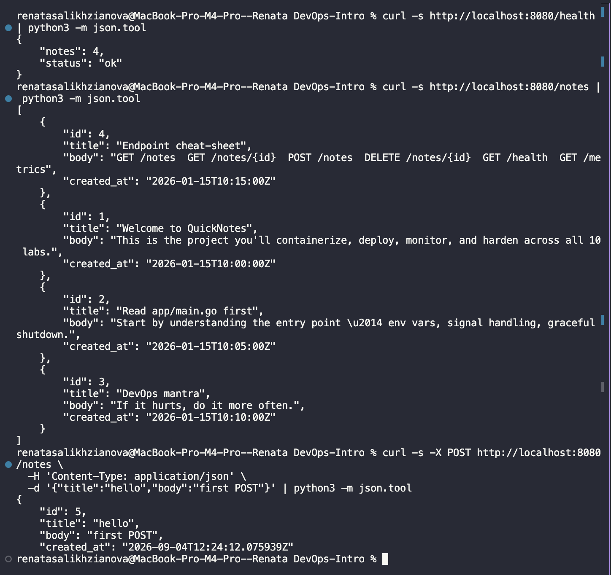
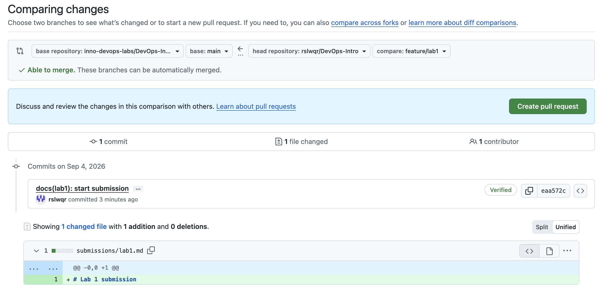

# Lab 1 submission
## Task 1 — QuickNotes and Signed Commits

### QuickNotes
I ran QuickNotes locally and tested the required endpoints

#### GET /health

```json

{

    "notes": 4,

    "status": "ok"

}

```

#### GET /notes

```json

[

    {

        "id": 4,

        "title": "Endpoint cheat-sheet",

        "body": "GET /notes  GET /notes/{id}  POST /notes  DELETE /notes/{id}  GET /health  GET /metrics",

        "created_at": "2026-01-15T10:15:00Z"

    },

    {

        "id": 1,

        "title": "Welcome to QuickNotes",

        "body": "This is the project you'll containerize, deploy, monitor, and harden across all 10 labs.",

        "created_at": "2026-01-15T10:00:00Z"

    },

    {

        "id": 2,

        "title": "Read app/main.go first",

        "body": "Start by understanding the entry point — env vars, signal handling, graceful shutdown.",

        "created_at": "2026-01-15T10:05:00Z"

    },

    {

        "id": 3,

        "title": "DevOps mantra",

        "body": "If it hurts, do it more often.",

        "created_at": "2026-01-15T10:10:00Z"

    }

]

```

#### POST /notes

```json

{

    "id": 5,

    "title": "hello",

    "body": "first POST",

    "created_at": "2026-09-04T12:24:12.075939Z"

}

```

Screenshot of the curl output:



### Commit Signature

Output of `git log --show-signature -1`:

```text

commit eaa572c8de3d7ddf8424d698a4bbf1eba5f020c9

Good "git" signature for reny.zel@mail.ru with ED25519 key SHA256:VaUm+fcb8tsKSbhThnrXU1LNuh7A6H9ojNi8OyAD82U

Author: Renata Salikhzyanova <reny.zel@mail.ru>

Date:   Fri Sep 4 15:32:54 2026 +0300

    docs(lab1): start submission

    Signed-off-by: Renata Salikhzyanova <reny.zel@mail.ru>

```

Screenshot of the Verified badge:



### Why Signed Commits Matter

Signed commits help verify who actually created a commit and make it harder to impersonate another developer. The xz-utils incident in March 2024 showed how trust in maintainers can be abused to introduce malicious changes into widely used software. Signing does not prevent such attacks by itself, but it makes the origin of changes easier to verify