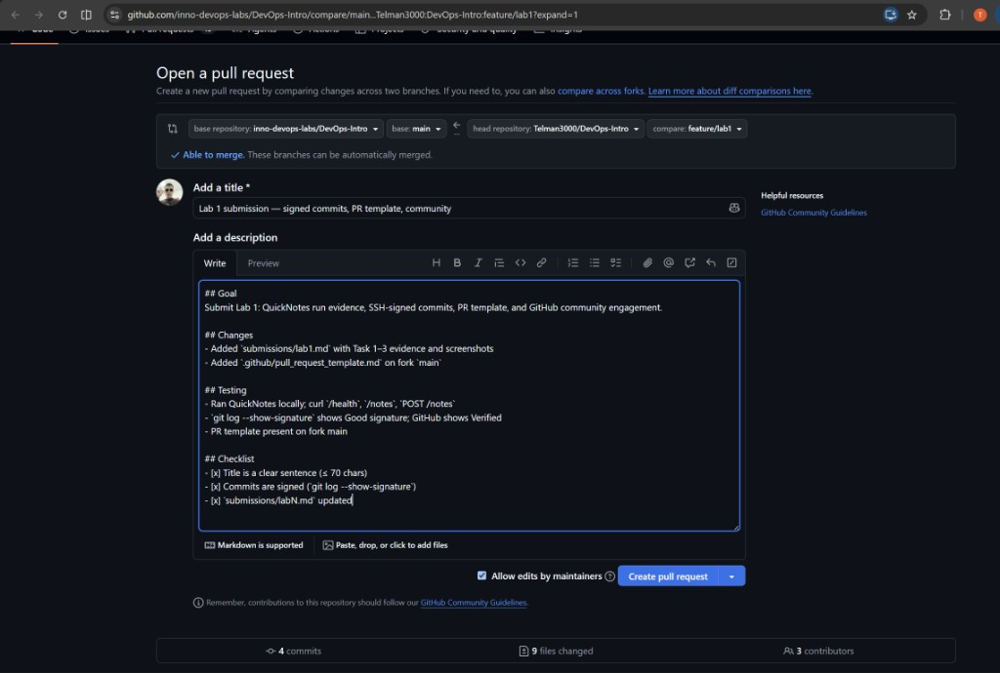
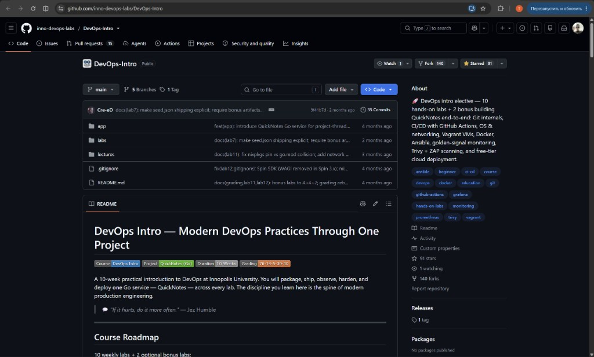
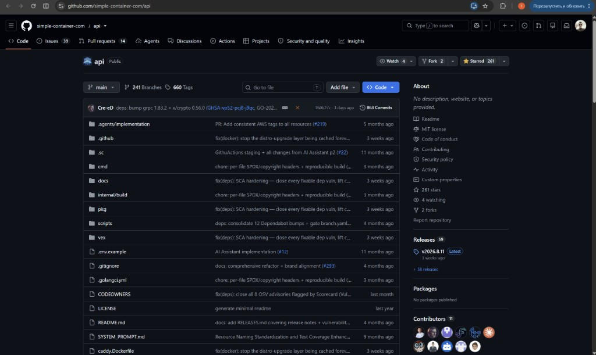
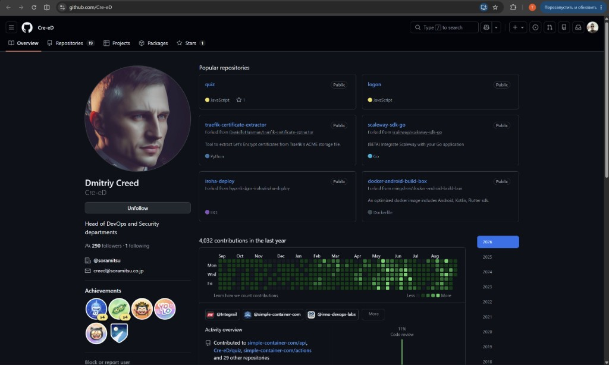
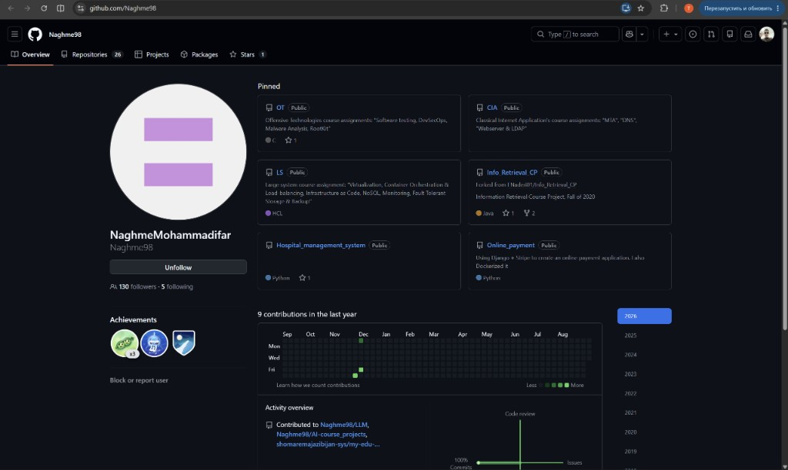
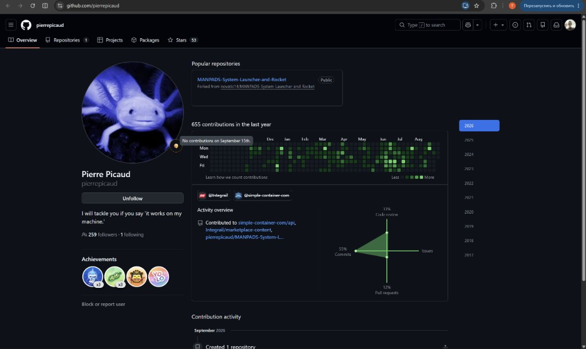
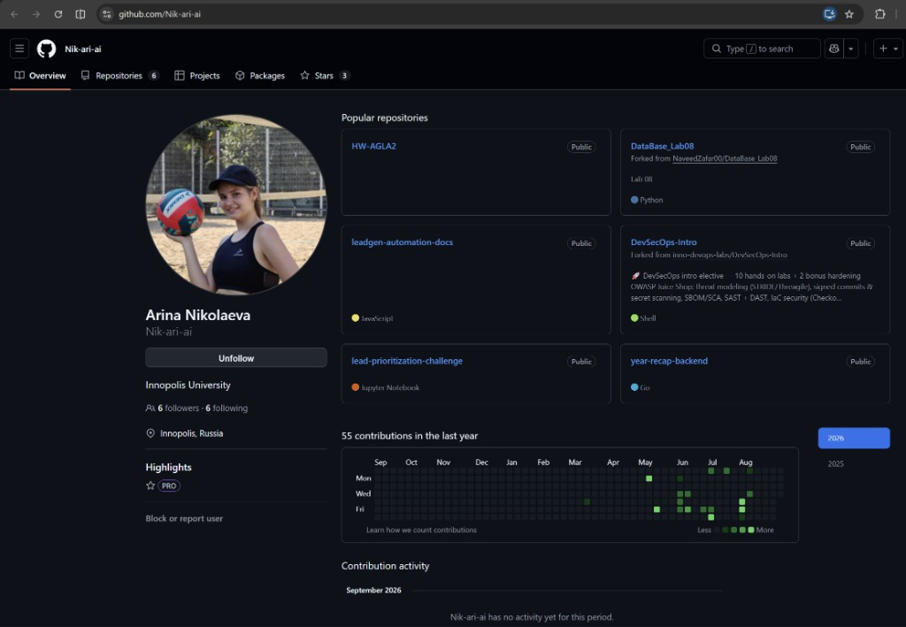
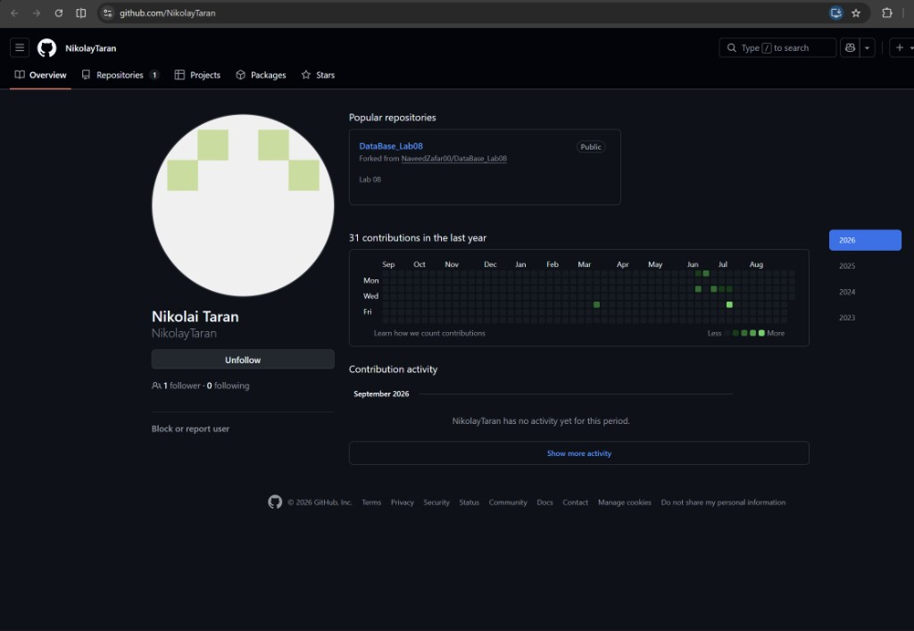
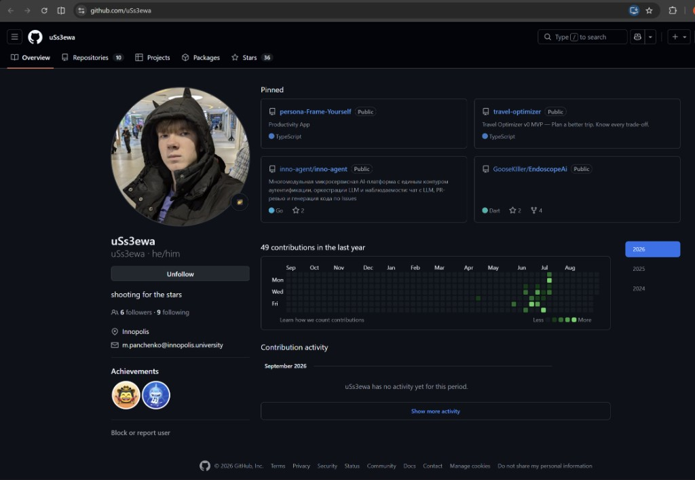

# Lab 1 submission

Author: Telman Nuruzov (`Telman3000`)
Branch: `feature/lab1`
Fork: https://github.com/Telman3000/DevOps-Intro

---

## Task 1 — QuickNotes + SSH signed commits

### 1.2 QuickNotes curl output

**GET /health**

```text
{"notes":4,"status":"ok"}
```

**GET /notes**

```text
[{"id":1,"title":"Welcome to QuickNotes","body":"This is the project you'll containerize, deploy, monitor, and harden across all 10 labs.","created_at":"2026-01-15T10:00:00Z"},{"id":2,"title":"Read app/main.go first","body":"Start by understanding the entry point — env vars, signal handling, graceful shutdown.","created_at":"2026-01-15T10:05:00Z"},{"id":3,"title":"DevOps mantra","body":"If it hurts, do it more often.","created_at":"2026-01-15T10:10:00Z"},{"id":4,"title":"Endpoint cheat-sheet","body":"GET /notes  GET /notes/{id}  POST /notes  DELETE /notes/{id}  GET /health  GET /metrics","created_at":"2026-01-15T10:15:00Z"}]
```

**POST /notes** (PowerShell: JSON via temp file because curl quoting differs from bash)

```text
{"id":7,"title":"hello","body":"first POST","created_at":"2026-09-09T20:05:57.6840145Z"}
```

**GET /health after POST**

```text
{"notes":7,"status":"ok"}
```

Notes: seed data starts at 4 notes; additional POSTs during debugging raised the count to 7.

### 1.4 Signed commit verification

```text
commit e9262733e3bcc6994989db44caf0688c5b5546e2
Good "git" signature for telmannuruzov364@gmail.com with ED25519 key SHA256:D/h04PtvQMmjzUnLOj+qSeOLLrksAeYOk4PLy/FCJ0s
Author: Telman Nuruzov <telmannuruzov364@gmail.com>
Date:   Wed Sep 9 23:24:04 2026 +0300

    docs(lab1): start submission

    Signed-off-by: Telman Nuruzov <telmannuruzov364@gmail.com>
```

**Verified badge on GitHub:**
https://github.com/Telman3000/DevOps-Intro/commit/e9262733e3bcc6994989db44caf0688c5b5546e2


### Why signed commits matter

Anyone can set an arbitrary `user.name` / `user.email` in Git, so unsigned history is unauthenticated. The March 2024 xz-utils incident showed how a long-running social-engineering attack on a maintainer nearly planted a backdoor in a critical Linux dependency used by SSH. Signed commits (SSH signing since Git 2.34) cryptographically bind a commit to a key you control, so reviewers can trust provenance instead of only trusting the displayed author string.

---

## Task 2 — PR template + first PR

### PR template on `main`

Added `.github/pull_request_template.md` to the fork default branch (`main`) so new PRs auto-populate structured sections.

- File: https://github.com/Telman3000/DevOps-Intro/blob/main/.github/pull_request_template.md
- Commit: `f5d463e` — `docs: add PR template` (signed)

Template sections: Goal, Changes, Testing, Checklist (title clarity, signed commits, `submissions/labN.md` updated).

### Lab PR

Opened: [`Telman3000:feature/lab1` -> `inno-devops-labs/DevOps-Intro:main`](https://github.com/inno-devops-labs/DevOps-Intro/pull/1515)

- PR URL: https://github.com/inno-devops-labs/DevOps-Intro/pull/1515
- Description filled with Goal / Changes / Testing / Checklist (template sections; filled manually because cross-fork PRs load the base-repo template)



---

## Task 3 — GitHub community engagement

### Stars

- Starred course repo `inno-devops-labs/DevOps-Intro`
- Starred `simple-container-com/api`





### Follows — professor and TAs

- [@Cre-eD](https://github.com/Cre-eD) (professor)
- [@Naghme98](https://github.com/Naghme98) (TA)
- [@pierre-picaud](https://github.com/pierre-picaud) (TA)







### Follows — classmates

- [@Nik-ari-ai](https://github.com/Nik-ari-ai)
- [@NikolayTaran](https://github.com/NikolayTaran)
- [@uSs3ewa](https://github.com/uSs3ewa)







### GitHub Community

Starring repositories bookmarks useful projects, signals support to maintainers, and helps others discover trusted tools. Following classmates, TAs, and the professor keeps you aware of shared work and builds the professional network that collaborative DevOps practice depends on.