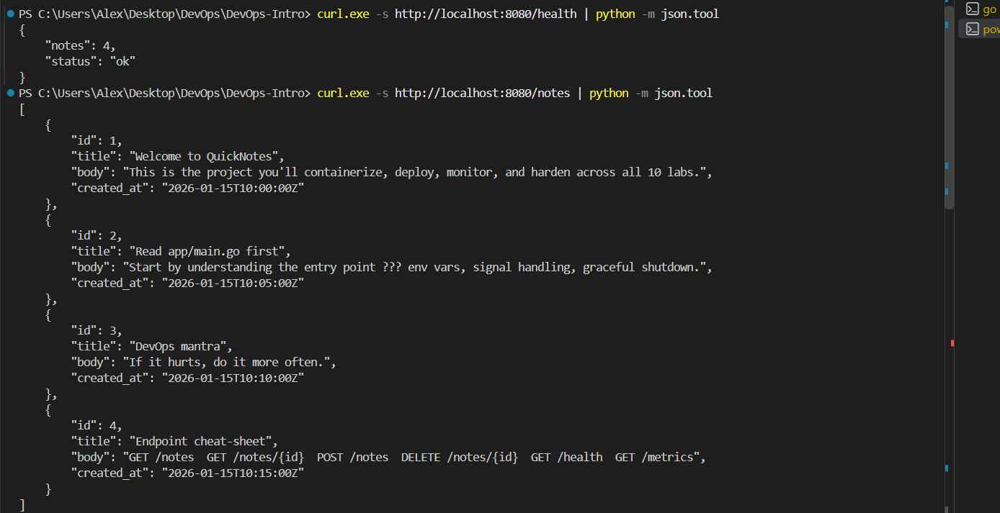
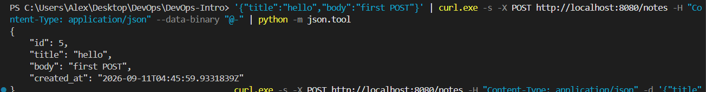
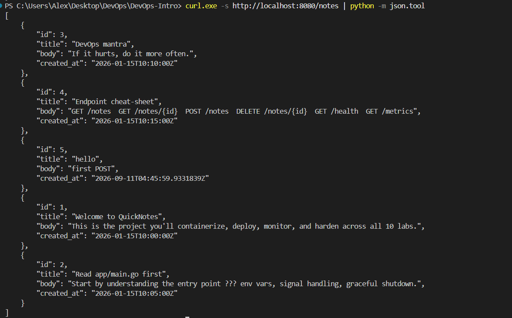
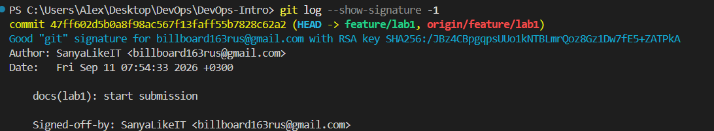
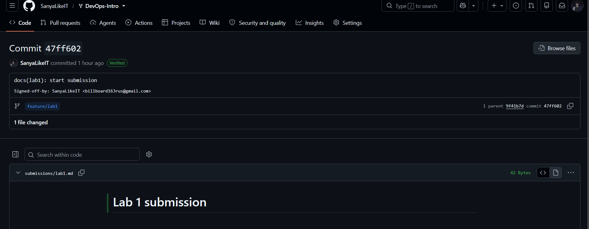
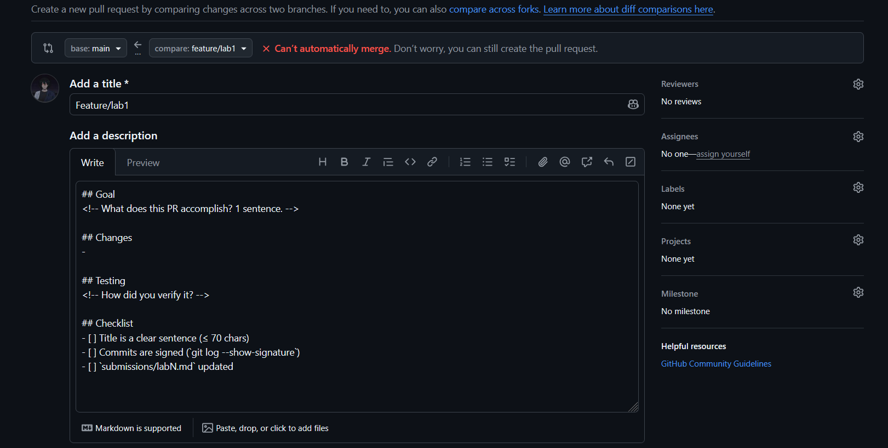

# Lab 1 submission
Signed commits help verify the identity of the person who created a commit and improve trust in the software supply chain. The xz-utils incident in March 2024 showed how dangerous compromised or malicious contributions can be, so verifying authorship and provenance is important. However, a valid signature does not guarantee that the code itself is safe, so code review and other security controls are still necessary.

## API checks

### Health check and initial notes

### Create a note

### List notes after creation

## Commit signature verification

### Local verification

### GitHub verification

## PR template

The PR template is not auto-populated when opening a pull request to the upstream course repository. In my own fork, the template works correctly and is auto-populated as expected.
