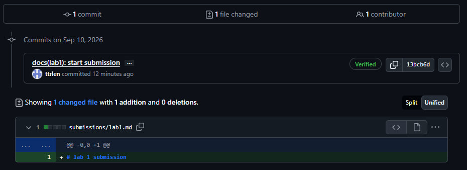
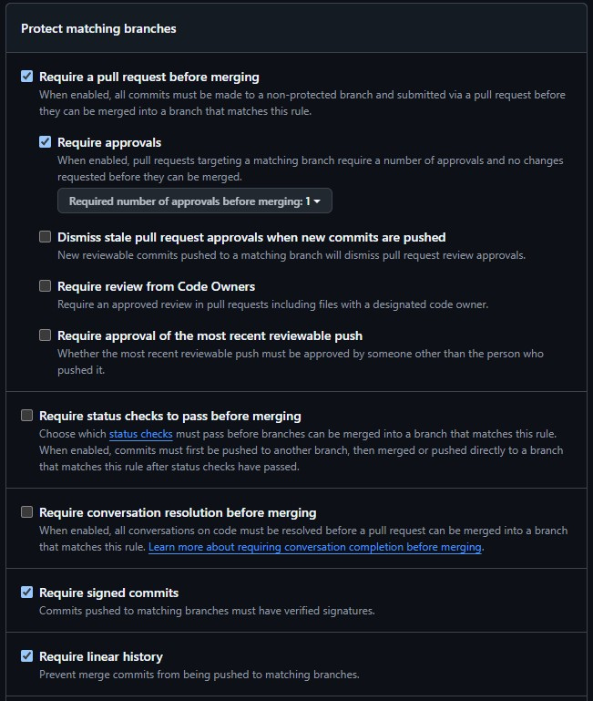

# Lab 1 submission

## Task 1 — SSH Commit Signing & QuickNotes

### Health Check

The QuickNotes application was started locally and the health endpoint was tested successfully.

```json
{
  "notes": 4,
  "status": "ok"
}
```

### Initial Notes

Before creating a new note, the `/notes` endpoint returned 4 existing notes:

```json
[
  {
    "id": 1,
    "title": "Welcome to QuickNotes",
    "body": "This is the project you'll containerize, deploy, monitor, and harden across all 10 labs.",
    "created_at": "2026-01-15T10:00:00Z"
  },
  {
    "id": 2,
    "title": "Read app/main.go first",
    "body": "Start by understanding the entry point — env vars, signal handling, graceful shutdown.",
    "created_at": "2026-01-15T10:05:00Z"
  },
  {
    "id": 3,
    "title": "DevOps mantra",
    "body": "If it hurts, do it more often.",
    "created_at": "2026-01-15T10:10:00Z"
  },
  {
    "id": 4,
    "title": "Endpoint cheat-sheet",
    "body": "GET /notes  GET /notes/{id}  POST /notes  DELETE /notes/{id}  GET /health  GET /metrics",
    "created_at": "2026-01-15T10:15:00Z"
  }
]
```

### POST Request

A new note was created using the `POST /notes` endpoint:

```json
{
  "id": 5,
  "title": "hello",
  "body": "first POST",
  "created_at": "2026-09-10T11:39:08.2643786Z"
}
```

After the POST request, the `/notes` endpoint returned 5 notes, which confirms that the new note was added successfully.

```json
[
  {
    "id": 1,
    "title": "Welcome to QuickNotes",
    "body": "This is the project you'll containerize, deploy, monitor, and harden across all 10 labs.",
    "created_at": "2026-01-15T10:00:00Z"
  },
  {
    "id": 2,
    "title": "Read app/main.go first",
    "body": "Start by understanding the entry point — env vars, signal handling, graceful shutdown.",
    "created_at": "2026-01-15T10:05:00Z"
  },
  {
    "id": 3,
    "title": "DevOps mantra",
    "body": "If it hurts, do it more often.",
    "created_at": "2026-01-15T10:10:00Z"
  },
  {
    "id": 4,
    "title": "Endpoint cheat-sheet",
    "body": "GET /notes  GET /notes/{id}  POST /notes  DELETE /notes/{id}  GET /health  GET /metrics",
    "created_at": "2026-01-15T10:15:00Z"
  },
  {
    "id": 5,
    "title": "hello",
    "body": "first POST",
    "created_at": "2026-09-10T11:39:08.2643786Z"
  }
]
```

### Signed Commit Verification

SSH commit signing was configured successfully. The latest commit was verified locally using `git log --show-signature -1`.

```text
commit 13bcb6d64c9d7c707274143245db198f2ca44b67 (HEAD -> feature/lab1)
Good "git" signature for e.tuturina@innopolis.university with RSA key SHA256:58a0VfUddYu80cRXN0pwferyuQEnlBBm5v/CWZ31xSU
Author: ttrlen <e.tuturina@innopolis.university>
Date:   Thu Sep 10 14:54:28 2026 +0300

    docs(lab1): start submission

    Signed-off-by: ttrlen <e.tuturina@innopolis.university>
```

### Verified Commit

The commit also appears as **Verified** on GitHub:



### Why Signed Commits Matter

Signed commits help verify that a commit was actually created by the expected developer and was not impersonated by another person. The xz-utils incident discussed in Lecture 1 showed how dangerous software supply-chain attacks can be, especially when malicious changes reach widely used infrastructure. Commit signing adds another layer of trust by making the authorship of changes verifiable.

## Task 3 — GitHub Community

Starring repositories makes useful open-source projects easier to find again and also helps increase their visibility in the developer community. Following developers helps me discover their work, stay aware of projects my classmates and colleagues contribute to, and makes future collaboration easier.

### Branch Protection Rules

The `main` branch is protected with required pull requests, signed commits, and linear history.

