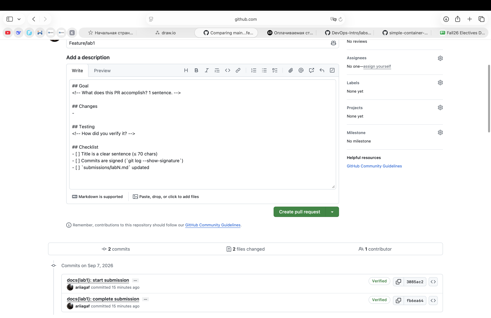
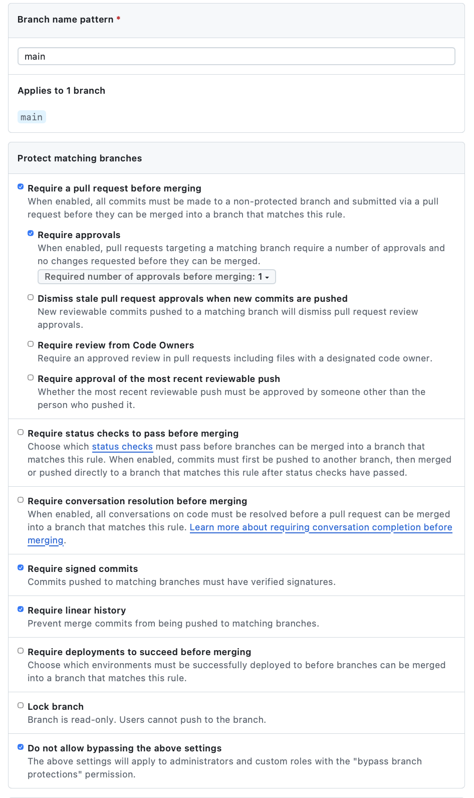

# Lab 1 submission

## Smoke Test

### Health endpoint

```json
{
    "notes": 4,
    "status": "ok"
}
```

### Get notes

```json
[
    {
        "id": 1,
        "title": "Welcome to QuickNotes",
        "body": "This is the project you'll containerize, deploy, monitor, and harden across all 10 labs.",
        "created_at": "2026-01-15T10:00:00Z"
    },
    {
        "id": 2,
        "title": "Read app/main.go first",
        "body": "Start by understanding the entry point — env vars, signal handling, graceful shutdown.",
        "created_at": "2026-01-15T10:05:00Z"
    },
    {
        "id": 3,
        "title": "DevOps mantra",
        "body": "If it hurts, do it more often.",
        "created_at": "2026-01-15T10:10:00Z"
    },
    {
        "id": 4,
        "title": "Endpoint cheat-sheet",
        "body": "GET /notes  GET /notes/{id}  POST /notes  DELETE /notes/{id}  GET /health  GET /metrics",
        "created_at": "2026-01-15T10:15:00Z"
    }
]
```

### Create note

```json
{
    "id": 5,
    "title": "hello",
    "body": "first POST",
    "created_at": "2026-09-07T18:47:18.309503Z"
}
```

## Signed Commit

The commit was signed using an SSH ED25519 key.

```text
commit f28c548c8a5aca241aa4fe6fc24e4ce92a27aecc
Good "git" signature for agafonova_arina@icloud.com with ED25519 key SHA256:IrCUPC4DTS87Y/H7GEphaSNlZoYPZJH7jOFCI0C1SPY
Author: Ari Agafonova <agafonova_arina@icloud.com>
Date: Mon Sep 7 21:54:57 2026 +0300

    docs(lab1): start submission

    Signed-off-by: Ari Agafonova <agafonova_arina@icloud.com>
```

GitHub also successfully verified the commit signature (`Verified`).

### GitHub Verification


Signed commits help verify that a commit was actually created by the expected developer and has not been impersonated. This is especially important in supply-chain incidents such as the xz-utils backdoor case from March 2024, where trust in contributors and changes to critical software became a major security concern. Verified signatures make repository history more trustworthy and make it harder to impersonate legitimate maintainers.

## Pull Request Template

The pull request template is stored in `.github/pull_request_template.md` on the `main` branch.

The template was tested using a draft pull request and auto-populated successfully.



## GitHub Community

Starring repositories helps bookmark useful open-source projects and also increases their visibility within the community. Following developers makes it easier to discover their work, stay aware of classmates' and teammates' activity, and build professional connections for future collaboration.

## Bonus — Branch Protection

The `main` branch is protected with the following rules:
- Require signed commits
- Require a pull request before merging
- Require linear history



### Unsigned Push Rejection

```text
remote: error: GH006: Protected branch update failed for refs/heads/main.
remote: - Commits must have verified signatures.
remote: - Changes must be made through a pull request.
```

The rejected commit was:

```text
26e69a47a3f9b886cc6b663a5e499b048f625a85
```

### Reflection

If Knight Capital had used branch protection and required signed commits on its production deployment branch, engineers would not have been able to push arbitrary changes directly into the production path. A pull request requirement could have forced an additional review step before deployment, while signed commits would have provided stronger accountability for the exact changes being released. These controls would not guarantee that a faulty deployment could never happen, but they would have added friction and verification at a critical point in the release process. In a high-risk production environment, that extra control could significantly reduce the chance of an uncontrolled deployment incident.