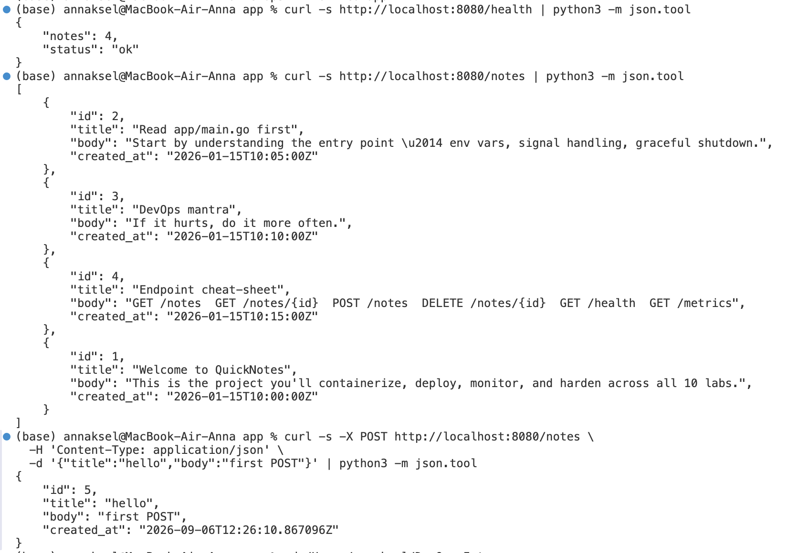
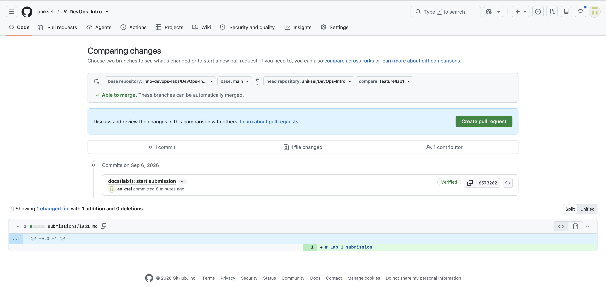

# Lab 1 submission

## Task 1 — SSH Commit Signing & First Signed Commit

### QuickNotes running locally

**GET /health**
```json
{
    "notes": 4,
    "status": "ok"
}
```

**GET /notes**
```json
[
    {
        "id": 2,
        "title": "Read app/main.go first",
        "body": "Start by understanding the entry point — env vars, signal handling, graceful shutdown.",
        "created_at": "2026-01-15T10:05:00Z"
    },
    {
        "id": 3,
        "title": "DevOps mantra",
        "body": "If it hurts, do it more often.",
        "created_at": "2026-01-15T10:10:00Z"
    },
    {
        "id": 4,
        "title": "Endpoint cheat-sheet",
        "body": "GET /notes  GET /notes/{id}  POST /notes  DELETE /notes/{id}  GET /health  GET /metrics",
        "created_at": "2026-01-15T10:15:00Z"
    },
    {
        "id": 1,
        "title": "Welcome to QuickNotes",
        "body": "This is the project you'll containerize, deploy, monitor, and harden across all 10 labs.",
        "created_at": "2026-01-15T10:00:00Z"
    }
]
```

**POST /notes**
```json
{
    "id": 5,
    "title": "hello",
    "body": "first POST",
    "created_at": "2026-09-06T12:26:10.867096Z"
}
```

**Screenshot of curl requests:**



### Signed commit verification

```
commit 6573262befb92969aeddee8ba64731ea56ef6518 (HEAD -> feature/lab1)
Good "git" signature for ka053384@gmail.com with ED25519 key SHA256:PfZuKut9SWOlrADPY4jUleInLSXW48nZoUHKhqa84Uw
Author: Anna Ksel <ka053384@gmail.com>
Date:   Sun Sep 6 15:30:41 2026 +0300

    docs(lab1): start submission

    Signed-off-by: Anna Ksel <ka053384@gmail.com>
```

Screenshot of the "Verified" badge on GitHub:



### Why signed commits matter

In March 2024, a backdoor was discovered in the xz-utils library, planted by a contributor who had spent years earning the maintainers' trust before slipping malicious code into a release. Signed commits help verify that a change genuinely came from the author it claims to be from, making this kind of supply-chain attack harder to pull off and easier to trace after the fact.

## Task 2 — Pull Request Template & First PR

_(to be filled in)_

## Task 3 — GitHub Community Engagement

Completed:
- Starred the course repository ([inno-devops-labs/DevOps-Intro](https://github.com/inno-devops-labs/DevOps-Intro))
- Starred [simple-container-com/api](https://github.com/simple-container-com/api)
- Followed the professor ([@Cre-eD](https://github.com/Cre-eD)) and TAs ([@Naghme98](https://github.com/Naghme98), [@pierrepicaud](https://github.com/pierrepicaud))
- Followed 3+ classmates from the course

### GitHub Community

Starring a repository is a lightweight way to bookmark useful projects and signal to maintainers that their work is valued and being watched by the community — star counts are also one of the first signals people use to judge whether an open-source project is trustworthy and active. Following other developers helps you keep track of what teammates and collaborators are building, makes it easier to discover their projects and contributions, and builds the kind of professional network that carries over from a classroom setting into future team and open-source work.

## Bonus Task — Branch Protection & Required Signed Commits

_(to be filled in, optional)_
