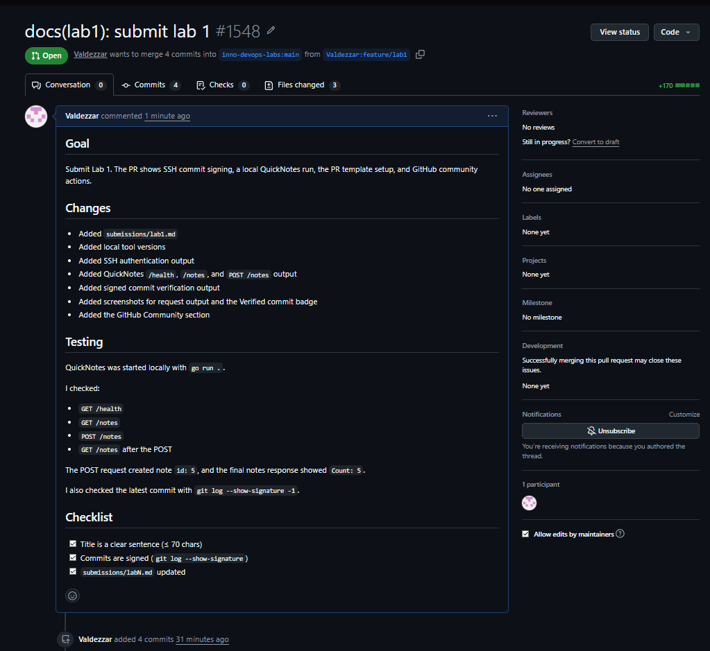

# Lab 1 submission

## Task 1: SSH commit signing and QuickNotes

### Local tools

```text
git version 2.51.0.windows.2
go version go1.27.0 windows/amd64
OpenSSH_for_Windows_9.5p1, LibreSSL 3.8.2
```

### SSH authentication

```text
Hi Valdezzar! You've successfully authenticated, but GitHub does not provide shell access.
```

### QuickNotes run

QuickNotes was started locally with `go run .`.

```text
2026/09/11 09:30:25 quicknotes listening on :8080 (notes loaded: 4)
```

### Health endpoint

```json
{
    "notes": 4,
    "status": "ok"
}
```

### Notes before POST

```json
[
    {
        "id": 1,
        "title": "Welcome to QuickNotes",
        "body": "This is the project you'll containerize, deploy, monitor, and harden across all 10 labs.",
        "created_at": "2026-01-15T10:00:00Z"
    },
    {
        "id": 2,
        "title": "Read app/main.go first",
        "body": "Start by understanding the entry point ??? env vars, signal handling, graceful shutdown.",
        "created_at": "2026-01-15T10:05:00Z"
    },
    {
        "id": 3,
        "title": "DevOps mantra",
        "body": "If it hurts, do it more often.",
        "created_at": "2026-01-15T10:10:00Z"
    },
    {
        "id": 4,
        "title": "Endpoint cheat-sheet",
        "body": "GET /notes  GET /notes/{id}  POST /notes  DELETE /notes/{id}  GET /health  GET /metrics",
        "created_at": "2026-01-15T10:15:00Z"
    }
]
```

### POST /notes

```json
{
    "id": 5,
    "title": "hello",
    "body": "first POST",
    "created_at": "2026-09-11T06:40:35.5049258Z"
}
```

### Notes after POST

```json
{
    "value": [
        {
            "id": 2,
            "title": "Read app/main.go first",
            "body": "Start by understanding the entry point — env vars, signal handling, graceful shutdown.",
            "created_at": "2026-01-15T10:05:00Z"
        },
        {
            "id": 3,
            "title": "DevOps mantra",
            "body": "If it hurts, do it more often.",
            "created_at": "2026-01-15T10:10:00Z"
        },
        {
            "id": 4,
            "title": "Endpoint cheat-sheet",
            "body": "GET /notes  GET /notes/{id}  POST /notes  DELETE /notes/{id}  GET /health  GET /metrics",
            "created_at": "2026-01-15T10:15:00Z"
        },
        {
            "id": 5,
            "title": "hello",
            "body": "first POST",
            "created_at": "2026-09-11T06:40:35.5049258Z"
        },
        {
            "id": 1,
            "title": "Welcome to QuickNotes",
            "body": "This is the project you'll containerize, deploy, monitor, and harden across all 10 labs.",
            "created_at": "2026-01-15T10:00:00Z"
        }
    ],
    "Count": 5
}
```

### Signed commit check

```text
commit 9a77c177743ed37028f7a324e7e4bda63b98c5a5 (HEAD -> feature/lab1)
Good "git" signature for rustamotatarian@gmail.com with ED25519 key SHA256:DCCGV8IMH/OoC2E1ZzKwwHSUCMVOBZ+DnFJJGr8esx4
Author: Valdezzar <rustamotatarian@gmail.com>
Date:   Fri Sep 11 09:43:39 2026 +0300

    docs(lab1): start submission

    Signed-off-by: Valdezzar <rustamotatarian@gmail.com>
```

### Why signed commits matter

Signed commits make it harder to fake who changed the code. After the xz-utils incident in March 2024, this matters because a trusted-looking commit can still be dangerous if nobody checks where it came from. The Verified badge gives reviewers a quick signal that the commit was signed by the expected developer key.

### Screenshots


## Task 2: Pull request template

The pull request template was added at `.github/pull_request_template.md` on the `main` branch.

The pull request description was filled from the template. It has the Goal, Changes, Testing, and Checklist sections.



## Task 3: GitHub Community

I starred the course repository and `simple-container-com/api`. I also followed the professor, the TAs, and at least three classmates.

Stars help me save useful repositories and show which projects are active or trusted. Following developers helps me see course work, team activity, and useful projects from people I work with.

## Bonus Task

Not attempted.
