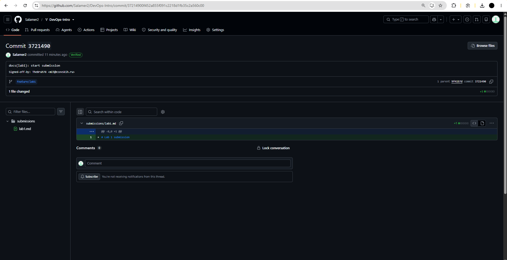
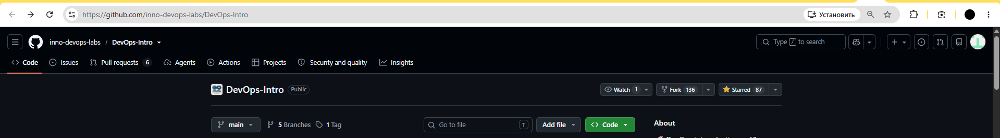
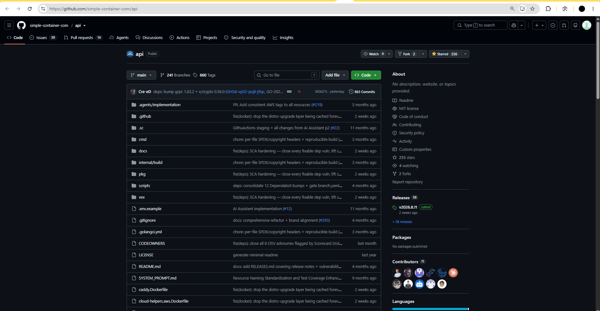
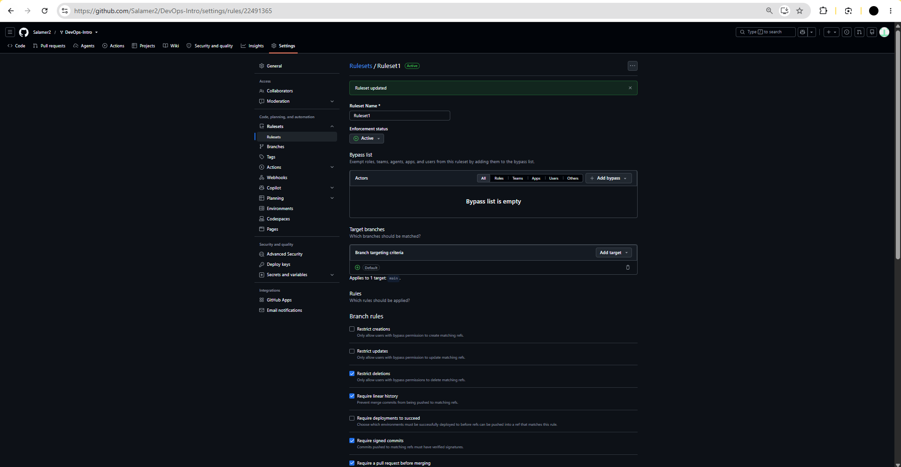
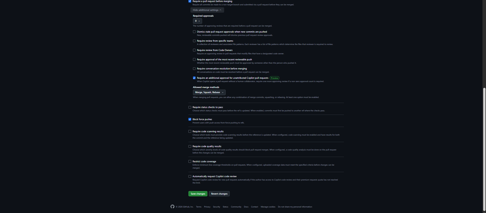

# Lab 1 submission

## Task 1. SSH Commit Signing & First Signed Commit

### QuickNotes
QuickNotes deployed successfully. All four commands executed as expected.

```
thebruh@thebruh-PC MINGW64 /
$ curl -s http://localhost:8080/health
echo
curl -s http://localhost:8080/notes
echo
curl -s -X POST http://localhost:8080/notes -H 'Content-Type: application/json' -d '{"title":"hello","body":"first POST"}'
echo
curl -s http://localhost:8080/notes
```

```
{"notes":4,"status":"ok"}
```

```
[{"id":1,"title":"Welcome to QuickNotes","body":"This is the project you'll containerize, deploy, monitor, and harden across all 10 labs.","created_at":"2026-01-15T10:00:00Z"},{"id":2,"title":"Read app/main.go first","body":"Start by understanding the entry point — env vars, signal handling, graceful shutdown.","created_at":"2026-01-15T10:05:00Z"},{"id":3,"title":"DevOps mantra","body":"If it hurts, do it more often.","created_at":"2026-01-15T10:10:00Z"},{"id":4,"title":"Endpoint cheat-sheet","body":"GET /notes  GET /notes/{id}  POST /notes  DELETE /notes/{id}  GET /health  GET /metrics","created_at":"2026-01-15T10:15:00Z"}]
```

```
{"id":5,"title":"hello","body":"first POST","created_at":"2026-09-07T22:12:28.9258683Z"}
```

```
[{"id":1,"title":"Welcome to QuickNotes","body":"This is the project you'll containerize, deploy, monitor, and harden across all 10 labs.","created_at":"2026-01-15T10:00:00Z"},{"id":2,"title":"Read app/main.go first","body":"Start by understanding the entry point — env vars, signal handling, graceful shutdown.","created_at":"2026-01-15T10:05:00Z"},{"id":3,"title":"DevOps mantra","body":"If it hurts, do it more often.","created_at":"2026-01-15T10:10:00Z"},{"id":4,"title":"Endpoint cheat-sheet","body":"GET /notes  GET /notes/{id}  POST /notes  DELETE /notes/{id}  GET /health  GET /metrics","created_at":"2026-01-15T10:15:00Z"},{"id":5,"title":"hello","body":"first POST","created_at":"2026-09-07T22:12:28.9258683Z"}]
```

### Signature

#### Verification
```
thebruh@thebruh-PC MINGW64 ~/Desktop/DevOpsCourse/DevOps-Intro (feature/lab1)
$ git log --show-signature -1
commit 37214900f452a855f091c2218d1fb35c2a560c00 (HEAD -> feature/lab1)
Good "git" signature for mit@ezovskih.ru with ED25519 key SHA256:+QEfxZR/v3MFcTTPH80A22V01jea3eqxxefeMcPFa0U
Author: TheBruh78 <mit@ezovskih.ru>
Date:   Tue Sep 8 01:31:49 2026 +0300

    docs(lab1): start submission

    Signed-off-by: TheBruh78 <mit@ezovskih.ru>
```



#### Why signing commits is important?
Signed commit prove that it actually came from its claimed author. For example, during xz-utils
incident the attacker "Jia Tan" commited a malicious code after years of social engineering and building trust, even though his commits were signed. While signing the commits doesn't prevent such attacks, it prevents framing other people. In xz-utils case, all Jia Tan changes were clearly documented as their.

## Task 2. Pull Request Template & First PR
Pull request template was succesfully created and is located at `.github/pull_request_template.md`

## Task 3. GitHub Community Engagement
### What was done
- Starred the course
- Starred simple-container-com/api project
- Followed Professor @Cre-eD, TA @Naghme98, TA @pierrepicaud
- Followed 3 classmates



### Importance of starring repositories and following authors.
First of all, stars motivate developers by showing that someone considered their project useful or just cool. Secondly, stars show people that this project is trusted by other people, therefore making it a visibility gaining tool. Lastly, stars can be used to bookmark projects.
Following is more personal and is importand tool for building community. It helps building a network of developers, sharing projects and staying updated on each other projects.

## Additional task. Branch Protection & Required Signed Commits
I created a branch protection rules on `main` branch.



Attempt to break the rules were succesfully prevented:
```
thebruh@thebruh-PC MINGW64 ~/Desktop/DevOpsCourse/DevOps-Intro (main)
$ git switch main
Already on 'main'
Your branch is up to date with 'origin/main'.

thebruh@thebruh-PC MINGW64 ~/Desktop/DevOpsCourse/DevOps-Intro (main)
$ git commit --no-gpg-sign -s --allow-empty -m "test: unsigned commit (should fail)"
[main a6ff3f3] test: unsigned commit (should fail)

thebruh@thebruh-PC MINGW64 ~/Desktop/DevOpsCourse/DevOps-Intro (main)
$ git push origin main
Enumerating objects: 1, done.
Counting objects: 100% (1/1), done.
Writing objects: 100% (1/1), 218 bytes | 218.00 KiB/s, done.
Total 1 (delta 0), reused 0 (delta 0), pack-reused 0 (from 0)
remote: error: GH013: Repository rule violations found for refs/heads/main.
remote: Review all repository rules at https://github.com/Salamer2/DevOps-Intro/rules?ref=refs%2Fheads%2Fmain
remote:
remote: - Commits must have verified signatures.
remote:   Found 1 violation:
remote:
remote:   a6ff3f394c7b6dd094b32329dd11167f25d8f429
remote:
To github.com:Salamer2/DevOps-Intro.git
 ! [remote rejected] main -> main (push declined due to repository rule violations)
error: failed to push some refs to 'github.com:Salamer2/DevOps-Intro.git'
```

### What would Knight Capital's deploy day have looked like with branch protection?
With branch protection, Knight Capital's deploy day catastrophe wouldn't even happen.
The engineer wouldn't be able to merge dead code without review. Proper automated rules would stop untested broken code from overriding working tool.