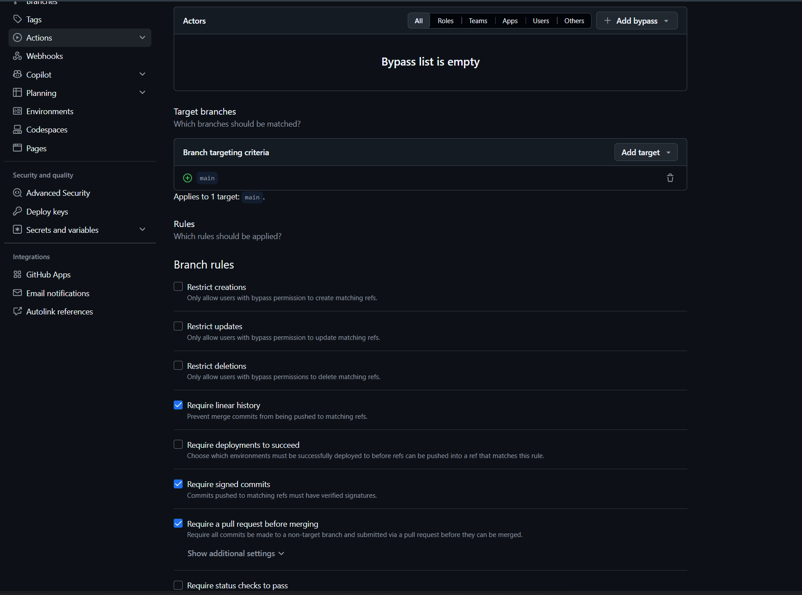

# Lab 1 — DevOps Foundations

## Task 1 — QuickNotes

### Health check

```text
{"notes":4,"status":"ok"}
```

### GET /notes

```text
[{"id":4,"title":"Endpoint cheat-sheet","body":"GET /notes  GET /notes/{id}  POST /notes  DELETE /notes/{id}  GET /health  GET /metrics","created_at":"2026-01-15T10:15:00Z"},{"id":1,"title":"Welcome to QuickNotes","body":"This is the project you'll containerize, deploy, monitor, and harden across all 10 labs.","created_at":"2026-01-15T10:00:00Z"},{"id":2,"title":"Read app/main.go first","body":"Start by understanding the entry point — env vars, signal handling, graceful shutdown.","created_at":"2026-01-15T10:05:00Z"},{"id":3,"title":"DevOps mantra","body":"If it hurts, do it more often.","created_at":"2026-01-15T10:10:00Z"}]
```

### POST /notes

```text
{"id":5,"title":"hello","body":"first POST","created_at":"2026-09-10T20:02:46.8652715Z"}
```

### git log --show-signature -1

```text
commit a8e39dc9039b1a8aa42edd5dce558ff007ba10ea (HEAD -> feature/lab1)
Good "git" signature for voridanaya@gmail.com with ED25519 key SHA256:NfNJWE1NIuw6ZnpMCLF+RXruNuQSg3VsvRMVAI41MNc
Author: AyazN <voridanaya@gmail.com>
Date:   Fri Sep 11 00:34:32 2026 +0300

    docs(lab1): start submission

    Signed-off-by: AyazN <voridanaya@gmail.com>
```

### The screenshot of the Verified badge


### Why signed commits matter

Signed commits matter because they provide cryptographic proof that a commit was created by a trusted developer and has not been altered. The March 2024 xz-utils incident showed how a compromised contributor and malicious code can enter a trusted software supply chain, highlighting the importance of verifying who is responsible for changes. Signed commits make it harder for attackers to impersonate developers and help maintain trust in the project's code history.

Task 2 — Pull Request Template

The pull request template was added to .github/pull_request_template.md on the fork's main branch before opening the Lab 1 pull request.

The template contains:

PR goal
Changes
Testing
Checklist for title, signed commits, and submission file

## Task 3 — Community Engagement

### GitHub Community

Starring repositories helps show appreciation for open-source projects and helps developers discover and support useful projects. Following developers makes it easier to learn from their work, stay connected with teammates and the wider community, and support professional growth.


## Bonus — Branch Protection

Branch protection/rules were enabled on the fork's `main` branch with:

* Require signed commits
* Require a pull request before merging
* Require linear history

### Unsigned push test

```text
Enumerating objects: 1, done.
Counting objects: 100% (1/1), done.
Writing objects: 100% (1/1), 190 bytes | 190.00 KiB/s, done.
Total 1 (delta 0), reused 0 (delta 0), pack-reused 0 (from 0)
remote: error: GH013: Repository rule violations found for refs/heads/main.
remote: Review all repository rules at https://github.com/AyazN/DevOps-Intro/rules?ref=refs%2Fheads%2Fmain
remote:
remote: - Changes must be made through a pull request.
remote:
remote: - Commits must have verified signatures.
remote:   Found 1 violation:
remote:
remote:   3efbb095869a778ce7e07f9588551dce84efab2f
remote:
To github.com:AyazN/DevOps-Intro.git
 ! [remote rejected] main -> main (push declined due to repository rule violations)
error: failed to push some refs to 'github.com:AyazN/DevOps-Intro.git'
```

### Screenshot



### Reflection

If Knight Capital had used branch protection and required signing on the production deployment branch, the faulty code would not have been able to reach production through an unreviewed direct push. A pull request requirement would have created an opportunity for another developer to review and catch the deployment problem before it went live. Required signing would also have provided stronger assurance about who authorized each change and made it harder to impersonate a trusted developer. Together, these controls could have added important safeguards and potentially reduced the impact of the deployment failure.

