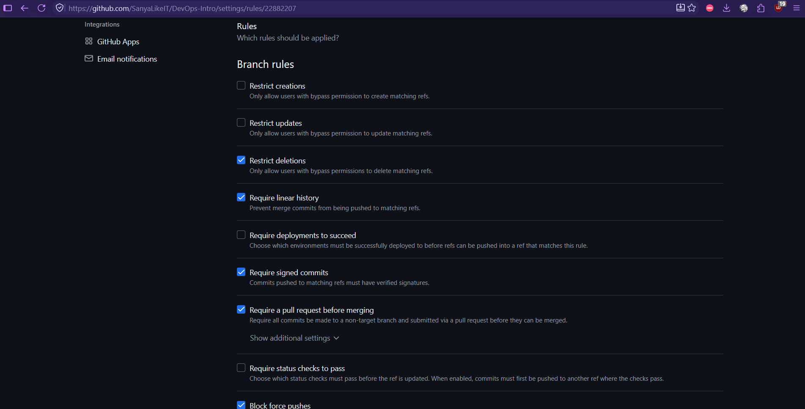
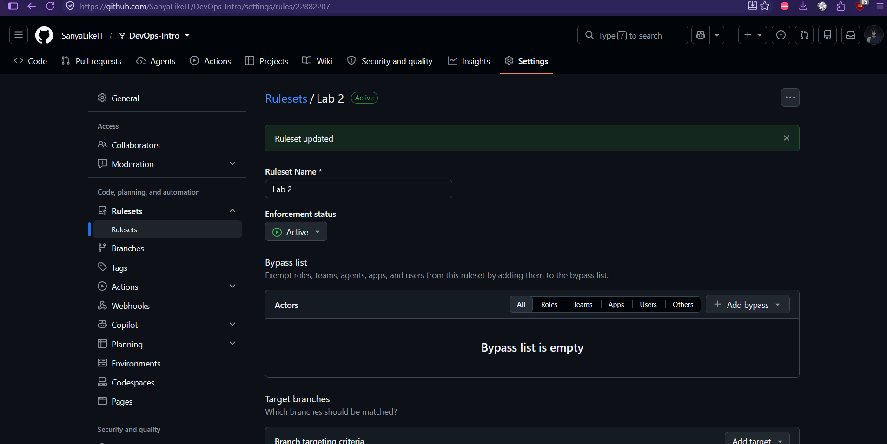
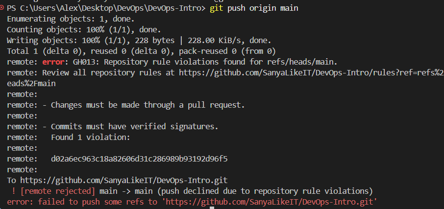

# Lab 1 submission
Signed commits help verify the identity of the person who created a commit and improve trust in the software supply chain. The xz-utils incident in March 2024 showed how dangerous compromised or malicious contributions can be, so verifying authorship and provenance is important. However, a valid signature does not guarantee that the code itself is safe, so code review and other security controls are still necessary.

## API checks

### Health check and initial notes


### Create a note


### List notes after creation


## Commit signature verification

### Local verification


### GitHub verification


## PR template


The PR template is not auto-populated when opening a pull request to the upstream course repository. In my own fork, the template works correctly and is auto-populated as expected.

## GitHub Community

Starring repositories helps open-source projects gain visibility and also makes useful projects easier to find later. Following developers helps you stay aware of their work, learn from their projects, and build connections that can be useful for teamwork and professional growth.

## Bonus Task — Branch Protection & Required Signed Commits

### Branch Protection Rules





### Unsigned Push Rejection



```text
remote: error: GH013: Repository rule violations found for refs/heads/main.
```

The captured output reports both that changes must go through a pull request and that commits must have verified signatures.

### Reflection

With branch protection and required signing on the production deploy branch, Knight Capital's team would have needed to submit signed commits through a pull request before merging. This would have given the team a chance to review the changes and made their source easier to verify. If production deployments only used that protected branch, these rules could have reduced the risk of unreviewed changes reaching production. They would still have needed deployment checks, monitoring, and a rollback plan, because a signed commit does not guarantee safe code or a correct deployment.
