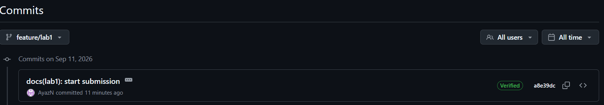

# Lab 1 — DevOps Foundations

## Task 1 — QuickNotes

### Health check

```text
{"notes":4,"status":"ok"}
```

### GET /notes

```text
[{"id":4,"title":"Endpoint cheat-sheet","body":"GET /notes  GET /notes/{id}  POST /notes  DELETE /notes/{id}  GET /health  GET /metrics","created_at":"2026-01-15T10:15:00Z"},{"id":1,"title":"Welcome to QuickNotes","body":"This is the project you'll containerize, deploy, monitor, and harden across all 10 labs.","created_at":"2026-01-15T10:00:00Z"},{"id":2,"title":"Read app/main.go first","body":"Start by understanding the entry point — env vars, signal handling, graceful shutdown.","created_at":"2026-01-15T10:05:00Z"},{"id":3,"title":"DevOps mantra","body":"If it hurts, do it more often.","created_at":"2026-01-15T10:10:00Z"}]
```

### POST /notes

```text
{"id":5,"title":"hello","body":"first POST","created_at":"2026-09-10T20:02:46.8652715Z"}
```

### git log --show-signature -1

```text
commit a8e39dc9039b1a8aa42edd5dce558ff007ba10ea (HEAD -> feature/lab1)
Good "git" signature for voridanaya@gmail.com with ED25519 key SHA256:NfNJWE1NIuw6ZnpMCLF+RXruNuQSg3VsvRMVAI41MNc
Author: AyazN <voridanaya@gmail.com>
Date:   Fri Sep 11 00:34:32 2026 +0300

    docs(lab1): start submission

    Signed-off-by: AyazN <voridanaya@gmail.com>
```

### The screenshot of the Verified badge



### Why signed commits matter

Signed commits matter because they provide cryptographic proof that a commit was created by a trusted developer and has not been altered. The March 2024 xz-utils incident showed how a compromised contributor and malicious code can enter a trusted software supply chain, highlighting the importance of verifying who is responsible for changes. Signed commits make it harder for attackers to impersonate developers and help maintain trust in the project's code history.

## Task 3 — Community Engagement

### GitHub Community

Starring repositories helps show appreciation for open-source projects and helps developers discover and support useful projects. Following developers makes it easier to learn from their work, stay connected with teammates and the wider community, and support professional growth.


## Bonus — Branch Protection

Branch protection/rules were enabled on the fork's `main` branch with:

* Require signed commits
* Require a pull request before merging
* Require linear history

### Unsigned push test

```text
PASTE THE ACTUAL ERROR OUTPUT FROM:

git push origin main
```

### Screenshot

Add a screenshot showing the branch protection/rules configuration.

### Reflection

The branch protection rules prevent changes from being pushed directly without satisfying the repository's requirements. Requiring signed commits helps verify who authored a commit and protects the integrity of the project history. Requiring pull requests ensures that changes go through review before they are merged. Requiring linear history keeps the Git history easier to understand and maintain.
