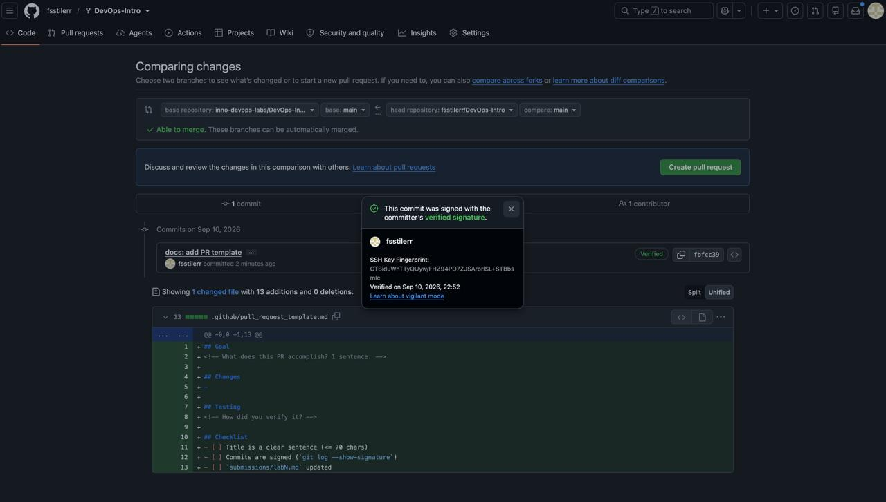
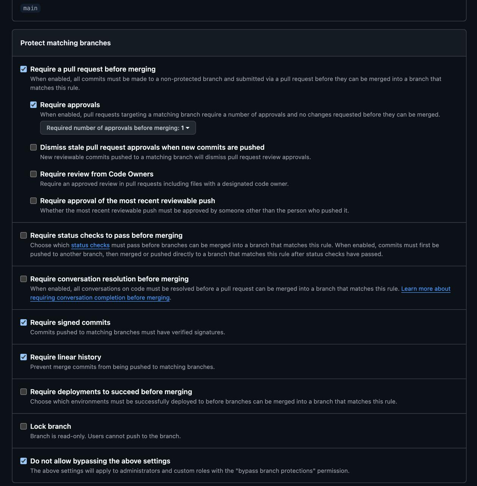

# Lab 1 — DevOps Foundations: Fork, Sign, and Open Your First PR

**Student:** SophiiSa Sultanova  
**Email:** s.sultanova@innopolis.university  
**GitHub:** [@fsstilerr](https://github.com/fsstilerr)  
**Environment:** macOS 26.6.2, git 2.55.0, Go 1.27.1 darwin/arm64, OpenSSH 10.3p1, LibreSSL 3.3.6

---

## Task 1 — SSH Commit Signing and QuickNotes Run

### 1.1 Running QuickNotes

On a clean start, the service loads four seeded notes from `app/seed.json`:

```plaintext
quicknotes listening on :8080 (notes loaded: 4)
```

During the captured curl session, two notes had already been created earlier, so the initial health check reported six notes:

```plaintext
$ curl -s localhost:8080/health
{"notes":6,"status":"ok"}

$ curl -s localhost:8080/notes
[
    {
        "id": 1,
        "title": "Welcome to QuickNotes",
        "body": "This is the project you'll containerize, deploy, monitor, and harden across all 10 labs.",
        "created_at": "2026-01-15T10:00:00Z"
    },
    {
        "id": 2,
        "title": "Read app/main.go first",
        "body": "Start by understanding the entry point \u2014 env vars, signal handling, graceful shutdown.",
        "created_at": "2026-01-15T10:05:00Z"
    },
    {
        "id": 3,
        "title": "DevOps mantra",
        "body": "If it hurts, do it more often.",
        "created_at": "2026-01-15T10:10:00Z"
    },
    {
        "id": 4,
        "title": "Endpoint cheat-sheet",
        "body": "GET /notes  GET /notes/{id}  POST /notes  DELETE /notes/{id}  GET /health  GET /metrics",
        "created_at": "2026-01-15T10:15:00Z"
    },
    {
        "id": 5,
        "title": "hello",
        "body": "first POST",
        "created_at": "2026-09-10T19:45:48.538834Z"
    },
    {
        "id": 6,
        "title": "hello",
        "body": "first POST",
        "created_at": "2026-09-10T19:46:14.023743Z"
    }
]
$ curl -X POST localhost:8080/notes -d ...
{
    "id": 7,
    "title": "hello",
    "body": "first POST",
    "created_at": "2026-09-10T19:46:46.739041Z"
}
$ curl -s localhost:8080/health
{"notes":7,"status":"ok"}
```

The note count moves from 6 to 7 after the POST, which confirms that the write path reaches persistent application storage rather than living in memory only.

### 1.2 Reading the code, not only the responses

Additional probes beyond the required requests:

```plaintext
GET /notes/999 -> 404
{"error":"invalid JSON body"}

[5, 6, 7, 1, 2, 3, 4]
[1, 2, 3, 4, 5, 6, 7]
[3, 4, 5, 6, 7, 1, 2]
[3, 4, 5, 6, 7, 1, 2]
[3, 4, 5, 6, 7, 1, 2]
```

The malformed POST is rejected because `handleCreateNote` calls
`dec.DisallowUnknownFields()`, so a typo in a field name is rejected rather
than being silently ignored. The repeated `GET /notes` calls are more
interesting: the response order changes between identical requests.
`Store.List()` in `app/store.go` ranges over a `map[int]Note`, and Go does
not guarantee map iteration order.

The metrics endpoint also confirms that the requests were handled by the service:

```plaintext
# HELP quicknotes_http_requests_total All HTTP requests.
# TYPE quicknotes_http_requests_total counter
quicknotes_http_requests_total 12
# HELP quicknotes_http_responses_by_code_total Responses by status code.
# TYPE quicknotes_http_responses_by_code_total counter
quicknotes_http_responses_by_code_total{code="200"} 9
quicknotes_http_responses_by_code_total{code="201"} 3
quicknotes_http_responses_by_code_total{code="204"} 0
quicknotes_http_responses_by_code_total{code="400"} 0
quicknotes_http_responses_by_code_total{code="404"} 0
quicknotes_http_responses_by_code_total{code="405"} 0
quicknotes_http_responses_by_code_total{code="500"} 0
```

> The API never promises an ordering, yet the seed data can make it look sorted
> during individual runs. A client that assumes stable ordering could therefore
> behave inconsistently. This is the kind of issue that becomes much clearer
> after reading the implementation rather than testing only the happy path.

### 1.3 Signing configuration

```bash
git config --global gpg.format ssh
git config --global user.signingkey "$HOME/.ssh/id_ed25519.pub"
git config --global commit.gpgsign true
git config --global tag.gpgsign true
git config --global gpg.ssh.allowedSignersFile "$HOME/.ssh/allowed_signers"
```

The last line is required so that `git log --show-signature` can resolve the
SSH signing key to an identity and report a verification result.

The SSH key is registered on GitHub for authentication and signing. These are
separate roles for the same key material: authentication proves who is pushing,
while signing proves who created the commit.

### 1.4 Signed commit

```plaintext
commit d9c554181bbbf74be34716db9127ac0370a84f99

Good "git" signature for namespaces=git with ED25519 key SHA256:CTSiduWnTTyQUyw/FHZ94PD7ZJSArorlSL+STBbsmlc

Author: SophiiaSultanova <sultanova2202@gmail.com>

Date:   Thu Sep 10 22:52:57 2026 +0300

    docs(lab1): start submission

    Signed-off-by: SophiiaSultanova <sultanova2202@gmail.com>
```



### 1.5 Why signed commits matter

A commit's author field is plain text that anyone can configure locally.
Signing binds the commit to a cryptographic key that the platform has verified,
so a reviewer can distinguish a genuinely signed commit from one that only
claims a particular author.

The xz-utils backdoor discovered in March 2024 is a useful example. A maintainer
who had built trust over time introduced a backdoor through apparently normal
project activity, and the compromise was discovered because of abnormal SSH
latency rather than ordinary review. Signing cannot stop a trusted maintainer
whose own key is compromised or intentionally misused, but it prevents a simpler
form of impersonation where an attacker attributes a commit to someone who never
signed it.

---

## Task 2 — Pull Request Template

The template lives at `.github/pull_request_template.md` on the fork's `main`
branch.


The screenshot is taken from a comparison inside the fork
(`main...feature/lab1`). GitHub resolves a pull request template from the base
repository's default branch. The base repository of the final submission PR is
the course repository rather than this fork, so testing the template against the
fork's own `main` is the correct place to demonstrate its auto-population.

---

## Task 3 — GitHub Community

Starred:
[inno-devops-labs/DevOps-Intro](https://github.com/inno-devops-labs/DevOps-Intro),
[simple-container-com/api](https://github.com/simple-container-com/api).

Following:
[@Cre-eD](https://github.com/Cre-eD),
[@Naghme98](https://github.com/Naghme98),
[@pierrepicaud](https://github.com/pierrepicaud),
[@rikire](https://github.com/rikire),
[@zv3zdochka](https://github.com/zv3zdochka),
[@pon4ik7](https://github.com/pon4ik7).


Starring is a simple public signal that also works as a personal bookmark for
useful projects

Following developers turns GitHub into a feed of real engineering activity

---

## Bonus Task — Branch Protection and Required Signed Commits

### Rules configured



Rules on `main`: require a pull request before merging, require signed commits,
and require linear history.

### What "protected" turned out to mean

The first attempt was performed while repository-owner bypass was still allowed.
The unsigned push was not rejected. GitHub reported the violations but applied
the push:

```plaintext
remote: Bypassed rule violations for refs/heads/main:
remote:
remote: - Commits must have verified signatures.
remote:   Found 1 violation:
remote:
remote:   6eda86e1f695de5afeb0c592cca907b2dcc49520
remote:
remote: - Changes must be made through a pull request.
remote:
To https://github.com/fsstilerr/DevOps-Intro.git
   fbfcc39..6eda86e  main -> main
```

> The important word here is `Bypassed`. The rules existed, but the repository
> owner was still allowed to bypass them. This demonstrates the difference
> between configuring a protection rule and configuring it so that even users
> with administrative privileges cannot ignore it.

Undoing that push exposed a second protection mechanism. A force push intended
to restore `main` was rejected:

```plaintext
remote: error: GH006: Protected branch update failed for refs/heads/main.

remote: - Cannot force-push to this branch

To https://github.com/fsstilerr/DevOps-Intro.git
 ! [remote rejected] main -> main (protected branch hook declined)
error: failed to push some refs to 'https://github.com/fsstilerr/DevOps-Intro.git'
```

After temporarily allowing the force push, `main` was restored to:

```plaintext
fbfcc39 docs: add PR template
```

The force-push permission was then disabled again.

### Attempting the bypass

To create an intentionally unsigned commit while global signing remained
enabled, `--no-gpg-sign` was used:

```bash
git commit --no-gpg-sign -s --allow-empty -m "test: unsigned commit (should fail)"
git push origin main
```

GitHub rejected the commit server-side:

```plaintext
remote: error: GH006: Protected branch update failed for refs/heads/main.

remote:
remote: - Commits must have verified signatures.
remote:   Found 1 violation:
remote:
remote:   5c9db8af0da62baa5dafade9f54364444d39f378
remote:
remote: - Changes must be made through a pull request.
remote:
To https://github.com/fsstilerr/DevOps-Intro.git
 ! [remote rejected] main -> main (protected branch hook declined)
error: failed to push some refs to 'https://github.com/fsstilerr/DevOps-Intro.git'
```

> The rejection comes from GitHub rather than from the local Git client. This is
> the value of server-side enforcement: changing local Git options cannot bypass
> the repository policy.

The rejected unsigned commit was then removed locally:

```plaintext
HEAD is now at fbfcc39 docs: add PR template
```

A signed empty commit was created next:

```bash
git commit -S -s --allow-empty -m "chore: verify signed push still works"
```

```plaintext
[main 19b2020] chore: verify signed push still works
```

Its direct push to `main` was still rejected by branch protection. This is
expected: satisfying the signed-commit requirement does not satisfy the
separate rule requiring changes to reach `main` through a pull request. The
experiment therefore shows that the protection mechanisms are enforced
independently.

### Reflection: Knight Capital

Knight Capital's 2012 incident is a useful example of why controlled and
auditable changes matter. A software deployment reached only seven of eight
production servers, leaving an old code path active on the remaining machine.
The resulting trading behaviour caused a loss of about $440 million in roughly
45 minutes.

Branch protection would not by itself detect an incorrect production deployment,
but requiring pull requests forces important changes through a reviewable path.
Signed commits make it easier to verify who actually created a change, while
linear history makes the sequence of accepted changes easier to audit and roll
back during an incident.

---

## Summary

| Task | Deliverable | Status |
|------|-------------|--------|
| Task 1 | QuickNotes running, curl output, Good signature, Verified badge | Done |
| Task 2 | PR template on `main`, auto-population evidence | Done |
| Task 3 | Stars, follows, written rationale | Done |
| Bonus | Protection rules, server-side rejection, reflection | Done |
