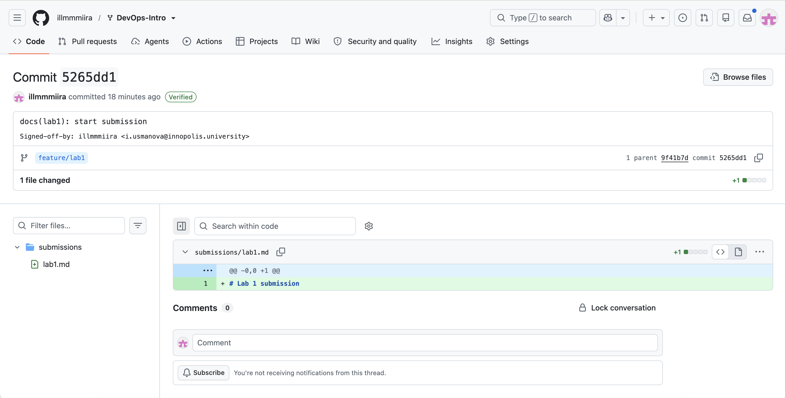
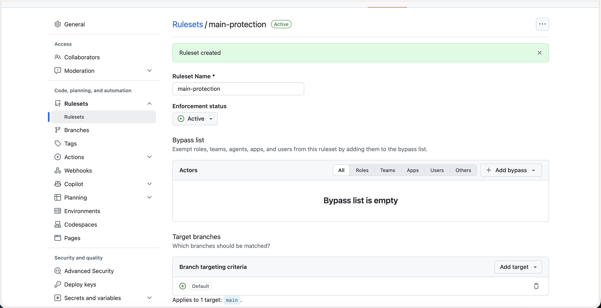

# Lab 1 submission

## Task 1 — SSH Commit Signing & First Signed Commit

### QuickNotes local run

`GET /health`

```json
{
    "notes": 4,
    "status": "ok"
}
```

`GET /notes`

```json
[
    {
        "id": 1,
        "title": "Welcome to QuickNotes",
        "body": "This is the project you'll containerize, deploy, monitor, and harden across all 10 labs.",
        "created_at": "2026-01-15T10:00:00Z"
    },
    {
        "id": 2,
        "title": "Read app/main.go first",
        "body": "Start by understanding the entry point — env vars, signal handling, graceful shutdown.",
        "created_at": "2026-01-15T10:05:00Z"
    },
    {
        "id": 3,
        "title": "DevOps mantra",
        "body": "If it hurts, do it more often.",
        "created_at": "2026-01-15T10:10:00Z"
    },
    {
        "id": 4,
        "title": "Endpoint cheat-sheet",
        "body": "GET /notes  GET /notes/{id}  POST /notes  DELETE /notes/{id}  GET /health  GET /metrics",
        "created_at": "2026-01-15T10:15:00Z"
    }
]
```

`POST /notes` with `{"title":"hello","body":"first POST"}`

```json
{
    "id": 5,
    "title": "hello",
    "body": "first POST",
    "created_at": "2026-09-10T18:52:56.124547Z"
}
```

### Signed commit verification

```
commit 5265dd183b7d4f8db845c8cd4979232fa34cd1e0 (HEAD -> feature/lab1)
Good "git" signature for i.usmanova@innopolis.university with ED25519 key SHA256:nRzoNCSkOdnU0U/32ngInt766BQ5tAat1U3SzWZzrb0
Author: illmmmiira <i.usmanova@innopolis.university>
Date:   Thu Sep 10 21:59:32 2026 +0300

    docs(lab1): start submission

    Signed-off-by: illmmmiira <i.usmanova@innopolis.university>
```

### Why signed commits matter

In March 2024, someone using the name "Jia Tan" spent about two years building trust as a maintainer of xz-utils, a compression tool used in most Linux systems. They quietly added a hidden backdoor that could have let attackers skip SSH login checks on huge numbers of servers. It was only found by chance, when a developer noticed logins were running a little slower than normal — not because anyone reviewing the code caught it. Signed commits would not have stopped a trusted maintainer from adding bad code, but they do prove who actually made each commit, which makes it much harder for an attacker to fake being someone else or hide behind a false identity.



## Task 2 — Pull Request Template & First PR

Added `.github/pull_request_template.md` to the fork's `main` branch (commit `docs: add PR template`, pushed before opening the lab PR, per the bootstrap requirement). Opened the lab PR from `feature/lab1` to `inno-devops-labs/DevOps-Intro`'s `main`:

- PR: https://github.com/inno-devops-labs/DevOps-Intro/pull/1529

Note: since GitHub resolves a pull request's template from the **base repository's** default branch, and the base repository here is the upstream course repo (not my fork), the description did not auto-populate on the actual submission PR — the upstream `main` doesn't (and can't, since I don't have write access there) contain the template. I filled in the template's sections manually in the PR description, and the template file itself is verifiable on my fork's `main` branch. All checklist items in the PR description are ticked.

## Task 3 — GitHub Community Engagement

Starred `inno-devops-labs/DevOps-Intro` and `simple-container-com/api`. Followed the professor (@Cre-eD), both TAs (@Naghme98, @pierrepicaud), and 3 classmates.

Starring matters in open source because it's how people bookmark and signal interest in a project — it gives maintainers a rough read on how many people care about what they're building, and it helps other developers discover tools that are actually being used rather than sitting unnoticed. Following other developers matters for team projects and professional growth because it keeps you aware of what teammates and peers are actually working on, makes it easier to find collaborators for future projects, and builds a visible professional network beyond just the people in your immediate team.

## Bonus Task — Branch Protection & Required Signed Commits

Created a ruleset (`main-protection`) on the fork's `main` branch, set to **Active**, targeting `main`, with:
- Require signed commits
- Require a pull request before merging
- Require linear history



### Trying to break it

```bash
git switch main
git commit --no-gpg-sign -s --allow-empty -m "test: unsigned commit (should fail)"
git push origin main
```

Rejection message:

```
remote: error: GH013: Repository rule violations found for refs/heads/main.
remote: Review all repository rules at https://github.com/illmmmiira/DevOps-Intro/rules?ref=refs%2Fheads%2Fmain
remote: 
remote: - Changes must be made through a pull request.
remote: 
remote: - Commits must have verified signatures.
remote:   Found 1 violation:
remote: 
remote:   a7a1ba09660dfe680ad32466b759993ce38f0b6c
remote: 
To github.com:illmmmiira/DevOps-Intro.git
 ! [remote rejected] main -> main (push declined due to repository rule violations)
error: failed to push some refs to 'github.com:illmmmiira/DevOps-Intro.git'
```

Both rules fired at once: the commit was unsigned, and it was also a direct push to `main` rather than going through a PR. The local unsigned commit was discarded afterward with `git reset --hard origin/main`, and normal signed pushes continue to work as before.

### Reflection

Knight Capital's 2012 incident happened because a deploy script pushed old, dormant test code straight to production on one of eight servers, with no review step and no way to tell that server's state had diverged from the rest — the company lost roughly $440 million in 45 minutes before anyone could diagnose it. Branch protection requiring a pull request before merging would have forced that deploy change through a review step where a second person could catch a stale or mismatched build before it reached production, rather than letting one person's local push go straight live. Requiring signed commits wouldn't have stopped a mistake by an authorized engineer, but on a production deploy branch it does guarantee every change is traceable to a specific person and machine, which matters a lot once you're trying to reconstruct what happened during an incident. Together, the two rules turn "one bad push takes down the system" into "a bad change has to pass through a visible, attributable process first" — exactly the kind of guardrail a high-stakes deploy branch needs.
