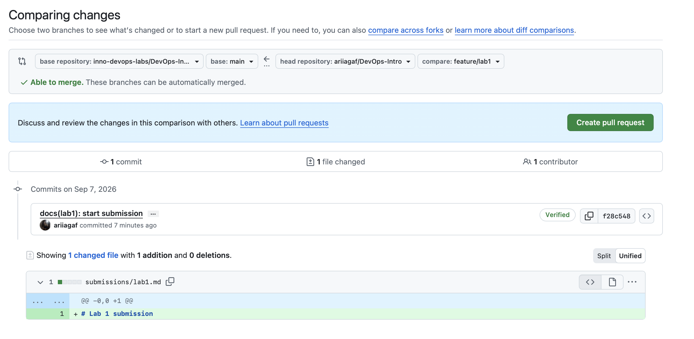

# Lab 1 submission

## Smoke Test

### Health endpoint

```json
{
    "notes": 4,
    "status": "ok"
}
```

### Get notes

```json
[
    {
        "id": 1,
        "title": "Welcome to QuickNotes",
        "body": "This is the project you'll containerize, deploy, monitor, and harden across all 10 labs.",
        "created_at": "2026-01-15T10:00:00Z"
    },
    {
        "id": 2,
        "title": "Read app/main.go first",
        "body": "Start by understanding the entry point — env vars, signal handling, graceful shutdown.",
        "created_at": "2026-01-15T10:05:00Z"
    },
    {
        "id": 3,
        "title": "DevOps mantra",
        "body": "If it hurts, do it more often.",
        "created_at": "2026-01-15T10:10:00Z"
    },
    {
        "id": 4,
        "title": "Endpoint cheat-sheet",
        "body": "GET /notes  GET /notes/{id}  POST /notes  DELETE /notes/{id}  GET /health  GET /metrics",
        "created_at": "2026-01-15T10:15:00Z"
    }
]
```

### Create note

```json
{
    "id": 5,
    "title": "hello",
    "body": "first POST",
    "created_at": "2026-09-07T18:47:18.309503Z"
}
```

## Signed Commit

The commit was signed using an SSH ED25519 key.

```text
commit f28c548c8a5aca241aa4fe6fc24e4ce92a27aecc
Good "git" signature for agafonova_arina@icloud.com with ED25519 key SHA256:IrCUPC4DTS87Y/H7GEphaSNlZoYPZJH7jOFCI0C1SPY
Author: Ari Agafonova <agafonova_arina@icloud.com>
Date: Mon Sep 7 21:54:57 2026 +0300

    docs(lab1): start submission

    Signed-off-by: Ari Agafonova <agafonova_arina@icloud.com>
```

GitHub also successfully verified the commit signature (`Verified`).

### GitHub Verification



Signed commits help verify the identity of the author and ensure that a commit was actually signed with the expected key. This makes the repository history more trustworthy and helps protect against commit impersonation.

## GitHub Community

I starred the required repositories and followed the professor, TAs, and at least three classmates.

This helps me stay connected with the course community and makes it easier to follow updates and contributions.