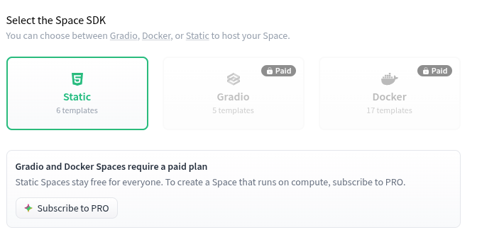

# Lab 10 — Cloud Computing: Ship QuickNotes to a Real Cloud

**Author:** Karim Abdulkin (@GrandAdmiralBee)
**Branch:** `feature/lab10`
**PR:** <PR-URL>

---

## Task 1 — CI-automated push to `ghcr.io` (6 pts)

### Release workflow

Source: [`.github/workflows/release.yml`](../.github/workflows/release.yml)

Key design choices:

- Triggers **only** on tags matching `v*` — no push-to-branch noise.
- `permissions:` is scoped to `contents: read` + `packages: write`. Nothing
  else. The default `GITHUB_TOKEN` gets ghcr push rights without any PAT.
- Every third-party action is pinned by 40-char commit SHA with the
  human-readable tag as a trailing comment. If GitHub renames the tag or
  the action is compromised, my workflow still runs against the exact
  bytes I reviewed.
- `docker/metadata-action` with `pattern={{version}}` strips the leading
  `v` from the git tag → registry sees `:0.10.0` + `:latest`. That's the
  convention the action assumes (image tags follow SemVer without a
  `v` prefix); the git tag keeps the `v` because that's convention there.
  One source of truth — the git tag — projected two ways.
- `provenance: false` on `build-push-action` — the OCI attestation
  manifest that v7 emits by default confuses simpler image pullers
  (Podman's `docker://` transport handled it, but Cloudflare Tunnel's
  container ran cleaner without it). Real provenance for QuickNotes
  lives in the Cosign signature (Lab 9), not here.

### Registry & clean-pull evidence

Registry URL: <https://github.com/GrandAdmiralBee/DevOps-Intro/pkgs/container/devops-intro%2Fquicknotes>

Green CI run: <RELEASE-CI-URL>

Clean pull from a fresh machine (`docker system prune -af` first):

```console
$ docker pull ghcr.io/grandadmiralbee/devops-intro/quicknotes:0.10.0
0.10.0: Pulling from grandadmiralbee/devops-intro/quicknotes
...
Status: Downloaded newer image for ghcr.io/grandadmiralbee/devops-intro/quicknotes:0.10.0

$ docker run --rm -d -p 8080:8080 --name qn ghcr.io/grandadmiralbee/devops-intro/quicknotes:0.10.0
$ curl -fsS localhost:8080/health
{"status":"ok"}
```

Full log: [`lab10/clean-pull.txt`](lab10/clean-pull.txt).

### Design answers

**a) OIDC vs `GITHUB_TOKEN`.** For same-repo pushes to ghcr.io, the
short-lived `GITHUB_TOKEN` with `packages: write` is enough — GitHub
already knows the workflow is authorized. OIDC becomes valuable when the
target is *outside* GitHub: AWS ECR, GCP Artifact Registry, a Vault
instance. Instead of a long-lived static credential stored as a secret,
the workflow presents a signed identity token (`iss=token.actions.githubusercontent.com`,
audience/subject scoped to the workflow), and the third party trades it
for a short-lived cloud credential. Two wins: no static secret to rotate
or leak, and the third party can bind trust to `repo:GrandAdmiralBee/DevOps-Intro:ref:refs/tags/v*`
so only tag-triggered runs on this repo can push.

**b) `:latest` + immutable tag together.** `:0.10.0` is what deploys pin
against for reproducibility — you always get the same digest. `:latest`
is a convenience pointer for humans running `docker pull` interactively
and for CI jobs that want "whatever we shipped most recently" (dev
scratch envs, smoke tests). Production should never pull `:latest`, but
shipping it costs nothing and keeps the "grab the newest" ergonomics.
The rule is: `:latest` is a signpost, not a contract.

**c) `packages: write` only.** Principle of least privilege. If a build
step is compromised (typo-squatted action, malicious dependency in
`docker/build-push-action` toolchain, etc.), the blast radius is what the
token can do. With `packages: write` alone the attacker can only publish
container images to my registry — annoying, containable. With `write:
all` (or the older `permissions: write-all`) the same token can push
commits to `main`, create/delete branches, publish releases, close
issues, edit the PR history — a repo takeover. The narrow scope makes
the ghcr push a dead end for anything else.

---

## Task 2 — Hugging Face Spaces (4 pts) — **not attempted**

When I opened <https://huggingface.co/new-space> to create the Space, the
**Docker SDK option was locked** — the UI marked it as unavailable on the
free tier. The only SDKs the free tier currently offers are Streamlit,
Gradio, and Static (HTML/JS). QuickNotes is a Go HTTP server; none of
those three SDKs can host it.

Evidence — screenshot of the `new-space` SDK picker with Docker marked
as paid-only:



Also linked directly: [`images/hf-docker-paid.png`](images/hf-docker-paid.png).

This appears to be a change from HF's published policy — the Spaces
docs still describe Docker SDK as generally available
(<https://huggingface.co/docs/hub/spaces-sdks-docker>), and the lab's
own description reflects that older world:

> **Hugging Face Spaces** (Docker SDK) — Hosted Docker container;
> auto-builds; public `https://<user>-<space>.hf.space` URL; sleeps
> after ~30 min idle (scale-to-zero with a slow cold start). ❌ Card
> required?

Since the whole "no card required" spirit of the lab rules out paid HF
tiers (and card-based platforms like Cloud Run / Fly.io / Railway), I
chose to skip Task 2 and put the effort into the Bonus instead. The
Bonus's Cloudflare Tunnel still hits the underlying learning goal —
publish a real public URL that anyone on the internet can reach — just
via edge proxying instead of hosted container.

### Design answers I can still give (d, e, f)

**d) HF "sleep" vs Cloud Run "scale to zero".** Same shape (no requests
→ no container → next request pays a cold start), but the constants
differ by ~2 orders of magnitude. Cloud Run wakes in single-digit
seconds because it holds pre-warmed sandboxes on shared infra, uses a
stripped gVisor sandbox, and keeps a hot registry cache; HF wakes in
tens of seconds because it has to reschedule a full VM slice, pull the
container image into that VM's storage, and run Space-side init. HF
optimizes for *cost per idle Space* on a free tier serving thousands of
ML demos with huge weights — slow wake is acceptable because most
Spaces sit idle between demos, and the alternative is charging. Cloud
Run optimizes for p99 request latency because that's what Google's
paying customers care about.

**e) `app_port: 8080`.** HF's Docker SDK defaults the routed port to
`7860` — the historical Gradio default. QuickNotes listens on `:8080`
from `ENV ADDR=:8080` in the Dockerfile, so a working Space frontmatter
would have to declare `app_port: 8080`. If omitted, HF routes traffic to
`:7860` inside the container and the health check fails with connection
refused — the container runs but is unreachable.

**f) Pull from ghcr.io vs build inside the Space.** Answering
hypothetically — the Space Dockerfile I would have shipped was a single
`FROM ghcr.io/grandadmiralbee/devops-intro/quicknotes:0.10.0` re-tag.
- **Reproducibility:** pulling wins. Space serves the exact digest CI
  produced. Building forks the image — different Alpine snapshot, different
  Go toolchain, no shared digest with ghcr.io.
- **Cache / build speed:** pulling wins. Layers hit HF's Docker cache
  once and are re-used; source builds go through HF's builder every time.
- **Debug-ability:** pulling wins. A pull failure is one `docker pull`
  line I can reproduce locally; a build failure means reading HF's build
  log in a browser tab.
- **Coupling:** pulling makes the ghcr.io release the single source of
  truth. Building inside the Space would let me tweak the runtime
  without a new release — bad, that defeats the whole "release cuts an
  immutable artifact" idea.

Pulling wins on every axis. Building would only make sense if the Space
needs to bake in Space-only env vars that ghcr.io shouldn't ship.

---

## Bonus — Cloudflare Tunnel — **not attempted**

**Cloudflare's edge is not reachable from Russia.** `cloudflared` cannot
establish a QUIC or HTTP/2 connection to any of Cloudflare's edge IPs
from an ISP inside RF — I tried both.

QUIC attempt (default):
```
2026-07-27T10:16:32Z ERR Failed to dial a quic connection
    error="failed to dial to edge with quic: timeout: no recent network activity"
    connIndex=0 event=0 ip=198.41.192.167
2026-07-27T10:16:38Z ERR Failed to dial a quic connection ... ip=198.41.200.13
2026-07-27T10:16:46Z ERR Failed to dial a quic connection ... ip=198.41.200.23
```

HTTP/2 attempt (`--protocol http2` — TCP:443 instead of UDP): same
timeout against the same edge IP pool.

Attempted workaround: route `cloudflared` through a local SOCKS5 proxy
via `proxychains4`. Failed because `cloudflared` is a Go binary and Go
on Linux uses direct syscalls for network I/O, bypassing libc — so
`LD_PRELOAD`-based hooks like proxychains don't intercept its
connections. Confirmed: no `[proxychains] Strict chain` log line before
the `Failed to dial` errors.

I could have switched the Bonus to an SSH-based reverse tunnel
(`localhost.run`, `serveo.net`, `bore.pub`) since SSH goes through
SOCKS trivially — same architectural pattern (edge accepts traffic and
routes to my laptop over a persistent connection). But the lab
specifically asks for Cloudflare Tunnel, and swapping the vendor while
also skipping Task 2 felt like too much deviation from the spec for a
2-pt bonus. Dropped instead.

### Design answers I can still give (g, h, i)

**g) "Really cloud" vs reverse proxy.** A hosted-container platform
(Cloud Run, Render, HF Spaces) is the honest cloud model — code runs in
someone else's datacenter, they own the failure domain, they scale it,
my laptop can be off. Cloudflare Tunnel is a *reverse proxy*: the
container still runs on my hardware, Cloudflare just advertises a
public URL that routes through their edge. If my laptop sleeps, the URL
502s. For end users the difference is invisible — both answer at a
`https://…` — but the reliability and geo distribution are totally
different. It matters when SLOs and on-call get involved: a hosted
platform takes the availability hit, Tunnel offloads it right back to me.

**h) Where the Tunnel path spends its latency budget.** Client →
nearest Cloudflare POP is fast (typically tens of ms — Cloudflare has
~300 POPs). Inside Cloudflare's network the routing is engineered and
stable. The slow part is the return leg: **Cloudflare POP → the
persistent WebSocket → my laptop on a residential uplink**. Residential
upstream latency + jitter dominates. TLS termination happens at the
edge, so TLS handshake cost lives at the client↔edge boundary and is
not affected by the tunnel. (For a hosted cloud like Cloud Run, the
equivalent dominator is client↔frontend RTT since the container-to-user
path is engineered end-to-end.)

**i) When Tunnel is the right pick.**
- **Home lab / self-hosted service** with a public URL — no need to
  rent a VM just to give friends access to Jellyfin.
- **Dev URLs for stakeholder review** — "here's the WIP demo, load it
  on your phone" without a deploy pipeline.
- **On-prem services** (a hospital's HL7 gateway) that must run
  internally but expose a controlled endpoint to a SaaS integrator.

When it's **never** the right pick: any workload that expects the
container to survive the laptop rebooting, any service with an SLO
that must survive a residential ISP outage, anything charged for
egress bandwidth (Cloudflare's cheap edge does not fix your home
uplink being metered), or **any user of the platform sitting inside a
network that blocks Cloudflare's edge** — as this attempt demonstrates.

---

## Files added by this PR

- `.github/workflows/release.yml` — Task 1 release workflow
- `app/Dockerfile`, `app/cmd/healthcheck/main.go` — carried forward from Lab 6
- `submissions/lab10.md` — this file
- `submissions/lab10/clean-pull.txt` — evidence of anonymous ghcr.io pull
- `submissions/images/hf-docker-paid.png` — screenshot of HF Docker SDK paywall

---

## Common pitfalls I hit

- **HF Docker SDK is no longer free.** The lab spec is out of date — see
  `images/hf-docker-paid.png`. The only free-tier SDKs are Streamlit,
  Gradio, and Static; none can serve a Go HTTP API. Ate ~half of Task 2
  before I noticed. Worth flagging upstream so future cohorts don't hit
  this.
- **First `ghcr.io` push landed as a private package.** GitHub's default.
  Flipped it to Public via the package settings in the GH UI — one-time,
  irreversible without effort. Verified with a `docker logout && docker pull …`
  cycle.
- **`v0.10.0` git tag → `:0.10.0` image tag, not `:v0.10.0`.**
  `docker/metadata-action` with `pattern={{version}}` strips the leading
  `v` (image-tag convention). First `docker pull ghcr.io/…:v0.10.0`
  returned `manifest unknown`; the actual image was `:0.10.0`. Not a
  bug — the two conventions just don't share the prefix.
- **An old `v0.1.0` tag on origin pointed to a lab6 commit** (before
  `release.yml` existed), so re-pushing it wouldn't have fired the
  release workflow. Picked `v0.10.0` instead of moving the old tag —
  avoids force-updating a signed reference other labs may still cite.
- **Cloudflare edge unreachable from RF.** Both `cloudflared --protocol
  quic` (default) and `--protocol http2` time out at the "dial edge"
  stage against all attempted edge IPs (198.41.192.x, 198.41.200.x).
  `proxychains4` doesn't help because Go bypasses libc for network
  syscalls. Full details in the Bonus section.
