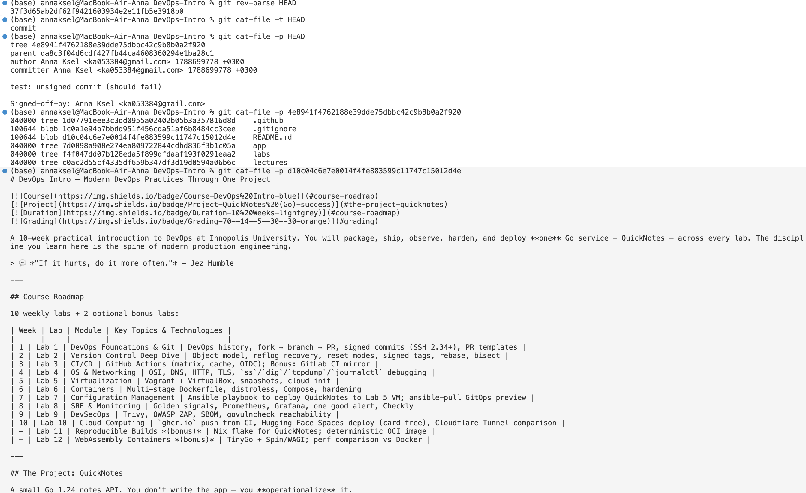
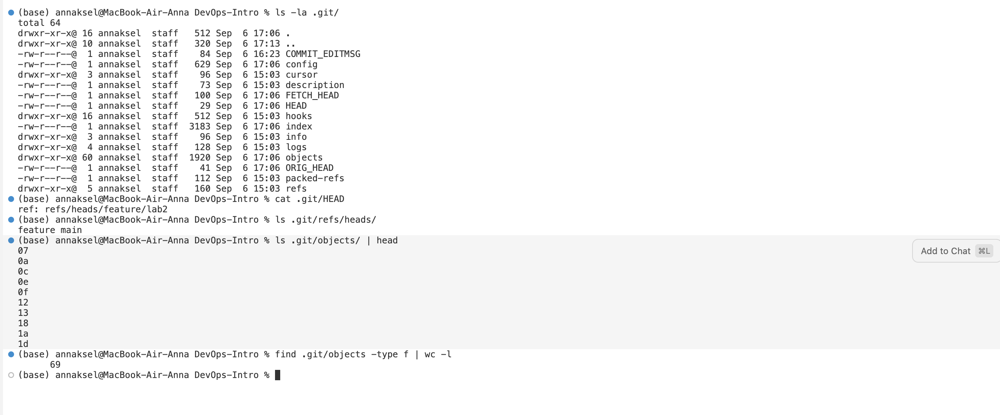
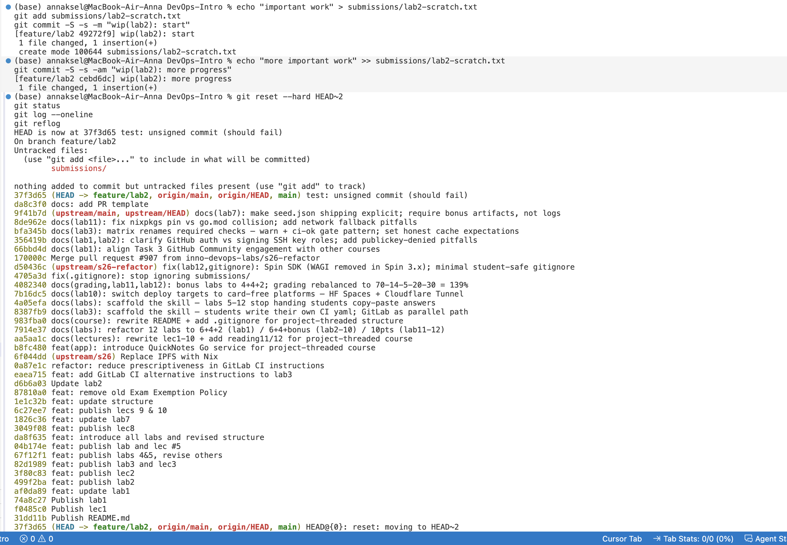
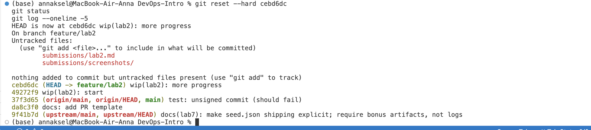
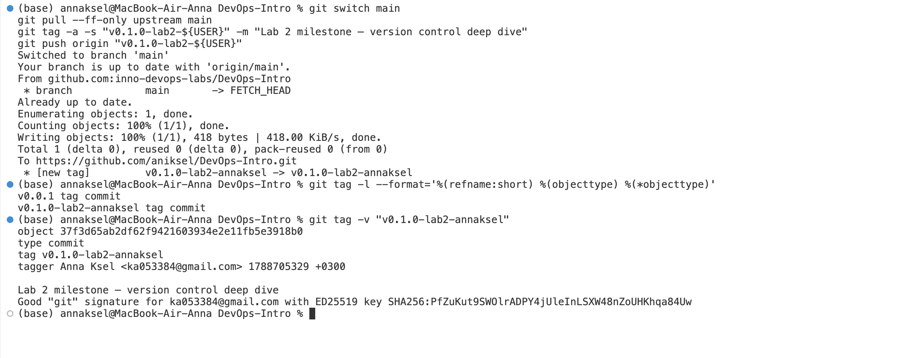
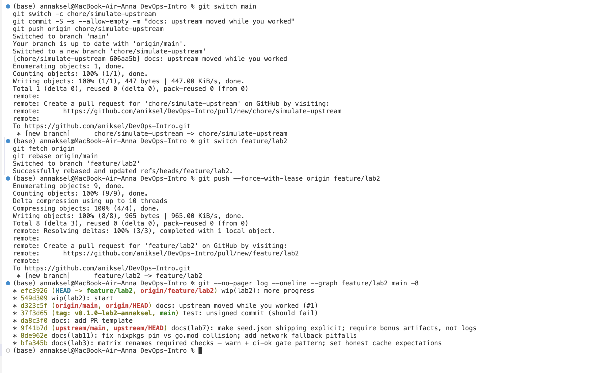
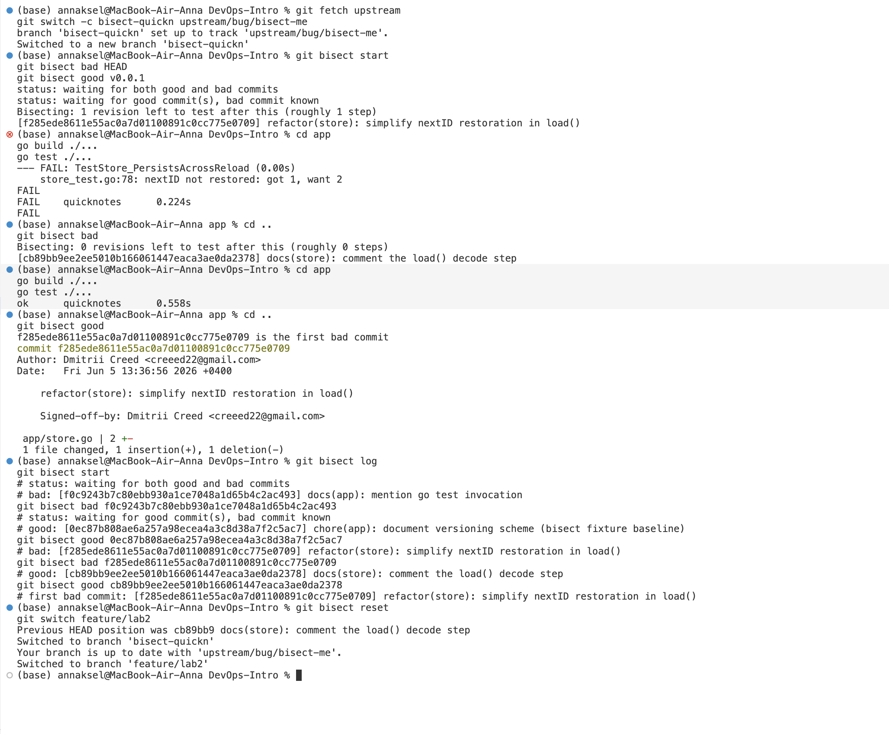

# Lab 2 submission

## Task 1 — Git Object Model + Reflog Recovery

### 1.1: Plumbing chain — HEAD → tree → blob → file

**HEAD commit:**
```
$ git rev-parse HEAD
37f3d65ab2df62f9421603934e2e11fb5e3918b0

$ git cat-file -t HEAD
commit

$ git cat-file -p HEAD
tree 4e8941f4762188e39dde75dbbc42c9b8b0a2f920
parent da8c3f04d6cdf427fb44ca4608360294e1ba28c1
author Anna Ksel <ka053384@gmail.com> 1788699778 +0300
committer Anna Ksel <ka053384@gmail.com> 1788699778 +0300

test: unsigned commit (should fail)

Signed-off-by: Anna Ksel <ka053384@gmail.com>
```

**Tree (root of the repo):**
```
$ git cat-file -p 4e8941f4762188e39dde75dbbc42c9b8b0a2f920
040000 tree 1d07791eee3c3dd0955a02402b05b3a357816d8d    .github
100644 blob 1c0a1e94b7bbdd951f456cda51af6b8484cc3cee    .gitignore
100644 blob d10c04c6e7e0014f4fe883599c11747c15012d4e    README.md
040000 tree 7d0898a908e274ea809722844cdbd836f3b1c05a    app
040000 tree f4f047dd07b128eda5f899dfdaaf193f0291eaa2    labs
040000 tree c0ac2d55cf4335df659b347df3d19d0594a06b6c    lectures
```

**Blob (README.md contents):**
```
$ git cat-file -p d10c04c6e7e0014f4fe883599c11747c15012d4e
# DevOps Intro — Modern DevOps Practices Through One Project
... (matches the actual README.md file content)
```

This confirms the full chain: a commit object points to one tree object (a snapshot of the root directory), the tree lists blobs (file contents) and sub-trees (subdirectories) by SHA, and each blob's content is exactly the file's bytes — in this case, the blob's content is byte-for-byte the current README.md.



### 1.2: Inside `.git/`

```
$ ls -la .git/
COMMIT_EDITMSG   config   cursor/   description   FETCH_HEAD   HEAD
hooks/   index   info/   logs/   objects/   ORIG_HEAD   packed-refs   refs/

$ cat .git/HEAD
ref: refs/heads/feature/lab2

$ ls .git/refs/heads/
feature   main

$ ls .git/objects/ | head
07  0a  0c  0e  0f  12  13  18  1a  1d

$ find .git/objects -type f | wc -l
69
```

**Interpretation:**
- `HEAD` is not a commit itself — it's a symbolic reference (`ref: refs/heads/feature/lab2`) pointing at whichever branch is currently checked out. Git resolves it one hop further to get the actual commit SHA.
- `refs/heads/` doesn't contain a file called `feature/lab2` directly — it contains a `feature/` subdirectory holding `lab1` and `lab2`, because a branch name with a slash in it (`feature/lab2`) becomes a nested path on disk, not a literal filename with a slash.
- `objects/` is a content-addressable store: each object (blob, tree, commit, tag) is saved under a path built from its SHA-1 — the first two hex characters become the subdirectory name (`07`, `0a`, `0c`, ...), and the remaining 38 characters become the filename inside it. This is just a way to avoid dumping tens of thousands of files into one flat directory.
- `find .git/objects -type f | wc -l` counting 69 loose objects means Git hasn't packed/compressed the object database yet (that happens via `git gc` or `git repack`, which bundles loose objects into `.pack` files for efficiency).
- `index` is the staging area (what will go into the next commit); `ORIG_HEAD` is a safety bookmark Git leaves before dangerous operations (like `reset --hard` or a merge) so you can jump back; `packed-refs` stores tags/branches that have already been compacted instead of living as individual files under `refs/`.



### 1.3: Simulate disaster + recover via reflog

Created two work-in-progress commits, then destroyed them with a hard reset:

```
$ git commit -S -s -m "wip(lab2): start"
[feature/lab2 49272f9] wip(lab2): start

$ git commit -S -s -am "wip(lab2): more progress"
[feature/lab2 cebd6dc] wip(lab2): more progress

$ git reset --hard HEAD~2
HEAD is now at 37f3d65 test: unsigned commit (should fail)

$ git status
On branch feature/lab2
nothing to commit, working tree clean

$ git log --oneline -3
37f3d65 test: unsigned commit (should fail)
da8c3f0 docs: add PR template
9f41b7d docs(lab7): make seed.json shipping explicit; require bonus artifacts, not logs
```

Both wip commits vanished from `git log` — but `git reflog` still has them, because the reflog tracks every place `HEAD` has pointed, independent of what any branch currently points to:

```
$ git reflog
37f3d65 (HEAD -> feature/lab2, ...) HEAD@{0}: reset: moving to HEAD~2
cebd6dc HEAD@{1}: commit: wip(lab2): more progress
49272f9 HEAD@{2}: commit: wip(lab2): start
37f3d65 (HEAD -> feature/lab2, ...) HEAD@{3}: checkout: moving from main to feature/lab2
...
```



**Recovery** — reset back to the tip of the "lost" chain (`cebd6dc`, taken straight from the reflog):

```
$ git reset --hard cebd6dc
HEAD is now at cebd6dc wip(lab2): more progress

$ git status
On branch feature/lab2
nothing to commit, working tree clean

$ git log --oneline -3
cebd6dc (HEAD -> feature/lab2) wip(lab2): more progress
49272f9 wip(lab2): start
37f3d65 (origin/main, origin/HEAD, main) test: unsigned commit (should fail)
```

Both commits are back, in order, with the file's full contents intact.



**What if `git gc` had run in between?**

By default, Git won't immediately delete unreachable objects even after `git gc` runs — there's a grace period (`gc.pruneExpire`, 2 weeks by default) during which recently-orphaned objects are kept regardless of the reflog, precisely to protect against exactly this scenario. So an ordinary `git gc` between the reset and the recovery would almost certainly have been harmless. The danger is a more aggressive collection — `git gc --prune=now`, a shortened `gc.reflogExpireUnreachable`, or reflog entries actually expiring (default 90 days for reachable, 30 days for unreachable) — any of which can permanently delete the now-unreferenced commit and blob objects from `.git/objects`. Once that happens, the reflog entry itself becomes useless (it still names the SHA, but the object behind it no longer exists), and the work is gone for good — this is why the pitfall note says to capture the SHA *first* rather than experimenting.

## Task 2 — Tag a Release & Rebase a Feature

### 2.1: Annotated, signed release tag

```
$ git tag -a -s "v0.1.0-lab2-annaksel" -m "Lab 2 milestone — version control deep dive"
$ git push origin "v0.1.0-lab2-annaksel"
 * [new tag]         v0.1.0-lab2-annaksel -> v0.1.0-lab2-annaksel

$ git tag -l --format='%(refname:short) %(objecttype) %(*objecttype)'
v0.0.1 tag commit
v0.1.0-lab2-annaksel tag commit

$ git tag -v "v0.1.0-lab2-annaksel"
object 37f3d65ab2df62f9421603934e2e11fb5e3918b0
type commit
tag v0.1.0-lab2-annaksel
tagger Anna Ksel <ka053384@gmail.com> 1788705329 +0300

Lab 2 milestone — version control deep dive
Good "git" signature for ka053384@gmail.com with ED25519 key SHA256:PfZuKut9SWOlrADPY4jUleInLSXW48nZoUHKhqa84Uw
```

Both checks confirm the tag is a real annotated tag object (`objecttype` = `tag`, pointing at a `commit`) rather than a lightweight tag (which would just be a ref pointing directly at the commit), and the signature verifies successfully.



### 2.2: Rebase + force-with-lease

**Before rebase** (`feature/lab2` branched off the old tip of `main`):
```
$ git --no-pager log --oneline --graph feature/lab2 main -8
* cebd6dc (HEAD -> feature/lab2) wip(lab2): more progress
* 49272f9 wip(lab2): start
* 37f3d65 (tag: v0.1.0-lab2-annaksel, origin/main, origin/HEAD, main) test: unsigned commit (should fail)
* da8c3f0 docs: add PR template
* 9f41b7d (upstream/main, upstream/HEAD) docs(lab7): make seed.json shipping explicit; require bonus artifacts, not logs
* 8de962e docs(lab11): fix nixpkgs pin vs go.mod collision; add network fallback pitfalls
* bfa345b docs(lab3): matrix renames required checks — warn + ci-ok gate pattern; set honest cache expectations
* 356419b docs(lab1,lab2): clarify GitHub auth vs signing SSH key roles; add publickey-denied pitfalls
```

Simulated `main` moving forward while working on the feature branch (merged via a self-PR instead of a direct push, due to branch protection):
```
$ git switch main
$ git switch -c chore/simulate-upstream
$ git commit -S -s --allow-empty -m "docs: upstream moved while you worked"
$ git push origin chore/simulate-upstream
# ... opened + merged PR #1 on GitHub: chore/simulate-upstream -> main
$ git fetch origin
d323c5f docs: upstream moved while you worked (#1)   # new tip of origin/main
```

Rebased the feature branch onto the new `main`:
```
$ git switch feature/lab2
$ git fetch origin
$ git rebase origin/main
Successfully rebased and updated refs/heads/feature/lab2.

$ git push --force-with-lease origin feature/lab2
 * [new branch]      feature/lab2 -> feature/lab2
```

**After rebase** (both wip commits replayed on top of `d323c5f`, with new SHAs — proof they were rewritten, not just moved):
```
$ git --no-pager log --oneline --graph feature/lab2 main -8
* efc3926 (HEAD -> feature/lab2, origin/feature/lab2) wip(lab2): more progress
* 549d309 wip(lab2): start
* d323c5f (origin/main, origin/HEAD) docs: upstream moved while you worked (#1)
* 37f3d65 (tag: v0.1.0-lab2-annaksel, main) test: unsigned commit (should fail)
* da8c3f0 docs: add PR template
* 9f41b7d (upstream/main, upstream/HEAD) docs(lab7): make seed.json shipping explicit; require bonus artifacts, not logs
* 8de962e docs(lab11): fix nixpkgs pin vs go.mod collision; add network fallback pitfalls
* bfa345b docs(lab3): matrix renames required checks — warn + ci-ok gate pattern; set honest cache expectations
```

`wip(lab2): start` went from `49272f9` to `549d309` and `wip(lab2): more progress` went from `cebd6dc` to `efc3926` — the content is identical but the commits were rebuilt with a different parent, which is why rewriting history like this requires `--force-with-lease` (not a plain fast-forward push) to update the remote branch.



### 2.3: Merge vs. rebase — when to use which

I'd reach for **rebase** on my own short-lived feature branch before opening a PR — it keeps history linear and makes the eventual PR diff read as "these are exactly the changes," without noise from unrelated commits that landed on `main` while I was working. I'd reach for **merge** once a branch is shared with other people or already public (e.g., `main` itself, or a long-lived release branch) — rewriting history that others have already pulled forces everyone to reconcile diverging histories, which is exactly the kind of pain `--force-with-lease` is a safety net against, not a reason to do it more often. In short: rebase your own unpublished/local work to keep things clean; merge once a branch is shared.

## Bonus Task — Bisect a Real Bug

### Setup

```
$ git fetch upstream
$ git switch -c bisect-quickn upstream/bug/bisect-me
$ git bisect start
$ git bisect bad HEAD
$ git bisect good v0.0.1
```

### Bisect log

```
$ git bisect log
git bisect start
# status: waiting for both good and bad commits
# bad: [f0c9243b7c80ebb930a1ce7048a1d65b4c2ac493] docs(app): mention go test invocation
git bisect bad f0c9243b7c80ebb930a1ce7048a1d65b4c2ac493
# status: waiting for good commit(s), bad commit known
# good: [0ec87b808ae6a257a98ecea4a3c8d38a7f2c5ac7] chore(app): document versioning scheme (bisect fixture baseline)
git bisect good 0ec87b808ae6a257a98ecea4a3c8d38a7f2c5ac7
# bad: [f285ede8611e55ac0a7d01100891c0cc775e0709] refactor(store): simplify nextID restoration in load()
git bisect bad f285ede8611e55ac0a7d01100891c0cc775e0709
# good: [cb89bb9ee2ee5010b166061447eaca3ae0da2378] docs(store): comment the load() decode step
git bisect good cb89bb9ee2ee5010b166061447eaca3ae0da2378
# first bad commit: [f285ede8611e55ac0a7d01100891c0cc775e0709] refactor(store): simplify nextID restoration in load()
```

### Offending commit

```
f285ede8611e55ac0a7d01100891c0cc775e0709 is the first bad commit
commit f285ede8611e55ac0a7d01100891c0cc775e0709
Author: Dmitrii Creed <creeed22@gmail.com>
Date:   Fri Jun 5 13:36:56 2026 +0400

    refactor(store): simplify nextID restoration in load()

    Signed-off-by: Dmitrii Creed <creeed22@gmail.com>

 app/store.go | 2 +-
 1 file changed, 1 insertion(+), 1 deletion(-)
```

The failing test was `TestStore_PersistsAcrossReload`, failing with `nextID not restored: got 1, want 2` — this commit's one-line change to how `nextID` gets restored in `load()` broke ID continuity across a reload.

### Why bisect only needed 2 test steps

`git bisect` does binary search over the commit range between a known-good and a known-bad commit rather than checking commits one by one. At each step it checks out the commit sitting in the middle of the remaining range and asks "good or bad?", which cuts the number of candidates roughly in half regardless of the answer. With a range of a handful of commits between `v0.0.1` (good) and `HEAD` (bad), only 2 build-and-test cycles were needed to land on the exact offending commit — for a linear scan that same range would take one test per commit, but bisect's cost grows as `log₂(N)` instead of `N`, which is why it stays fast even on a project history with thousands of commits.



### Cleanup

```
$ git bisect reset
$ git switch feature/lab2
```

