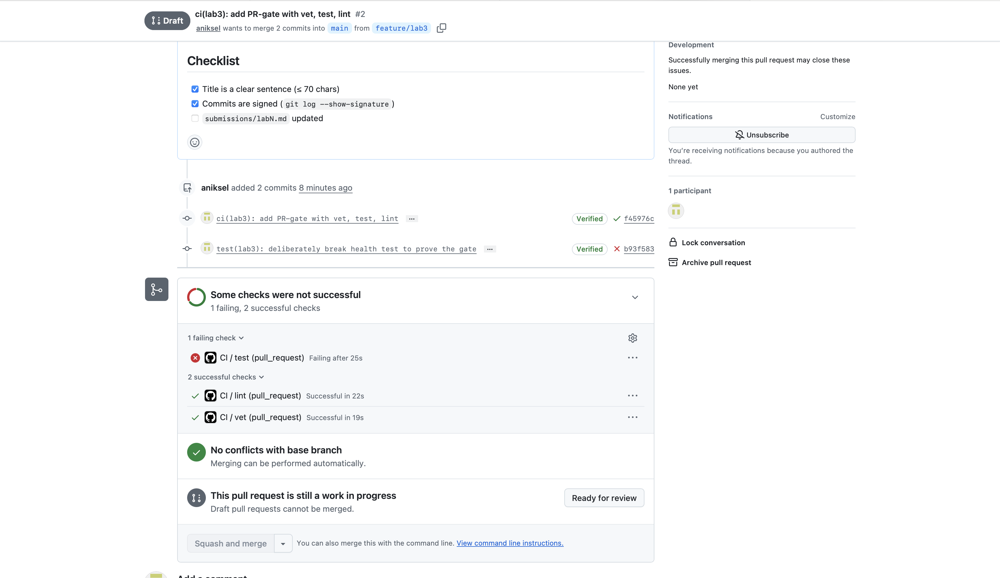
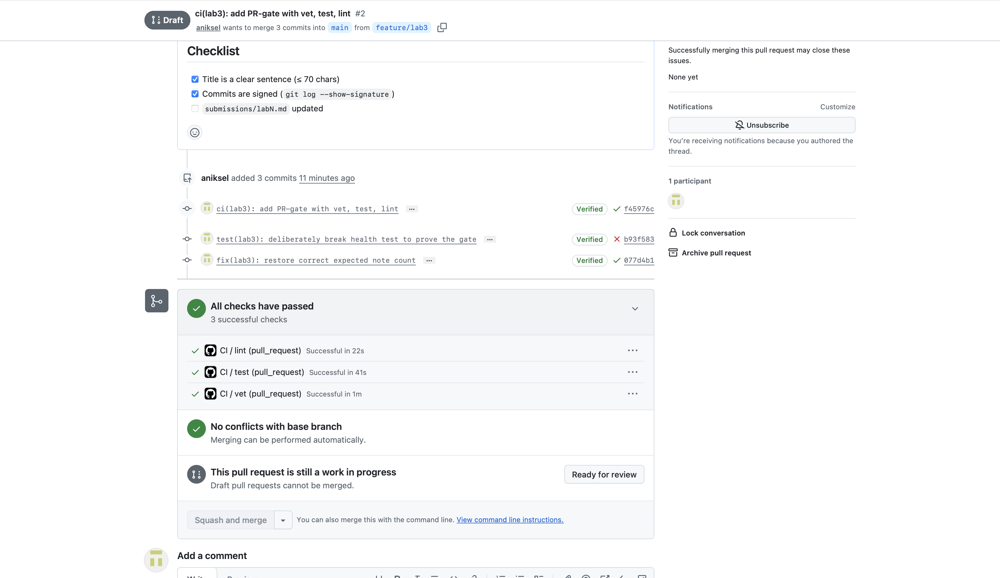
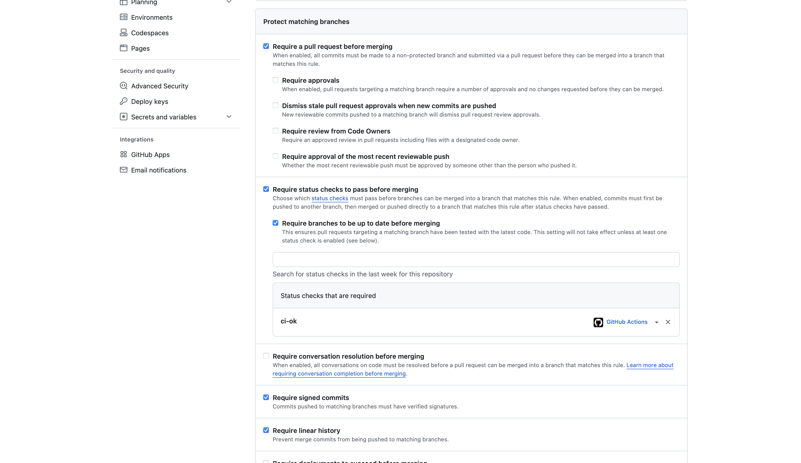
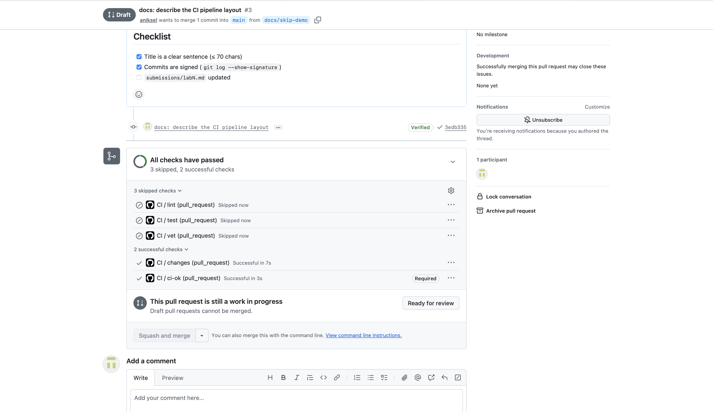
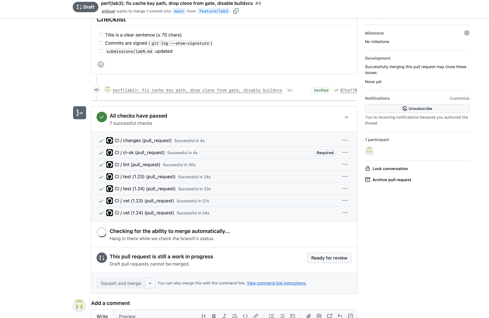
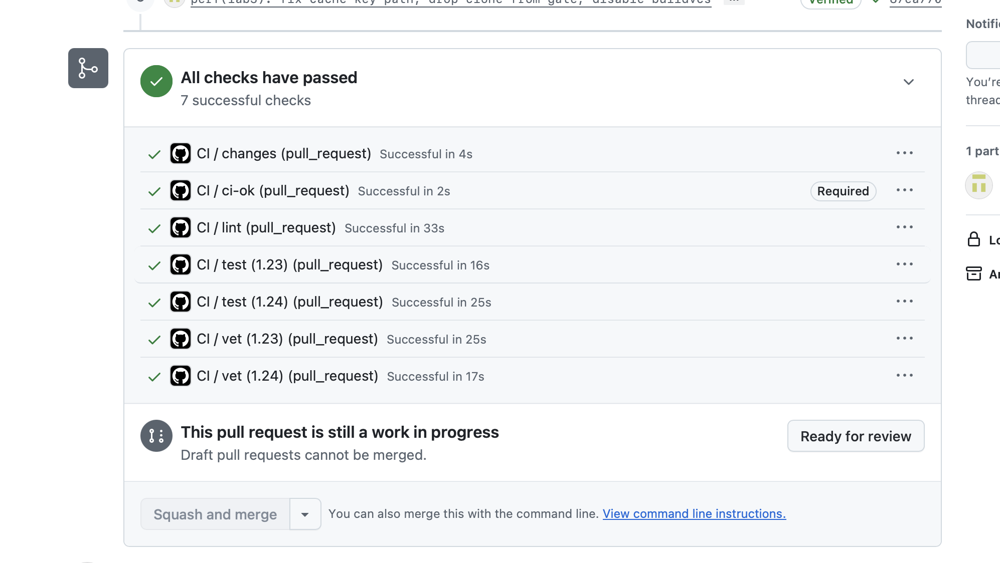

# Lab 3 submission

**Chosen path: GitHub Actions.** My fork, my signed commits and both previous lab PRs already live on github.com, so this keeps the whole course on one platform and lets the gate protect the same `main` I branch-protected in Lab 1.

---

## Task 1: Write the PR Gate

The pipeline lives in `.github/workflows/ci.yml`.

Green CI run: https://github.com/aniksel/DevOps-Intro/actions/runs/34476925612

### 1.2: Design questions

**a) Why pin `ubuntu-24.04` instead of `ubuntu-latest`?**

`ubuntu-latest` is a moving alias, not a version. GitHub migrates it to a newer LTS image over a rollout window, and when that happens the preinstalled toolchain, system libraries and default tool versions change underneath the pipeline with no commit on my side. The failure mode is the nasty kind: a build that was green yesterday goes red today for a reason that is not in the diff, and re-running CI on an old commit no longer reproduces what it originally did. Pinning makes the runner an explicit input that gets upgraded in a reviewable PR.

**b) Why split vet, test and lint into separate jobs?**

Three reasons. Wall-clock: as separate jobs they run in parallel on three runners, so the pipeline takes as long as the slowest one instead of the sum of all three. Diagnosis: a combined job stops at the first non-zero exit, so if `vet` fails I never learn whether the tests also fail, and I get one bug per CI round-trip instead of all of them at once. Granularity: each job reports its own status check, so the PR shows exactly which one is red rather than one opaque "ci failed".

**c) What real attack does SHA pinning prevent?**

The tj-actions/changed-files compromise of March 2025. An attacker got write access to the action's repository and re-pointed its existing version tags at a malicious commit that dumped the runner's process memory into the build log, which on public repositories is world-readable. The key detail is that a Git tag is a mutable pointer: thousands of workflows referencing `tj-actions/changed-files@v35` started executing attacker code without a single change on the consumer side and without anyone approving an upgrade. A full 40-character SHA is immutable content-addressing, so no amount of re-tagging upstream can redirect it. The cost is that upgrades become explicit, which is exactly the point.

**d) What is `permissions:` and what is the principle behind it?**

It declares the scopes granted to the `GITHUB_TOKEN` that GitHub injects into every run: `contents`, `packages`, `issues`, `pull-requests`, `id-token` and so on, each set to `read`, `write` or `none`. The principle is least privilege. The token gets only the access the job needs, so if any step is subverted (a compromised third-party action, a malicious dependency) the damage is bounded by what that token could do. My pipeline only clones the repo and runs Go commands, so `contents: read` is enough. Without an explicit declaration the token can default to much broader write access, which would let a compromised step push commits or publish packages.

**e) GitLab: stage vs job, and what does `dependencies:` do that `stages:` doesn't?**

A job is the actual unit of work, one script in one container on one runner. A stage is an ordering bucket: all jobs in a stage run in parallel, and the next stage starts only once every job in the previous one succeeded. So `stages:` controls execution order and gating, nothing else. `dependencies:` controls a different axis, artifact flow: it names which earlier jobs' artifacts get downloaded into this job's workspace. By default a job downloads artifacts from every job in all preceding stages, which quietly wastes time and bandwidth, while `dependencies: []` downloads none. Two jobs can be correctly ordered by stage and still pass no files between them.

### 1.5: Proving the gate blocks a bad change

I broke `TestHealth_ReportsCount` in `app/handlers_test.go` on purpose, changing the expected note count from 1 to 2, and pushed it as commit `b93f583`. The `test` check went red while `vet` and `lint` stayed green, and the PR could not merge:



A follow-up commit `077d4b1` restored the correct value and all three checks went green again:



### 1.6: Branch protection

`main` requires a pull request before merging, requires status checks to pass, requires branches to be up to date, and keeps the Lab 1 rules: signed commits and linear history. The required check is the `ci-ok` aggregation job explained in 2.2, so the Go matrix can change without editing this rule.



---

## Task 2: Make It Fast and Smart

### 2.1: Caching

`actions/setup-go` caches the Go module and build caches by default. To measure what it contributes I turned it off with `cache: false` for one commit, then restored it. The contribution is zero, and the run log says why:

```
Restore cache failed: Dependencies file is not found in
/home/runner/work/DevOps-Intro/DevOps-Intro. Supported file pattern: go.mod
```

Two things compound. There is nothing to cache: `app/go.mod` has no `require` block and the module has no `go.sum`, since QuickNotes is standard-library only. And the key could not even be computed, because `setup-go` looks for `go.mod` at the repository root while this module lives in `app/`. The second part is fixable with `cache-dependency-path`, which I do in the bonus task.

### 2.2: Build matrix

`vet` and `test` run against Go 1.23 and 1.24 in parallel, with `fail-fast: false` so one bad cell cannot cancel the others.

The matrix earned its keep immediately. On the first matrixed run both 1.23 cells failed while both 1.24 cells passed, because `app/go.mod` declared `go 1.24`, and since Go 1.21 that directive is a hard minimum rather than a hint. `actions/setup-go` also exports `GOTOOLCHAIN=local` on purpose, so the version you ask for is the one that runs instead of silently downloading a newer toolchain. I verified locally that the service compiles and passes its tests under Go 1.23, since it uses no 1.24-only API, so the declared minimum was simply too high and I lowered it. This is exactly the kind of toolchain-dependent problem a matrix exists to surface.

The matrix also renames the checks to `vet (1.23)`, `vet (1.24)` and so on, which leaves any branch protection rule that required the old names waiting forever on a context that will never report again. The pipeline therefore ends in an aggregation job, `ci-ok`, with `needs: [changes, vet, test, lint]` and `if: always()`, and branch protection requires only that. The matrix can now change without anyone touching the protection settings. The `if: always()` matters: without it a failed dependency skips the job, and a skipped required check can let a broken PR through.

### 2.3: Skipping docs-only changes

The pipeline only does real work when something under `app/` or `.github/workflows/` changed. A cheap `changes` job resolves the PR's merge base, diffs it against the head and publishes a boolean, and `vet`, `test` and `lint` carry `if: needs.changes.outputs.code == 'true'`.

I filter inside the workflow rather than with a trigger-level `paths:` filter, because a trigger filter cannot coexist with a required aggregated check: on a docs-only PR the workflow never starts, `ci-ok` never reports, and branch protection blocks the PR forever. Adding a second workflow on the inverse `paths-ignore` does not solve it either, since `paths` and `paths-ignore` are not strict complements: a commit touching documentation and code matches both, both workflows start, and two check runs named `ci-ok` report against the same commit, one of them a stub that always succeeds. That is a hole in the gate. Filtering inside the workflow costs one small runner spin-up on a docs-only change and guarantees exactly one authoritative `ci-ok`.

Demonstrated on PR #3 (`docs/skip-demo` into `main`), whose whole diff is a single documentation file. The three heavy jobs were skipped and the required check still reported:



This needs to be a separate PR, because `changes` diffs the entire pull request against its merge base rather than looking at the last commit. For a merge gate that is the right question to ask: what matters is the total set of changes being proposed.

### 2.4: Measurements

Wall-clock is the critical path through the run, since independent jobs run in parallel. For the first two rows that is the slowest of the three jobs; for the matrix row the `changes` gate and the `ci-ok` aggregation sit in series around it.

| Scenario | vet | test | lint | Wall-clock |
|---|---:|---:|---:|---:|
| Baseline (no cache, single Go version, no path filter) | 21s | 28s | 36s | ~36s |
| With cache | 25s | 31s | 36s | ~36s |
| With cache + matrix (1.23 / 1.24) | 23s / 25s | 31s / 36s | 26s | ~42s |

The per-step breakdown of the baseline run shows where the time goes: `go vet` 15s, `go test` 22s, `golangci-lint` 28s, while `setup-go` costs 0 to 3s and checkout under a second.

Caching moves nothing here, and the cached run is even a couple of seconds slower, which is runner noise rather than a regression: the actual work is unchanged, `go test` 22s in both and `golangci-lint` 28s in both. That is the expected result for a zero-dependency module, and the "Restore cache failed" annotation confirms the cache never engaged. The matrix doubles the work performed but costs only about 6s of wall-clock, because the cells run concurrently. What it spends is CI minutes, not developer waiting time. All figures come from single runs, so differences under a few seconds are not signal.

### 2.5: Design questions

**f) Why cache `go.sum`-keyed inputs and not build outputs?**

Because inputs are content-addressed and outputs are not. A `go.sum` line pins both an exact module version and its hash, so a cache keyed on it either restores precisely the dependency set the build asked for or misses. It cannot quietly substitute a different one, since a mismatch fails loudly on verification. A compiled output has no such guarantee: it depends on the toolchain version, build tags, `CGO_ENABLED`, `GOOS`/`GOARCH` and the exact compiler flags, and any key that fails to capture all of those will hand back a stale object that looks valid. The failure modes are asymmetric. A wrong input crashes the build immediately, a wrong output produces a green pipeline shipping a binary nobody can reproduce. On this project the question is moot in practice, since there are no third-party inputs to cache.

**g) What does `fail-fast: false` change, and when do you want `fail-fast: true`?**

With the default `fail-fast: true`, the moment one matrix cell fails GitHub cancels every other cell still running. `fail-fast: false` lets them all finish. You want `false` whenever the matrix exists to produce information: "is this broken on 1.23, on 1.24, or both?" is unanswerable if the first red cell kills the rest, and you would need a second full run to find out. This lab is a live example. Because `fail-fast: false` was set, one run showed both 1.23 cells red and both 1.24 cells green, which localized the problem to the toolchain instantly. You want `true` when the cells are effectively equivalent and expensive, like a wide matrix of long integration tests where any single failure already means the commit is bad and the remaining cells just burn runner minutes.

**h) What is the risk of an attacker writing a cache from a malicious PR that protected branches later read?**

Cache poisoning. A PR from a fork runs with a read-only token, but it can still write cache entries, and those entries are bytes that a later job unpacks and executes: a tampered module, a doctored object in the build cache. If a workflow on a protected branch could restore an entry authored by that PR, attacker code would run in a privileged context with access to real secrets. GitHub's mitigation is cache scope isolation: a run can restore caches from its own branch and from the default branch, but not from other branches, and a pull request's cache is scoped to that PR's merge ref, so `main` can never read it. Trust flows one way, from the default branch outward. That bounds the risk without erasing it, since a malicious PR that does get merged into the default branch makes its cache readable everywhere. Which is why deriving cache keys from hash-pinned inputs, as in question f, matters as defence in depth.

---

## Bonus Task: Pipeline Performance Investigation

### B.1: Profile

Per-step timings from the baseline run:

| Phase | vet | test | lint |
|---|---:|---:|---:|
| Runner start | 1s | 1s | 2s |
| Checkout | 0s | 1s | 1s |
| Dependency setup (`setup-go`) | 2s | 0s | 1s |
| Actual work | `go vet` 15s | `go test` 22s | `golangci-lint` 28s |
| Cleanup | 0s | 0s | 1s |

The shape is unusual. On most projects dependency setup dominates a cold pipeline, but here it is 0 to 2 seconds: the Go toolchain is already baked into the runner image and there are no third-party modules to fetch. Over 90% of every job is compilation, since `go vet`, `go test` and `golangci-lint` each type-check and build the same package from scratch. There is no download to eliminate, only compiler work to reuse.

### B.2: Optimizations applied

**1. `cache-dependency-path: app/go.mod` on every `setup-go` step.** This fixes the "Restore cache failed" warning from 2.1: the action searches the repository root while the module lives in `app/`, so it had been skipping the cache silently. With a computable key the Go build cache persists between runs, which is the one thing that can help given that compilation is the whole cost.

**2. `GOFLAGS: -buildvcs=false` at workflow level.** Go stamps VCS metadata into every binary it builds, which forces extra git work on each invocation and is pointless on a CI checkout that ships no versioned artifact.

**3. The `changes` gate no longer clones the repository.** It used to run `actions/checkout` with `fetch-depth: 0`, a full clone, purely to run `git diff`. It now asks the API for the changed file list with the preinstalled `gh` CLI and checks out nothing. Since every other job waits on it, its cost sits directly on the critical path.

**4. `persist-credentials: false` on every checkout.** Not speed but hardening: by default `actions/checkout` leaves the job's token in `.git/config` where any later step can read it. The `changes` job also demonstrates job-level permissions, since only it receives `pull-requests: read` while the workflow default stays `contents: read`.

### B.3: Before / after

Same PR, same runner class. The warm column is a re-run of the optimized workflow, so the build cache written by the previous run is available.

| Job | Before | After (cold cache) | After (warm cache) | Saving |
|---|---:|---:|---:|---:|
| changes | 4 to 7s | 4s | 4s | up to -3s |
| vet (1.23) | 23s | 27s | 25s | +2s |
| vet (1.24) | 25s | 24s | 17s | -8s |
| test (1.23) | 31s | 24s | 16s | -15s |
| test (1.24) | 36s | 33s | 25s | -11s |
| lint | 26s | 30s | 33s | +7s |
| ci-ok | 2s | 4s | 2s | 0 |
| **Wall-clock** | **~42s** | **~41s** | **~39s** | **-3s** |





The per-job savings on `test` and `vet` are real: a warm build cache removes 8 to 15 seconds of recompilation from each. Wall-clock moves less, from about 42s to about 39s, because those jobs were never the critical path. `lint` is, and `golangci-lint-action` manages its own cache independently of `setup-go`, so `cache-dependency-path` never reaches it, and its 26 to 33s spread is noise. The lesson is the ordinary one about optimization: shaving 15 seconds off a job that runs in parallel with a longer one buys CI minutes and nothing else.

The 90s target is met, at roughly 39 to 42 seconds.

### B.4: Bottleneck analysis

The dominant step is `golangci-lint` at 28 to 33s. It is both the longest job and the critical path, since `ci-ok` cannot report until it finishes, and nearly all of that is the linter type-checking and compiling the package, with `staticcheck` accounting for most of it. Making it meaningfully shorter would mean changing QuickNotes rather than the pipeline: the service is a single package of a few hundred lines, so there is no incremental-analysis win from splitting it, and the fixed costs of runner provisioning, fetching the pinned linter and one full type-check are irreducible at this size. The realistic levers are dropping the most expensive linter or accepting that a service this small has a floor of about half a minute. I would stop optimizing here, well under a minute: a fast pipeline matters because a developer does not context-switch away while waiting, and below a minute or two further tuning stops buying attention back. Past that point every extra trick, hand-rolled cache keys, conditional job graphs, self-hosted runners, is more CI complexity to maintain and more ways for the gate to pass silently when it should have failed.
