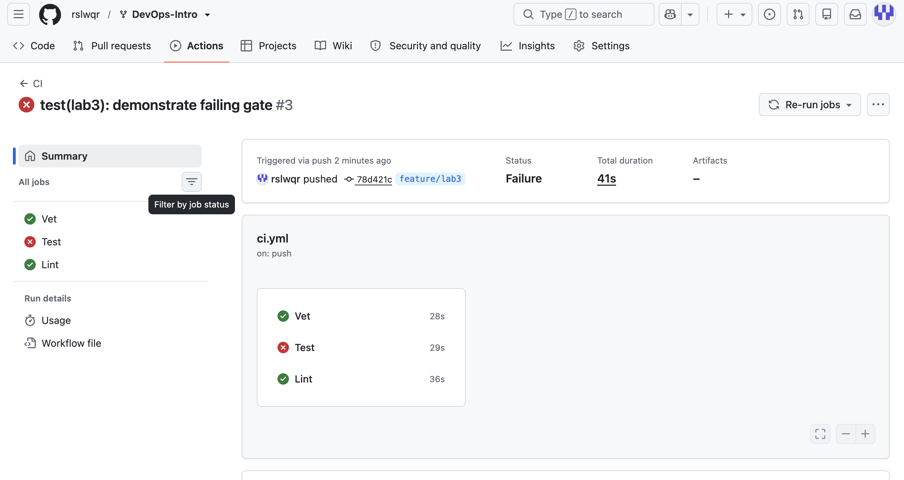
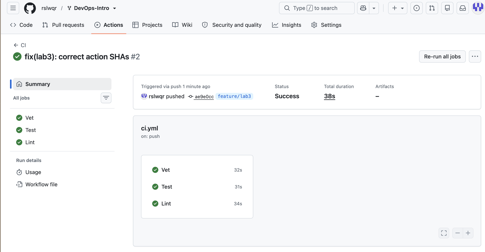
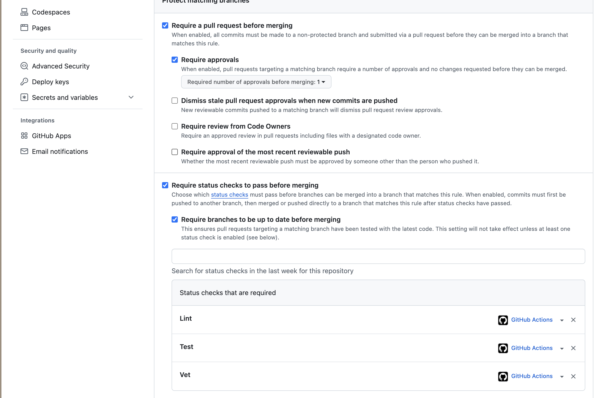

# Lab 3 — CI/CD: A PR-Gated Pipeline for QuickNotes

## Path

I chose GitHub Actions because the repository is hosted on GitHub and the course submission workflow already uses GitHub pull requests. This keeps the CI configuration and pull request checks in the same platform.

---

# Task 1 — Build a PR Gate

## CI Pipeline

The CI workflow is located at:

```text
.github/workflows/ci.yml
```

The workflow runs on pushes to `main` and `feature/lab3`, and on pull requests targeting `main`.

The pipeline contains three independent jobs:

- `Vet` — runs `go vet ./...`
- `Test` — runs `go test -race -count=1 ./...`
- `Lint` — runs `golangci-lint run`

The jobs run on the pinned `ubuntu-24.04` runner. GitHub Actions are pinned to full commit SHAs and the workflow uses:

```yaml
permissions:
  contents: read
```

## Green CI Run

After fixing the workflow configuration, all three CI jobs passed successfully.

Initial green run:

https://github.com/rslwqr/DevOps-Intro/actions/runs/34609530393

The pipeline completed successfully with:

```text
Vet   — passed
Test  — passed
Lint  — passed
```



## Deliberate Failure

To verify that the PR gate detects a real failure, I deliberately changed the expected HTTP status in:

```text
app/handlers_test.go
```

The correct expectation was:

```go
if rec.Code != http.StatusCreated {
    t.Fatalf("expected 201, got %d: %s", rec.Code, rec.Body.String())
}
```

It was temporarily changed to expect HTTP 200 instead of HTTP 201.

The local test command:

```bash
cd app
go test -race -count=1 ./...
```

failed with:

```text
--- FAIL: TestCreateNote_RoundTrip
    handlers_test.go:67: expected 200, got 201
FAIL
FAIL    quicknotes
```

The intentional failure was committed as:

```text
78d421c test(lab3): demonstrate failing gate
```

Failed GitHub Actions run:

https://github.com/rslwqr/DevOps-Intro/actions/runs/34610088161

The CI result was:

```text
Vet   — passed
Test  — failed
Lint  — passed
```

This demonstrated that a failing test causes the CI pipeline to fail.

## Fix

The correct HTTP status expectation was restored in a separate commit:

```text
b94f80a fix(lab3): restore passing test
```

Green CI run after the fix:

https://github.com/rslwqr/DevOps-Intro/actions/runs/34610420766

After the fix, all three CI jobs passed again:

```text
Vet   — passed
Test  — passed
Lint  — passed
```

This demonstrates the complete CI gate cycle:

```text
green pipeline -> deliberate test failure -> red pipeline -> fix -> green pipeline
```


## Branch Protection

Branch protection was configured for the `main` branch of my fork.

The following status checks are required before merging:

```text
Vet
Test
Lint
```

The following protections are enabled:

- Require a pull request before merging
- Require status checks to pass before merging
- Require branches to be up to date before merging
- Require signed commits
- Require linear history
- Do not allow bypassing the above settings

Branch protection screenshot:



---

# Design Questions

## a) Why pin the runner version?

Using `ubuntu-24.04` instead of `ubuntu-latest` makes the CI environment more predictable and reproducible.

The meaning of `ubuntu-latest` can change when GitHub updates its default runner image. Such a change may introduce different system packages, tools, or behavior and could break a pipeline without any change in the repository.

Pinning the runner version reduces this risk.

## b) Why split vet, test, and lint into separate jobs?

Separate jobs can execute independently and in parallel.

They also make failures easier to diagnose because the pull request clearly shows whether `Vet`, `Test`, or `Lint` failed.

If all checks were placed in a single job, an early failure could prevent later checks from running and provide less information about the state of the project.

## c) What attack does SHA pinning prevent?

Pinning third-party GitHub Actions to full commit SHAs reduces the risk of a supply-chain attack.

Tags such as `v4` are mutable and can potentially be changed to point to malicious code. A full commit SHA identifies one exact revision of the action.

A relevant example discussed in Lecture 3 is the `tj-actions/changed-files` supply-chain incident from March 2025. The action was compromised and malicious code was distributed through modified action references.

Using full commit SHA pinning makes it harder for an attacker to silently replace the code executed by an existing workflow dependency.

## d) What is `permissions:` and what principle is behind it?

The `permissions:` section defines what the automatically generated `GITHUB_TOKEN` is allowed to access during a workflow.

This pipeline uses:

```yaml
permissions:
  contents: read
```

The workflow therefore receives read access to repository contents without unnecessary write permissions.

This follows the principle of least privilege: a process should receive only the permissions required to perform its task.

## e) What is the difference between a GitLab stage and job dependencies?

This lab uses the GitHub Actions path, so GitLab stages are not used in my implementation.

In GitLab CI, a stage defines the general execution order of groups of jobs. Jobs in the same stage can normally run in parallel, while the next stage waits for the previous stage to finish.

Explicit job dependencies allow a job to depend only on specific earlier jobs instead of relying only on the global stage order. This can create a more efficient dependency graph and reduce unnecessary waiting.

---


# Task 2 — Make It Fast and Smart

## Dependency Cache

TODO: add cache implementation and evidence.

### Cache Evidence

Cold run:

```text
TODO
```

Warm run:

```text
TODO
```

Cache-hit evidence:

```text
TODO
```

## Go Version Matrix

TODO: document the Go 1.23 / 1.24 matrix.

Matrix checks:

```text
TODO
```

## Path Filters

TODO: document path filtering and the docs-only PR experiment.

Docs-only PR result:

```text
TODO
```

## Required Check Gate

TODO: document the stable aggregate required check after introducing the matrix/path filters.

## Timing Measurements

Baseline CI measurements:

```text
Run 1: 38 s
Run 2: TODO
Run 3: TODO
```

Baseline median:

```text
TODO
```

Optimized CI measurements:

```text
Run 1: TODO
Run 2: TODO
Run 3: TODO
```

Optimized median:

```text
TODO
```

Improvement:

```text
TODO
```

## Task 2 Reflection

TODO: summarize the effect of caching, matrix testing, path filters, and the stable required check.

---

# Bonus — Performance

TODO: complete and document the bonus performance task.

## Before

```text
TODO
```

## After

```text
TODO
```

## Measurement

```text
TODO
```

## Explanation

TODO.

---

# Pull Request

Draft pull request:

```text
https://github.com/inno-devops-labs/DevOps-Intro/pull/1553
```

Final pull request status:

```text
TODO
```