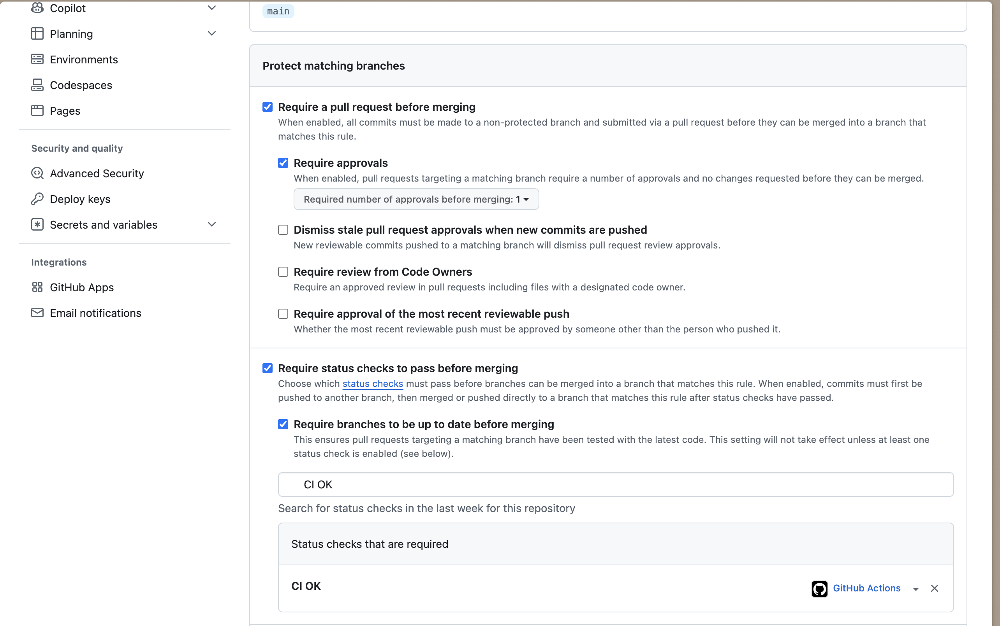
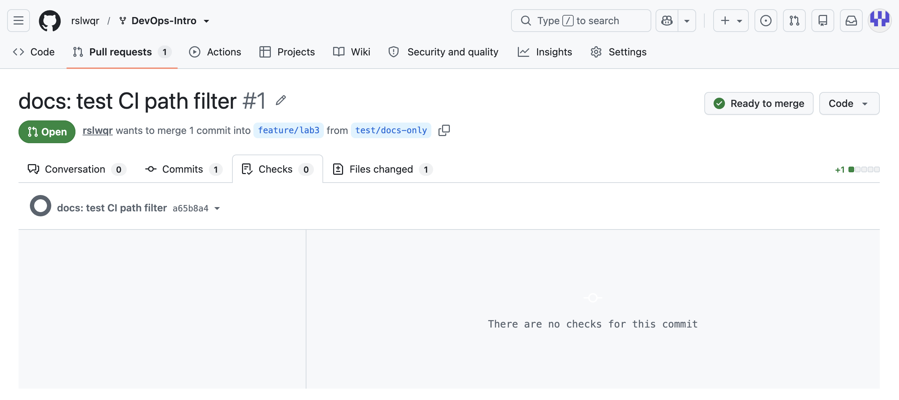

# Lab 3 — CI/CD: A PR-Gated Pipeline for QuickNotes

## Path

I chose GitHub Actions because the repository is hosted on GitHub and the course submission workflow already uses GitHub pull requests. This keeps the CI configuration and pull request checks in the same platform.

---

# Task 1 — Build a PR Gate

## CI Pipeline

The CI workflow is located at:

```text
.github/workflows/ci.yml
```

The workflow runs on pushes to `main` and `feature/lab3`, and on pull requests targeting `main`.

The pipeline contains three independent jobs:

- `Vet` — runs `go vet ./...`
- `Test` — runs `go test -race -count=1 ./...`
- `Lint` — runs `golangci-lint run`

The jobs run on the pinned `ubuntu-24.04` runner. GitHub Actions are pinned to full commit SHAs and the workflow uses:

```yaml
permissions:
  contents: read
```

## Green CI Run

After fixing the workflow configuration, all three CI jobs passed successfully.

Initial green run:

https://github.com/rslwqr/DevOps-Intro/actions/runs/34609530393

The pipeline completed successfully with:

```text
Vet   — passed
Test  — passed
Lint  — passed
```


## Deliberate Failure

To verify that the PR gate detects a real failure, I deliberately changed the expected HTTP status in:

```text
app/handlers_test.go
```

The correct expectation was:

```go
if rec.Code != http.StatusCreated {
    t.Fatalf("expected 201, got %d: %s", rec.Code, rec.Body.String())
}
```

It was temporarily changed to expect HTTP 200 instead of HTTP 201.

The local test command:

```bash
cd app
go test -race -count=1 ./...
```

failed with:

```text
--- FAIL: TestCreateNote_RoundTrip
    handlers_test.go:67: expected 200, got 201
FAIL
FAIL    quicknotes
```

The intentional failure was committed as:

```text
78d421c test(lab3): demonstrate failing gate
```

Failed GitHub Actions run:

https://github.com/rslwqr/DevOps-Intro/actions/runs/34610088161

The CI result was:

```text
Vet   — passed
Test  — failed
Lint  — passed
```

This demonstrated that a failing test causes the CI pipeline to fail.

## Fix

The correct HTTP status expectation was restored in a separate commit:

```text
b94f80a fix(lab3): restore passing test
```

Green CI run after the fix:

https://github.com/rslwqr/DevOps-Intro/actions/runs/34610420766

After the fix, all three CI jobs passed again:

```text
Vet   — passed
Test  — passed
Lint  — passed
```

This demonstrates the complete CI gate cycle:

```text
green pipeline -> deliberate test failure -> red pipeline -> fix -> green pipeline
```


## Branch Protection

Branch protection was configured for the `main` branch of my fork.

The following status checks are required before merging:

```text
Vet
Test
Lint
```

The following protections are enabled:

- Require a pull request before merging
- Require status checks to pass before merging
- Require branches to be up to date before merging
- Require signed commits
- Require linear history
- Do not allow bypassing the above settings

Branch protection screenshot:


---

# Design Questions

## a) Why pin the runner version?

Using `ubuntu-24.04` instead of `ubuntu-latest` makes the CI environment more predictable and reproducible.

The meaning of `ubuntu-latest` can change when GitHub updates its default runner image. Such a change may introduce different system packages, tools, or behavior and could break a pipeline without any change in the repository.

Pinning the runner version reduces this risk.

## b) Why split vet, test, and lint into separate jobs?

Separate jobs can execute independently and in parallel.

They also make failures easier to diagnose because the pull request clearly shows whether `Vet`, `Test`, or `Lint` failed.

If all checks were placed in a single job, an early failure could prevent later checks from running and provide less information about the state of the project.

## c) What attack does SHA pinning prevent?

Pinning third-party GitHub Actions to full commit SHAs reduces the risk of a supply-chain attack.

Tags such as `v4` are mutable and can potentially be changed to point to malicious code. A full commit SHA identifies one exact revision of the action.

A relevant example discussed in Lecture 3 is the `tj-actions/changed-files` supply-chain incident from March 2025. The action was compromised and malicious code was distributed through modified action references.

Using full commit SHA pinning makes it harder for an attacker to silently replace the code executed by an existing workflow dependency.

## d) What is `permissions:` and what principle is behind it?

The `permissions:` section defines what the automatically generated `GITHUB_TOKEN` is allowed to access during a workflow.

This pipeline uses:

```yaml
permissions:
  contents: read
```

The workflow therefore receives read access to repository contents without unnecessary write permissions.

This follows the principle of least privilege: a process should receive only the permissions required to perform its task.

## e) What is the difference between a GitLab stage and job dependencies?

This lab uses the GitHub Actions path, so GitLab stages are not used in my implementation.

In GitLab CI, a stage defines the general execution order of groups of jobs. Jobs in the same stage can normally run in parallel, while the next stage waits for the previous stage to finish.

Explicit job dependencies allow a job to depend only on specific earlier jobs instead of relying only on the global stage order. This can create a more efficient dependency graph and reduce unnecessary waiting.

---


# Task 2 — Make It Fast and Smart

## Dependency Cache

Go caching was enabled through `actions/setup-go`.

The configuration uses:

```yaml
with:
  go-version: "1.23"
  cache: true
  cache-dependency-path: app/go.mod
```

The project does not contain a `go.sum` file, so `app/go.mod` is used as the dependency input for the cache key.

The cache covers the Go module cache and Go build cache.

During one of the CI runs, GitHub successfully configured Go but the cache service returned an error:

```text
Successfully set up Go version 1.23

Warning: Failed to restore: Cache service responded with 400
Cache is not found
```

The workflow itself still completed successfully. This error came from the GitHub cache service and did not cause the CI pipeline to fail.

Cache CI run:
https://github.com/rslwqr/DevOps-Intro/actions/runs/34686099362

---

## Go Version Matrix

The `Vet` and `Test` jobs run against two Go versions:

```text
Go 1.23
Go 1.24
```

The matrix uses:

```yaml
strategy:
  fail-fast: false
  matrix:
    go:
      - "1.23"
      - "1.24"
```

Using `fail-fast: false` means that if one matrix job fails, GitHub still allows the other matrix jobs to finish. This gives more complete information about compatibility with both Go versions.

The resulting checks are:

```text
Vet / Go 1.23
Vet / Go 1.24
Test / Go 1.23
Test / Go 1.24
Lint
CI OK
```

The matrix completed successfully on both Go versions.

Matrix CI run:
https://github.com/rslwqr/DevOps-Intro/actions/runs/34686296947

---

## Stable Required Check

After introducing the matrix, the names of the individual `Vet` and `Test` checks depend on the Go version.

To keep branch protection stable, an aggregate job was added:

```yaml
ci-ok:
  name: CI OK
  if: always()
  needs:
    - vet
    - test
    - lint
  runs-on: ubuntu-24.04

  steps:
    - name: Verify all CI jobs passed
      run: |
        test "${{ contains(needs.*.result, 'failure') || contains(needs.*.result, 'cancelled') }}" = "false"
```

`CI OK` depends on `vet`, `test`, and `lint`.

The `if: always()` condition makes sure that the aggregation job still runs even when one of its dependencies fails. It can therefore report the final state of the complete pipeline.

Branch protection was updated to require only:

```text
CI OK
```

Evidence:



---

## Path Filters

Path filters were added so that the CI pipeline only runs when application code or the CI configuration changes.

The workflow contains:

```yaml
paths:
  - "app/**"
  - ".github/workflows/ci.yml"
```

The same filtering is applied to pushes and pull requests.

Therefore changes to files such as `README.md` or files under `submissions/` do not start the complete CI pipeline.

### Docs-only Test

To verify the filter, I created a temporary branch:

```text
test/docs-only
```

and changed only `README.md`.

A pull request was created from:

```text
test/docs-only -> feature/lab3
```

The pull request contained one changed file.

GitHub reported:

```text
Checks: 0
There are no checks for this commit
```

This confirms that the documentation-only change did not trigger the CI workflow
Path-filter CI run:

```text

https://github.com/rslwqr/DevOps-Intro/actions/runs/34686663067

```

Evidence:



---

## Timing Measurements

### Baseline

The original pipeline used:

```text
Go 1.23 only
Vet + Test + Lint
No matrix
No path filtering
```

Current collected baseline measurement:

```text
Run 1: 38 s
Run 2: TODO
Run 3: TODO
```

Baseline median:

```text
TODO
```

### Cache

A CI run after enabling the Go cache completed in:

```text
41 s
```

The GitHub cache service returned an HTTP 400 error during cache restore, so this run cannot yet be treated as a successful warm-cache measurement.

Additional measurements:

```text
Run 1: 41 s
Run 2: TODO
Run 3: TODO
```

Median:

```text
TODO
```

### Cache + Matrix

The first successful matrix pipeline completed in approximately:

```text
45 s
```

A later run with the matrix and path filters completed in approximately:

```text
44 s
```

Additional measurements are required before calculating the final median.

```text
Run 1: 45 s
Run 2: 44 s
Run 3: TODO
```

Median:

```text
TODO
```

---

## Task 2 Design Questions

### f) Why cache dependency inputs instead of build outputs?

The cache key should depend on files that describe the dependencies of the project, such as `go.mod` or `go.sum`.

When these files change, the dependency set may also change and GitHub can generate a new cache entry.

Caching arbitrary final build outputs would be less reliable because they may depend on source code, compiler versions, operating system details, or other environment state.

Using dependency inputs makes cache invalidation more predictable.

### g) What is the difference between `fail-fast: false` and `fail-fast: true`?

With `fail-fast: true`, GitHub can cancel the remaining matrix jobs after one matrix job fails.

With:

```yaml
fail-fast: false
```

all matrix combinations are allowed to finish even if one fails.

For this lab, `false` is useful because it shows whether the project works independently on Go 1.23 and Go 1.24 and gives more complete diagnostic information.

### h) What is cache poisoning and how does GitHub reduce the risk?

Cache poisoning happens when an attacker manages to place malicious or incorrect data into a cache that is later restored by another trusted workflow.

GitHub limits cache access between branches and workflow contexts so that untrusted pull requests cannot freely overwrite every cache used by protected branches.

Cache keys should also be derived from trusted dependency inputs, and workflows from untrusted pull requests should receive minimal permissions.

The principle of least privilege and careful cache-key design reduce the impact of a compromised or malicious workflow.

---

## Task 2 Summary

The CI pipeline now:

- caches Go module and build data through `actions/setup-go`;
- tests Go 1.23 and Go 1.24;
- keeps all matrix jobs running with `fail-fast: false`;
- uses `CI OK` as a stable aggregate branch-protection check;
- skips the pipeline for documentation-only changes using path filters.

The timing measurements will be completed after collecting enough runs to calculate meaningful medians.

---

# Bonus — Performance

TODO: complete and document the bonus performance task.

## Before

```text
TODO
```

## After

```text
TODO
```

## Measurement

```text
TODO
```

## Explanation

TODO.

---

# Pull Request

Draft pull request:

```text
https://github.com/inno-devops-labs/DevOps-Intro/pull/1553
```

Final pull request status:

```text
TODO
```