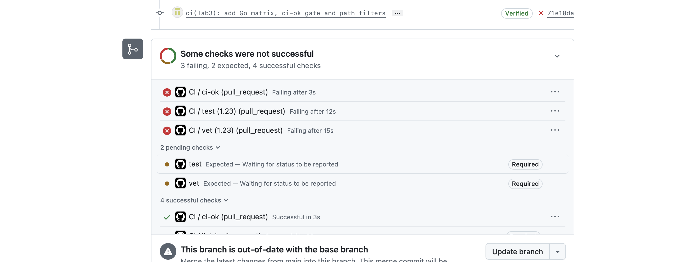
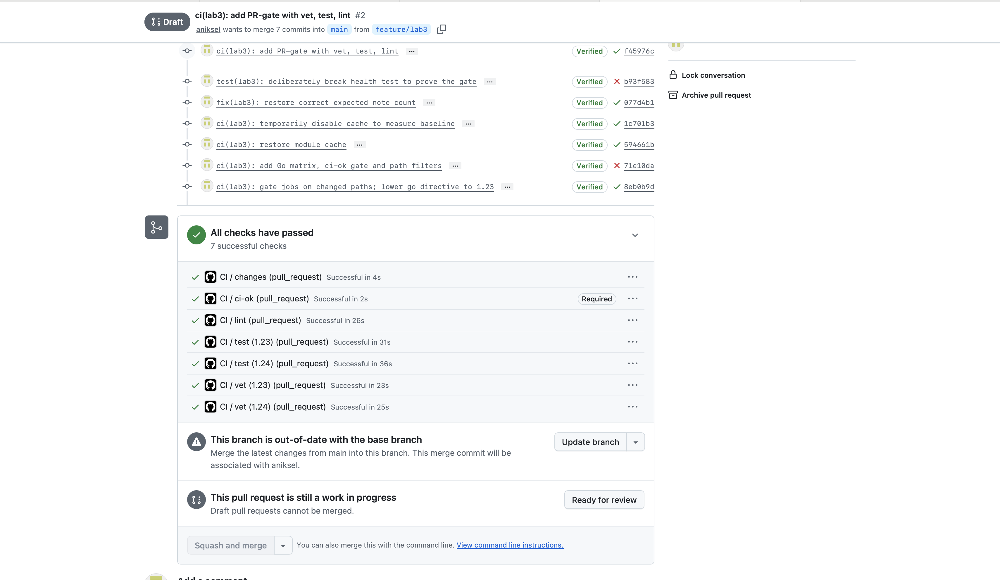
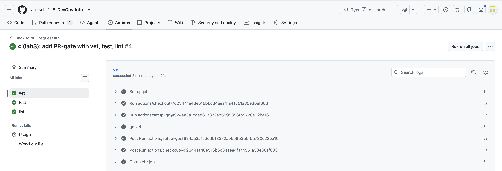
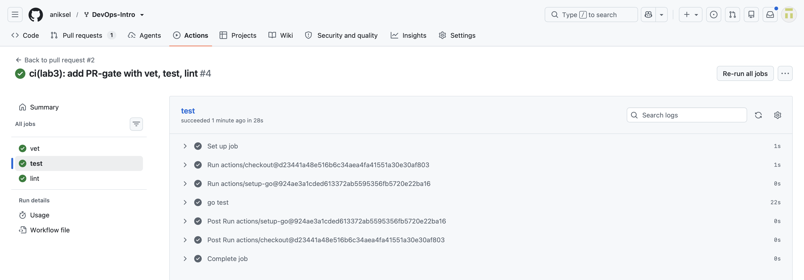
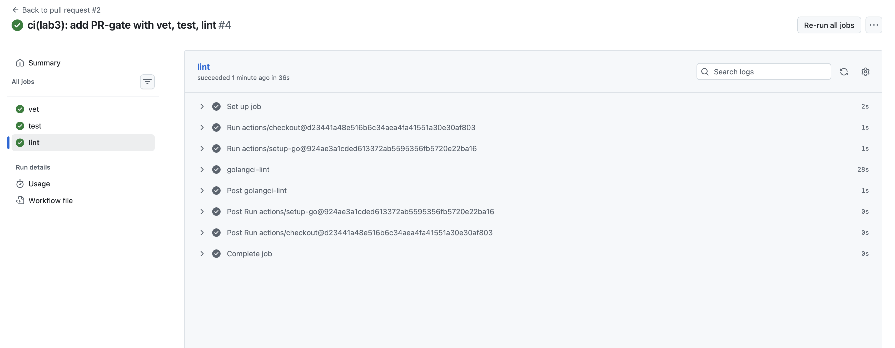
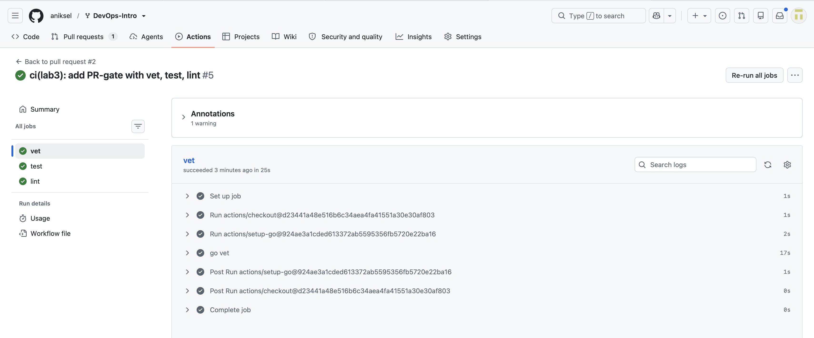
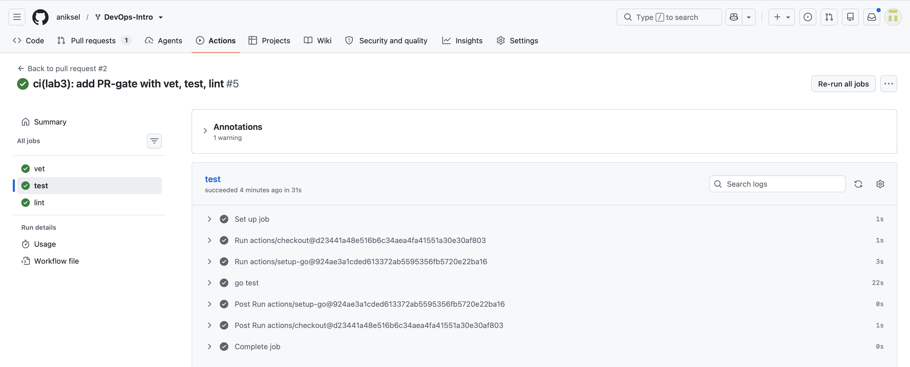
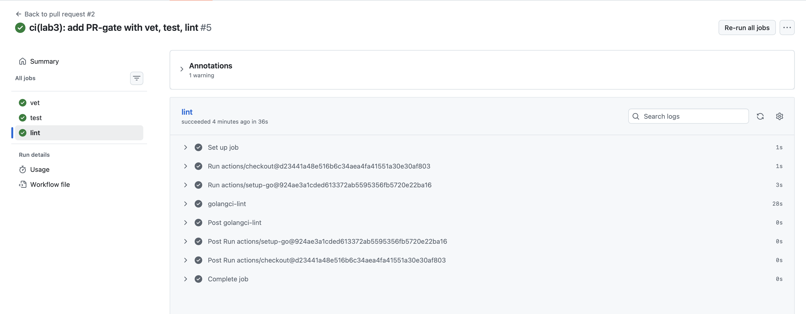

# Lab 3 submission

**Chosen path: GitHub Actions.** I already run my fork, signed commits, and both previous labs' PRs on github.com, so the GitHub path keeps the whole course on one platform and lets the CI gate protect the same `main` I branch-protected in Lab 1. The GitLab path would have required setting up a parallel mirror on the university GitLab for no additional engineering benefit.

---

## Task 1 — Write the PR Gate

### 1.1: The pipeline

`.github/workflows/ci.yml` — three independent jobs, each pinned and least-privileged:

| Requirement | How it is met |
|---|---|
| Trigger on push to `main` + every PR targeting `main` | `on.push.branches: [main]` and `on.pull_request.branches: [main]` |
| Three independent units | separate jobs `vet`, `test`, `lint` (no `needs:` between them, so they run in parallel) |
| `go vet ./...` against `app/` | `vet` job, `working-directory: app` |
| `go test -race -count=1 ./...` against `app/` | `test` job, `working-directory: app` |
| `golangci-lint run` pinned to v2.5.0 | `lint` job via `golangci-lint-action` with `version: v2.5.0`, `working-directory: app` |
| Pinned runtime (no `:latest`) | `runs-on: ubuntu-24.04` in all three jobs |
| Third-party actions pinned by full 40-char SHA | every `uses:` is a commit SHA with the tag in a trailing comment |
| `permissions:` least privilege | workflow-level `permissions: contents: read` |
| Pipeline fails the PR if any unit fails | demonstrated in 1.5 below |

Pinned action SHAs:

```
actions/checkout@d23441a48e516b6c34aea4fa41551a30e30af803              # v6.1.0
actions/setup-go@924ae3a1cded613372ab5595356fb5720e22ba16              # v6.5.0
golangci/golangci-lint-action@d583c34f0599d37dbac4a198b9c83201be380893 # v9.3.0
```

### 1.2: Design questions

**a) Why pin the runner version (`ubuntu-24.04`) instead of `ubuntu-latest`?**

`ubuntu-latest` is a moving alias, not a version. GitHub migrates it to a newer LTS image over a rollout window (22.04 → 24.04, and eventually → 26.04), and when that flip lands, the preinstalled toolchain, system libraries, and default versions of things like `git`, Python, and the C toolchain change underneath the pipeline — with no commit on my side. The failure mode is the worst kind: a build that was green yesterday goes red today for a reason that is not in the diff, and re-running CI on an old commit no longer reproduces the result it originally had. Pinning turns the runner into an explicit, versioned input that gets upgraded in a reviewable, revertable PR.

**b) Why split vet + test + lint into separate units? What would happen with one combined job?**

Three reasons. First, **wall-clock**: as separate jobs they run in parallel on three runners, so the pipeline takes `max(21s, 26s, 29s) ≈ 29s` instead of the roughly 76s a sequential combined job would take. Second, **diagnosis**: a combined job runs commands sequentially and stops at the first non-zero exit, so if `vet` fails I never find out whether the tests also fail — I get one bug per CI round-trip instead of all of them at once. Third, **branch protection granularity**: each job reports its own status check, so `vet`, `test`, and `lint` can be required independently and the PR checks list shows exactly which one is red, rather than one opaque "ci failed".

**c) What real attack does SHA pinning prevent?**

The **tj-actions/changed-files supply-chain compromise of March 2025**. An attacker obtained write access to the action's repository and retroactively re-pointed its existing version tags (`v35`, `v44`, and others, plus `v1`) at a malicious commit that dumped the CI runner's process memory and printed the discovered secrets into the build log — which, on public repositories, is world-readable. The critical detail is that a Git tag is a *mutable pointer*: thousands of workflows referencing `tj-actions/changed-files@v35` began executing attacker-controlled code without a single change on the consumer side, and without any of them approving an upgrade. A full 40-character commit SHA is immutable content-addressing — it names one exact commit object, and no amount of re-tagging upstream can redirect it. The cost is that upgrades become explicit (a PR that changes the SHA), which is precisely the point.

**d) What is `permissions:` and what is the principle behind it?**

`permissions:` declares the scopes granted to the `GITHUB_TOKEN` that GitHub automatically injects into every workflow run — `contents`, `packages`, `issues`, `pull-requests`, `id-token`, and so on, each settable to `read`, `write`, or `none`. The principle is **least privilege**: the token is issued with only the access the job actually requires, so that if any step is subverted — a compromised third-party action, a malicious dependency, a script injection through an untrusted PR title — the blast radius is bounded by what the token could do. My pipeline only clones the repository and runs Go commands, so `contents: read` is sufficient; without an explicit declaration the token may default to far broader write access, which would let a compromised step push commits, publish packages, or approve pull requests.

**e) GitLab: what is the difference between a *stage* and a *job*? What would `dependencies:` do that `stages:` doesn't?**

A **job** is the actual unit of work — one script executed in one container by one runner. A **stage** is an ordering bucket that groups jobs: every job inside a stage runs in parallel, and the next stage does not begin until all jobs of the previous stage have succeeded. So `stages:` controls *execution order and gating*, nothing else. `dependencies:` controls a different axis entirely — **artifact flow**: it names which earlier jobs' artifacts should be downloaded into this job's workspace. By default a job downloads the artifacts of *every* job in all preceding stages, which silently wastes time and bandwidth; `dependencies: [build]` narrows that to one job, and `dependencies: []` downloads nothing at all. In other words two jobs can be correctly ordered by stage while passing no files between them, and conversely `needs:` (the DAG form) can let a job start before its entire preceding stage has finished.

### 1.5: Proving the gate blocks a bad change

Deliberately broke `TestHealth_ReportsCount` in `app/handlers_test.go` by changing the expected note count from 1 to 2, and pushed it (commit `b93f583`).

Result — `test` red, `vet` and `lint` still green, PR blocked:


Fixed it with a follow-up commit `077d4b1` (`fix(lab3): restore correct expected note count`), restoring the expected value. All three checks green again:


Green run job timings: `vet` 21s, `test` 26s, `lint` 29s.

### 1.6: Branch protection

`main` on my fork requires all three status checks (`vet`, `test`, `lint`) to pass, plus the rules already set in Lab 1 (signed commits, PR before merging, linear history, no admin bypass), and branches must be up to date before merging:


---

## Task 2 — Make It Fast and Smart

### 2.1: Caching

`actions/setup-go` caches the Go module cache and the build cache by default (`cache: true`), keyed on the dependency file. To measure its real contribution I disabled it explicitly with `cache: false` for one commit (baseline), then restored it.

The measured contribution was **zero**, for two compounding reasons — and the run log states the second one outright:

```
Run actions/setup-go@924ae3a1cded613372ab5595356fb5720e22ba16
Restore cache failed: Dependencies file is not found in
/home/runner/work/DevOps-Intro/DevOps-Intro. Supported file pattern: go.mod
```

1. **There is nothing to cache.** `app/go.mod` has no `require` block and the module has no `go.sum` at all — QuickNotes is standard-library only, so `go mod download` fetches nothing.
2. **The cache key could not even be computed.** `setup-go` looks for `go.mod` at the *repository root*, but QuickNotes' module lives in `app/`, so the action never found a dependency file and skipped cache restore entirely. This is fixable with the `cache-dependency-path` input — done and measured in the Bonus task below.

### 2.2: Build matrix

`vet` and `test` now run against Go **1.23** and **1.24** in parallel, with `fail-fast: false` so one bad cell cannot cancel the others.

**The matrix immediately earned its keep.** On the first matrixed run both 1.23 cells failed while both 1.24 cells passed. The cause: `app/go.mod` declared `go 1.24`, and since Go 1.21 that directive is a hard *minimum*, not a hint — and `actions/setup-go` deliberately exports `GOTOOLCHAIN=local` (see `setGoToolchain()` in the action's source) precisely so that the Go version you asked for is the one that actually runs, instead of silently downloading a newer toolchain behind your back. So the 1.23 cell refused to build the module. I verified locally that the service compiles and passes its tests under Go 1.23 language semantics — it uses no 1.24-only API — so the declared minimum was simply too high, and I lowered the directive to `go 1.23`. This is exactly the class of toolchain-dependent problem the task says a matrix exists to catch.

**The renamed-checks pitfall, observed live.** Adding the matrix renamed the status checks to `vet (1.23)`, `vet (1.24)`, `test (1.23)`, `test (1.24)`. Branch protection still required the old contexts `vet` and `test`, which will never report again, so they sat at *"Expected — Waiting for status to be reported"* with the **Required** badge while every real check was green — the PR was permanently unmergeable:



The fix is the robust one from the task description: a single aggregation job `ci-ok` that `needs: [changes, vet, test, lint]` and carries `if: always()`, and branch protection requires **only** `ci-ok`. The matrix can now grow or shrink without anyone touching the protection settings. The `if: always()` is not cosmetic — without it a failed dependency causes this job to be *skipped* rather than run, and a skipped required check can let a broken PR through.



### 2.3: Skipping docs-only changes

The pipeline only does real work when something under `app/` or `.github/workflows/` changed. A cheap `changes` job resolves the PR's merge base, diffs it against the head, and publishes a boolean output; `vet`, `test` and `lint` carry `if: needs.changes.outputs.code == 'true'`.

**Why not the trigger-level `paths:` filter.** I implemented it that way first and it broke, for a reason worth recording. A trigger-level filter cannot coexist with a *required* aggregated check: on a docs-only PR the workflow never starts at all, so `ci-ok` never reports, and branch protection blocks the PR forever at "Expected" — the same dead end as the renamed-checks pitfall, just from a different direction. GitHub's documented workaround is a second workflow with the same job name on the inverse `paths-ignore` filter, which I also tried; it fails too, because `paths` and `paths-ignore` are **not strict complements**. A commit that touches documentation *and* application code matches both filters, both workflows start, and two check runs named `ci-ok` report against the same commit — one of them a stub that always succeeds. That is not a cosmetic glitch but a hole in the gate: with two same-named contexts, a red pipeline can end up looking mergeable. I saw exactly this on my own PR, which touches `app/`, `.github/workflows/` and `submissions/` together.

Filtering inside the workflow costs one small runner spin-up (~4s for `changes`, ~2s for `ci-ok`) on a docs-only change instead of zero, and in exchange there is always exactly one authoritative `ci-ok`, and the expensive 25–36s jobs are correctly skipped.

### 2.4: Measurements

Wall-clock is reported as the critical path through the run, since independent jobs execute in parallel: for the first two rows that is simply the slowest of the three jobs; for the matrix row the `changes` gate and the `ci-ok` aggregation sit in series around it.

| Scenario | vet | test | lint | Wall-clock |
|---|---:|---:|---:|---:|
| Baseline (no cache, single Go version, no path filter) | 21s | 28s | 36s | **~36s** |
| With cache | 25s | 31s | 36s | **~36s** |
| With cache + matrix (1.23 / 1.24) | 23s / 25s | 31s / 36s | 26s | **~42s** |

Per-step breakdown of the baseline run shows where the time actually goes: `go vet` 15s, `go test` 22s, `golangci-lint` 28s, while `actions/setup-go` costs 0–3s and checkout under 1s.

Baseline (cache disabled):   

With cache:   

**Reading the table honestly.** Caching moved nothing — the cached run is a couple of seconds *slower*, which is runner-to-runner noise, not a regression: the actual work is unchanged (`go test` is 22s in both, `golangci-lint` 28s in both). That is the expected result for a zero-dependency module, and the run log's "Restore cache failed" annotation confirms the cache never even engaged. The matrix doubles the amount of work performed but costs only ~6s of wall-clock, because the cells run concurrently — what the matrix really spends is CI minutes (roughly double), not the developer's waiting time. Individual numbers come from single runs, so differences under a few seconds should not be read as signal.

### 2.5: Design questions

**f) Why cache `go.sum`-keyed inputs and not build outputs?**

Because inputs are content-addressed and outputs are not. A `go.sum` line pins both an exact module version and its cryptographic hash, so a cache keyed on `go.sum` either restores precisely the dependency set the build asked for, or misses — it can never quietly substitute a different one, because a mismatch fails loudly on verification. A compiled output has no such guarantee: it depends on the toolchain version, build tags, `CGO_ENABLED`, `GOOS`/`GOARCH`, and the exact compiler flags, and any cache key that fails to capture all of those will cheerfully hand back a stale object that *looks* valid. The failure modes are asymmetric — a wrong input crashes the build immediately, a wrong output produces a green pipeline shipping a binary nobody can reproduce. On this project the entire question is moot in practice, since there are no third-party inputs to cache at all.

**g) What does `fail-fast: false` change in a matrix run, and when do you actually want `fail-fast: true`?**

With the default `fail-fast: true`, the moment any matrix cell fails GitHub cancels every other cell still running. `fail-fast: false` lets them all finish. You want `false` whenever the matrix exists to produce *information*: the question "is this broken on 1.23, on 1.24, or on both?" is unanswerable if the first red cell kills the rest, and you would need a second full run just to find out. This lab is a live example — because `fail-fast: false` was set, one run showed both 1.23 cells red and both 1.24 cells green, which localized the problem to the toolchain instantly. You want `true` when the cells are effectively equivalent and expensive: a wide matrix of long integration tests where any single failure already means "this commit is bad", and letting the other thirty-nine cells run to completion just burns runner minutes to re-learn the same fact.

**h) What is the risk of an attacker writing a cache from a malicious PR that protected branches later read?**

This is **cache poisoning**. A pull request opened from a fork runs with a read-only `GITHUB_TOKEN`, but it can still *write* cache entries — and cache entries are just bytes that a later job will unpack and execute (a tampered module in the module cache, a doctored object in the build cache). If a workflow on a protected branch were able to restore an entry authored by that PR, attacker-controlled code would run in a privileged context with access to real secrets. GitHub's mitigation is **cache scope isolation**: a run can restore caches created in its own branch and in the repository's default branch, but not caches created in *other* branches, and a pull request's cache is scoped to that PR's merge ref, so `main` can never read it. Trust flows one way — from the default branch outward to feature branches, never back. That bounds the risk without erasing it: if an attacker gets a malicious PR merged into the default branch, its cache becomes readable everywhere, which is why deriving cache keys from hash-pinned inputs (question f) matters as defence in depth. GitHub documents the scoping rules under "Caching dependencies to speed up workflows → Restrictions for accessing a cache".
