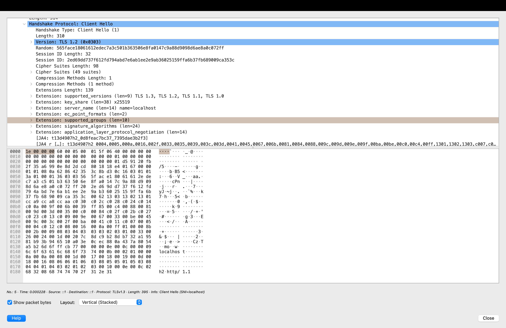
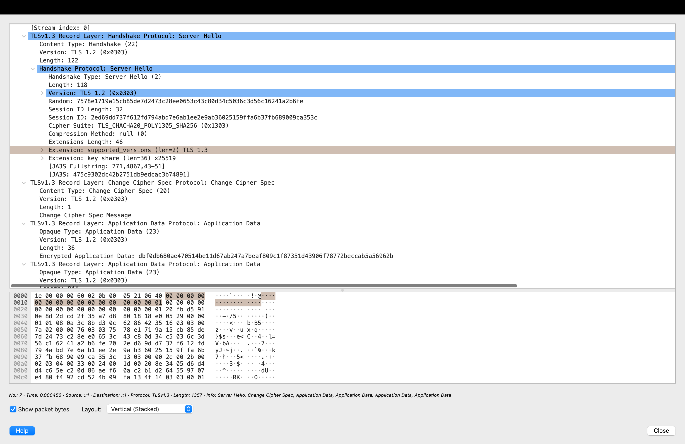

# Lab 4 — OS & Networking: Trace, Debug, and Read the Substrate

## Environment

- OS: macOS
- Architecture: Apple Silicon
- Application: QuickNotes
- Application address: `localhost:8080`

Some commands in the lab instructions are Linux-specific. Since this lab was completed on macOS, equivalent macOS commands were used where necessary. In particular, macOS uses `lo0` as the loopback interface and does not provide systemd or `journalctl`.

---

# Task 1 — Trace a Request End-to-End

## 1.1 Capture one request

QuickNotes was started from the `app` directory:

```bash
cd app
go run .
```

The application successfully started on port `8080`.

```text
quicknotes listening on :8080
```

On macOS, the loopback interface is `lo0` instead of Linux `lo`, so the packet capture was started with:

```bash
sudo tcpdump -i lo0 -nn -s 0 -A 'tcp port 8080' -w lab4-trace.pcap
```

While the capture was running, I sent the following request:

```bash
curl -i -X POST http://127.0.0.1:8080/notes \
  -H 'Content-Type: application/json' \
  -d '{"title":"lab4","body":"network trace"}'
```

The server returned:

```text
HTTP/1.1 201 Created
Content-Type: application/json
Date: Sat, 12 Sep 2026 10:46:07 GMT
Content-Length: 90

{"id":6,"title":"lab4","body":"network trace","created_at":"2026-09-12T10:46:07.658749Z"}
```

The capture was stopped with `SIGINT`. `tcpdump` reported:

```text
12 packets captured
0 packets dropped by kernel
```

The resulting capture was stored in `lab4-trace.pcap`.

---

## 1.2 Decode the capture

The binary packet capture was converted into a human-readable trace:

```bash
sudo tcpdump -A -nn -r lab4-trace.pcap > lab4-trace.txt
```

The complete decoded trace is stored in `lab4-trace.txt`.

### TCP three-way handshake

The beginning of the connection contains:

```text
13:46:07.658418 127.0.0.1.50656 > 127.0.0.1.8080 Flags [S]
13:46:07.658484 127.0.0.1.8080 > 127.0.0.1.50656 Flags [S.]
13:46:07.658497 127.0.0.1.50656 > 127.0.0.1.8080 Flags [.]
```

This is the TCP three-way handshake:

```text
Client                         QuickNotes
50656                            8080

  | -------- SYN -------------> |
  | <------ SYN/ACK ----------- |
  | -------- ACK -------------> |
```

The client used ephemeral port `50656`, while QuickNotes was listening on port `8080`.

### HTTP request

After the connection was established, the client sent:

```text
POST /notes HTTP/1.1
Host: 127.0.0.1:8080
User-Agent: curl/8.7.1
Accept: */*
Content-Type: application/json
Content-Length: 39

{"title":"lab4","body":"network trace"}
```

The `[P.]` TCP flag shows a packet containing application data.

The request creates a new note using the QuickNotes `POST /notes` endpoint.

### HTTP response

QuickNotes responded with:

```text
HTTP/1.1 201 Created
Content-Type: application/json
Date: Sat, 12 Sep 2026 10:46:07 GMT
Content-Length: 90

{"id":6,"title":"lab4","body":"network trace","created_at":"2026-09-12T10:46:07.658749Z"}
```

`201 Created` confirms that the note was successfully created.

### TCP connection close

At the end of the trace the connection was closed cleanly:

```text
client -> server Flags [F.]
server -> client Flags [.]
server -> client Flags [F.]
client -> server Flags [.]
```

The FIN packets show the normal TCP connection termination.

The complete request lifecycle observed in the capture was therefore:

```text
TCP handshake
    ↓
HTTP POST /notes
    ↓
HTTP/1.1 201 Created
    ↓
TCP connection close
```

---

## 1.3 Debugging commands

The lab uses several Linux networking commands. On macOS I used equivalent tools where the original command was not available.

### 1. Check the listening socket

The Linux command from the lab is:

```bash
ss -tlnp | grep :8080
```

macOS does not provide `ss` by default, so I used `lsof`:

```bash
lsof -nP -iTCP:8080 -sTCP:LISTEN
```

Output:

```text
COMMAND     PID                USER   FD   TYPE   DEVICE SIZE/OFF NODE NAME
quicknote 62148 renatasalikhzianova    5u  IPv6  ...       0t0  TCP *:8080 (LISTEN)
```

Decision: QuickNotes is running and successfully listening on TCP port `8080`.

---

### 2. Check the routing table

The Linux command from the lab is:

```bash
ip route show
```

On macOS I used:

```bash
netstat -rn
```

Relevant IPv4 routes included:

```text
Destination        Gateway            Flags     Netif
default            192.168.1.1        UGScIg    en0
127                127.0.0.1          UCS       lo0
127.0.0.1          127.0.0.1          UH        lo0
```

There was also another default route through a `utun` interface.

Decision: localhost traffic is correctly routed through the `lo0` loopback interface. The machine also has routes for external network traffic.

---

### 3. Check reachability

Command:

```bash
sudo mtr -rwc 5 localhost
```

Output:

```text
Start: 2026-09-12T13:54:53+0300
HOST: MacBook-Pro-M4-Pro--Renata.local Loss%   Snt   Last   Avg  Best  Wrst StDev
  1.|-- localhost                         0.0%     5    0.2   0.2   0.2   0.2   0.0
```

Decision: localhost is reachable. All five probes succeeded with `0.0%` packet loss and approximately `0.2 ms` average latency.

Since the destination is localhost, the packets remain on the local machine instead of travelling through an external network.

---

### 4. Check DNS resolution

Command:

```bash
dig +short example.com @1.1.1.1
```

Output:

```text
104.20.23.154
172.66.147.243
```

Decision: DNS resolution using Cloudflare DNS at `1.1.1.1` works correctly.

---

### 5. Check service logs

The Linux command from the lab is:

```bash
journalctl --user -u quicknotes -n 20
```

I checked whether `journalctl` was available:

```bash
command -v journalctl || echo "journalctl is not available on macOS"
```

Output:

```text
journalctl is not available on macOS
```

macOS does not use systemd, so `journalctl` is not available. QuickNotes was started directly using:

```bash
go run .
```

Therefore its application logs were available directly in the terminal running the process.

For example:

```text
quicknotes listening on :8080
```

Decision: the missing `journalctl` command is expected on macOS and is not an application failure. For this local deployment, the process output in the terminal was used as the application log source.

---

## 1.4 What I would check first for a 502

If QuickNotes returned `502 Bad Gateway`, I would debug the request from outside in. First, I would check whether the QuickNotes process is running and whether something is listening on the expected port. Then I would call the backend directly with `curl` and check `/health`. If the backend works directly but the proxy still returns 502, I would investigate the proxy configuration and its connection to the upstream service. After that, I would check routing, firewall rules, DNS resolution, and application or proxy logs. This approach helps identify the layer where the request stops working.

---

# Task 2 — Outside-In Debugging on a Broken Deploy

## 2.1 Reproduce the failure

To reproduce a port conflict, one QuickNotes instance was already running on port `8080`.

I attempted to start another instance:

```bash
cd app
go run .
```

Output:

```text
2026/09/12 13:50:43 quicknotes listening on :8080 (notes loaded: 6)
2026/09/12 13:50:43 listen: listen tcp :8080: bind: address already in use
exit status 1
```

The exact error was:

```text
listen tcp :8080: bind: address already in use
```

I then checked which process owned the port:

```bash
lsof -nP -iTCP:8080 -sTCP:LISTEN
```

Output:

```text
COMMAND     PID                USER   FD   TYPE   DEVICE SIZE/OFF NODE NAME
quicknote 59314 renatasalikhzianova    5u  IPv6  ...       0t0  TCP *:8080 (LISTEN)
```

This showed that another `quicknotes` process was already listening on port `8080`.

### Root cause

The second QuickNotes process could not start because TCP port `8080` was already bound by the first QuickNotes process.

Only one process can normally bind to the same address and TCP port at the same time. Therefore the second process failed during `bind()` with:

```text
address already in use
```

---

## 2.2 Outside-in debugging chain

I followed an outside-in debugging approach to determine whether the problem was caused by the process, listening socket, application health, firewall, or name resolution.

### 1. Process check

Command:

```bash
ps -ef | grep quicknotes | grep -v grep
```

Output:

```text
501 62148 62144 0 1:51PM ttys014 0:00.00 /Users/renatasalikhzianova/Library/Caches/go-build/.../quicknotes
```

Decision: a QuickNotes process is running. This confirms that the application process exists, but does not yet prove that it is listening on the expected port or serving requests.

### 2. Listening socket check

The Linux command from the lab is:

```bash
ss -tlnp | grep 8080
```

Since macOS does not provide `ss`, I used:

```bash
lsof -nP -iTCP:8080 -sTCP:LISTEN
```

Output:

```text
COMMAND     PID                USER   FD   TYPE   DEVICE SIZE/OFF NODE NAME
quicknote 62148 renatasalikhzianova    5u  IPv6  ...       0t0  TCP *:8080 (LISTEN)
```

Decision: PID `62148` owns the listening socket on TCP port `8080`. The application has successfully bound to the expected port.

### 3. Health endpoint check

Command:

```bash
curl -s -o /dev/null -w "%{http_code}\n" http://localhost:8080/health
```

Output:

```text
200
```

Decision: QuickNotes is reachable through HTTP and its `/health` endpoint returns `200 OK`. The application is currently healthy.

### 4. Firewall check

The lab uses `iptables` or `nft` on Linux. macOS uses Packet Filter (`pf`), so I inspected its rules with:

```bash
sudo pfctl -sr
```

Output:

```text
No ALTQ support in kernel
ALTQ related functions disabled
scrub-anchor "com.apple/*" all fragment reassemble
anchor "com.apple/*" all
```

Decision: the displayed rules do not indicate a rule blocking the local QuickNotes connection. The successful HTTP health check also confirms that local traffic to port `8080` can reach the application.

### 5. Name resolution check

The command from the lab was:

```bash
dig +short localhost
```

Output:

```text
;; connection timed out; no servers could be reached
```

`dig` performs a DNS query directly, while `localhost` on macOS can be resolved through the operating system's local name-resolution mechanisms rather than an external DNS server.

I therefore checked the macOS system resolver:

```bash
dscacheutil -q host -a name localhost
```

Output:

```text
name: localhost
ipv6_address: ::1

name: localhost
ip_address: 127.0.0.1
```

Decision: the macOS system resolver correctly maps `localhost` to both IPv6 loopback `::1` and IPv4 loopback `127.0.0.1`. Therefore local name resolution required by QuickNotes works.

### Root-cause conclusion

The outside-in checks show that the repaired QuickNotes instance is running, listening on port `8080`, reachable through HTTP, and resolvable through `localhost`.

The original deployment failure was:

```text
listen tcp :8080: bind: address already in use
```

The root cause was a second QuickNotes instance attempting to bind to a port that was already owned by another QuickNotes process.


## 2.3 Repair and verify

The process that was holding port `8080` had PID `59314`.

I stopped it:

```bash
kill 59314
```

Then I checked the port again:

```bash
lsof -nP -iTCP:8080 -sTCP:LISTEN
```

There was no output, confirming that port `8080` was free.

I started QuickNotes again:

```bash
cd app
go run .
```

Output:

```text
2026/09/12 13:51:40 quicknotes listening on :8080 (notes loaded: 6)
```

Decision: after terminating the old process, QuickNotes successfully bound to port `8080`, confirming that the port conflict was the cause of the deployment failure.

---

## 2.4 Blameless mini-postmortem

The deployment failed because a previous QuickNotes process was still listening on port `8080` when another instance was started. The new process therefore failed with `bind: address already in use`. The failure was reproduced and diagnosed by checking the running processes, listening sockets, health endpoint, firewall, and name resolution. After terminating the process that owned port `8080`, the application started normally and `/health` returned HTTP 200.

This was an environment and process-management issue rather than an individual mistake. A more robust deployment should manage QuickNotes through a service manager instead of manually starting multiple processes. The deployment procedure should also include a pre-start port check and a post-start health check. These controls would detect an existing process before starting a replacement and reduce the chance of the same failure happening again.

---

# Bonus — Decode a TLS Handshake

## B.1 HTTPS with Caddy

For the bonus task I placed Caddy in front of QuickNotes as a local HTTPS reverse proxy.

The resulting request path was:

```text
Client
  |
  | HTTPS :8443
  v
Caddy
  |
  | HTTP :8080
  v
QuickNotes
```

Since the lab was completed on macOS, Caddy was run directly instead of using the Linux `systemctl` service.

The following `Caddyfile` was used:

```caddyfile
localhost:8443 {
    tls internal
    reverse_proxy localhost:8080
}
```

Caddy was started with:

```bash
caddy run --config Caddyfile
```

The `tls internal` directive makes Caddy issue a locally trusted certificate using its internal certificate authority.

I verified the HTTPS endpoint with:

```bash
curl -vk https://localhost:8443/health
```

Relevant output:

```text
Connected to localhost (::1) port 8443
TLS handshake, Client hello (1)
TLS handshake, Server hello (2)
TLS handshake, Certificate (11)
SSL connection using TLSv1.3
ALPN: server accepted h2
SSL certificate verify ok.
using HTTP/2

HTTP/2 200

{"notes":6,"status":"ok"}
```

This confirmed that Caddy successfully established HTTPS with the client and proxied the request to QuickNotes.

---

## B.2 Capture the TLS handshake

On macOS the loopback interface is `lo0`, so I captured traffic on port `8443` with:

```bash
sudo tcpdump -i lo0 -nn -s 0 -w lab4-tls.pcap 'tcp port 8443'
```

While the capture was running, I generated a new HTTPS request:

```bash
curl -vk https://localhost:8443/health
```

The resulting TLS packet capture was saved as:

```text
lab4-tls.pcap
```

The capture was then opened in Wireshark for handshake analysis.

---

## B.3 TLS handshake analysis

### ClientHello

I filtered the Wireshark capture using:

```text
tls.handshake.type == 1
```

The captured ClientHello contained:

```text
Handshake Type: Client Hello (1)
Version: TLS 1.2 (0x0303)
Cipher Suites (49 suites)
Extension: supported_versions: TLS 1.3, TLS 1.2, TLS 1.1, TLS 1.0
Extension: key_share: x25519
Extension: server_name: localhost
```

The `Version: TLS 1.2 (0x0303)` field is the legacy ClientHello version field. For modern TLS, the versions actually offered by the client are communicated using the `supported_versions` extension.

In this handshake the client offered:

```text
TLS 1.3
TLS 1.2
TLS 1.1
TLS 1.0
```

The client also advertised 49 cipher suites and sent:

```text
SNI = localhost
```

SNI tells the server which hostname the client is trying to reach, allowing the server to select the appropriate certificate and virtual host.

The ClientHello also included an X25519 key share

Screenshot from Wireshark:



---

### ServerHello

I filtered the capture using:

```text
tls.handshake.type == 2
```

The ServerHello contained:

```text
Handshake Type: Server Hello (2)
Version: TLS 1.2 (0x0303)
Cipher Suite: TLS_CHACHA20_POLY1305_SHA256 (0x1303)
Extension: supported_versions: TLS 1.3
Extension: key_share: x25519
```

Again, `TLS 1.2 (0x0303)` is the legacy compatibility field.

The `supported_versions` extension shows the version actually selected by the server:

```text
TLS 1.3
```

For this captured connection, Caddy selected:

```text
TLS_CHACHA20_POLY1305_SHA256
```

and used an X25519 key share.

Therefore the important negotiation can be summarized as:

```text
ClientHello
    |
    | supported versions:
    | TLS 1.3, TLS 1.2, TLS 1.1, TLS 1.0
    |
    | cipher suites: 49 offered
    | SNI: localhost
    | key share: X25519
    v
ServerHello
    |
    | selected version: TLS 1.3
    | selected cipher:
    | TLS_CHACHA20_POLY1305_SHA256
    | key share: X25519
    v
TLS 1.3 connection established
```
Screenshot from Wireshark:


---

### Certificate chain

I inspected the certificate chain separately with:

```bash
openssl s_client \
  -connect localhost:8443 \
  -servername localhost \
  -showcerts </dev/null
```

The server presented a certificate issued by:

```text
CN=Caddy Local Authority - ECC Intermediate
```

The chain contained:

```text
localhost server certificate
        |
        v
Caddy Local Authority - ECC Intermediate
        |
        v
Caddy Local Authority - 2026 ECC Root
```

The certificates used EC `prime256v1` public keys and ECDSA with SHA-256 signatures.

For this separate OpenSSL connection, the negotiated parameters were:

```text
Protocol: TLSv1.3
Cipher: TLS_AES_128_GCM_SHA256
Server public key: 256 bit
```

OpenSSL reported:

```text
Verify return code: 20 (unable to get local issuer certificate)
```

This happened because this `openssl s_client` invocation did not have Caddy's local root CA in its verification trust path. The earlier `curl` request through the macOS trust store reported:

```text
SSL certificate verify ok.
```

The OpenSSL connection and the captured curl connection are separate TLS connections, so they can negotiate different TLS 1.3 cipher suites. The Wireshark capture selected `TLS_CHACHA20_POLY1305_SHA256`, while the OpenSSL connection selected `TLS_AES_128_GCM_SHA256`.

---

### Where TLS 1.0 and TLS 1.1 are rejected

The ClientHello advertised several supported versions, including TLS 1.0 and TLS 1.1.

The server chooses the protocol version during negotiation and communicates its choice in the ServerHello. In this capture, the ServerHello `supported_versions` extension selected:

```text
TLS 1.3
```

Therefore TLS 1.0 and TLS 1.1 were not selected for this connection.

In a modern configuration that disables deprecated protocol versions, the server's supported-version policy prevents TLS 1.0 or TLS 1.1 from being negotiated. If a client offered only deprecated versions and there were no mutually supported versions, the TLS handshake would fail instead of establishing a TLS 1.0/1.1 connection.

For this connection, the negotiated protocol was TLS 1.3.

---

## Bonus conclusion

The TLS capture showed the complete negotiation between the client and Caddy. The ClientHello advertised protocol versions, cipher suites, SNI `localhost`, and key-exchange parameters. The ServerHello selected TLS 1.3 and `TLS_CHACHA20_POLY1305_SHA256` for the captured curl connection. Caddy then presented a certificate issued by its local certificate authority and established an encrypted connection before proxying the HTTP request to QuickNotes.