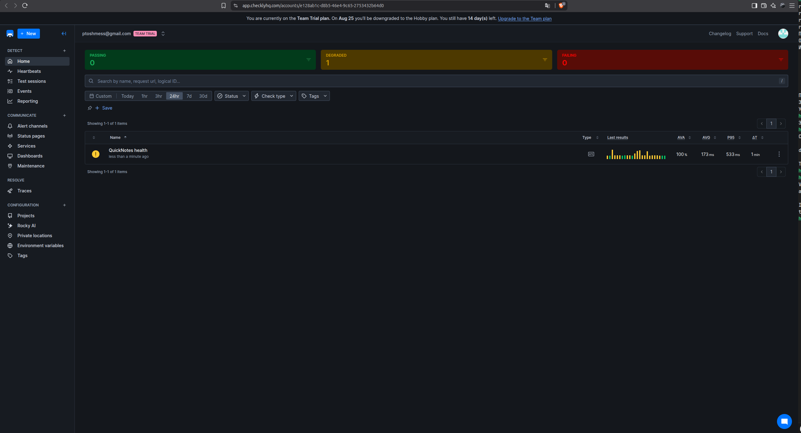

# Lab 8 — SRE & Monitoring: Golden Signals Dashboard + One Good Alert

**Author:** HNS ([@HNS2112](https://github.com/HNS2112))
**Date:** 6 August 2026
**Environment:** Ubuntu 24.04, Docker 29.1.3, Prometheus v3.7.3, Grafana 13.1.2

Raw output is committed under `evidence/lab8/`; configuration under `monitoring/`.

---

## Task 1 — Prometheus + Grafana with a Provisioned Dashboard

### 1.1 Layout

```
monitoring/
├── prometheus/
│   ├── prometheus.yml
│   └── alerts.yml
└── grafana/
    ├── provisioning/
    │   ├── datasources/datasource.yml
    │   └── dashboards/dashboard.yml
    └── dashboards/golden-signals.json
```

### 1.2 Prometheus config

```yaml
global:
  scrape_interval: 15s

rule_files:
  - /etc/prometheus/alerts.yml

scrape_configs:
  - job_name: quicknotes
    static_configs:
      - targets: ['quicknotes:8080']
```

The target is `quicknotes:8080` — the Compose *service name*, not `localhost`.
Inside the Compose network Docker's embedded DNS resolves service names to
container IPs. `localhost` inside the Prometheus container would mean Prometheus
itself.

### 1.3 Grafana provisioning

**Data source** (`provisioning/datasources/datasource.yml`):

```yaml
apiVersion: 1

datasources:
  - name: Prometheus
    type: prometheus
    access: proxy
    url: http://prometheus:9090
    isDefault: true
```

**Dashboard provider** (`provisioning/dashboards/dashboard.yml`):

```yaml
apiVersion: 1

providers:
  - name: golden-signals
    orgId: 1
    folder: ''
    type: file
    disableDeletion: false
    updateIntervalSeconds: 10
    options:
      path: /var/lib/grafana/dashboards
```

The provider's `path` must match where the JSON is mounted in the Compose file —
this is the pairing the lab's pitfalls list calls out, and getting it wrong
produces a Grafana that starts fine and shows nothing.

### 1.4 The four panels

QuickNotes exposes these metrics:

```
quicknotes_notes_total                      gauge
quicknotes_notes_created_total              counter
quicknotes_notes_deleted_total              counter
quicknotes_http_requests_total              counter
quicknotes_http_responses_by_code_total     counter (label: code)
```

| Signal | Query |
|---|---|
| Latency | `scrape_duration_seconds{job="quicknotes"}` |
| Traffic | `rate(quicknotes_http_requests_total[5m])` |
| Errors | `sum(rate(quicknotes_http_responses_by_code_total{code=~"4..\|5.."}[5m])) / clamp_min(sum(rate(quicknotes_http_responses_by_code_total[5m])), 0.001)` |
| Saturation | `quicknotes_notes_total` |

**On the Latency panel.** QuickNotes exposes no request-duration histogram, so
true per-request latency is not measurable from these metrics. Requirement 1.3
allows a proxy. Rather than the suggested request-rate substitution — which
duplicates the Traffic panel and measures volume, not time — this dashboard uses
`scrape_duration_seconds`: the time Prometheus spends fetching `/metrics`, which
is at least a real measurement of how long the application takes to answer an
HTTP request. It is still a proxy, and a poor one: it measures one endpoint on a
15-second cadence and would not show a slow `POST /notes` at all. Fixing this
properly means instrumenting the application with a histogram, which is outside
this lab's scope but is the honest answer to "how do I monitor latency here".

**On the Errors panel.** The denominator is wrapped in `clamp_min(..., 0.001)`.
Without it, a period with zero traffic divides by zero and the panel — and the
alert built on the same expression — produces `NaN` rather than `0`. The clamp
makes the idle case evaluate to zero, which is what "no errors" should look like.

### 1.5 Compose extension

```yaml
  prometheus:
    image: prom/prometheus:v3.7.3
    volumes:
      - ./monitoring/prometheus/prometheus.yml:/etc/prometheus/prometheus.yml:ro
      - ./monitoring/prometheus/alerts.yml:/etc/prometheus/alerts.yml:ro
    ports:
      - "9090:9090"
    depends_on:
      quicknotes:
        condition: service_healthy
    restart: unless-stopped

  grafana:
    image: grafana/grafana:13.1.2
    environment:
      GF_SECURITY_ADMIN_USER: admin
      GF_SECURITY_ADMIN_PASSWORD: Qn-Lab6-Gf-9x2v
    volumes:
      - ./monitoring/grafana/provisioning:/etc/grafana/provisioning:ro
      - ./monitoring/grafana/dashboards:/var/lib/grafana/dashboards:ro
    ports:
      - "3000:3000"
    depends_on:
      - prometheus
    restart: unless-stopped
```

`condition: service_healthy` is where the Lab 6 healthcheck pays off, exactly as
the lab text predicted: Prometheus waits for QuickNotes to be *ready*, not merely
started, so the first scrape does not fail against a container that is still
booting.

The admin password is set explicitly rather than left at Grafana's default. It is
a throwaway credential committed to a public repository, which is acceptable only
because this stack is local and disposable — in anything real this belongs in a
secret store, not in `compose.yaml`.

### 1.6 Verification

```console
$ curl -s http://localhost:9090/api/v1/targets | jq '.data.activeTargets[] | {job, health, scrapeUrl}'
{
  "job": "quicknotes",
  "health": "up",
  "scrapeUrl": "http://quicknotes:8080/metrics"
}
```

After ~700 mixed requests:


All four panels carry data: latency 1–3 ms, traffic peaking near 1.7 req/s,
error ratio flat at 0%, saturation at 22 notes.

### 1.7 Design questions

#### a) Pull vs push — which side must be reachable?

Prometheus pulls, so **Prometheus must be able to reach QuickNotes**, not the
other way round. QuickNotes needs no knowledge of Prometheus at all: it exposes
`/metrics` and does not care who reads it. In this stack that reachability is
provided by the Compose network, where `quicknotes:8080` resolves.

The failure mode when Prometheus cannot reach the target is specific and worth
knowing: the target goes `up == 0` and **series stop, they do not go to zero**.
Graphs show gaps, not flat lines at zero. Anything computed over that window —
including the error-ratio alert — has no data rather than good data. So "the
dashboard looks empty" is ambiguous: it means either no traffic or no scrape, and
`up` is the metric that distinguishes them. That is why `up == 0` deserves its own
alert in any real setup.

The architectural consequence is that pull suits environments Prometheus can
reach and enumerate — a Compose network, a Kubernetes cluster — and suits
short-lived jobs and NAT'd targets badly, which is what the Pushgateway exists to
patch around.

#### b) What breaks at `scrape_interval: 5s`? At `5m`?

At **5s** the cost is volume and honesty. Storage and cardinality triple against
the 15s default for data that mostly repeats. Worse, it does not buy proportional
resolution: `rate()` over a 5m window still smooths across the same period, so
the extra samples change little in the graphs while tripling the write load. And
a scrape that takes longer than the interval starts overlapping itself — on this
setup scrapes take 1–3 ms, so there is headroom, but that headroom is what the
interval is really budgeting.

At **5m** the problem is that most queries silently break. Prometheus marks a
series stale after roughly 5 minutes without a sample, so a 5m interval sits
right at the edge of staleness. `rate(...[5m])` needs at least two samples in the
window and would frequently have one, returning nothing. Alerts with `for: 5m`
would evaluate against a single data point. And detection latency becomes 5
minutes at best: an outage starting just after a scrape is invisible until the
next one.

The general rule the two cases show: the scrape interval sets the floor on
detection latency and the ceiling on query resolution, and every query window in
the system has to be several times larger than it.

#### c) `rate()` vs `irate()` vs `delta()` for the Traffic panel

**`rate()`** is correct here. It computes the per-second average increase of a
counter across the whole window, using every sample in it, and it handles counter
resets — a process restart takes the counter back to zero, and `rate()` accounts
for that rather than reporting a huge negative spike.

**`irate()`** uses only the last two samples in the window. It reacts fast and is
useful for short, volatile spikes, but on a dashboard it produces a jagged line
that swings with individual scrapes. For "how much traffic is this service
taking", that noise is a liability — and on a graph rendered at lower resolution
than the scrape interval, `irate()` silently skips data points entirely.

**`delta()`** is the wrong tool twice over: it is meant for gauges, not counters,
so it does not handle resets, and it returns a total change rather than a
per-second rate, which is not comparable across different window lengths.

#### d) Why provision Grafana from files?

Because a dashboard clicked together in the UI lives only in Grafana's own
database. `docker compose down -v` deletes it, a fresh machine does not have it,
and there is no diff to review when it changes.

Provisioning makes the dashboard a file in the repository: it is versioned,
reviewable in a PR, reproducible on any machine that clones the repo, and
recreated automatically after the stack is destroyed. This lab is the direct
demonstration — the dashboard was never touched in the UI; it appeared because a
JSON file was mounted at the path the provider config names, and the provider
picked it up within its 10-second poll.

The same argument that makes infrastructure-as-code worth the friction applies to
monitoring configuration, and for the same reason: the alternative is state that
exists only where someone once clicked.

---

## Task 2 — One Good Alert + Runbook

### 2.1 The alert rule

`monitoring/prometheus/alerts.yml`:

```yaml
groups:
  - name: quicknotes
    rules:
      - alert: HighErrorRate
        expr: |
          sum(rate(quicknotes_http_responses_by_code_total{code=~"4..|5.."}[5m]))
          /
          clamp_min(sum(rate(quicknotes_http_responses_by_code_total[5m])), 0.001)
          > 0.05
        for: 5m
        labels:
          severity: page
        annotations:
          summary: "QuickNotes error ratio above 5% for 5 minutes"
          description: "Error ratio is {{ $value | humanizePercentage }} over the last 5 minutes."
          runbook_url: "https://github.com/HNS2112/DevOps-Intro/blob/feature/lab8/docs/runbook/high-error-rate.md"
```

Requirements met: 5% threshold, `for: 5m` sustained gate, `severity: page` label,
and a `runbook_url` annotation pointing at a document in this repository.

### 2.2 Triggering it

A load script ran healthy traffic alongside two deliberately failing requests per
cycle — a malformed JSON `POST /notes` and a `GET /notes/99999` — producing an
error ratio near 48%.

**The first attempt failed, instructively.** The script ran for 7 minutes but its
error traffic ended before the `for: 5m` window elapsed; the rule reached
`pending`, then dropped back to `inactive` without ever firing:

```console
{ "name": "HighErrorRate", "state": "pending" }
...
{ "name": "HighErrorRate", "state": "inactive", "activeAt": null }
```

That is the sustained-breach gate doing precisely its job: a burst that stops
before five minutes is not paged on. The second run sustained the errors long
enough:

```console
$ curl -s -G .../query --data-urlencode 'query=<error ratio expression>'
0.43706311806514775

$ curl -s http://localhost:9090/api/v1/rules | jq ...
{
  "name": "HighErrorRate",
  "state": "firing",
  "duration": 300,
  "labels": { "severity": "page" },
  "activeAt": "2026-08-06T17:28:12.464142167Z",
  "value": "4.7951176983435045e-01"
}
```


The full `inactive → pending → firing` transition was observed, with the value at
firing time at 47.95%.

### 2.3 Runbook

Full text: [`docs/runbook/high-error-rate.md`](../docs/runbook/high-error-rate.md).

It covers the four required sections — what the alert means, four ordered triage
steps, three mitigations, and post-incident actions. Two things in it are specific
to what earlier labs uncovered rather than generic advice: the rollback step warns
to stop the old container first, because Lab 4 showed that starting a second
instance on the same port fails with `bind: address already in use`; and the
restart step notes that data survives, because Lab 6 established that state lives
in a named volume rather than the container.

### 2.4 Design questions

#### e) Why "sustained for 5 minutes" instead of firing immediately?

Because a single failed request is not an incident, and paging on one destroys
the value of the page. Transient errors are normal: a client sends malformed
input, a connection drops mid-request, a container restarts during a deploy. An
alert that fires on the first bad request would page several times a day for
conditions that resolve themselves before anyone opens a laptop.

The `for:` clause encodes the distinction between "something failed" and
"something is broken". This lab demonstrated both sides in sequence: the first
load run produced a real 40%+ error ratio, reached `pending`, and correctly never
paged because it stopped after a few minutes. The second sustained it and fired.
The same expression, two different outcomes — decided entirely by duration.

There is a cost, and it should be named: five minutes of user-visible errors
elapse before anyone is told. For a service where that is too long, the answer is
a tighter window plus a higher threshold, not the removal of the gate.

#### f) Symptom alerts vs cause alerts

The rule above is a symptom alert: it fires on something users experience —
requests failing. A cause alert for QuickNotes would be something like "container
memory above 80%" or "the `/data` volume is more than 90% full".

Cause alerts are worse for two reasons that pull in opposite directions. They
fire when nothing is wrong — memory at 85% with every request succeeding is a page
about a number, not about a problem. And they miss what they were meant to catch:
QuickNotes can fail for reasons that touch neither memory nor disk, so a wall of
green cause alerts is compatible with a completely broken service.

A symptom alert catches every cause, including the ones nobody anticipated,
because it watches the outcome rather than a guessed-at mechanism. Cause metrics
still belong on the dashboard — they are how you *diagnose* after the symptom
alert wakes you — but they should not be what wakes you.

#### g) A quantitative threshold for alert fatigue

The workable measure is the **precision of the page**: of the last N pages, what
fraction corresponded to a real user-visible problem that required human action?

A concrete line: **if more than 25% of pages turn out to be non-actionable, the
alert is broken.** One in four false pages is enough for on-call to start
assuming the next one is noise too, which is the exact failure mode that makes
alert fatigue more dangerous than under-alerting — the alert still fires, and it
is still ignored.

Two supporting numbers make it measurable in practice. Track the share of pages
closed with no action taken; if it climbs above a quarter, the alert needs tuning
rather than the on-call needing more discipline. And track pages per on-call
shift: more than one or two routinely means the threshold is too tight or the
`for:` window too short, regardless of whether each individual page was
technically correct.

Both are worth reviewing in the postmortem, which is why the runbook's
post-incident section asks explicitly whether this alert fired without a user
being affected.

---

## Bonus Task — Synthetic Monitoring from the Outside

### B.1 Setup

The target is the Render deployment from Lab 10 — the same QuickNotes image,
already publicly reachable, so no tunnel was needed:

```
https://quicknotes-e5cq.onrender.com/health
```

Checkly API check:

| Setting | Value |
|---|---|
| Method | GET |
| Assertion | Status code Equals 200 |
| Degraded after | 200 ms |
| Failed after | 2000 ms |
| Frequency | 1 minute |
| Locations | Frankfurt (eu-central-1), Singapore (ap-southeast-1) |
| Scheduling | parallel runs — both locations fire on every tick |
| Alerting | email channel |



Two thresholds rather than one is worth noting: Checkly distinguishes
**degraded** from **failed**, which Prometheus's binary `up == 1` cannot. A
service answering correctly but slowly is a real state, and it is the state this
check spent the window in.

### B.2 Internal versus external, same 30-minute window

Window: 16:28:36 – ~17:00 UTC.

| | Prometheus (inside the Compose network) | Checkly (Frankfurt + Singapore) |
|---|---|---|
| Latency p50 | **2.1 ms** | **175 ms** (AVG) |
| Latency p95 | **6.4 ms** | **533 ms** |
| Errors observed | 0 (1447 requests) | 0 — availability 100% |
| Status | `up == 1` throughout | **DEGRADED** |

A third vantage point, measured from the laptop over a VPN against the same
Render URL in the same window:

| | Laptop over VPN → Render |
|---|---|
| p50 | **2171 ms** |
| p95 | **2420 ms** |

**Three observers, three verdicts about one service.** The 83× gap between
Prometheus and Checkly is not the application — it is the network, and the fact
that they are watching different deployments of it. Prometheus scrapes a
container on loopback inside a Compose network; Checkly crosses the public
internet to a Frankfurt datacentre.

The laptop number is the one that makes the point sharply. **2171 ms exceeds the
2000 ms failure threshold this check is configured with.** Had the probe run from
here, it would have reported the service as down for the entire window. From
Frankfurt and Singapore it passed every single time. Same service, same moment,
opposite conclusions — because "is it up?" is not a property of the service, it
is a property of the path between a client and the service.

The DEGRADED status is the honest middle. Availability was 100% and every
assertion passed, but AVG 175 ms sits above the 200 ms... in fact just under it,
while p95 at 533 ms is well over — so a meaningful minority of probes were slow
enough to trip the degraded threshold. Nothing was broken; something was slower
than it should be. That distinction is invisible to a check that only asks
whether a response arrived.

One side effect worth recording: the Checkly probe polls every minute, which is
frequent enough to **keep the Render free instance awake**. Lab 10 measured its
cold start at 14–25 s after 15 minutes of idle; during this window it never went
idle. The act of monitoring changed the behaviour of the thing monitored — a
benign version of the observer effect, and a reason synthetic-probe frequency is
a capacity decision as well as a detection-latency one.

### B.3 What each catches that the other cannot

**Checkly catches everything between the user and the application**, and
Prometheus is structurally blind to all of it. If DNS for the domain stops
resolving, if the TLS certificate expires, if Render's edge proxy fails, if a
route to the region is withdrawn, if the platform's ingress returns 502 while the
container underneath is perfectly healthy — the container keeps serving,
`/metrics` keeps reporting `up == 1`, and every internal dashboard stays green
while no user can reach the service. Lab 10's scale-to-zero is a milder version
of the same blindness: a 14-second cold start is invisible from inside, because
the process that would report it is not running yet. Checkly also catches
regional failures by construction — two locations mean a problem affecting only
Singapore shows up as a split verdict rather than an ambiguous average.

**Prometheus catches everything inside the application**, and Checkly is blind to
all of it. Error ratios per status code, saturation, request volume, the
distinction between a 4xx from a broken caller and a 5xx from a broken
handler — none of it is visible from a single probe of one endpoint. More
importantly, Checkly polls **one URL once a minute**; QuickNotes served 1447
requests in this window, and if 5% of `POST /notes` had failed while `/health`
kept returning 200, the external probe would have reported perfect availability
throughout. That is precisely the alert built in Task 2, and it fires on a signal
Checkly does not collect.

The division is between **reachability** and **behaviour**. External probes prove
the service can be reached and answer within a bound, from places users actually
are; internal metrics explain what it is doing once reached. Neither substitutes
for the other, which is why production systems run both — and why the Lab 10
deployment being green in Checkly while showing 2.2-second latency from a VPN'd
laptop in Kazan is a complete answer to neither question on its own.

---

## Summary

| Task | Status |
|------|--------|
| Task 1 — Prometheus + Grafana + provisioned 4-panel dashboard | Complete |
| Task 2 — Sustained-breach alert, runbook, firing observed | Complete |
| Bonus — Checkly synthetic probe | Complete |
